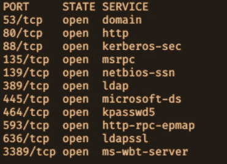
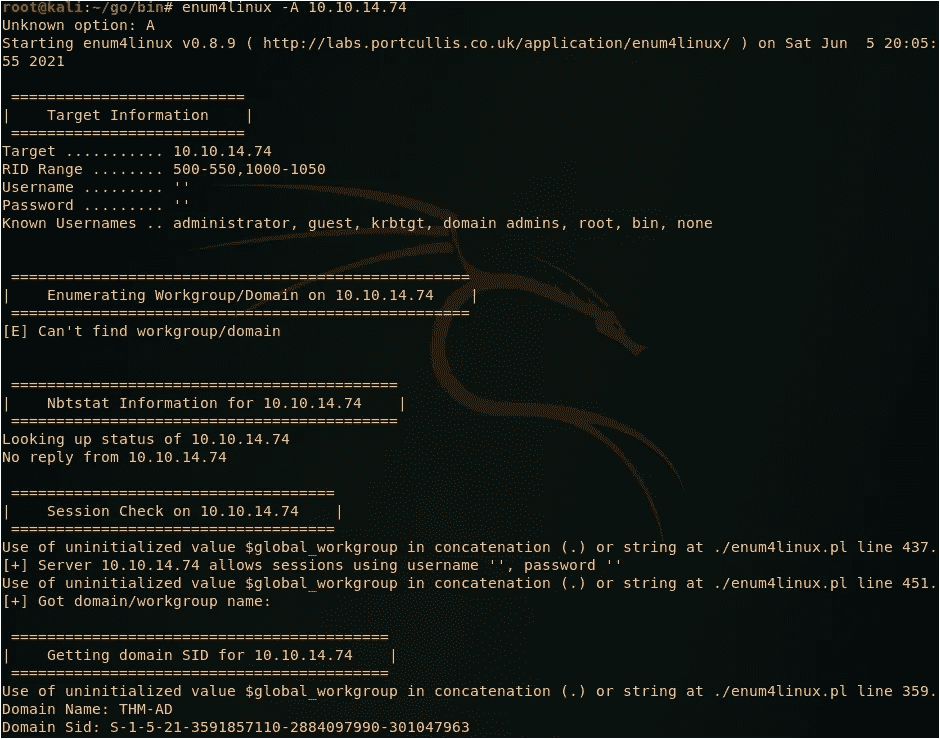
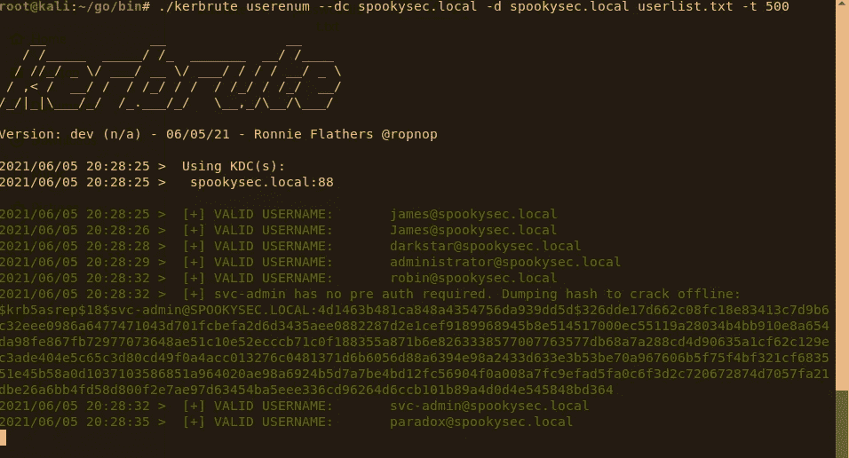
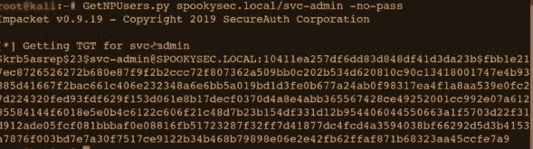
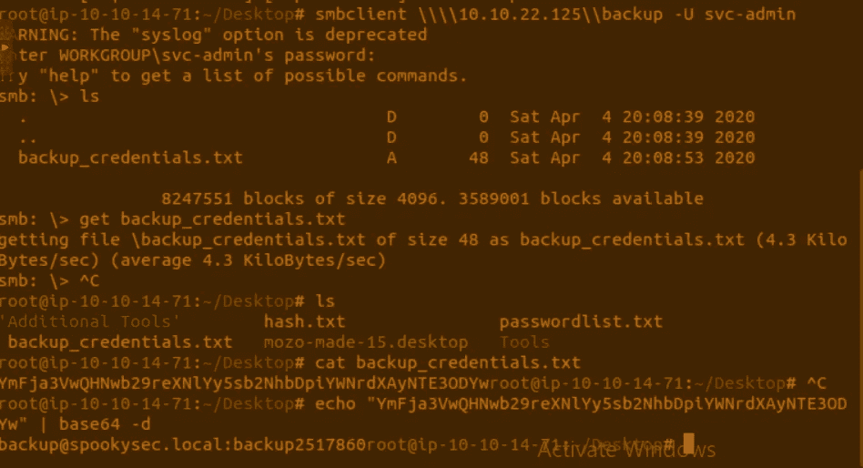
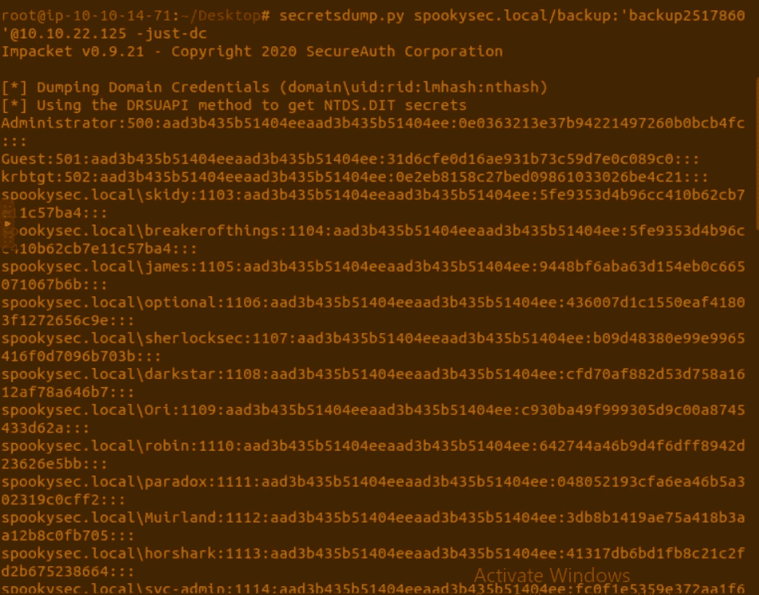
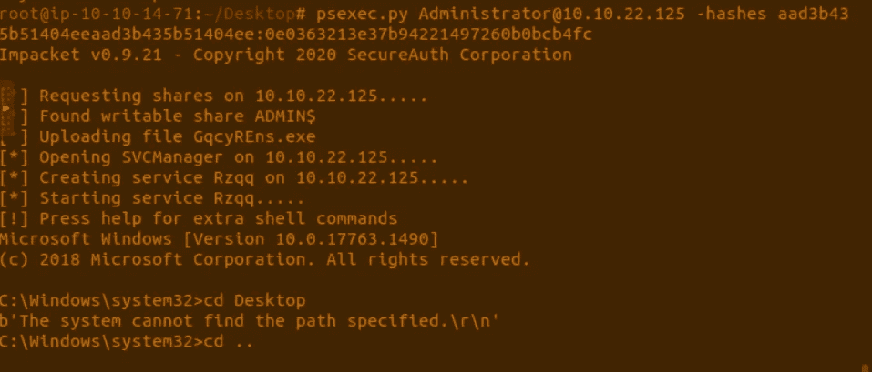

# 走过攻击目录框(THM)

> 原文：<https://infosecwriteups.com/walk-through-on-attacktivedirectory-box-thm-eb6c87bedb56?source=collection_archive---------4----------------------->

## Active Directory:-Active Directory 是一个数据库和一组服务，将用户与他们完成工作所需的网络资源连接起来。大多数公司都使用活动目录

## 枚举-1

通过使用具有给定 Ip 的 Nmap，我们可以看到 139 和 445 端口是打开的，这是 Netbios 和 Smb 程序

Netbios 是一个允许不同计算机上的应用程序在局域网内通信的程序

**SMB** :- SMB 代表服务器消息块，用于共享文件、打印机等



Nmap 扫描输出

-然后通过使用“Enum4Linux”工具，我们可以枚举这些端口

```
enum4linux -A 10.10.14.74
```



通过研究活动目录的名称，我们可以理解“. local”是常用的 TLD

## 枚举-2

在查看 Nmap 扫描报告时，我们可以找到在 88(Kerberos)上运行的其他端口。基本上，Kerberos 是活动目录中的一种身份验证服务。打开这个端口，我们可以使用一个叫做`kerbrute`的工具来强行发现用户、密码

有了 GitHub repo 中给定的`userList.txt`和`passwordList.txt`，我们就可以暴力破解 Kerberos



Kerbrute 枚举

所以很明显，从输出中可以发现是`svc-admin` (flag-3)和`backup` (Flag-4)

## 滥用 Kerberos

## Kerberos 是如何工作的？

*   在 Kerberos 下，客户端通常向密钥分发服务(KDC)发送请求。KDC 为客户端创建一个票据授予票据(TGT)，使用客户端的密码作为密钥对其进行加密，然后将加密的 TGT 发送回去。通过使用 TGT，我们可以请求 KDC 提供 TGS(票证授予服务)来访问 ActiveDirectory 中的任何特定服务，如 SQL，我们还找到了一个运行服务的服务帐户(svc-admin)。因为我们有一张 TGS 票，所以我们可以将票发送给一个特定的服务，该服务将使用提供的 TGS 对用户进行身份验证。该服务使用用户名和密码来解密 TGS，并声明它是否有效
*   在我们的例子中，我们发现了 2 个特定的用户名，我们没有特定的密码来请求 TGT，**但是**，Kerberos 中存在一个被称为`ASREPRoasting`的攻击特性。ASREPRoasting 是一个用户帐户可以拥有特权`DO Not require PreAuthentication`，因此这意味着该帐户在请求指定用户帐户上的 Kerberos 票据之前不需要提供有效的身份证明

为了执行 Asreproasting，一个名为`Impacket`的工具位于 impacket/examples/getnpusers . py 中，它将允许我们从密钥分发中心查询 ASReproastable 帐户。使用这个工具的先决条件是知道我们已经列举的用户名



使用 GetNPUsers.py 工具检索哈希

在接收到散列后，我们可以通过使用 *`john`* 和密码为 *`management2005`* 的密码列表来破解散列


约翰(密码检索器)

**枚举(回到基础):-**

因为我们有用户名和密码，所以我们可以登录到服务器。我们可以使用“smbclient”工具来完成这项工作



中小企业客户端

通过使用 `secretsdump.py`工具，我们可以提取管理员账户 `secretsdump.py spookysec.local/backup:'backup2517860'@10.10.22.125 -just-dc`的 NTLM 哈希



secretsdump.py

接下来，要获得管理员权限，我们可以使用一个名为`psexec.py`的工具，命令如下`psexec.py Administrator@10.10.22.125 -hashes aad3b435b51404eeaad3b435b51404ee:0e0363213e37b94221497260b0bcb4fc`



帐户访问

获得管理员访问权限后，每个标志都位于用户的桌面文件夹/

在 [TryHackme](https://tryhackme.com/room/attacktivedirectory) 访问此框