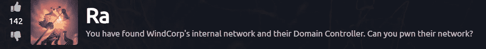
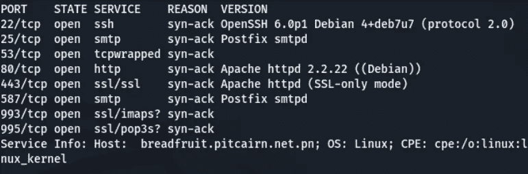
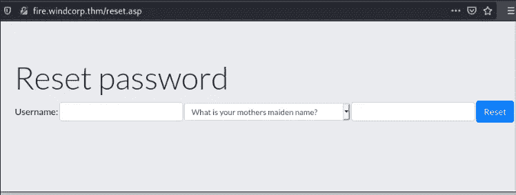
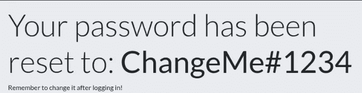
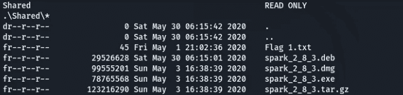
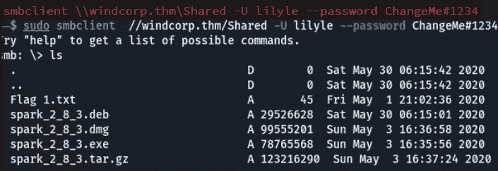
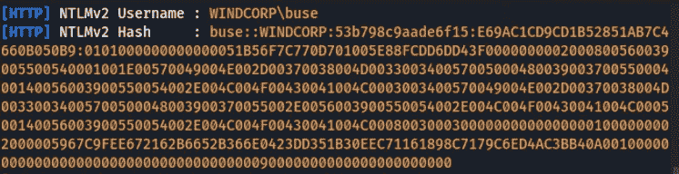
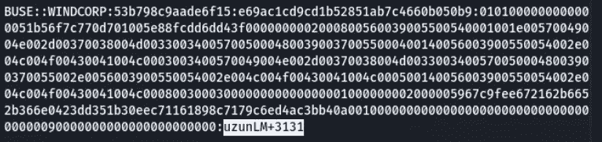
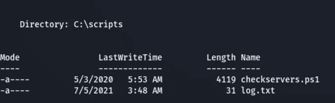
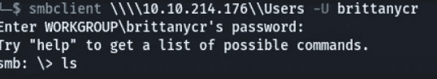

# Ra 箱(THM)演练

> 原文：<https://infosecwriteups.com/walkthrough-on-ra-box-thm-a70b8e27f14?source=collection_archive---------1----------------------->

让我们解决来自 Tryhackme 的名为“Ra”的盒子

Ra 徽标

# 渗透测试方法

1.  **侦察**
2.  **枚举**
3.  **剥削**
4.  **权限提升**

在 [Tryhackme](https://tryhackme.com/room/ra) 访问此框

# **侦察:-**

Nmap:- Nmap 扫描显示几个端口打开

Nmap

*   浏览网页后，我们可以看到需要保存到`/etc/hosts`中的`fire.windcorp.thm`和`windcorp.thm`
*   然后查看网页，有一个`resetpassword`按钮提示安全问题

重置密码页面

*   因此，要获得用户名和安全问题的答案，我们可以浏览网页并滚动到最后，我们可以看到员工列表和一个名为`Lily levesque`的员工发布了她和她的狗的照片，狗的名字出现在图片 URL(即 sparky)上

莉莉·莱维斯克(雇员)

*   通过粘贴用户名为`Liliye`并将安全问题改为 pet，答案为`Sparky`

*   我们还得到了一个重置密码

密码已更改

# 枚举:-

*   因为我们知道 149 和 445 端口是打开的，也就是`smb`，我们能做的就是使用`smbmap`工具和 liliye 的用户名和密码来列出其中的所有目录
*   我们使用这个命令`smbmap -u lilyle -p Changeme#123 -R -H windcorp.thm`，由于这个工具执行递归搜索并提取所有目录，我列出了对我们来说重要的目录

smbmap

*   现在，我们可以看到 Flag1.txt 位于`Shared`文件夹中，所以我们使用`smb-client`来列出文件`smbclient \\windcorp.thm\Shared -U lilyle --password ChangeMe#1234`的内容

SMB 客户端

*   因为我们可以看到标志和 spark 文件，快速的谷歌搜索让我明白了什么是 spark，它是一个在工具之间进行通信的即时通讯工具
*   我们还可以在`Shared`文件夹中看到一个特定的版本，它指出这个过时的版本有特定的漏洞，我发现了[这个](https://github.com/theart42/cves/blob/master/cve-2020-12772/CVE-2020-12772.md)

# 剥削

*   通过运行 Spark(2.8.3)和发送有效载荷`/image.jpg"`并打开响应器将捕获`buse` NTLM 散列

混杂

*   然后在运行 hashcat 之后，我们得到破解的密码`uzunLM+3131`，命令是`hashcat -m 5600 hash.txt /usr/share/wordlists/rockyou.txt`

密码

*   既然我们知道用户名和密码，我们可以使用 evil-winrm 来获取访问权限，使用下面的命令`evil-winrm -u buse -p uzunLM+3131 -i windcorp.thm`

邪恶-winrm

# 特权逃脱

*   遍历到`C:\>`并列出内容会让我们明白有一个不寻常的文件叫做脚本，在列出脚本后，我们可以找到两个文件`log.txt`和`checkserver.pl1`。

*   查看 log.txt 和 checkservers.ps1 后，我们可以理解代码正在获取`C:\Users\brittanycr\hosts.txt`并执行其中的命令
*   根据组信息，我们作为管理员拥有所有的访问权限，如创建、删除、编辑低特权用户，而我们不能做任何与管理员帐户相关的事情
*   因此，我们可以使用这个命令`net user /domain <user-name> <passoword>`创建一个新用户
*   因为该用户没有管理员权限，我们无法将该访问权限设置为`buse`用户。我们可以编辑 Hosts.txt 文件，并使用这个命令`net localgroup Administrators hacker /add`更新它，这个命令改变了管理员的访问级别

但是，我们如何访问它呢？

*   我们可以使用 Smbclient 作为`brittanycr`用户登录，并在那里编辑文件

SMB 客户端

*   所以，这些就是我们编辑`hosts.txt`文件的步骤

1.  使用`get hosts.txt`将其下载到本地机器
2.  编辑我们主机上的文件，并添加`net localgroup Administrators hacker /add`
3.  在上传我们编辑过的文件之前，我们先用`rm.txt`删除 hosts.txt，然后用`put hosts.txt`上传到那台机器上

*   上传 hosts.txt 之后，我们已经知道这个`checkservers.ps1`每分钟运行一次，获取 hosts.txt 并在其中运行命令
*   因此，大约一分钟后，我们的黑客帐户是管理员特权，所以我们可以使用 evil-winrm 作为黑客登录，并收到第三个标志

就这些，感谢阅读