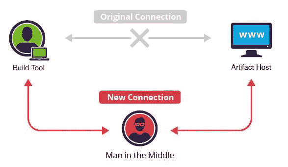
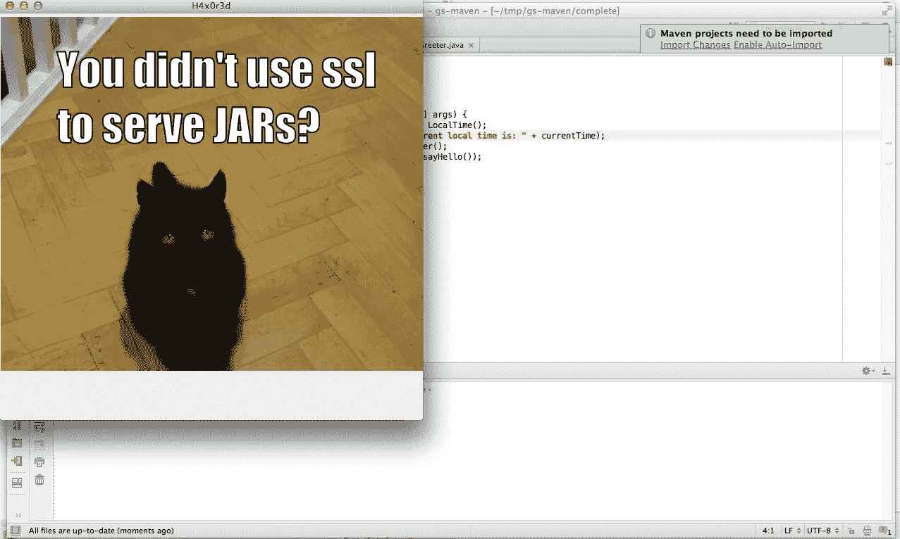
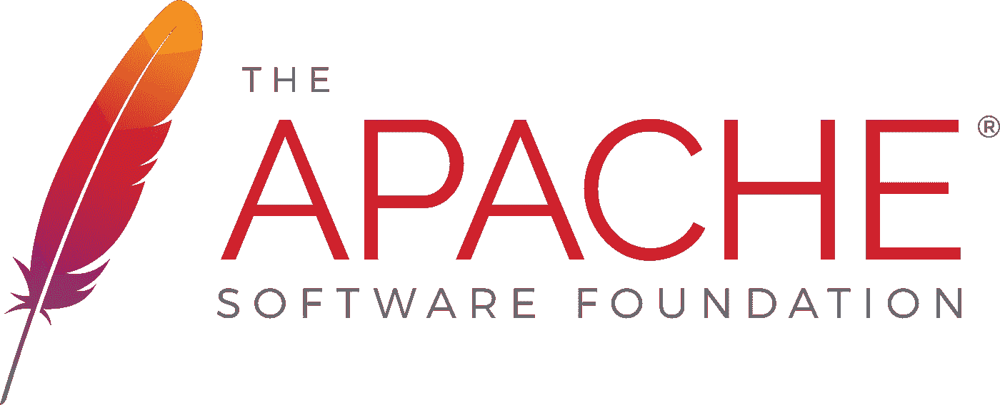
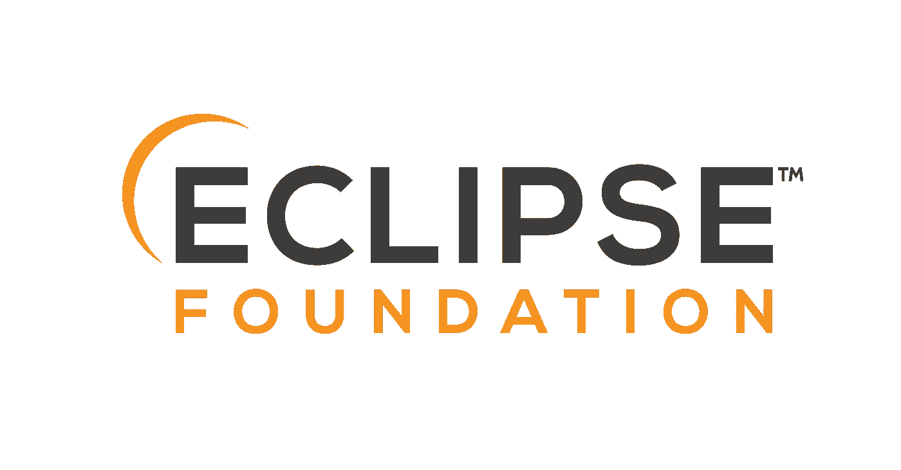
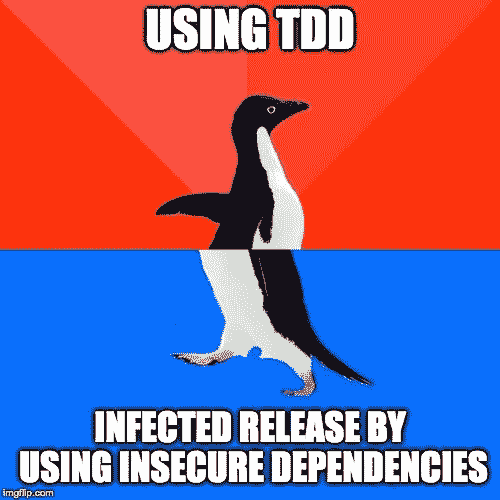
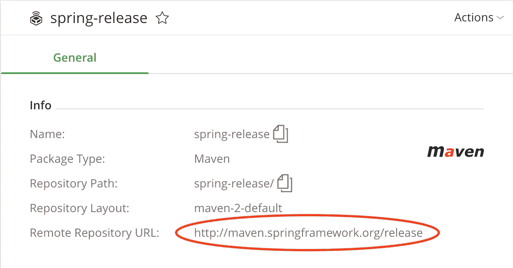

# 想要接管 Java 生态系统？你需要的只是一个 MITM！

> 原文：<https://infosecwriteups.com/want-to-take-over-the-java-ecosystem-all-you-need-is-a-mitm-1fc329d898fb?source=collection_archive---------0----------------------->

## 数百个非常流行和广泛部署的 Java 库& JVM 编译器仍然通过 HTTP 下载它们的依赖项，没有完整性检查。

最初是一个小项目的简单漏洞报告，很快发现了一个影响 Java 虚拟机(JVM)开发生态系统的行业安全漏洞。

# 进入业余

这项工作建立在 2014 年由 Max Veytsman 撰写的优秀文章的基础上，这篇文章的标题是[“如何接管任何 Java(或 Closure 或 Scala)开发者的计算机”](https://max.computer/blog/how-to-take-over-the-computer-of-any-java-or-clojure-or-scala-developer/)。

回到 2014 年，当它发布时，由 Sonatype 运行的 Maven Central Repository 不支持 SSL (HTTPS)来提供 JAR 文件。多亏了 Max 的文章，Sonatype 在几天内就解决了这个问题。我强烈建议你在继续之前至少浏览一下他的文章。尽管他的文章已经发表 5 年了，但他的警告仍然适用，现在也适用于 Kotlin 和 Groovy 开发人员。

然而，这一次不是因为缺乏存储库主机对 HTTPS 的支持；这一次是因为一个普遍存在的单个字符的输入错误，直到今天，成千上万的开源项目仍然存在漏洞。

在他的文章中，Max 介绍了一个名为 Dilettante 的工具，“一个中间人代理，它从[任何工件库]中截取 jar 并向其中注入恶意代码。”"通过 dilettante 代理 HTTP 流量将后门任何从[工件库]下载的 jar 文件."

 [## 业余爱好者

### Maven Central 在为您提供 jar 时不支持 SSL。业余爱好者是利用这一点的 MiTM 代理。…

github.com](https://github.com/mveytsman/dilettante) 

Dilettante 是一个简单的 POC，它所做的只是让 Java 在你的屏幕上呈现一张猫的图片。但是这种非常简单的技术可能会被用来恶意破坏 Java 生态系统的大部分。唯一的先决条件是项目通过 HTTP 而不是 HTTPS 下载它的依赖项。

HTTPS 不仅仅加密客户端和服务器之间的流量，它还提供了一种加密保证，即客户端与所请求的服务器通信，而不是一个 MITM 冒名顶替者。

# **这是怎么被发现的？**

当我发现在我自己的构建中，我因为一个工件而使用 HTTP 时，这个研究就开始了。

这是怎么来的？

我发现根本原因是来自 [Ktor 库](https://github.com/ktorio/ktor)的复制粘贴。深入研究 Ktor 库的历史，我发现直到最近 [Ktor 还在使用 HTTP 来解决依赖关系](https://github.com/ktorio/ktor/issues/953)。需要注意的一点是，Ktor 是一个官方的 JetBrains 库。这件事让我很好奇，于是我开始在别处寻找。

# 谁脆弱？

长话短说；GitHub 上一些最受欢迎的基于 JVM 的项目曾经或现在仍然容易受到攻击。

*注意:标记为“完成”为“真”的项目已经完全修复了该问题，并且已经审核或发布了其先前版本的 CVE 编号。*

对于感兴趣的人，这里有一个到 Google 表单的直接链接。

 [## 依赖关系的不安全解析

### 易受 MITM 攻击的所有开放源代码项目的列表。

docs.google.com](https://docs.google.com/spreadsheets/d/1zemxj8QdIp0saqvwJx6Po1KnyEmJXl2KC_0j0SLd_2E/edit?usp=sharing) 

除了上面列出的项目，还有一些大型社区和组织也受到此漏洞的影响。

## 《我的世界》·莫德

这是我开始寻找的第一个地方，并且毫不奇怪地在我看过的几乎所有 Minecraft mods 的构建基础设施中立即发现了这个漏洞。

## JetBrains

考虑到 Ktor 事件可能不仅仅是一次性事件，我开始关注 JetBrains GitHub 项目。

**科特林编译器**

Kotlin 是一种由 JetBrains 开发的编程语言，可以编译成 JVM、LLVM 和 Javascript。它在 Android 开发者中非常受欢迎。谷歌最近指定 Kotlin 现在是 Android 开发的首选语言。
我在 Kotlin 编译器代码库中找到了多个实例，其中构建基础设施和测试通过 HTTP 下载依赖项。不仅 Kotlin 编译器的源代码依赖易受攻击，而且易受攻击的存储库也被用于 Gradle `buildscript`类路径，使得发布工件有被破坏的可能。如果这还不够糟糕的话，`buildscript`类路径还被用来解析先前版本的 Kotlin 编译器，从而使编译器容易受到“信任”攻击(参见下文)。

**IntelliJ IDEA** 不仅 IntelliJ 和几个官方插件易受此攻击，而且在许多情况下，使用 IntelliJ 创建起始项目的代码生成器生成的项目也易受攻击。

## **格雷尔**

格拉德是一个有趣的例子。作为 Gradle 的贡献者，您不会受到此漏洞的影响，但是，当使用 Gradle 在 Gradle Inc .的 Team City CI 基础架构上构建 Gradle 存储库时，该基础架构覆盖了默认设置，转而使用通过 HTTP 提供工件的公司 JFrog Artifactory 实例。幸运的是，这个基础设施与 Gradle JFrog Artifactory 服务器位于同一个网络上。

也就是说，grad le corporate JFrog Artifactory 服务器通过 HTTP 镜像其他工件服务器，从而可能将这些镜像暴露给基于 MITM 的缓存中毒攻击。

## 弹性搜索

在撰写本文时，Elastic Search repository 拥有 38.6k 颗星，因此成为 GitHub 上最受关注的基于 Java 的项目。主要的弹性搜索项目已经有超过 11k 的贡献者。弹性构建中的测试逻辑被认为易受此影响。

## 街头流氓

我在 Apache 软件基金会的几个项目中发现了这个漏洞。下面列出了一些值得注意的例子。

截至本文发布之日，Apache Software Foundation 已经决定不为受影响的项目发布 CVE 号码，尽管在大多数情况下，没有执行审计来确定这些项目是否被此漏洞恶意破坏。

**Groovy 编译器**

Apache Groovy 是为 JVM 开发的最受欢迎的备选方案之一，它也被发现易受此攻击。在撰写本文时，根据 Tiobe 指数，Groovy 是世界上第 19 大流行的编程语言。与 Kotlin 类似，Groovy 编译器的`buildscript`类路径通过 HTTP 解析依赖关系。这也留下了发布工件被破坏的可能性。

幸运的是，Groovy 编译器是用完全用 Java 编写的引导编译器构建的，因此“信任”攻击的可能性非常小。

此外，Groovy-Eclipse 插件也被发现易受攻击。

**Hadoop** Apache Hadoop 拥有超过 193 名贡献者，是贡献者最多的项目。所有那些在他们的机器上运行 Hadoop 版本的贡献者都有可能被 MITM 入侵。

**卡夫卡
LinkedIn 在内部使用 Kafka，每天接收超过 1 万亿条消息。我发现卡夫卡的构建系统是通过 HTTP 而不是 HTTPS 加载 Gradle 插件的。**

**其他 Apache 项目** 我发现易受攻击的 Apache 项目列表包括但不限于以下:Casandra、Geode、Storm、Bigtop、Fink、OpenJPA、Royal Compiler & Airavata。

## 詹金斯

> *全球超过 1，000，000 名 Jenkins 用户使 Jenkins 成为使用最广泛的开源自动化服务器。
> -* [詹金斯社区宣布 2017 年创纪录增长和创新](https://www.cloudbees.com/press/jenkins-community-announces-record-growth-and-innovation-2017)

Jenkins 被用作一个自托管的 CI 管道来自动化构建和测试软件。

Jenkins 和许多 Jenkins 官方插件都附带了通过 HTTP 下载的依赖项。

## 春天

我找到的第一个位置是在 spring-security-oauth 项目中。Spring 项目是我开始关注的第一个基于 Maven 的项目，这迫使我建立了一个完全不同的搜索方法来使用 GitHub 搜索功能检查 Maven POM 文件。一旦我开始寻找，我发现这个漏洞存在于 Spring 组织下的许多其他项目中。

Spring 团队立即对这个漏洞做出了反应，并开始修补他们所有的项目。由于大量的 Pivotal 项目受到影响，Pivotal 开发了一个工具来查找和替换存储库中所有的 HTTP 使用。该工具可在以下位置找到:

 [## spring-io/nohttp

### 在 GitHub 上创建一个帐户，为 spring-io/nohttp 开发做贡献。

github.com](https://github.com/spring-io/nohttp) 

## 红衣主教

这个漏洞也影响了许多由 Red Hat 维护的项目。这些项目包括但不限于 Hibernate ORM、RestEasy 以及 Wildfly(原 JBoss)生态系统中的许多项目。

## Eclipse 基金会

类似于 Red Hat & Apache Foundation，这也影响了 Eclipse Foundation 项目 Vorto、Buildship、xtext、Orion & Birt。

## 神谕

该漏洞还影响了 Oracle 的一些开源项目，包括 VisualVM、PGQL、OpenGrok 和 Helidon。

## 测试库和框架

一些非常流行的 JVM 测试库和框架也容易受到这种攻击，包括 TestNG、Spock 和 PowerMock。

## 其他项目

发现此漏洞的其他项目包括 Grails，FasterJacksonXML & Ehcache3 的 Scala 模块。此外，我在网飞、谷歌、Twitter、美国国家安全局(NSA)、Stripe、Gluon(场景构建器)PortSwigger、Black Duck、Snyk、LinkedIn 和 PayPal 的开源项目中发现了这个漏洞。具有讽刺意味的是，当这被报告给 PayPal 的安全团队时，他们关闭了它，因为他们认为 MITM 攻击[“超出了他们 HackerOne 程序的范围](https://hackerone.com/paypal#out-of-scope-vulnerabilities)。

# MITM 袭击有多常见？

我对常见 MITM 攻击的最初研究实际上源于我对恶意损害 XML 解析器的研究，这些解析器加载通过 HTTP 加载的 DTD 文件，以实现 [XXE](https://www.owasp.org/index.php/XML_External_Entity_(XXE)_Processing) 。在以后的文章中会有更多关于这个主题的内容。我的发现相当惊人。

## 互联网服务提供商

令我惊讶的是，互联网服务提供商(ISP)似乎经常这么做。

> 康卡斯特开始向我在互联网上请求的页面注入 400 多行 JavaScript 代码，这样当浏览器呈现网页时，JavaScript 就会弹出一个窗口，试图向我追加销售一个新的调制解调器。
> - [康卡斯特继续向你访问的网站注入自己的代码](https://thenextweb.com/insights/2017/12/11/comcast-continues-to-inject-its-own-code-into-websites-you-visit/)

[Bharat Sanchar Nigam Limited](http://www.bsnl.co.in/)(BSNL)印度的一家互联网服务提供商也曾在用户通过 HTTP 下载网页时向其网页植入广告。

这表明基础设施已经存在，可以重新定位以影响 JAR 文件。

## 恶意的演员

当恶意行为者获得对系统的访问权时，他们通常会迅速利用新的立足点建立 MITM。每年，威瑞森都会发布一份数据泄露调查报告(DBIR ),分析每年最常被利用的各种攻击媒介。这是从他们的一份报告中引用的。

> ***处理措施*** *前三大威胁处理措施类别是黑客、恶意软件和社交。最常见的黑客行为类型是使用窃取的登录凭据、利用后门和中间人攻击。*
> 
> *-* [威瑞森 2011 年数据泄露调查报告](https://www.verizonenterprise.com/resources/reports/rp_data-breach-investigations-report-2011_en_xg.pdf)；第 69 页

引用这份报告的分析:

> 我推断，这是一个次要的行动，一旦有人在系统中有了立足点，但荷兰高科技犯罪单位的数据表明，这是相当可信的关注。在构成其统计数据的 32 起数据泄露事件中，有 15 起涉及 MITM 行动。
> - [答案:堆栈交换:“中间人”攻击是否极其罕见？](https://security.stackexchange.com/a/12050)

MITM 攻击应被视为软件安全中的一个可信威胁。

## 通过公共 WiFi 连接

抛开所有这些其他攻击媒介不谈，任何通过公共 WiFi 连接从事这些项目的开发人员都将他们的计算机暴露在恶意攻击的潜在威胁之下。著名的火狐插件 [Firesheep](https://en.wikipedia.org/wiki/Firesheep) 演示了这种攻击。

WiFi 热点的潜在危害会对开发人员本身产生重大影响，因为许多开发人员在咖啡店、开发人员会议等场合使用 WiFi 工作。只需要一个 [WiFi 菠萝](https://shop.hak5.org/products/wifi-pineapple)和一个尚未被缓存的依赖项就能感染开发者的机器。

## 政府

由于斯诺登的爆料，我们现在明白了美国政府的三个情报机构对美国公民实施 MITM 袭击所使用的各种方法。

> 为了欺骗目标访问 FoxAcid 服务器，美国国家安全局依靠其与美国电信公司的秘密合作关系。作为混乱系统的一部分，美国国家安全局将代号为量子的秘密服务器放置在互联网主干网的关键位置。这种布局确保了他们比其他网站反应更快。通过利用这种速度差异，这些服务器可以在合法网站做出响应之前，将被访问的网站伪装成目标网站，从而诱骗目标浏览器访问 Foxacid 服务器。
> -[NSA 如何用 QUANTUM 和 FOXACID 攻击 Tor/Firefox 用户](https://www.schneier.com/blog/archives/2013/10/how_the_nsa_att.html)

由于[错误配置的 BGP 路由](https://www.wired.com/story/google-internet-traffic-china-russia-rerouted/)，互联网流量也有通过外国路由的历史。

# 通过 HTTP 加载的最常见的存储库

让我们看看通过 HTTP 加载的最常用的存储库的一些统计数据。请注意，这些数字并不准确，可能略有夸大，因为 GitHub 的搜索功能本质上是模糊的。

## Maven Central

Maven Central 是 JVM 生态系统中使用的最流行的工件服务器，也是 Maven 使用的默认工件服务器。Maven Central 是 JVM 工件托管领域的第一个主要参与者。

## JFrog JCenter

JCenter 是 Maven Central 的超集。发布到 JFrog Bintray 的开发人员可以请求在这里镜像他们的工件。

## JFrog 纸盒

JFrog Bintray 允许开发者为开源项目免费创建自己的工件服务器。

显然，这是一个广泛存在于 Gradle 和 Maven 项目中的安全漏洞。

# 编写一个(理论上的)Java 库蠕虫

作为一个思想实验，我起草了滥用这个 MITM 漏洞来创建一个 Java 库蠕虫的想法。这个思想实验的结果可以在这里找到。

 [## 让我们写一个(理论上的)Java 库蠕虫

### 本文是对《想接管 Java 生态系统？你需要的只是一个 MITM！

medium.com](https://medium.com/@jonathan.leitschuh/lets-write-a-theoretical-java-library-worm-9a6edff87cf5) 

TL；博士是这样的:

此漏洞的后果是，在发布过程中使用的依赖关系 MITM 可能允许恶意代码恶意损害构建产生的工件，从而感染下游用户。

# 修复过去

对于已经发布的库，除非这些项目构建是完全可复制的，否则没什么可做的。对于易受此攻击的编译器(Kotlin)、用于自我测试的测试库(Spock 和 TestNG)以及用于自我构建的构建工具(Gradle)，这可能是一个问题，因为信任链已经被破坏。大多数编译器都是用来编译自己的。关于这个话题的更多信息，请参阅 Ken Thompson 的一篇相对较短的论文，题为“[关于信任的思考](https://www.archive.ece.cmu.edu/~ganger/712.fall02/papers/p761-thompson.pdf)”。

# 修复未来

我认为像 Gradle、Maven 和 SBT 这样的构建工具需要要求用户明确选择不使用 HTTPS 来解决他们的依赖性。这将迫使用户清楚地表明他们使用不安全协议的意图，从而防止偶然的打字错误。我有一个与 Gradle 和 Maven 都开放的建议来实现这一功能。你可以在下面找到这些建议。请上去给他们投票！

 [## 反对 JLLeitschuh 请求#9419 gradle/gradle 的 HTTP 下载

github.com](https://github.com/gradle/gradle/pull/9419)  [## [MNG-6673]反对 HTTP 下载和上传- ASF JIRA

issues.apache.org](https://issues.apache.org/jira/browse/MNG-6673) 

## 仓库的自动审计

Pivotal 开发的 nohttp 工具查找所有出现的 http，除了那些被列入白名单的(即 XML 名称空间名称)。这将确保 HTTP 不会在其他地方引起问题(例如 Gradle 包装器位置、DTD 声明等)。它可以查找 HTTP 出现的位置，替换出现的位置，并与一个构建集成以确保将来不会使用 HTTP。

 [## spring-io/nohttp

### 在 GitHub 上创建一个帐户，为 spring-io/nohttp 开发做贡献。

github.com](https://github.com/spring-io/nohttp) 

## 神器主机解嘲 HTTP 2020 年 1 月

随着这个漏洞的范围越来越大，我很快意识到这个漏洞的一些责任落在了像 Maven Central 和 JCenter 这样的工件主机上。我联系了两个最大的工件主机 Sonatype (Maven Central)、JFrog (JCenter)以及 Pivotal (Spring)、Eclipse Foundation、Jenkins、Red Hat & JetBrains 等较小的主机，询问他们是否愿意加入一项倡议，从 2020 年 1 月 15 日开始完全阻止 HTTP 上的下载请求。

> 25%的 Maven Central 下载仍在使用 HTTP

在这个声明发布后不久，JFrog 和 Pivotal 都通知我他们将会跟进。

你可以在这里找到 [Maven 中央公告](https://central.sonatype.org/articles/2019/Apr/30/http-access-to-repo1mavenorg-and-repomavenapacheorg-is-being-deprecated/)。

# 我容易受到这种伤害吗？

鉴于我在许多广泛使用的开源项目中发现了这一漏洞，我建议任何为 JVM 开发软件的人去检查他们的构建逻辑，以便通过 HTTP 解析依赖关系。

## 我在找什么？

对于 Gradle，您正在寻找这样的存储库配置。

Gradle 开发人员可能还想检查任何在他们公司内部分发的`init.gradle`脚本，但是这些脚本通常不会被签入源代码控制。

对于基于 Maven 的项目，您正在寻找这样的存储库配置。

Maven 开发人员还应该检查他们的`~/.m2/settings.xml`文件中的配置，因为那里通常是配置存储库凭证的地方。

此外，JFrog Artifactory 或 Sonatype 的 Nexus 的企业用户应该检查他们的服务器的配置，看看他们是否通过 HTTP 镜像其他工件服务器。

JFrog Artifactory 中的不安全配置示例

我已经联系了 Sonatype 和 JFrog，要求他们在未来的更新中开始警告用户/管理员不安全的配置。

JFrog 回应说这个功能现在已经正式成为他们路线图的一部分，但是他们还没有计划好发布日期。

## 发现这个漏洞怎么办？

执行潜在恶意 jar 的整个机器(开发人员机器、构建盒等)应该被认为是潜在受损的。这也意味着机器可以访问的任何内容(其他项目、凭证、其他主机等)也应该被认为是潜在的危害。共享的工件缓存，如`~/.gradle`和`~/.m2`目录，其中 Gradle 和 Maven 缓存工件应该被认为受到了威胁，应该被删除。为了避免单个易受攻击的应用程序暴露它构建的每个项目，尝试隔离您的构建也是最佳实践。

如果您是一个容易受到这种攻击的开源项目的维护者，那么您有责任让您的用户审核以前的版本是否存在漏洞，或者申请一个 CVE 号码来通知下游用户潜在的漏洞。

# 关闭

不幸的是，我只能联系到受此漏洞影响的一小部分项目。您在自己的工作中依赖的许多开源项目可能容易受到这种攻击。如果你有能力这样做，考虑接触那些你发现受到影响的项目，为我们所有人保护 Java 生态系统。

如果你在开源软件上工作，或者用这些商业构建工具开发软件，我也强烈建议你为了软件供应链管道的完整性审核你的构建。

# 特别感谢

我要感谢我联系的所有组织中所有真正令人敬畏的专业安全团队和项目维护人员。我绝对不可能自己修补所有这些地方。这些团队中有几个在我报告后的几个小时内就做出了回应，并在第二天开始在他们的代码中推出补丁。此外，我要感谢 Snyk 公司同意担任所有这些 CVE 报告的 CNA。我也要感谢 Max Veytsman 创造了业余爱好者。有了概念验证后，负责任的披露流程变得更加顺畅。

# 进一步研究注意事项

如果您碰巧是一名安全研究人员，并且希望在其他 Java 项目中找到这些我在这里可能错过的安全漏洞，那么我使用的 Github 搜索查询是。

如果您在使用这些查询的项目中发现了这个问题，请将它们指向本文。

## 不同版本的工具

*   https://reproducible-builds.org/tools/
*   【https://github.com/scala/jardiff 