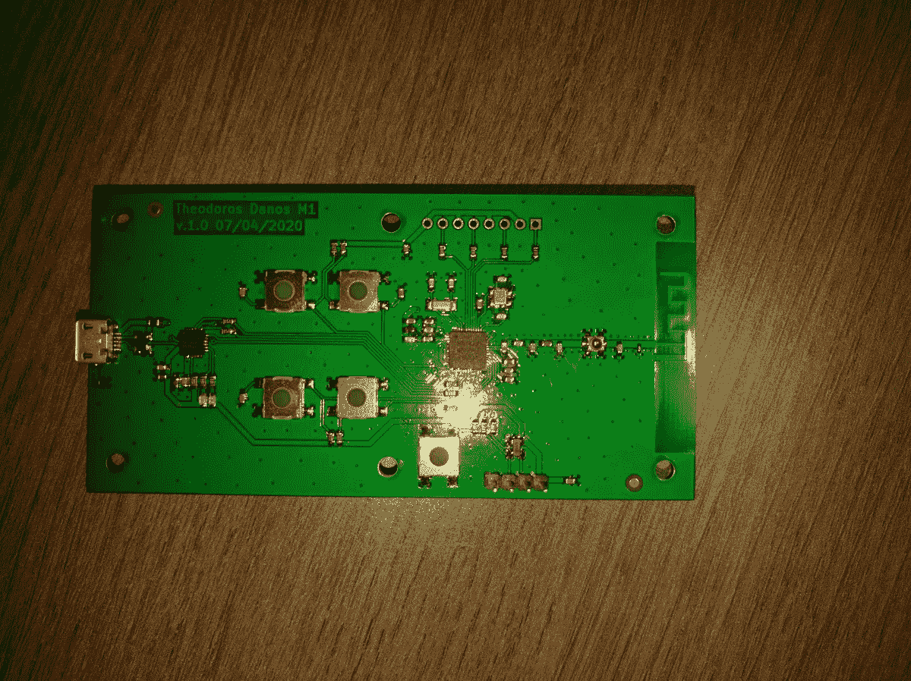
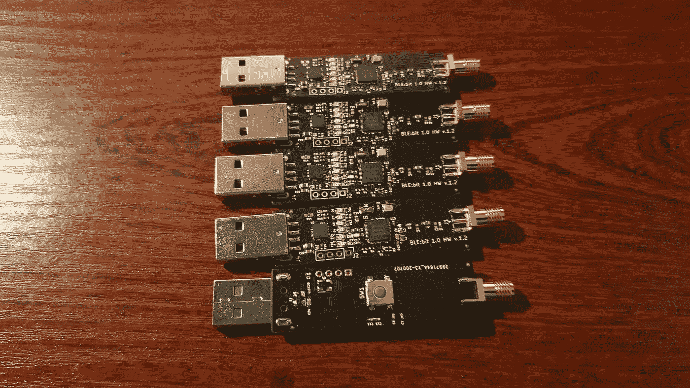
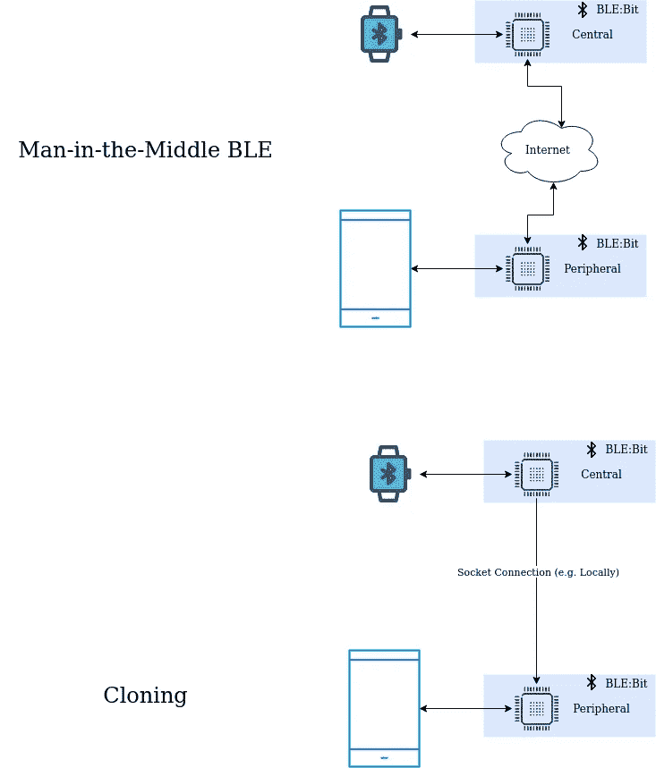

# 在我开发信息安全产品时，对新冠肺炎的战争

> 原文：<https://infosecwriteups.com/war-against-covid-19-while-i-was-developing-an-infosec-product-2e2320375acd?source=collection_archive---------3----------------------->

当我们因为新冠肺炎被锁在家里的时候，我开发了一个安全相关的产品。

# 为什么新冠肺炎时期帮助我创造了这个产品

在新冠肺炎隔离期间，每个人都很沮丧，但新冠肺炎帮助我创造了一个产品。我刚刚找到空闲时间，对吗？不对。

作为一个人，我工作很多。不是为了我的全职工作，而是为了我自己。过去 10 年，我一直在开发自己的不同领域。我的不同领域喜欢黑那个，编程那个，破解别的东西。我知道很多关于一切的事情，而一切都是微不足道的。我非常想花时间在生活上，但我唯一做过的事情就是黑客或者我不知道是什么。我总是认为它将在下周结束，看看我现在。而这和我们的话题直接相关。

## 产品的需求

一切都始于我想创建一个关于蓝牙低能耗的课程——从安全的角度来看。我相信业界关于 BLE 安全的一切都是不够的。我在研究 BLE 上花了太多时间，所以我需要从我的头脑中获取一些知识。关于 BLE 以及它如何与漏洞发现、安卓和物联网相结合，我学到了太多东西。蓝牙是如此神奇的技术。

当时我是一名信息安全研究员(处于攻击性的一方)。正如我提到的，我需要停止像过去几年那样把时间花在研究上，而是专注于我的生活。当 BLE 课程即将推出时，我就迫不及待地想这么做，但我仍然需要时间来使它变得更完美，学习更多来做更多。那从未发生过。都是因为我看到了一个机会并抓住了它。

首先，我想创造一个工具来帮助我的学生轻松破解蓝牙设备。我需要一个工具来帮助他们完成我要在课堂上做的黑客练习。但后来我发现这个设备可以单独出售。最后，我太专注于这个设备，以至于完全忽略了 BLE 和沃恩。探索训练。

# 进退两难

所以，如果你还在阅读，现在你知道了，为什么新冠肺炎帮助我创造了我的产品。这与空闲时间无关。过了这么多年，我已经准备放弃了。我花了一生的时间，除了点击一下鼠标，什么都不记得。新冠肺炎来了。

我们被锁在家里，远程工作。然后我明白了，由于隔离，那段时间我不能再见到我的家人，我有足够的时间在家。所以我花了我所有的精力、金钱和时间来建造 BLE 钻头。

当每个人都渴望出去，享受生活，像动物一样狂欢时，我却被锁在家里，利用这段时间，直到最后一刻。在 9 点至 5 点的工作之后，我切换电脑(公司/个人),我一直在做我的项目直到深夜。我知道一些关于硬件的狗屎，但我从来没有一个硬件的人。进入 2020 年。我已经从网上雇了一些家伙，一个自由职业者，一个高级的。他做出了我所能想象的最杰出的作品。价格有点超出我的支付能力，但我付出了我所有的积蓄来生下这个孩子。如果我讨厌新冠肺炎的一切，但是我很高兴我可以利用呆在家里的机会。我从来没有时间和精力去完成这个项目，没有想到我可以把这些时间花在更有意义的事情上——例如，去公园散步，或者去看望我的父母，或者我不知道是什么。当然，这个项目花了 3 个多月的时间才完成，但是在新冠肺炎时期得到了提升。

原型——马克一世

# 该项目

该项目是关于一种设备，让用户能够自由地与蓝牙低能耗设备进行交互。自由意味着可以和 SDK 一起工作。自由意味着带有预构建开源工具的并行设备。

自由意味着没有依赖库(需要排除故障才能编译到我自己的环境中)。自由意味着开源。
自由意味着优雅的建筑。
自由意味着即插即用。
自由意味着跨平台，拥有比其他工具更多的功能。自由意味着 **BLE:比特。**

BLE:Bit 是我开发的工具，可以帮助任何渗透测试人员或安全研究人员进入物联网领域并发现漏洞——可能像我最近发现的那样零天——快速，没有与工具的争论，而是使用工具的结果。

BLE:比特 1.0 准备好了吗

*   固件就绪
*   SDK 就绪
*   CLI-工具就绪
*   新硬件就绪
*   GUI 界面需要更多时间

# 与 BLE 黑客:Bit

BLE:Bit 是一种可以充当外围设备或中心设备的设备(就像 WiFi 中的接入点和客户端一样)。这允许我们创建一个**克隆**。更有趣的是，我们可以为新连接创建一个中间人攻击(或 BLE 代理)。这是可能的，因为蓝牙低能耗的工作方式不同于我们所知道的其他协议。外围设备(例如接入点)在每个固定的时间段进行广告。但是想想我们说的是低能耗设备，也就是说广告时间总是比 SIG 蓝牙定义的最小广告时间长。我们可以使用相同的 mac 地址进行广告，甚至在原始设备的第一次传输发出之前，我们就可以多次进行广告。让我们有机会锁定目标。此外，请记住，原始设备可能不在那里，中央(如客户端)将没有其他选择，只能连接到我们。

使用 BLE 的 MiTM 和克隆攻击:Bit

# 加密连接？没问题

## 加密密钥提取

有人可能会说有些通信是加密的。BLE:位设备支持加密方法，并将导出加密密钥，以便用户能够使用 LE 嗅探器检查通信。当然，它不能破解密钥，但密钥必须由用户输入。

## 加密密钥重置

**这里的秘密**是，在蓝牙低能量中，有一个程序叫做密钥修复强制执行。

BLE 比特设备可以强制另一端修复并用新密钥重新绑定，因此之前使用的加密是无用的。只有当另一端允许密钥修复时，这才是正确的(所有检查的设备都允许，因为如果密钥被错误删除，可能会导致锁定用户)。

## 错误和漏洞

值得注意的是，所有 android(也可能是 iOS)应用程序都在非常愚蠢地保护它们的 BLE 连接。开发者还不熟悉他们操作系统的 API(阅读我最近在安卓 BLE 图书馆找到的 CVE)。我必须补充一点，我在 android 操作系统中发现了许多错误，BLE 代码并没有得到很好的开发——至少在 android 6 之前，现在的代码要好得多。

我欠你一篇关于设备当前发展的文章。目前，我只开发了 Java SDK，它可以直接与 USB 供电的设备和基于 CLI 的工具进行通信，但我很快就会有一个 GUI 界面(移动应用程序或 web)。

# 未来目标

**免费协议市场**

我想在应用程序内创建一个免费的社区，任何人都可以建立，上传或下载“协议”。“协议”将能够解码用户设备之间传输的数据，并显示有意义的消息，而不是“51 FF FA 3A”。

**起毛器**

另一个未来目标是创建一个应用程序模糊器，它将智能地模糊 SIG 标准定义的每一个服务。从某个地方开始，我们需要一个抽象。这就是我和 BLE 取得的成就:一点点。作为一个社区，我们没有足够的工具来攻击 BLE。也许这些工具确实存在，但是要么太贵，要么隐藏在大型企业环境中。

该设备将在接下来的几个月内上市。如果你想获得任何更新，请关注我。通常他们会要求发电子邮件，但我讨厌这样。

# 关于我

我是一个非常工作狂的人。我从未停止创造，也从未停止在世界上寻找答案。如果我能走出去看到我自己，我想象我会看到自己像一个电子通过一根电线，和许多其他人一起，孤独而疲惫，连接着明天的互联网。不断聚焦，试图定义旅程的目的。知道最后，这是一个循环，一个无意义但令人兴奋的旅程。一开始我以为我疯了。我甚至认为我必须像正常人一样调整自己。但是每天我都通过 twitter 发现有更多像我一样的人存在，所以我一步一步来。试图证明疯狂的人和不合群的人可以改变世界。

我学过通信和互联网，并以优异成绩毕业。然后，我以全班第一的成绩学习了数据科学与工程理学硕士，我是一名博士辍学生(我仍在考虑这件事)。我曾在移动攻击安全领域的**世界**最臭名昭著的公司担任信息安全研究员，拥有一个令人惊叹的团队。现在我已经转行到行业的另一边，目前在做渗透测试员。