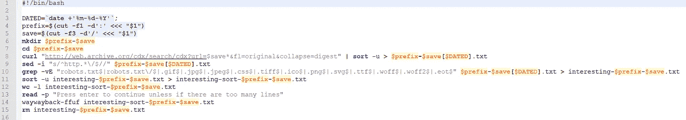

# 回溯机——寻找 bug 的一种方法

> 原文：<https://infosecwriteups.com/wayback-machine-a-way-forward-in-finding-bugs-bf03e294475?source=collection_archive---------2----------------------->



你一定听说过在 github repos 中发现漏洞的人的漏洞奖励。而且，这些都是很好的读物，当然在现实世界中要难得多。至少对我们中的一些人来说。但是，总是有更多的方法可以到达一些有趣的端点，包括泄漏的数据，如 api 令牌，这些令牌可能仍然有效。

关于使用 Wayback 机器寻找旧的有趣文件的想法并不是一个新的想法。有一个工具做得相当好:[https://github.com/tomnomnom/waybackurls](https://github.com/tomnomnom/waybackurls)

现在，虽然上面的工具，可能还有许多其他类似的工具为您提供了 wayback machine 拥有的链接列表，但我需要一种方法来快速验证这些链接是否真的在工作。并且，有了一个 5 个，甚至 10 个链接的列表，手动操作很容易。但是，列表越大，事情就越复杂。还有一个问题是，如果链接正常工作，但是(即使它们有不同的页面名称)它们都重定向到主页面或一些自定义 404，那么该怎么办？

输入:waywayback 和它的同伴 waywayback-ffuf，我按照当时听起来有趣的东西命名，按照我的需要写剧本，它肯定很丑，但它是我的:)

此外，它并不复杂，所以请随意编辑(或者我应该说改进它)以满足您的特定需求，我想将它们合并到一个脚本中是选项之一:)

你需要安装 ffuf 来充分利用这些脚本:【https://github.com/ffuf/ffuf

而且，为了能够在任何目录中运行它，为了更好地组织，创建一个到 waywayback 和 waywayback-ffuf 的符号链接，否则我想您必须在脚本中指定各种路径。

**剧本回顾:**

```
#!/bin/bashDATED=`date +’%m-%d-%Y’`;
prefix=$(cut -f1 -d’:’ <<< “$1”)
save=$(cut -f3 -d’/’ <<< “$1”)
mkdir $prefix-$save
cd $prefix-$save
curl “[http://web.archive.org/cdx/search/cdx?url=$save*&fl=original&collapse=digest](http://web.archive.org/cdx/search/cdx?url=$save*&fl=original&collapse=digest)" | sort -u > $prefix-$save[$DATED].txt
sed -i “s/^http.*\/$//” $prefix-$save[$DATED].txt
grep -vE “robots.txt$|robots.txt\/$|.gif$|.jpg$|.jpeg$|.css$|.tiff$|.ico$|.png$|.svg$|.ttf$|.woff$|.woff2$|.eot$” $prefix-$save[$DATED].txt > interesting-$prefix-$save.txt
sort -u interesting-$prefix-$save.txt > interesting-sort-$prefix-$save.txt
wc -l interesting-sort-$prefix-$save.txt
read -p “Press enter to continue unless if there are too many lines”
waywayback-ffuf interesting-sort-$prefix-$save.txt
rm interesting-$prefix-$save.txt
```

**脚本 waywayback-ffuf:**

```
#!/bin/bash
cut -d’/’ -f4- $1 > $1-wordlist.txt
prefix=$(cut -f4 -d’-’ <<< “$1”)
save0=$(sed s/interesting-sort-//g <<< “$1”)
save1=$(sed s/http//g <<< “$save0”)
save2=$(sed s/^s-//1 <<< “$save1”)
save=$(sed s/.txt//g <<< “$save2”)
ffuf -mc 200,204,301,302,307,401,403,405 -c -w $1-wordlist.txt -H “X-Forwarded-For: 127.0.0.1” -u “[https://$save/FUZZ](https://$save/FUZZ)" -v -o [ffwayback-$prefix-$save].csv -of csv
```

用法:waywayback https://x.target.com

它将显示新创建的单词列表中有多少行/单词，至少对我来说，这个想法是我不想处理任何超过一定数量的东西，但这取决于所讨论的目标和我是否有心情等。

然后，一旦完成(假设你决定通过单词表进行 ffufing):

- cd 目标

- cut -d '，'-f2，5，6 *csv | grep -E "，200，|，405，|，302，" |更多

你明白了。

**这些脚本背后的基本思想:**

-使用 curl 与 wayback machine api 交互并检索数据，同时使用 sed 和 grep 创建一个感兴趣的端点列表，并将其放入 ffuf 的单词列表中

-使用 wc -l 来统计找到的链接数量，并提示您是否希望使用新创建的单词列表在目标网站上执行 ffuf(虽然 ffuf 对 100K 链接没有问题，甚至达到 500K 也可以接受，但有时太多意味着目标网站有问题，即。假阳性或类似)。

-使用 ffuf 和新创建的单词列表来查看什么是误报，什么是有趣/无聊的，添加-H "X-Forwarded-For: 127.0.0.1 "是因为有时它可以绕过 waf。

**快速浏览 csv 结果的一些技巧:**

cut -d '，'-f2，5，6 *csv | grep "，200，" |更多

以上是一个好的开始。它只显示与 url、状态代码和页面大小相关的列。如果你看到不同的 URL 大小相同，那么只需添加| grep -v "，1234 "，其中 1234 是有问题的大小，如果你发现其他不同的大小被重复了太多次，那么添加:grep -vE "，1234|，4321 "等。

除了明显好奇的端点之外，还有一些有趣的事情要寻找，比如 api 令牌/密钥。诚然，在某些情况下，在大多数情况下，它们往往会过期和/或属于随机的低级别用户，但在某些情况下，它们可能仍在运行。并且，它们可能属于管理员、职员和其他公司人员。你可以看到这里的潜力。

使用上面的脚本，我发现了有效的 api 令牌，并且我还发现了默认单词表没有的端点，因为有问题的公司有他们的非标准命名。有一次，我访问了一些奇怪命名的端点，得到了一个用户名和加密密码的列表，除此之外，它是公开可访问的，所以我为此得到了一笔可观的奖金。

*当你陷入困境时，有时回顾可以帮助你前进。也就是说，你也应该注意不要在侦察中迷路，如果你不小心的话，这很容易发生。*