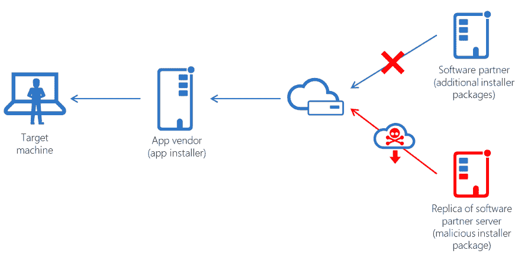
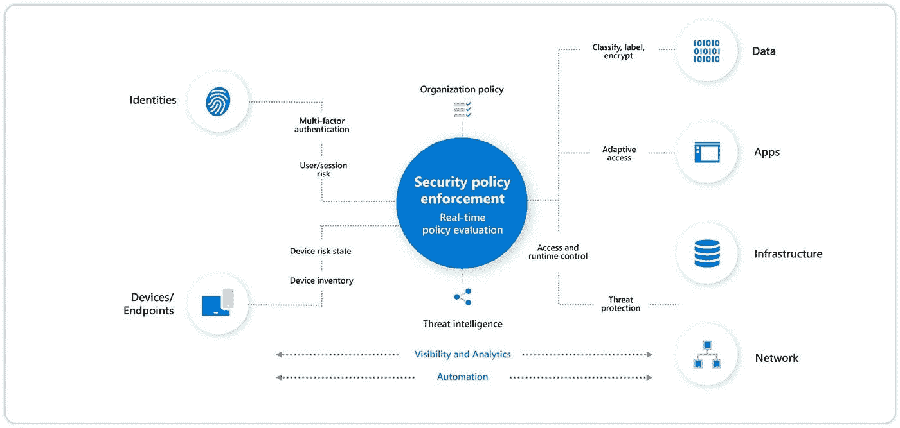

# 2022 年缓解软件供应链攻击的方法

> 原文：<https://infosecwriteups.com/ways-to-mitigate-software-supply-chain-attacks-in-2022-f06794767218?source=collection_archive---------3----------------------->

[**照片**](https://unsplash.com/photos/zvHhKiVuR9M) **被** [**靶**](https://unsplash.com/@arget?utm_source=unsplash&utm_medium=referral&utm_content=creditCopyText) **拍下**

供应链攻击，也称为价值链攻击或第三方攻击，是指有人通过能够访问您的系统和数据的外部合作伙伴或提供商攻击组织的系统。合作伙伴或提供商可以是已经整合到业务中的第三方系统，例如 CRM 系统或用于持续集成和交付的 CodeCov 管道。

如果由于合作伙伴的系统遭到破坏而导致组织的数据遭到破坏，那么其他组件也有可能遭到破坏。由于近年来普通组织的攻击面已经大大扩展，并且他们依赖于各种合作伙伴，因此他们特别容易受到这些类型的攻击。

[来源](https://medium.datadriveninvestor.com/supply-chain-attacks-df74371df44a)

供应链攻击是一种网络攻击，在这种攻击中，由于[供应链](https://en.wikipedia.org/wiki/Supply_chain)中的缺陷，组织的供应链受到损害。因此，保护供应链是非常必要的。让我们讨论几种可以用来保护供应链的方法。

# 追踪 SBOM

一份[软件材料清单](https://scribesecurity.com/sbom/) (SBOM)是一份软件产品或服务开发中使用的组件的完整清单。由于软件是使用各种开源代码和部件构建的，因此跟踪其开发中使用的每个组件至关重要。它由不同的预构建库、开源包和第三方资源组成，用于加快开发过程和提高项目的整体质量。这些组件用于增强软件和应用程序的功能。恶意行为者经常在第三方软件包中包含潜在的脏代码。当一个不小心的用户安装了被感染的软件包，他们的机器就会被黑客攻击，从而导致对网络其余部分的供应链攻击。至关重要的是，软件的每个组件都要追踪到它的来源。然后，任何时候在某个组件中发现漏洞，公司都可以使用 SBOM 尽快修补漏洞，从而降低供应链攻击发生的可能性。

# 供应商和开源审查

[**来源**](https://www.wallarm.com/what/what-is-a-supply-chain-attack)

供应商和[开源软件](https://opensource.com/resources/what-open-source)的安全审计在保护组织免受供应链攻击方面发挥着关键作用。如果您正在将任何产品集成到您的组织中，并允许它访问不同的数据分类，那么您必须在前进之前进行供应商审查。在供应商评估过程中，组织评估各种数据处理能力、安全措施、事件响应模型、监控能力以及不同形式的[服务级别协议](https://www.cio.com/article/274740/outsourcing-sla-definitions-and-solutions.html)(SLA)。这为是否应该将供应商纳入组织中提供了很多明确性。如果出现任何问题，例如供应商没有正确处理数据或没有适当的事件响应机制，供应商的集成可能会被拒绝。因此，当组织决定将供应商集成到组织中时，他们可以放心，他们的数据是安全的。

# 实现零信任架构

[来源](https://hackernoon.com/zero-trust-architecture-an-introduction-sw1q37na)

实施[零信任架构](https://csrc.nist.gov/CSRC/media/Presentations/zero-trust-architecture-101/images-media/Zero%20Trust%20Architecture%20101%20-%20Scott.pdf) (ZTA)有助于组织降低因供应链攻击而受损的风险。默认情况下，ZTA 假定所有网络活动都是恶意的。因此，在访问组织的任何资源之前，每个连接请求都必须通过一组必须遵守的严格策略。ZTA 存在不同的组件，包括策略引擎(通过信任算法过滤网络请求来确定是否允许网络请求)、策略管理员(指示是否允许访问企业资源)和策略实施点(根据策略引擎的决定拒绝或允许网络流量)。由于每个请求都必须通过一套严格的规定，攻击者将很难进入组织的网络。因此，供应链威胁的风险被降至最低。

# 员工安全意识培训

员工可能是公司指挥链中最薄弱的一环。目前，许多不同形式的攻击和破坏都是通过将员工困在各种社会工程攻击中来实现的。因此，在新员工入职时，定期(通常为 6 到 12 个月)为他们提供一个基础的、全面的网络安全培训计划至关重要。建议培训涵盖各种问题，如网络钓鱼、创建强密码以及在当今快节奏的信息技术环境中保持安全。一旦员工完成培训，他们可能需要参加一个测验，他们必须通过测验才能获得认证。此外，由于信息技术发展迅速，培训应该更新，以包括新的主题和正在发生的攻击场景。

# 结论

供应链攻击变得越来越普遍。每个组织实施各种对策来保护自己免受供应链攻击是至关重要的。应该优先执行供应商评估和安全培训，并且应该为已经采购或正在采购的每个软件维护一个 SBOM。降低供应链攻击风险的唯一方法是制定对策。