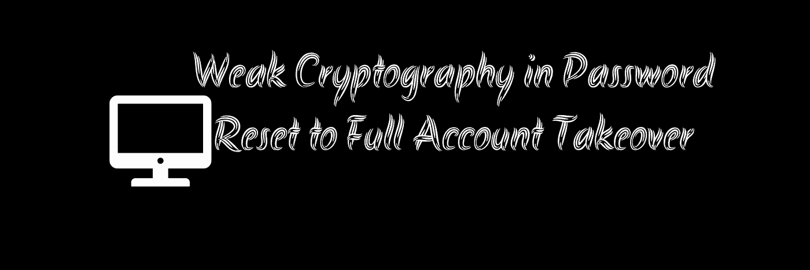

# 密码重置为完全帐户接管中的弱加密

> 原文：<https://infosecwriteups.com/weak-cryptography-in-password-reset-to-full-account-takeover-fc61c75b36b9?source=collection_archive---------0----------------------->

大多数应用程序为用户提供通过电子邮件“重置密码”的功能。这个功能一直是大多数 Bug 赏金猎人或安全研究人员感兴趣的一部分。从执行基本攻击(如速率限制、主机标头注入)到执行帐户接管，此功能非常有趣，值得投入时间。

嗨，黑客和猎人们，在这篇文章中，我将通过分析密码重置中的加密模式和最终的 P1(关键)漏洞来描述我最近对**账户被接管的发现。**

我正在开发的应用程序是**私人项目的一部分。为了演示起见，我们称它为 www.target.com 的 T4。**

几个星期后，我又回到了这个目标，我忘记了我的测试账户的凭证(我通常是这样做的:P)。我继续为我的两个测试账户做了**忘记密码**的请求。

账号分别是*<bug crowd _ alias>+1@bugcrowdninja.com*和*<bug crowd _ alias>+2@bugcrowdninja.com。*

对于那些不知道这个**“+”在这里起什么作用的人来说。**如果你在你的电子邮件后面加上一个 **+sometext** ，它实际上会为你的电子邮件创建一个别名，你会在你的实际电子邮件上收到所有的邮件。这在测试时很有帮助，因为大多数应用程序不会阻塞，这一发现纯粹是因为这个原因而得出的。

**示例—**

实际电子邮件地址:hbothra22@gmail.com

别名:hbothra22+1@gmail.com**或**hbothra22+harsh@gmail.com

所有化名的邮件将被转发到**实际邮件。**

现在回到应用程序，通常的密码重置流程包括:

请求新通行证。→接收唯一复位链接→复位通道

现在，当使用**重置链接重置密码时，**我观察到这两个重置链接之间的唯一区别是: **1 和 2。**

账户 1 重置链接:[https://target.com/reset_password?token = zbp . nwavaqjbeptho % 401+neugboufenu](https://target.com/reset_password?token=zbp.nwavaqjbeptho@neugboufenu)

重置账户 2 的链接:[https://target.com/reset_password?token = zbp . nwavaqjbeptho % 402+neugboufenu](https://target.com/reset_password?token=zbp.nwavaqjbeptho@neugboufenu)

**我观察到的第二件事是重置令牌的长度=电子邮件中的字符数和%40=@。**

酷毙了。因此，可以肯定的是，应用程序有一个弱的加密机制，但应用程序如何编码令牌仍有待研究。又过了几分钟，我推导出了生成令牌的公式。

**Ceaser_Cipher_Key13(反向(邮件))** ==密码重置令牌

1.  以受害者的电子邮件为例:hbothra22@gmail.com
2.  反转邮件，即:moc.liamg @ 22arhtobh
3.  现在用 Ceaser 密码加密反向邮件，Key=13，即:zbp.yvnzt@22neugbou
4.  至少将@更改为%40，我们将拥有我们的重置令牌。

**最终示例 Token = zbp.yvnzt%4022neugbou**

现在使用它，我们可以为任何用户重置密码。该应用程序还允许在忘记密码时列举有效的电子邮件，这使得我们的任务更容易。

# **外卖**

1.  测试密码时，请始终使用两个别名，并尝试查看重置令牌中有哪些不同的位。
2.  检查重置令牌并尝试查看是否使用了任何公共编码库/弱加密。