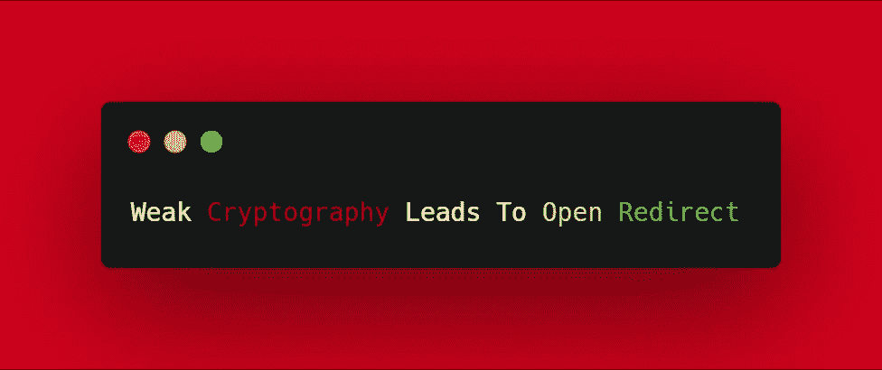

# 弱加密导致开放重定向

> 原文：<https://infosecwriteups.com/weak-cryptography-leads-to-open-redirect-3fe052c12995?source=collection_archive---------1----------------------->

**大家好！**，
希望你一切安好。如果你是一个 bug 搜索的新手，你可以看看我的 [**以前的**](https://medium.com/bugbountywriteup/introduction-to-bug-bounty-for-noobs-46654bd6e0e2) 博客，今天我将分享我的一个有趣的发现，那就是开放重定向漏洞。

**什么是开放重定向？**
当应用程序以不安全的方式将用户可控制的数据合并到重定向的目标中时，就会出现开放重定向漏洞。攻击者可以在应用程序中构建一个 URL，导致重定向到任意外部域。这种行为可被利用来促进针对应用程序用户的网络钓鱼攻击。使用可信的应用程序 URL、以正确的域为目标并具有有效的 SSL 证书(如果使用了 SSL)的能力增加了网络钓鱼攻击的可信度，因为许多用户即使验证了这些特征，也不会注意到随后重定向到不同的域。

开始吧！，我们称我们的目标为 target.com。我的第一步是始终做侦察，因为它在发现 bug 中起着重要的作用。通过 [**waybackurls**](https://github.com/tomnomnom/waybackurls) 工具，我得到了目标的许多端点，然后我通过 grep 命令过滤了带有“ **redirect** 参数的 URL，结果是这样的:

[https://login.target.com/login?redirect = ahr 0 CHM 6 ly 9 hchaudgfyz 2 vww 05 agntut 0% 3D](https://login.target.com/login?redirect=aHR0cHM6Ly9hcHAudGFyZ2V0LmNvbS9kYXNoYm9hcmR8MzJ8YUhSMGNITTZMeTloY0hBdWRHRnlaMlYwTG1OdmJTOWtZWE5vWW05aGNtUT0%3D)

首先，我复制了重定向值，并将“%3D”更改为“=”(URL-decoded)，所以现在它看起来像这样:

ahr 0 CHM 6 ly 9 hchaudgfyz 2v 0 lmn VBS 9 kyxnoym 9 hcmr 8 mzj 8 yuhsmgnittzmetloy 0 hbdwrhrnlamlywtg 1 odmjtowtzwe 5 vww 05 agntut 0 =

它看起来像 Base64 编码值，所以我直接解码它，得到这个:

[https://app . target . com/dashboard | 32 | ahr 0 CHM 6 ly 9 hchaudgfyz 2v 0 lmn VBS 9 kyxnoym 9 hcmq =](https://app.target.com/dashboard|32|aHR0cHM6Ly9hcHAudGFyZ2V0LmNvbS9kYXNoYm9hcmQ=)

有几秒钟，我在想 URL 后面到底是什么？然后，我知道“32”是从“https”的第一个“h”到“dashboard”的最后一个“d”的 URL 的长度，在这之后，他们给了一个令牌，它只不过是 URL 的 Base64 编码值。

**服务器后端流程:**
用户登录- > Base64 解码重定向值- >通过 URL 长度检查完整性&编码值- >如果一切正常- >重定向

现在你可以想象我的感受，我的下一步是创建一个恶意网站的重定向。所以对于这个，我的第一步是统计 URL 的长度，然后将 URL 编码为 Base64，很简单知道吗？

**创建步骤:**
1 .先统计一下网址中的字符、符号、数字等的个数:
[https://evil.com](https://evil.com)=>16

2.现在只需对网址进行 Base64 编码:
[https://evil.com](https://evil.com)=>ahr 0 CHM 6 ly 9 ldmlslmnvbq = =

3.使用管道作为分隔符，将这两个值与恶意 URL 组合在一起，现在我们的有效负载看起来像:
[https://evil . com | 16 | ahr 0 CHM 6 ly 9 ldmlslmnvbq = =](https://evil.com|16|aHR0cHM6Ly9ldmlsLmNvbQ==)

4.现在只需对 Base64 中的有效载荷进行编码:
ahr 0 CHM 6 ly 9 ldmlslmnvbxwxnnxhfiwy 0 hnnkx 5 owxkbwxztg 1 odmjrpt 0 =

5.对“=”进行 URL 编码，即“%3D”。

只需将最终的 Base64 编码值放入易受攻击的 URL 的“redirect”参数中，然后**我们就可以执行**了。

[https://login.target.com/login?redirect = ahr 0 CHM 6 ly 9 ldmlslmnvbxwxnnxhsfiwy0 hnnkx 5 owxkbwxztg 1 odmjrpt 0% 3D](https://login.target.com/login?redirect=aHR0cHM6Ly9ldmlsLmNvbXwxNnxhSFIwY0hNNkx5OWxkbWxzTG1OdmJRPT0%3D)

并且登录后，网站顺利重定向到**EVIL.COM**。我希望你喜欢这篇文章！如果你喜欢我的作品 [**买** - **me-a-coffee**](https://www.buymeacoffee.com/darklotus) 关注我的 [**twitter**](https://twitter.com/darklotuskdb) 了解一些很酷的技巧。

谢谢你