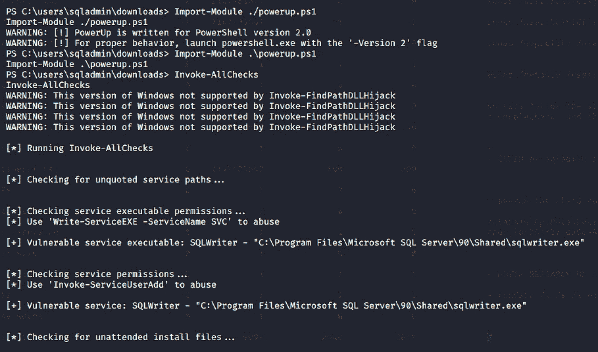
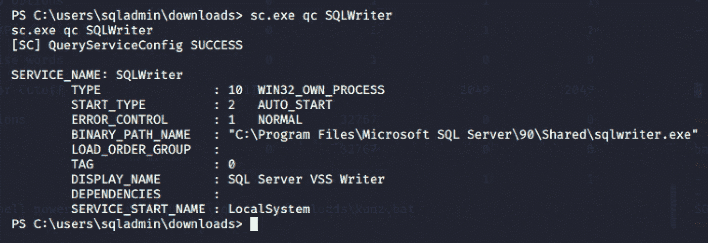
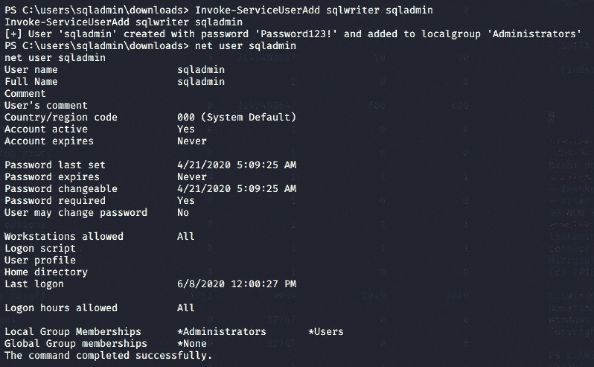
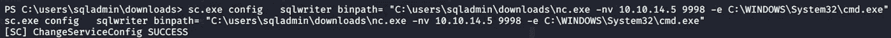
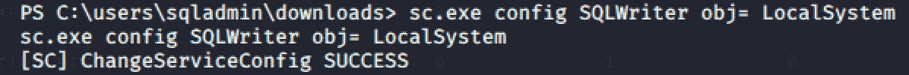
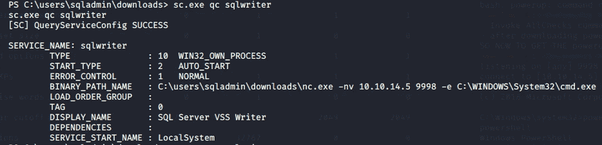
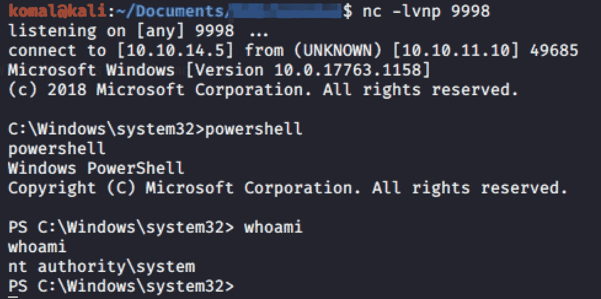

# 从“Windows 服务上的弱权限”到“外壳“|权限提升”

> 原文：<https://infosecwriteups.com/weak-permissions-on-windows-service-privilege-escalation-e8fa97ce4a54?source=collection_archive---------1----------------------->

…用户对服务 exe 具有“写”访问权限；服务二进制路径的文件夹。

错误配置的服务| [像素](https://www.pexels.com/photo/computer-content-control-data-270700/)

*假设你在受害者的 Windows 操作系统机器上运行 powershell。*

*这篇文章讨论了作为“本地系统”运行的易受攻击的服务如何被标准用户利用，并获得权限提升成为“管理员”。*

下载 [PowerUp.ps1](https://github.com/PowerShellMafia/PowerSploit/blob/master/Privesc/PowerUp.ps1) 并导入 IMG 1 中所示的模块。—我们现在准备好出发了！

IMG 1 号。执行 Invoke-AllChecks 函数来检查任何系统配置错误。

> 调用所有检查

powerup.ps1 的这个函数检查系统配置错误，并列出可能被利用的攻击媒介。

> sc.exe—Windows 服务的服务控制

这个内置的窗口可执行文件允许查询 windows 服务的配置细节。如我们所见，此易受攻击的服务“SQLWriter”作为“LocalSystem”运行。因此，利用此服务可以让我们获得系统级权限。

IMG 2。显示 SQLWriter 服务配置详细信息。

> 从“用户”权限升级到本地组“管理员”权限

正如我们在“IMG 一号”中看到的和“IMG-2”一样，名为“SQLWriter”的服务具有 LocalSystem 特权，也具有弱服务权限。此易受攻击的服务将允许本地用户获得管理员级别的权限。

IMG 3。

> 从本地组“管理员”升级到“系统”

IMG 4。

IMG 5 号。

IMG-4。-“SQL writer”的二进制路径与命令外壳可执行文件一起注入。

IMG 五号。obj 是用“LocalSystem”注入的

IMG 6。“SQLWriter”服务的已修改二进制路径

现在，在执行“SQLWriter”服务之前，在攻击者的机器上启动 netcat。

> $ nc -lvnp 9998。—来自攻击者的机器
> 
> $ net start sqlwriter —从受害者的机器上

