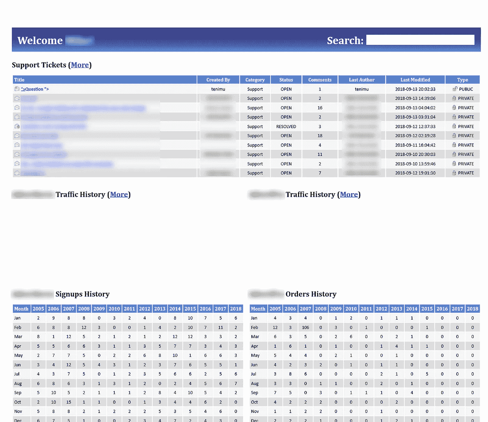
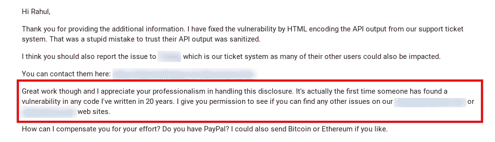
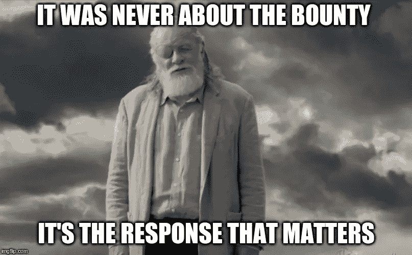

# 武器化 XSS 攻击内部系统

> 原文：<https://infosecwriteups.com/weaponizing-xss-attacking-internal-domains-d8ba1cbd106d?source=collection_archive---------0----------------------->

由野蛮的❤提供

几周前，我和我的一个朋友聊天，他给了我一个有管理面板的子域，并问我是否能找到一种方法进入这个子域，为什么不试一试。

所以我开始了我的侦察，做目录扫描，检查 SQL 注入，检查是否有一些易受攻击的库，最后

妈的，但我很想知道更多，我去谷歌搜索了这家公司，收集了更多关于这家公司的信息，甚至通过 LinkedIn 向首席技术官提出了连接请求(我们一会儿就会联系首席技术官)

在浏览公司网站时，我看到了一个支持面板，我可以在那里提交门票，我脑海中的某个地方有一个声音说它很容易受到攻击，我应该测试一下。

嗯，可能是一个盲目的 XSS，所以我去了我的[**xs shunter**](http://xsshunter.com/)**账户，复制了有效载荷，并提交了请求。我从来没有任何成功执行的希望，但第二天我登录我的账户，检查它是否被执行，然后嘣。**

****

**我能够抓取我能够模拟的用户的 cookie，并在内部系统中获得有效的会话 Boom。**

****

**我注册了一个新账户，并提交了一份负责任的披露**

**一天后，迎接我的是我收到的最好的信息之一**

********

**这封邮件实际上是由公司的首席技术官发来的，他是一个非常酷的人，因为我的发现而奖励了我，**

****