# Web OSINT Tryhackme 演练

> 原文：<https://infosecwriteups.com/web-osint-tryhackme-walkthrough-5f497a2ba12b?source=collection_archive---------0----------------------->

大家好，欢迎回来，Ayush 这边，今天我们将谈论一个 tryhackme 房间网站，这是一个学习一些侦察技术的神奇房间，比如我们如何使用 waybackmachine，viewdnsinfo 和更多工具找到任何域的历史。所以，不浪费时间，让我们开始:)

## 当网站不存在时的任务 1:

在这里，我们的目标是给定的**RepublicofKoffee.com**，这个域名不存在，我们必须找到关于这个域名的信息，如任务部分所述，我只是用引号“RepublicofKoffee.com”搜索它，得到了一些关于它的结果。

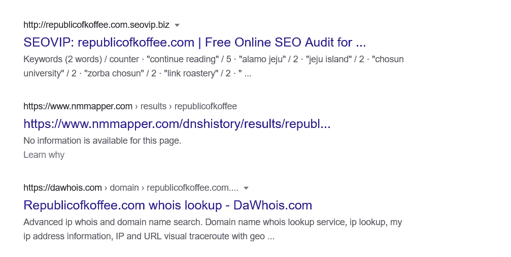

我对第二个任务的结果**[**【https://dawhois.com/】**](https://dawhois.com/)很感兴趣，得到了这么多答案**

**所以 dawhois 基本上是一个提供域名信息的网站。**

****任务 2 Whois 注册:****

**我们还需要使用这个工具[**lookup . ICANN . o**](https://lookup.icann.org/lookup)**rg**来查找更多信息。**

****Q1 域名注册公司的名称是什么？****

****

> ****Ans Namecheap Inc****

****Q2 注册公司的电话号码是多少？(不包括国家代码或特殊字符/空格)****

****

> **Ans 6613102107**

****Q3 网站列出的第一个域名服务器是什么？****

**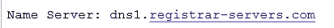**

> **Ans DNS1。注册服务器。计算机输出缩微胶片**
> 
> **名称服务器:名称服务器，也称为“名称服务器”，是一种旨在将域名转换为 IP 地址的服务器。它处理来自客户端(如电脑或平板电脑)的关于域名位置及其在 DNS 服务器上的服务的查询。任何装有 DNS 软件的服务器都可以被认为是域名服务器。资料来源:bluehost.com**

****Q4 注册人的姓名是什么？****

**这个问题耗费了我很多时间，因为我得到了公司(注册人)的名称:**

**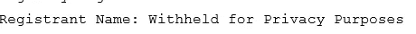**

**但是当我用这个工具[**lookup . ICANN . o**](https://lookup.icann.org/lookup)**rg**查找更多信息的时候。我得到不同的结果**

**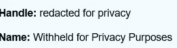**

> **你可能会认为两个名字是一样的，但是为了保密，答案被修改了，我不知道为什么？？？**

****Q5 注册人在哪个国家注册？****

**这个问题也花了我很多时间，首先我得到它的国家是冰岛，但它是现在的一个，当公司开始时，它的国家是不同的。**

**我用这个工具[https://www.whoxy.com/republicofkoffee.com#history](https://www.whoxy.com/republicofkoffee.com#history)找到这个域名的历史，结果是:**

**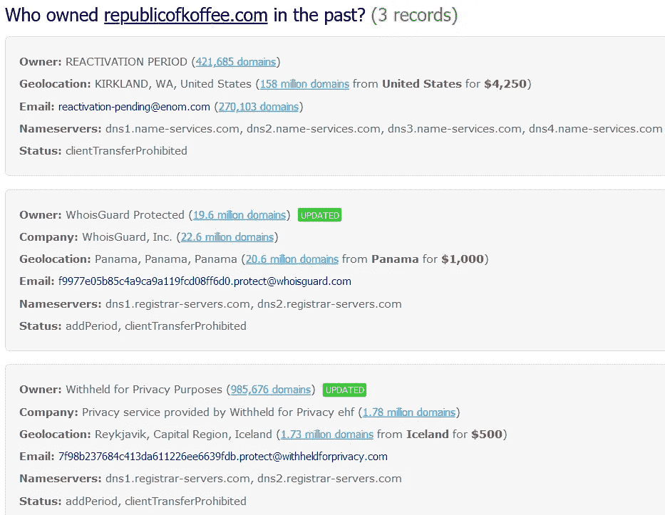**

> **Ans 巴拿马**

**现在我们已经完成了任务 2，在任务 2 中，我们使用了像 https://dawhois.com、[https://lookup . ICANN . o](https://lookup.icann.org/lookup)rg、[https://www.whoxy.com/](https://www.whoxy.com/republicofkoffee.com#history)这样的工具，还学习了域名服务器以及如何查找域名历史。**

## **任务 3 网站过去的幽灵:**

**现在我们使用了 waybackmachine(这是一个在线存档，它抓取互联网上的所有网页，并在数据库中存储所有日期。)这不是官方定义，但的确很容易理解。**

**所以，让我们来解决问题。**

****Q1 博客作者的名字是什么？****

**我刚刚在 wayback machine(archive.org)上输入了域名，得到了这个网站，这是一个基于 wordpress 的博客网站，当我打开博客时，我得到了作者的名字。**

**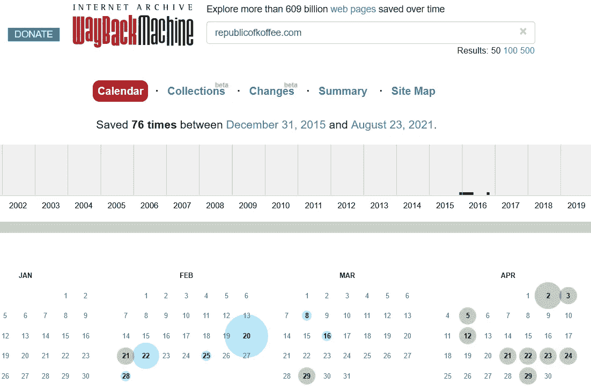****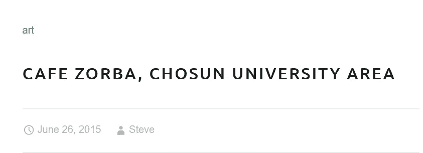**

> **安·史蒂夫**

****Q2 作者来自哪个城市和国家？****

**为了这个问题，我读了每一个博客，每个博客都有一个共同点，那就是城市名，光州搜索了一下，这个城市在韩国**

> **Ans 韩国光州**

****Q3【研究】作者经常去的国家公园内的寺庙叫什么名字(英文)？****

**我有一个博客，其中提到了一部分，然后我就用寺庙关键字搜索公园名称，得到了结果。**

**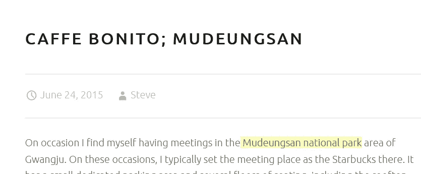******

> **Ans Jeungsimsa 寺**

**现在我们也完成了任务 3，在任务 3 中，我们学习了 waybackmachine，以及如何使用它来查找当前不存在的东西。**

****任务 4 挖掘 DNS****

**在这方面，我们必须找到一些关于 IPs 历史的信息，为此我们使用了 viewdns.info**

****Q1 截至 2016 年 10 月，RepublicOfKoffee.com 的 IP 地址是多少？****

**为此，我们使用了 IP 历史工具，[https://viewdns.info/iphistory/?domain=RepublicofKoffee.com](https://viewdns.info/iphistory/?domain=RepublicofKoffee.com)，并得到了这个结果**

**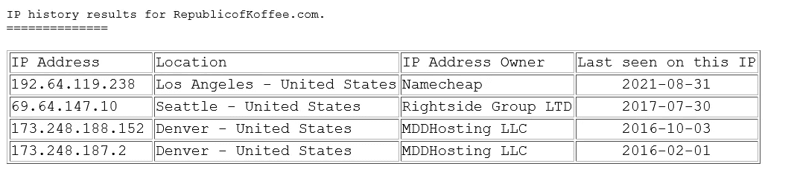**

> **安 173.248.188.152**

****Q2 根据托管在同一 IP 地址上的其他域，我们可以安全地假设我们的目标使用哪种托管服务？****

> **这是共享的**

****Q3 域名历史上 IP 地址变更过多少次？****

> **这是我们在上面的结果中看到的 4 倍**

**现在，我们已经完成了任务 4，并了解了 viewdns.info IP history 实用程序。**

## **任务 5:卸下训练轮**

**现在，在任务 5 中，我们得到了另一个域名 heat.net，我们找到了这个域名的信息。为了找到所有答案，我们使用了之前在任务 4 中使用的所有工具。**

****Q1 该域名的第二个域名服务器是什么？****

**使用 dawhois 或 whois**

**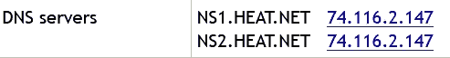**

> **Ans NS2。HEAT.NET**

****Q2 截至 2011 年 12 月，该域名位于哪个 IP 地址？****

**使用 viewdns.info**

**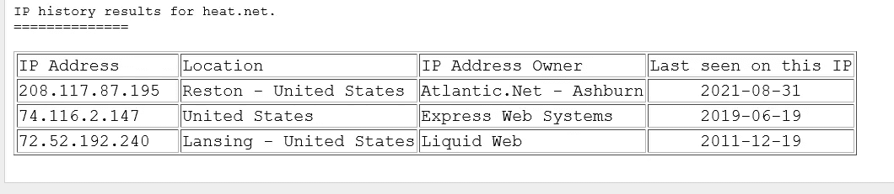**

> **安 72.52.192.240**

****Q3 基于共享相同 IP 的域名，域名所有者使用哪种托管服务？****

> **Ans 共享**

****Q4 该网站首次被互联网档案馆捕获是在哪一天？(年月日/YY 格式)****

**为此，我使用了 archive.org，并得到了结果**

**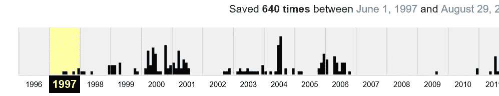**

> **Ans 06/01/97**

****Q5 2001 年《最后的捕获》第一段正文的第一句话是什么？****

**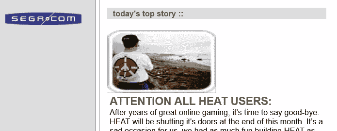**

> **Ans 经过多年的在线游戏，现在是说再见的时候了。**

****Q6 运用你的搜索引擎技能，负责网站原始版本的公司叫什么名字？****

> **你可以在上面看到 sega.com，所以 segasoft 也在。**

****Q7 2010 年最后一次拍摄时，网站上的第一个标题写了什么？****

**自己搜哈哈哈**

**现在，我们也完成了任务 5，并在 wayback 机器的帮助下完成了大多数问题。**

****任务 6 偷窥网站****

****Q1 文章的正文中有多少个内部链接？****

> **前往这个网站[http://heat . net/36/need-to-hire-a-commercial-heating-contractor/](http://heat.net/36/need-to-hire-a-commercial-heating-contractor/)并数一下可见的链接，这是 **5** 。**

****Q2 文章的正文中有多少个外部链接？****

> **purchase.org 有一个对外联系**

****Q3 网站文章中唯一的外部链接(那不是广告)****

> **purchase.org**

****Q4 尝试找到链接到该网站的谷歌分析代码****

> **右键打开源代码，点击查看页面源代码，搜索 **ga.js** 即可得到答案**UA-251372–24****

****问题 Google Analytics 代码是否正在其他网站上使用？是或否****

**使用 nerdydat.com**

**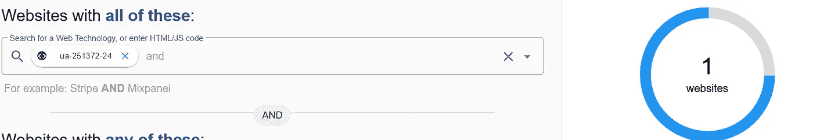**

> **回答不**

****问题 6:该网站的链接中是否嵌入了任何明显的联盟代码？是或否****

**不，我搜索了 href，没有任何附属链接**

> **回答不**

**现在我们终于完成了任务 6，让我们进入最后一项任务。**

## **任务 7 期末考试:将点点滴滴连接起来**

**在这方面，我只是使用了 viewdns.info，并比较了 heat.net 和 purchase.org 两个域名的结果，有一点是共同的，两家公司的所有者都是灵动网络公司**

**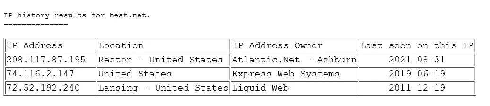****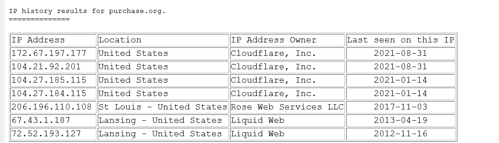**

**Q1 使用任务 4 中的工具来确认两个站点之间的联系。在没有提示的情况下努力想明白。**

****Ans 灵动网络有限公司****

**耶，我们终于完成了所有给定的任务，我希望你喜欢这篇文章，如果是的话，请鼓掌并给出反馈，因为我是 it 新手，这是我的第二篇文章，所以请给出反馈:)**

**你可以在推特上关注我:【https://twitter.com/3xabyt3_ T5**

**insta gram:[https://instagram.com/_3xabyt3_](https://instagram.com/_3xabyt3_)**

**谢谢你的时间，我们将在下一篇文章中见面，再见，祝你黑客愉快！**