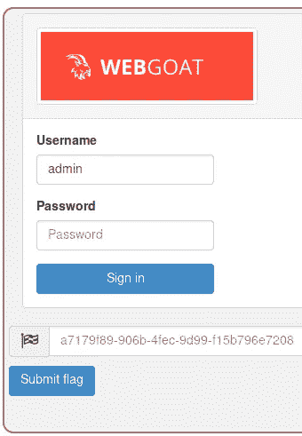
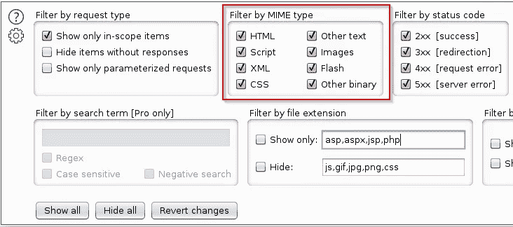
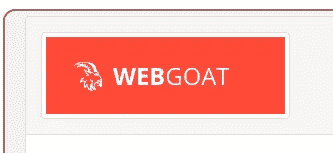
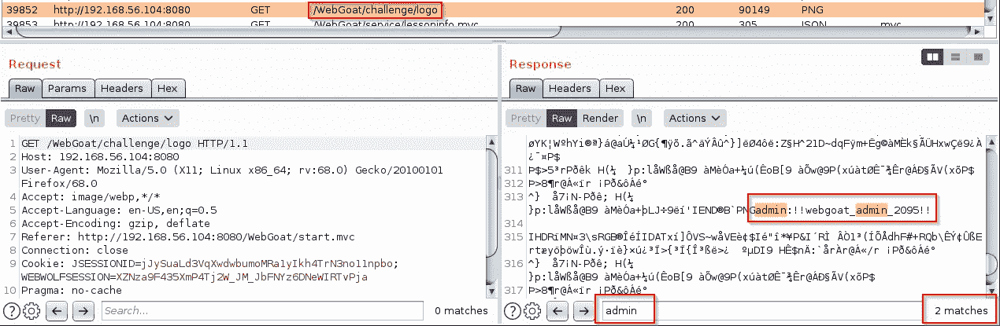

# WebGoat 管理员密码丢失挑战

> 原文：<https://infosecwriteups.com/webgoat-admin-lost-password-challenge-3e2b317cc0e5?source=collection_archive---------0----------------------->

WebGoat 首次挑战

这是 WebGoat 中四个类似 CTF 的挑战中的第一个

挑战本身并不复杂，但你必须经历的过程才是最重要的

我花了很多时间试图找出这个挑战的任何合理之处，你可以在下面找到的 [thehackerish](https://thehackerish.com/) 的视频是我最后的手段，只是为了确保我的思路是正确的，因为我一直在试图思考我所知道的安全相关 CTFs 领域的解决方案，唉，我错了，但这帮助我了解了很多关于找出可能解决方案的心理过程

为了充分理解经历这个特殊的挑战意味着什么，以及寻找漏洞的每一个可能的方面，我强烈推荐观看在 你自己尝试了这个挑战之后来自黑客 ***的这个视频***

黑客管理员丢失密码现场黑客

**我必须强调，这是一个 CTF 挑战，它不是一个常见的现实生活中的安全漏洞问题，也不是针对 CTF 的貌似合理的安全问题，所以如果你不想要任何剧透，就停止阅读，先自己解决它**

让我们继续，一旦挑战页面被加载，去检查打嗝，看看发生了什么事

打嗝历史过滤器

为每种可能的 MIME 类型启用日志记录

打嗝历史请求

打嗝历史将揭示加载过程的全部范围，在所有这些内容中，红色箭头突出显示的内容是专门为该挑战加载的，其他内容似乎是所有 WebGoat 共享的(但这并不真正意味着什么)
特别是:

*   /web goat/challenge 1 . lesson . lesson 是挑战页面，有很多 HTML，但没有多少有趣的信息
*   /web goat/service/lessoninfo . MVC 由课程页面调用以获取内容，内容不多
*   /WebGoat/challenge/logo 是为挑战赛加载的无扩展名 PNG 图像文件，而 boss.jpg 已经加载到其他 WebGoat 页面中，它不在“挑战赛”目录中

浏览器开发工具上的挑战页面 HTML

通过检查页面 HTML 源代码，我们可以在 div 一课中找到/WebGoat/challenge/logo

不带扩展的 PNG 徽标

没有文件扩展名的臭名昭著的徽标图像

我检查了调试器开发工具，并搜索了所有页面加载的文件，以确定 admin/pass/password/log in/username，但没有显示任何有趣的内容

然后我开始在 Burp 历史上的回复中寻找 admin/pass/password/log in/username，Burp 在这方面是个例外，只需在搜索栏中输入你的文本，然后点击回复

最佳打嗝搜索功能

就这样，我们有了这次挑战的用户名和密码

登录挑战页面，您将获得一面旗帜

WebGoat 管理员密码丢失质询到此结束

我希望你喜欢它。

PVXs—[https://twitter.com/pivixih](https://twitter.com/pivixih)