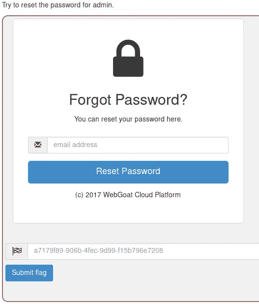
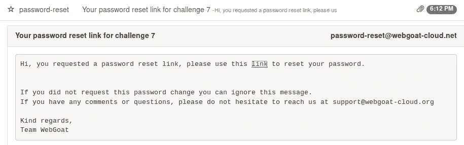

# WebGoat 管理员密码重置挑战

> 原文：<https://infosecwriteups.com/webgoat-admin-password-reset-challenge-36a26dd598ca?source=collection_archive---------0----------------------->

WebGoat 管理员密码重置挑战

这个挑战基本上是一个“建议”,即在可能的情况下，利用源代码获得尽可能多的信息

首先在 WebWolf 上给自己发一封邮件，获取重置的链接结构，输入 <username>@ <anydomain>,然后点击“重置密码”</anydomain></username>

重置密码邮件

在 WebWolf 中检查邮件，重置链接在邮件中，看起来像这样

[/web goat/challenge/7/reset-password/<HASH _ VALUE>](http://192.168.56.104:8080/WebGoat/challenge/7/reset-password/<HASH_VALUE>)

我们必须找到正确的<hash_value>来重置管理员密码</hash_value>

你可以

*   搜索 WebGoat GitHub
*   使用 java 反编译器 GUI—[http://java-decompiler.github.io/](http://java-decompiler.github.io/)—检查 webgoat 服务器安装中 webgoat.jar 文件的源代码
*   上 [/WebGoat/challenge/7/。git](http://192.168.56.104:8080/WebGoat/challenge/7/.git) 解压缩并检查下载的 git 存储库中的对象

最终你会来查看 web goat/web goat-lessons/challenge/src/main/Java/org/owasp/web goat/challenges/solution constants . Java 或者 SolutionConstants.class 的源代码

[https://github . com/web goat/web goat/tree/develop/web goat-lessons/challenge/src/main/Java/org/owasp/web goat/challenges](https://github.com/WebGoat/WebGoat/tree/develop/webgoat-lessons/challenge/src/main/java/org/owasp/webgoat/challenges)

在里面，您会发现在 web goat/web goat-lessons/challenge/src/main/Java/org/owasp/web goat/challenges/challenge 7/assignment 7 . Java 或 Assignment7.class 中使用的 ADMIN_PASSWORD_LINK 静态值

[https://github . com/web goat/web goat/tree/develop/web goat-lessons/challenge/src/main/Java/org/owasp/web goat/challenges/challenge 7](https://github.com/WebGoat/WebGoat/tree/develop/webgoat-lessons/challenge/src/main/java/org/owasp/webgoat/challenges/challenge7)

这就是我们要找的大麻

然后浏览到[/web goat/challenge/7/reset-PASSWORD/<ADMIN _ PASSWORD _ LINK>](http://192.168.56.104:8080/WebGoat/challenge/7/reset-password/<ADMIN_PASSWORD_LINK>)就会给你旗子

WebGoat 管理员密码重置挑战到此结束

我希望你喜欢它。

PVXs—[https://twitter.com/pivixih](https://twitter.com/pivixih)