# WebGoat 客户端课程

> 原文：<https://infosecwriteups.com/webgoat-client-side-lessons-4a75d3bf28da?source=collection_archive---------0----------------------->

# 绕过前端限制 2

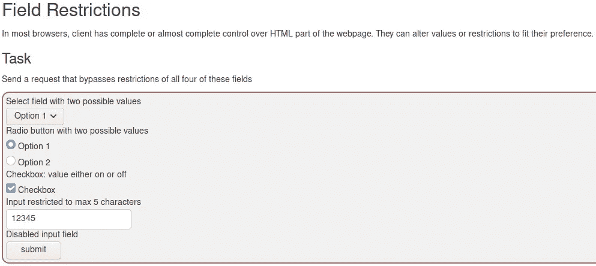

绕过前端限制第 2 课

在本课中，我们必须发送一个请求，绕过页面上的限制，让我们继续填写并提交表单

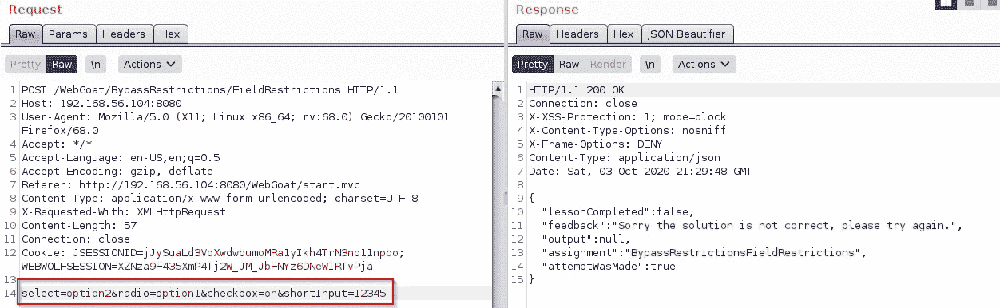

请求打嗝历史记录

好了，现在我们有了请求，让我们修改它，使它包含“不允许”的数据

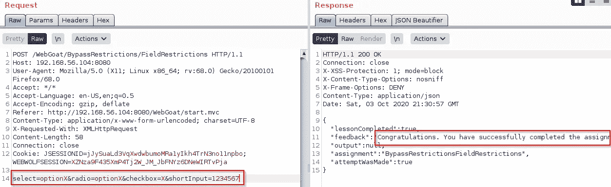

变更请求

这里我们在 Burp Repeater 上有相同的请求，做了一些修改，使值在“允许的”范围内，发送这个被篡改的请求，课程就完成了

# 绕过前端限制 3

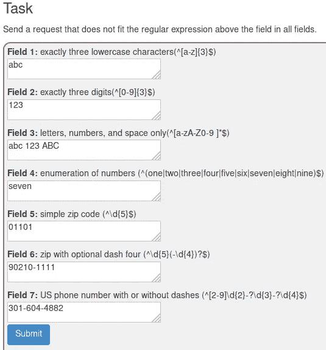

绕过前端限制第 3 课

要完成本课，您需要清楚了解每个字段描述中的正则表达式

我认为开始理解正则表达式的好地方有

 [## 正则表达式教程-从正则表达式 101 到高级正则表达式

### 关于雷克斯早餐吃正则表达式的参考。你也可以！这个正则表达式教程，最…

www.rexegg.com](https://www.rexegg.com/)  [## ziishaned/learn-regex

### 正则表达式是用于在文本中查找特定模式的一组字符或符号。普通的…

github.com](https://github.com/ziishaned/learn-regex)  [## 正则表达式-学习正则表达式-第 1 课:介绍，和 ABC

### 正则表达式在从文本中提取信息时非常有用，比如代码、日志文件、电子表格或…

regexone.com](https://regexone.com/) 

然后开始尝试过滤文本和行

 [## 学习、构建和测试正则表达式

### 正则表达式测试器，语法高亮，PHP / PCRE & JS 支持，上下文帮助，备忘单，参考…

regexr.com](https://regexr.com/)  [## 解决正则表达式代码挑战

### 加入超过 1100 万名开发人员的行列，在 HackerRank 上解决代码挑战，这是为…

www.hackerrank.com](https://www.hackerrank.com/domains/regex)  [## 缩短代码

### SPOJ (Sphere Online Judge)是一个在线裁判系统，拥有超过 315，000 名注册用户和超过 20，000 个问题。的…

www.spoj.com](https://www.spoj.com/SHORTEN/problems/regex/) 

所有这些学习和练习都需要很长时间，但是开始阅读其中的一些内容将有助于你学习 WebGoat 课程

所以让我们继续并提交表单

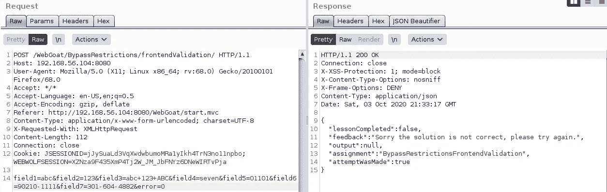

请求打嗝历史记录

当然解决方案是不正确的，所以让我们在打嗝中继器上发送这个请求

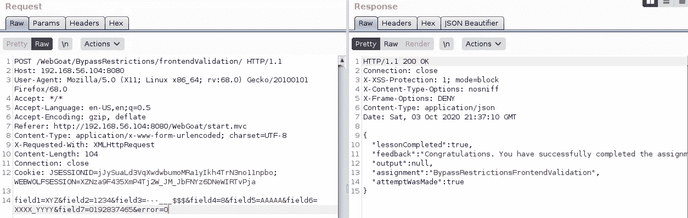

Burp 中继器上的请求被篡改

更改字段值，使其包含不允许的组合，然后发送请求，课程就完成了

# 客户端过滤 2

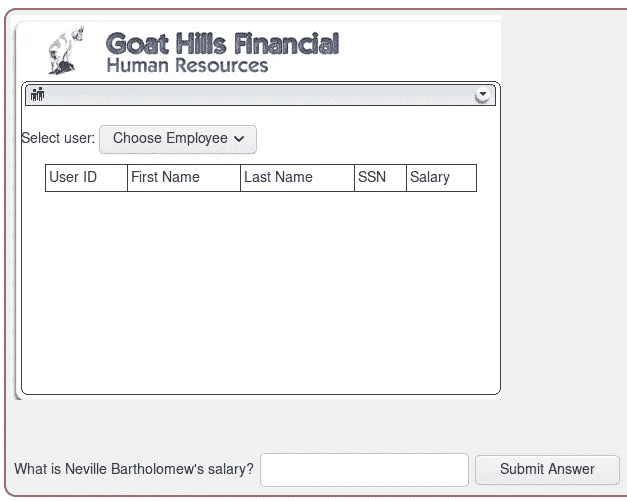

客户端过滤第 2 课

本课请求是查找 Neville Bartholomew 的薪金，它不在下拉列表中，所以让我们看看该页面中有什么

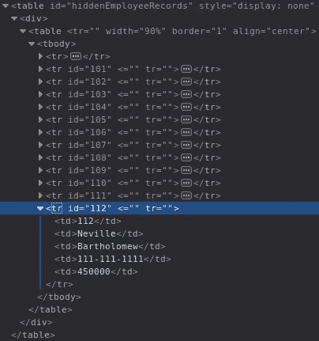

内维尔·巴塞洛缪薪金

通过使用您的浏览器开发工具，检查隐藏的元素，有一个“hiddenEmployeeRecords”表与请求的信息

在文本字段中输入相应的员工薪金值，本课就完成了

# 客户端过滤 3

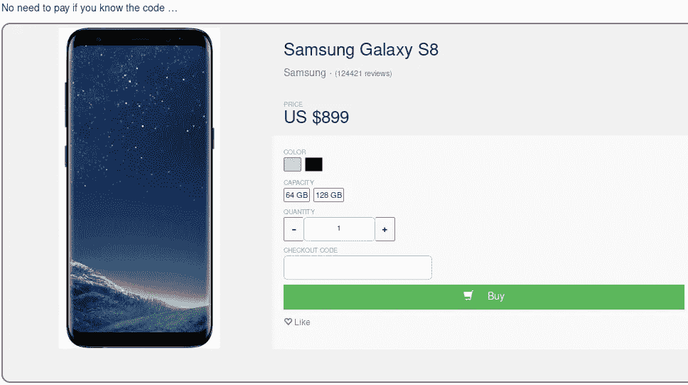

客户端过滤第 3 课

这里的目标是购买手机而不付款，有一个知道“代码”的明确提示，在表单中有一个“结帐代码”字段

让我们按“购买”

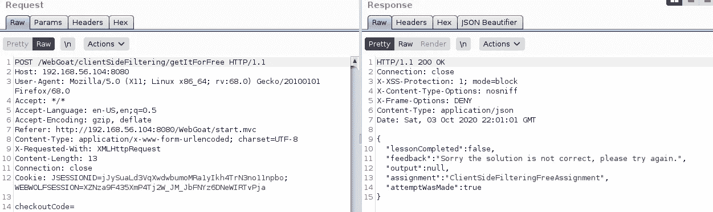

打嗝历史上的“购买”请求

在 Burp 上获取请求，有一个作为 POST 数据发送的“checkoutCode”参数

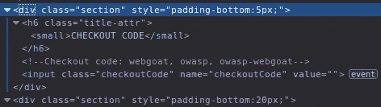

结帐代码 HTML

在页面 HTML 中，靠近结帐代码输入，有一些结帐代码留在那里，尝试他们，但没有一个解决教训，因为他们不允许 100%的折扣

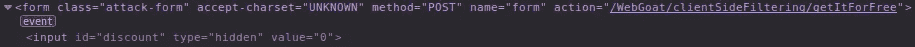

隐藏的“折扣”输入

在表单的开头，有一个隐藏的“折扣”输入

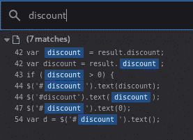

浏览器开发工具调试器搜索

通过在开发工具->调试器中搜索“折扣”，可以找到一些代码行

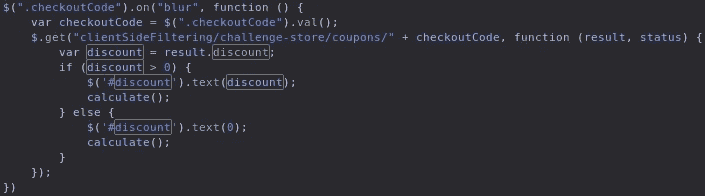

“签出代码”模糊的 JS 函数

找到的代码有几个 JS 函数，其中一个运行 checkoutCode 文本输入的每个“模糊”部分

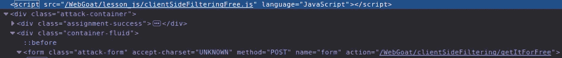

这个源代码位于/web goat/lesson _ js/clientsidefilteringfree . JS 中，在表单开始前几行，它作为内联 JS 文件被加载

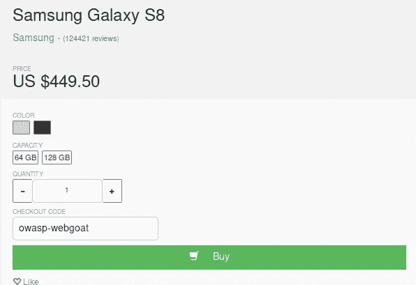

用在 HTML 源代码中找到的代码之一购买

因此，当输入在 HTML 中找到的优惠券之一时，只要焦点离开文本字段，就会应用折扣

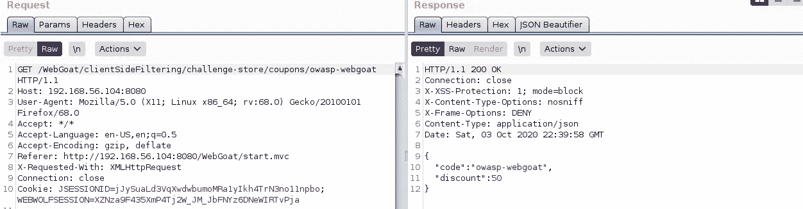

打嗝历史上的“模糊时检出代码”请求

一旦结帐代码有一个“on blur”事件，nn 就会打嗝，我们找到一个/web goat/client side filtering/challenge-store/coupons/<coupon_code>的请求，并得到相应的折扣响应</coupon_code>

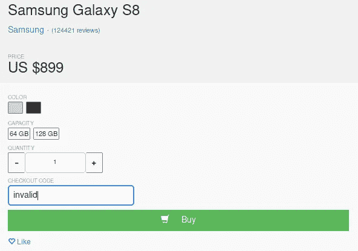

无效的结帐代码

让我们尝试一个无效的优惠券，并改变重点

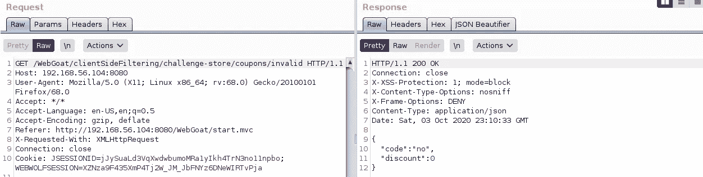

打嗝历史记录中的结账代码无效

该请求是一个无效的优惠券，响应没有折扣

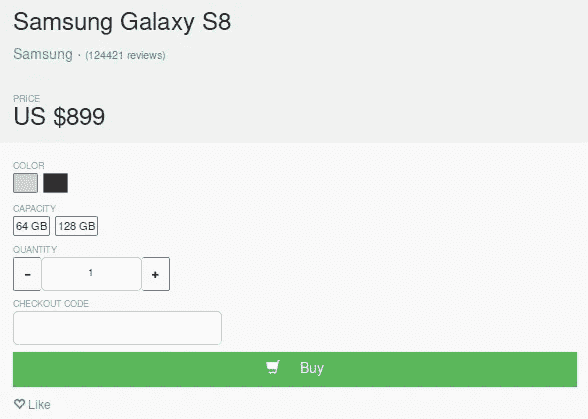

没有结帐代码，然后模糊事件

所以我们可以试着拿掉优惠券，改变焦点，看看打嗝会发生什么

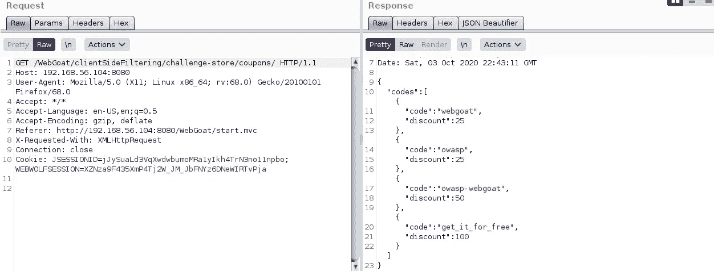

所有优惠券列表

响应现在有了所有有效优惠券的列表

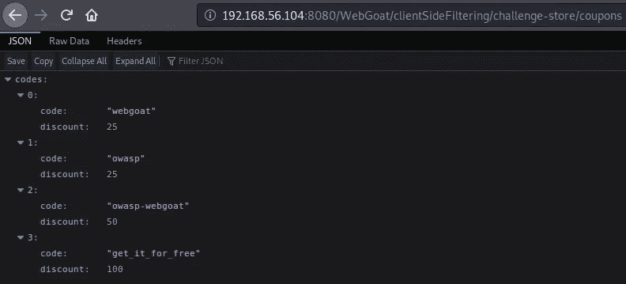

直接在浏览器上得到相同的响应

如果我们将/coupons 端点直接放在浏览器地址栏中，也会发生同样的情况

因此，在课程页面上输入“get_it_for_free ”,我们可以获得 100%的折扣，课程就完成了

# HTML 篡改 2

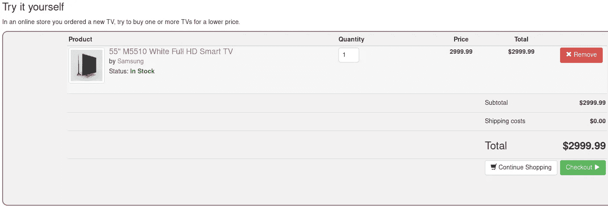

HTML 篡改第 2 课

你可以通过改变浏览器开发工具中 HTML 的成本来解决这个问题，但是我用了 Burp Suite

按“结帐”

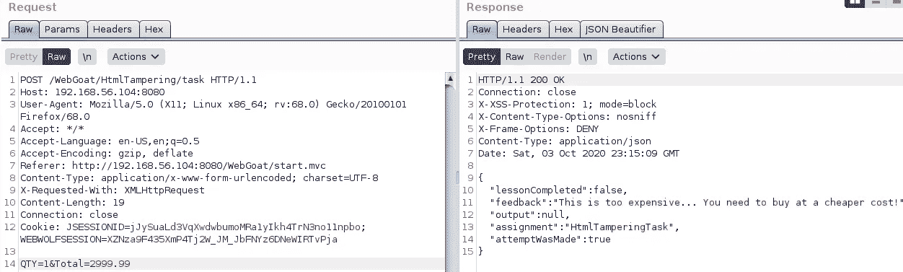

请求打嗝历史记录

检查 Burp 上的请求，它有一个“Total”参数可以被篡改

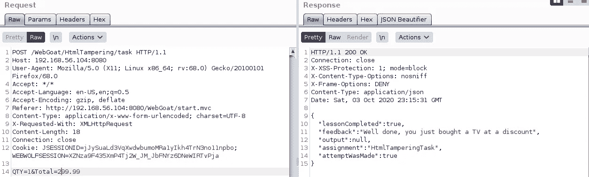

对打嗝中继器的要求

在打嗝重复器上获取请求，更改“总”值，发送请求，课程就完成了

WebGoat 客户端课程到此结束

这篇文章比通常的要长一点，因为它们非常相似，所以我想把它们放在一起

我希望你喜欢它。

https://twitter.com/pivixih[PVXs](https://twitter.com/pivixih)