# 韦山羊 CSRF 7 8

> 原文：<https://infosecwriteups.com/webgoat-csrf-7-8-916f52dbc3d3?source=collection_archive---------2----------------------->

# WebGoat CSRF 7

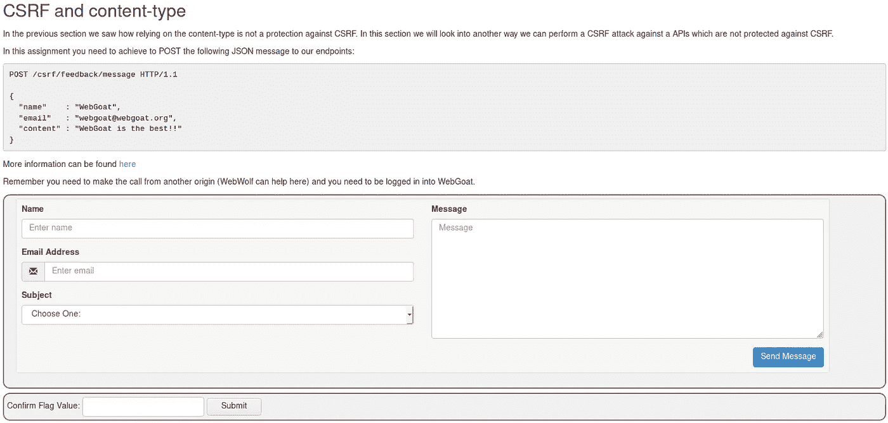

WebGoat CSRF 第 7 课

这一课与前两节非常相似，但是这一次要发送的有效载荷必须是 JSON 格式，让我们看看这是如何实现的

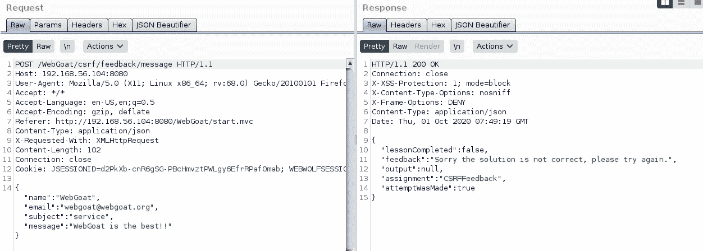

具有给定值的请求

通过用给定的值填充课程表单，HTTP 请求用 JSON 格式的输入值填充，反馈告诉我们解决方案不正确，正如预期的那样

让我们继续，只是将页面上的表单复制到一个新的 html 文件中，在这里您可以发现表单清除了所有不必要的 div，并添加了一个用于测试的隐藏字段

修改的 WebGoat CSRF 7 web 表单 HTML 源代码——这个不工作

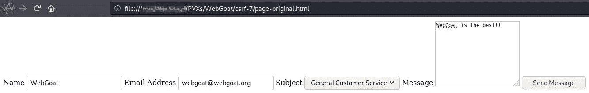

修改了火狐浏览器上的网页山羊 CSRF 7 网页表单——这个不能用

让我们填写表格，看看会发生什么

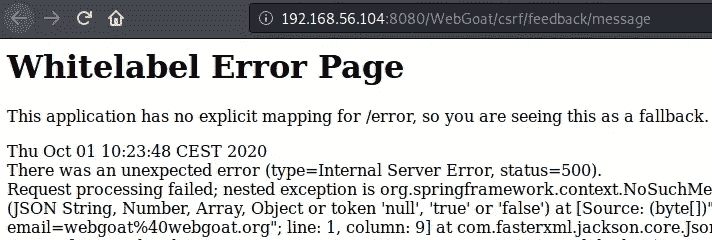

提交表单时出错

请求不工作，WebGoat 回复状态代码 500，让我们看看打嗝历史显示什么

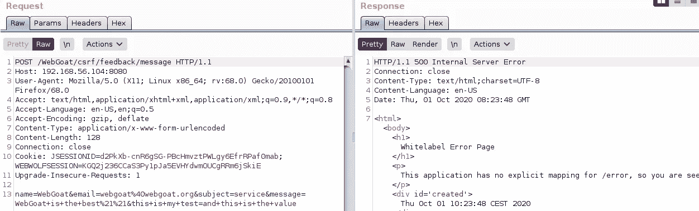

打嗝时的请求和错误响应

这里的请求根本不是 WebGoat 所期望的，这是一个普通的 POST 表单提交，它永远不会在这里工作

WebGoat 课程页面建议去阅读[http://pentestmonkey.net/blog/csrf-xml-post-request](http://pentestmonkey.net/blog/csrf-xml-post-request)是最重要的，在这里 PentestMonkey 清楚地解释了如何从一个 HTML 文件和一个简单的表单开始伪造一个所需格式的 HTTP 请求，也就是说，基本上，这就是我在这里试图实现的

如果需要更多帮助，这里有来自 WebGoat GitHub 的【https://github.com/WebGoat/WebGoat/wiki/Main-Exploits】T2 页面，以及正确的有效载荷和更多解释

经过阅读和研究，一个新的 HTML 文件是为了伪造正确的要求

修改后的 WebGoat CSRF 7 web 表单 HTML 源代码——这个确实有效

首先:表单 enctype="text/plain "强制浏览器创建一个请求，而不对来自客户端的数据内容进行编码

第二:为了创建有效的 JSON 有效负载，请求必须具有课程页面上可用的内容，并且该文本具有以下字符，以便伪造 JSON 有效负载

```
" : { }
```

幸运的是，只要使用相同类型的引号作为开始和结束字符，HTML 标记属性分隔符可以是“or ”,所以这两个表单属性

```
name='{"name": "WebGoat", "email": "webgoat@webgoat.org", "content": "WebGoat is the best!!", "ignoreme":"'

value='sdfsdfdf"}'
```

有效的 HTML 属性允许我们在请求中放入 JSON 格式的数据体吗

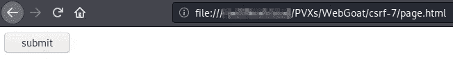

火狐浏览器上的 WebGoat CSRF 7 网页表单——这个确实有效

让我们利用这两个方面提交表单

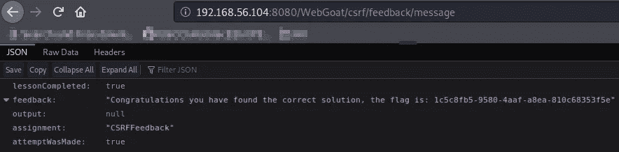

成功！！

WebGoat 回复了这个包含标志的 JSON 消息

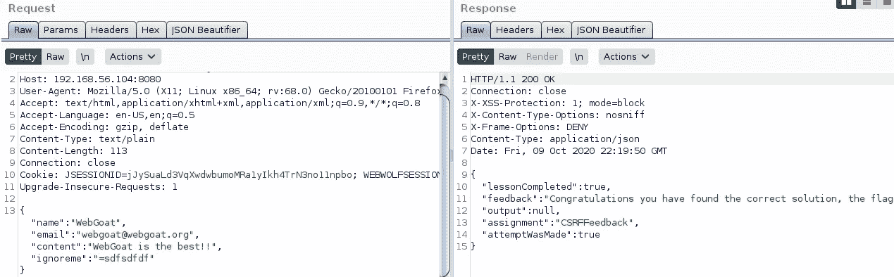

打嗝的要求

在 Burp 上，我们可以看到添加了“ignoreme”属性的正确 JSON 格式的伪造请求

在课程页面中输入标志来完成它

# WebGoat CSRF 8

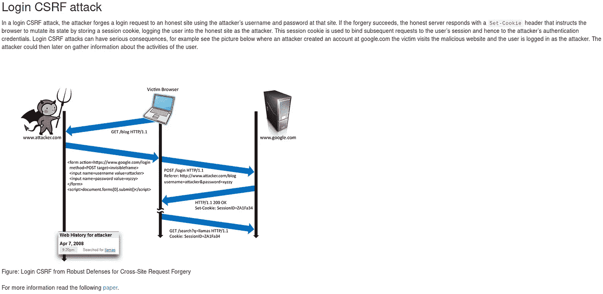

WebGoat CSRF 第 8 课

让我们从 WebGoat 登录页面结构开始创建一个表单

我的网络山羊 CSRF 第八课形式上的 Git Gists

第一个是一个简单的版本，只有基本的组件，第二个有一些修改，使其自动提交和显示一个空白页

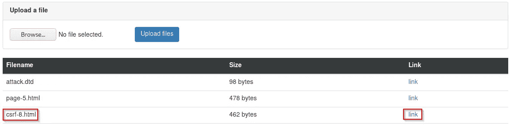

在 WebWolf 上上传的表单文件

将其上传到 WebWolf，并在新的选项卡上打开

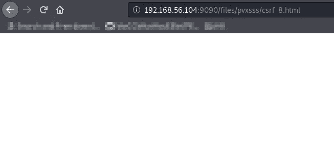

页面是空白的，因为 HTML 文件中的所有内容都已被隐藏

然后切换到课程页面，点击“已解决！”按钮来完成课程

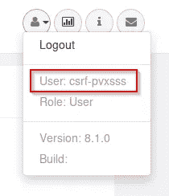

具有已更改用户的 web 山羊用户菜单

您现在以 csrf- <your_username>用户身份登录，重新加载任何 web 山羊页面，并在右上角菜单上检查您的用户，以检查是否有新的登录</your_username>

网络山羊 CSRF 7-8 到此结束

我希望你喜欢它。

PVXs—[https://twitter.com/pivixih](https://twitter.com/pivixih)