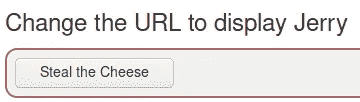
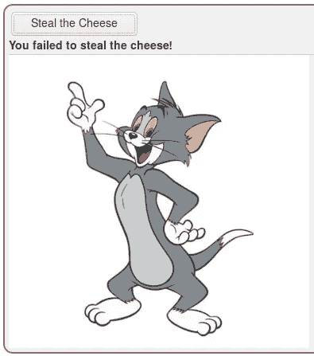
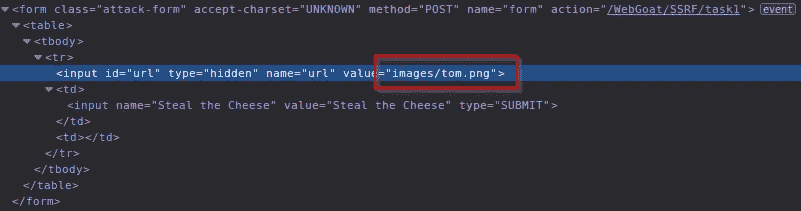
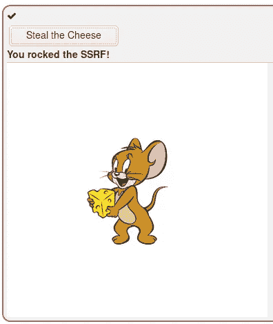
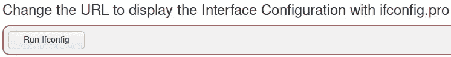
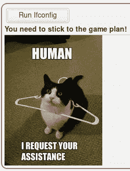
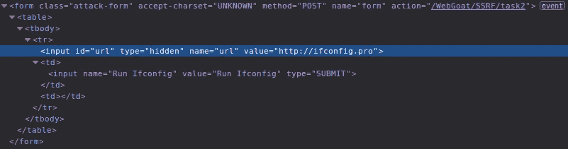
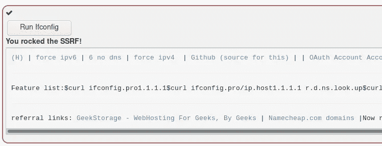

# WebGoat SSRF 2 3

> 原文：<https://infosecwriteups.com/webgoat-ssrf-2-3-75bf7cb4710c?source=collection_archive---------1----------------------->

## WebGoat SSRF 2

WebGoat SSRF 第二课

看完橘子君关于 SSRF 的精彩演讲后

让我们看看这一课有什么内容

汤姆，非常直接

按下按钮，我们就能找到汤姆

这一课明确告诉我们将 URL 改为“jerry”

隐藏页面输入

用你的浏览器开发工具检查按钮，找到隐藏的输入，将 URL 从“tom”改为“jerry”

这是杰瑞

再次按下按钮，课程结束

# WebGoat SSRF 3

一个全新的按钮！

按钮

不行

为了坚持游戏计划，我们可以检查这里是否有类似上一课的东西

同样，一个隐藏的输入字段

将隐藏文本输入更改为“http://ipconfig.pro ”,从而要求服务器请求页面

是的，ipconfig.pro

再次按下按钮，课程结束

记得去检查一下 http://ipconfig.pro/的功能

WebGoat SSRF 2 比 3 结束

我希望你喜欢它。

https://twitter.com/pivixih[PVXs](https://twitter.com/pivixih)