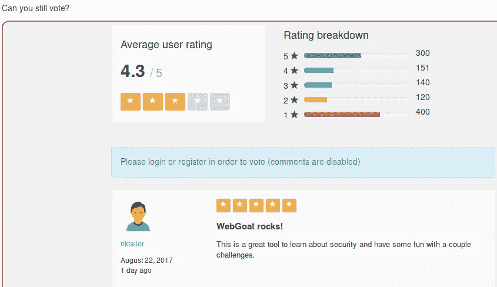
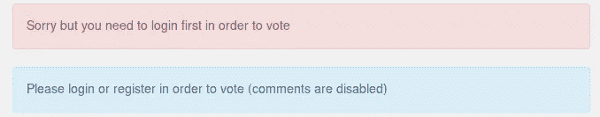
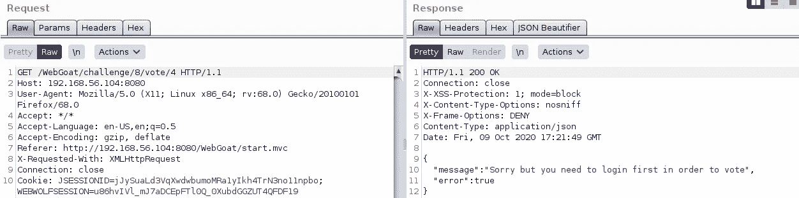
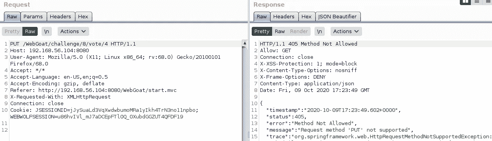
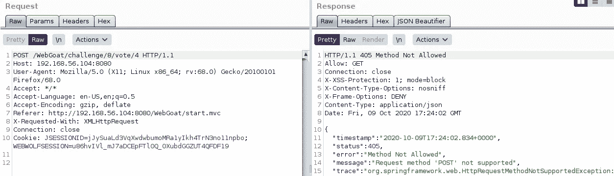
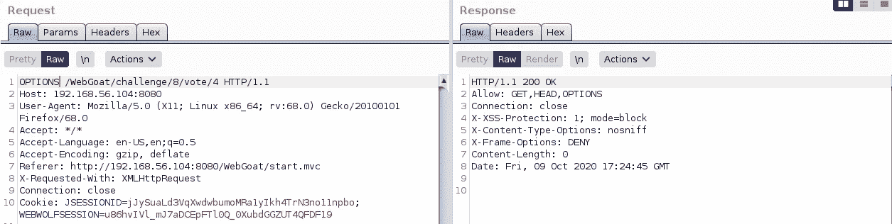
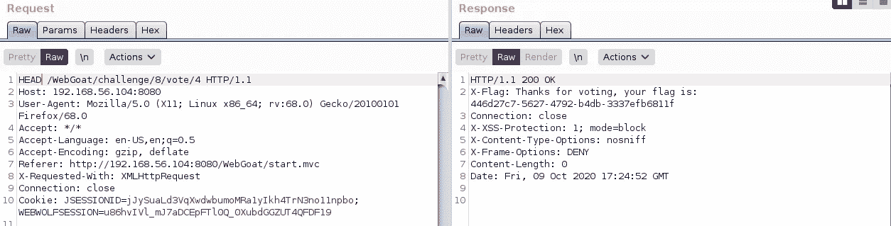

# 无帐户挑战的 WebGoat

> 原文：<https://infosecwriteups.com/webgoat-without-account-challenge-9abbeaf4ba44?source=collection_archive---------6----------------------->

无帐户挑战页面

从界面上看，我想我应该试着投票，所以让我们通过点击星星来试试

没有。

我们在页面上得到明确的回应

打嗝时的请求和响应

在打嗝时，我们得到同样的信息

将消息发送到 Burp Repeater，并尝试查看是否有/login /log 端点，但是没有

上传请求，不！又

所以让我们试着改变请求方法，这里是 PUT 方法，没有 go

发布请求，不！又来了

这里是邮寄方法，不去

选项请求，一些有趣的信息

对于 OPTIONS 请求，我们在“Allow”响应头中得到可用的方法，但没有成功消息，所以接下来我想是 HEAD 方法

标题要求和目标

使用 HEAD 方法，我们可以在课程页面中提交一个标志

这就结束了没有帐户挑战的 WebGoat

我希望你喜欢它。

PVXs—[https://twitter.com/pivixih](https://twitter.com/pivixih)