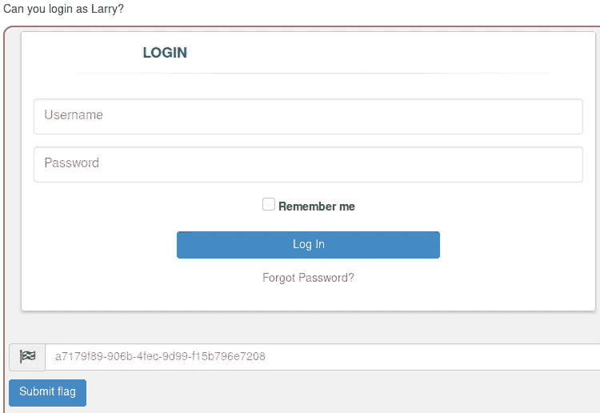
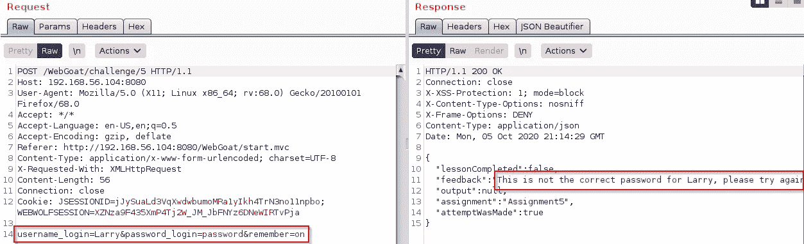
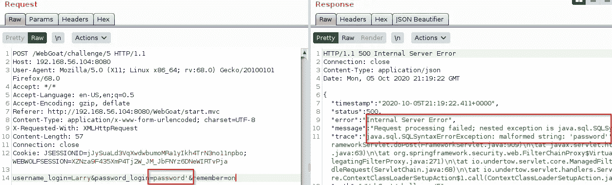
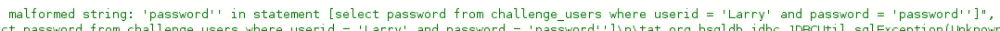
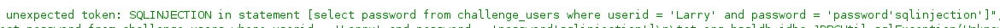
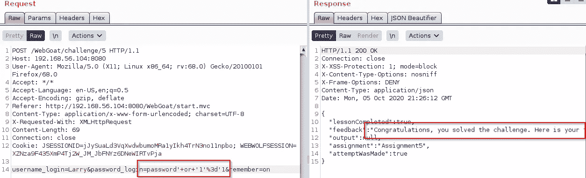

# WebGoat 无密码挑战

> 原文：<https://infosecwriteups.com/webgoat-without-password-challenge-3a0f0c831ad9?source=collection_archive---------2----------------------->

WebGoat 无密码挑战

第二个 WebGoat 挑战，我们必须以 Larry 的身份登录，让我们看看这里有什么

“忘记密码”链接是假的，在 HTML 源代码中不多

Burp 显示，除了对/web goat/challenge 5 . lesson . lesson 及其 HTML 的请求之外，请求页面时没有太多其他内容

挑战加载了一个/web goat/lesson _ CSS/challenge 6 . CSS 文件，但是其中没有任何有趣的内容

让我们试着以拉里的身份登录

Burp 上的登录请求

这是 Burp 上的登录请求，当然“密码”不是正确的密码

如果用户名和密码参数存在，但它们的值在请求中丢失，质询将抱怨缺少输入

如果用户名或密码参数完全丢失，我们会得到错误状态代码 400 —错误的请求

“记住”参数在值和参数存在上都是可选的

让我们看看放入单引号会发生什么

打嗝时使用单引号的请求

我们得到了一个很好的 Java SQL 异常

Java SQL 错误

通过检查错误，我们得到了登录 SQL 查询

注入时出现 Java SQL 错误

是的，我们这里有 SQL 注入

绕过 SQL 注入和验证的请求

好了，我们已经以 Larry 的身份登录，响应在反馈字符串的下方有一个标记

将标记放入课程提交字段，然后就完成了

WebGoat 无密码挑战到此结束

我希望你喜欢它。

PVXs—[https://twitter.com/pivixih](https://twitter.com/pivixih)