# WebOSINT Tryhackme 写文章

> 原文：<https://infosecwriteups.com/webosint-tryhackme-writeup-d4665e97dcf3?source=collection_archive---------0----------------------->

这是 Tryhackme room“webo Sint”的一篇文章

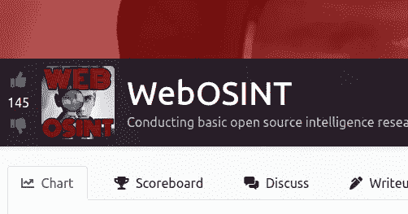

https://tryhackme.com/room/webosint

**房间链接:**[https://tryhackme.com/room/webosint](https://tryhackme.com/room/webosint)
**注:此房免费**

# 任务 1:当网站不存在时

当你得到一个要检查的企业名称时，你做的第一件事是什么？打开网络浏览器，找到网站并查看，对吗？

如果网站，甚至整个企业都不复存在了呢？

这并不意味着这是路的尽头。

OSINT 的研究人员可能仍然能够将这些点联系起来，找到关于这些组织的有用信息。

你的工作是尽可能多地找到关于 RepublicofKoffee.com 网站的信息。

<spoiler alert="">该网站并不存在，如果在您阅读本文时它存在，那么该网站目前的形式不是我们的目标。</spoiler>

收集网站信息而不直接访问它的一种方法是简单地搜索它。

**注意:**有时候把一个网站插到搜索栏会直接把你送到那个网站。为了避免这种情况，请将网站用引号括起来。还要注意的是，这只会返回网站上写有完整域名的结果。

继续谷歌“**RepublicOfKoffee.com**”带引号和不带引号，看看会发生什么。

# 任务 2: Whois 注册

仅仅因为当你访问'**RepublicOfKoffee.com**'时什么也没显示，并不意味着某人不拥有这个域名。事实上，如果有任何类型的登录页面，即使是垃圾邮件，那么你可以肯定有人拥有它。但它目前是否由在我们感兴趣的时间段内使用过它的同一个人所拥有？我们也许能搞清楚，也许不能，但它值得一看。

我们可以通过查找 whois 来确认当前的注册状态。

“whois”查找是可用的最基本的域名重组形式。有多个网站也会为你做这件事。

我个人建议直接去 lookup.icann.org。这应该告诉你当前使用的托管公司和名称服务器。查看原始数据选项将显示进一步的详细信息。

我们在寻找任何可以作为支点的数据。也许是电子邮件地址？或者更好，一个物理地址或电话号码？

***从技术上讲*** 注册任何域名都需要这些，但大多数域名注册商提供某种隐私保护，即使不是免费的，也只收取很少的费用。

无论如何，让我们看看我们能发现什么！

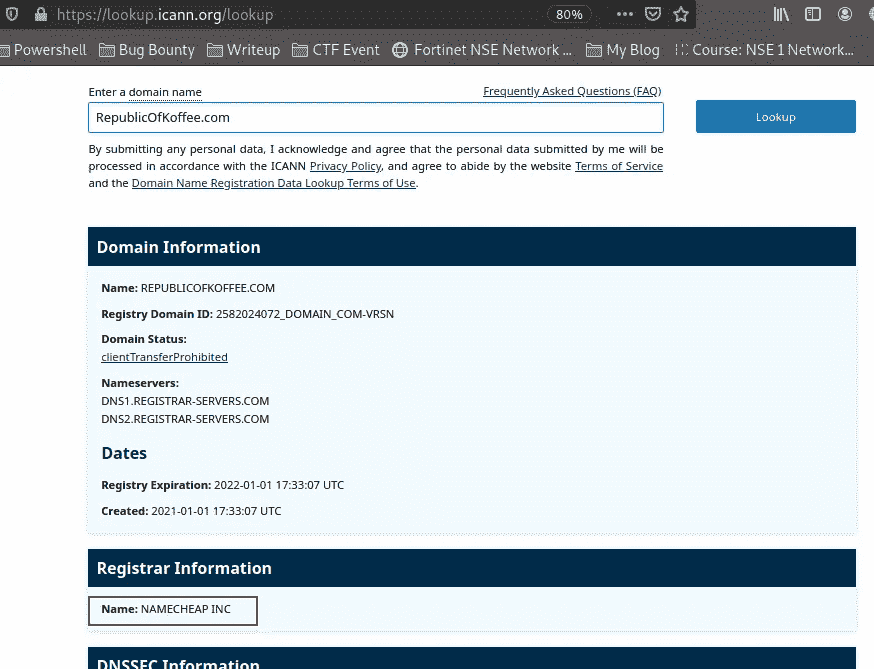

[https://tryhackme.com/room/webosint](https://tryhackme.com/room/webosint)

**问题 1:** 域名注册公司的名称是什么？

> **答案:Namecheap Inc**

**Q.2:** 登记公司的电话号码是多少？(不要包括国家代码或特殊字符/空格)

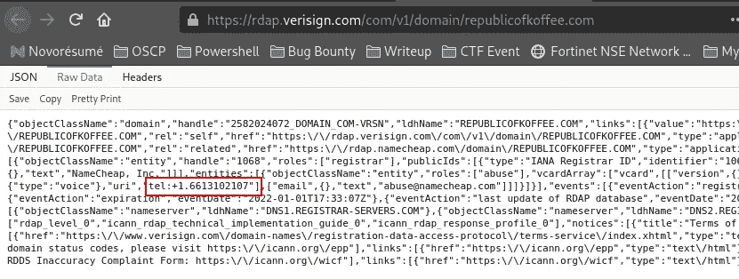

[https://rdap . verisign . com/com/v1/domain/republicofkoffee . com](https://rdap.verisign.com/com/v1/domain/republicofkoffee.com)

> **回答:*6613102107***

**问题 3:** 网站列出的第一个域名服务器是什么？

> **答案:*DNS1.REGISTRAR-SERVERS.COM***

**问题 4:** 登记人的姓名是什么？

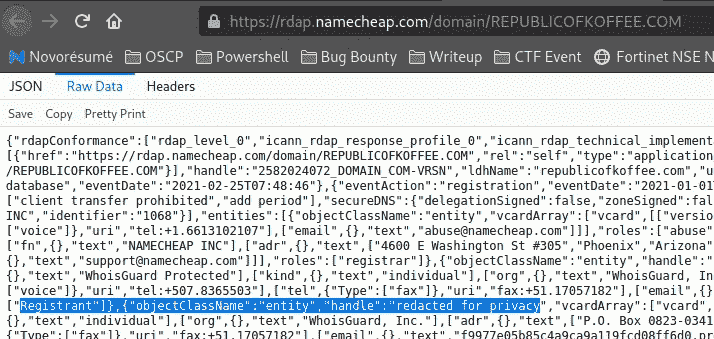

[https://rdap.namecheap.com/domain/REPUBLICOFKOFFEE.COM](https://rdap.namecheap.com/domain/REPUBLICOFKOFFEE.COM)

> **回答:*因隐私编辑***

**问题 5:** 注册人在哪个国家注册？

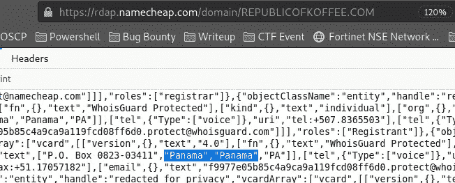

[https://rdap.namecheap.com/domain/REPUBLICOFKOFFEE.COM](https://rdap.namecheap.com/domain/REPUBLICOFKOFFEE.COM)

> **回答:*巴拿马***

# 任务 3:网站过去的幽灵

当你在一个网站上的初步搜索没有结果时，不要气馁。

这就是 Archive.org 和互联网回溯机发挥作用的地方。

帮你自己一个忙，安装 archive.org 浏览器扩展，当 Wayback 机器在网络浏览器中加载失败时，它会自动弹出一个选项来搜索网站。

无论是通过浏览器扩展，还是直接去 archive.org 搜索，看看我们的目标域名**RepublicOfKoffee.com 有哪些可用的快照。**

查看该站点可用的历史信息，您应该能够毫不费力地回答以下问题。

我们将利用 [waybackmachine](https://web.archive.org/) 保存一年中不同时间的网站档案。

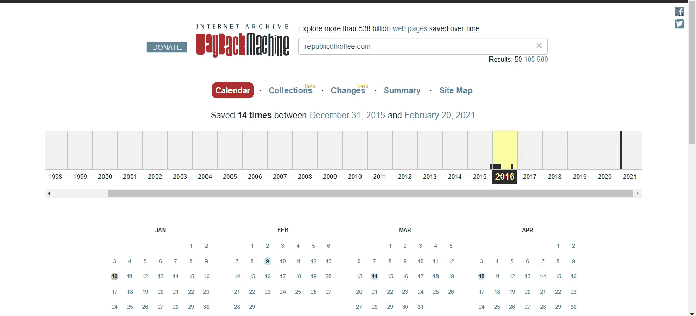

[http://web.archive.org/](http://web.archive.org/)

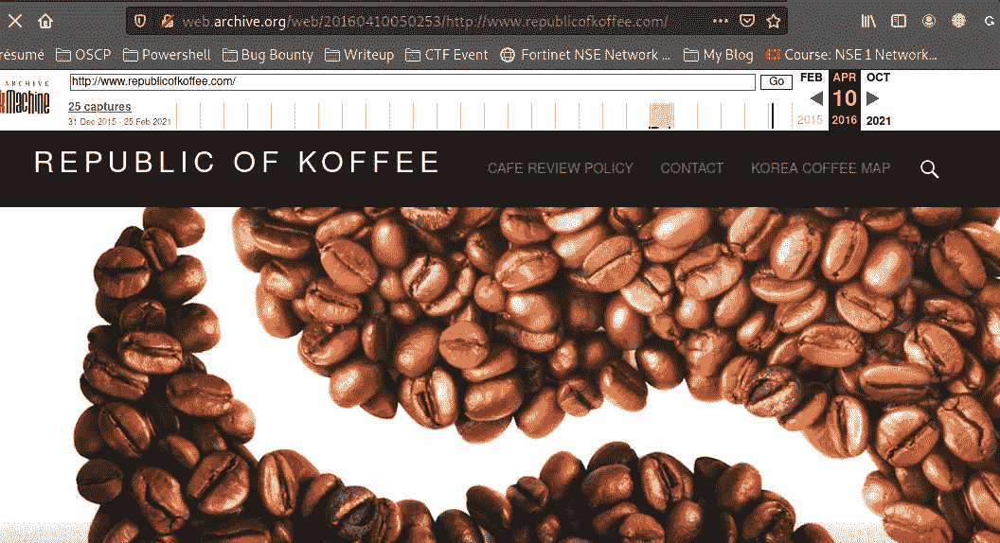

**问题 1:** 博客作者的名字是什么？

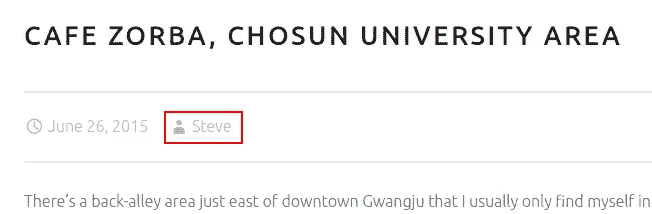

> **答案:史蒂夫**

问题 2:作者来自哪个城市和国家？

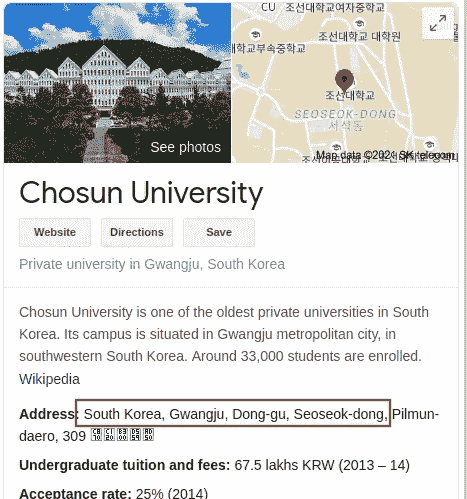

> **答案:韩国光州**

**问题 3:** 【研究】作者经常去的国家公园内的寺庙叫什么名字(英文)？

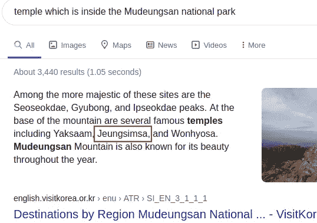

> **答案:琼森寺**

# 任务 4:深入研究 DNS

到目前为止，我们已经收集了一些关于目标网站内容的有用信息，尽管它已经有几年没有上线了。

但是技术细节呢？

这就是 ViewDNS.info 的用武之地。

**ViewDNS.info** 提供了一个方便的用户界面，用于在目标网站上查找注册信息。使用这些信息，可能会得出某些没有明确说明的结论，例如网站是托管在共享的还是专用的 IP 地址上。这个问题的答案暗示了网站的预算和流量。

看看可用的搜索选项，看看你能否回答这些问题。

**问题 1:**republicofkoffee . com 截至 2016 年 10 月的 IP 地址是多少？

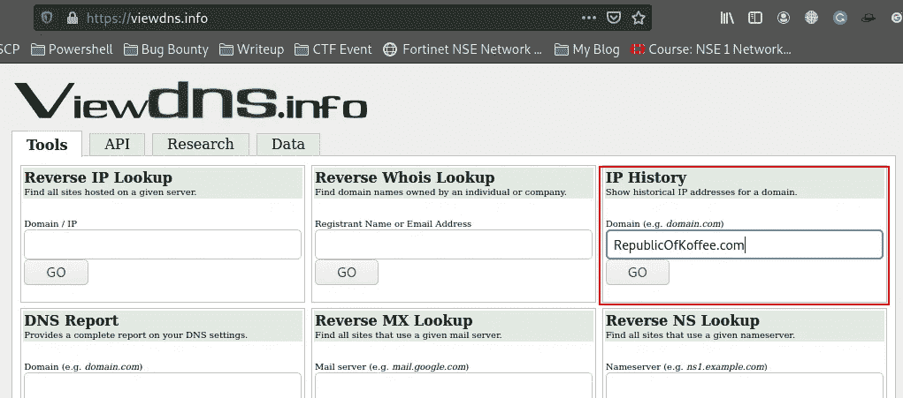

接下来我们需要找到的是 RepublicOfKoffee.com 截至 2016 年 10 月的 IP 地址。使用 IP 历史记录提取所需信息

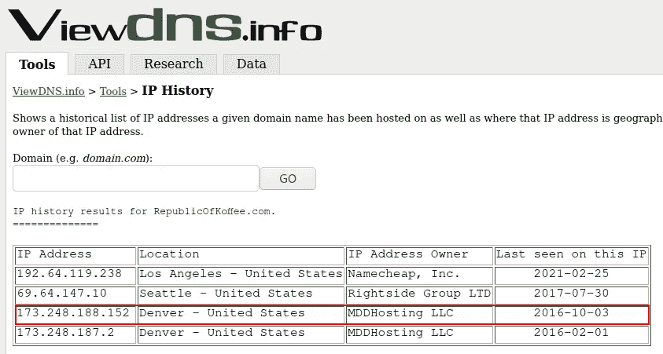

> **答案:*173.248.188.152***

**问题 2:** 根据托管在同一 IP 地址上的其他域，我们可以安全地假设我们的目标使用哪种托管服务？

> **回答:分享**

现在我们需要找出我们的目标使用的主机服务。为此使用反向查找。与我们之前发现的 IP 相关联的域名有一长串。这意味着我们的目标网站所有者正在使用共享主机服务，因为它的成本比专用主机服务低得多

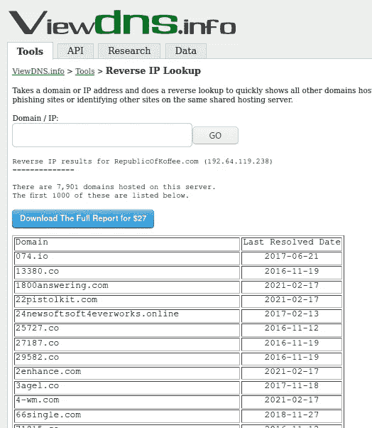

回到 IP 历史，IP 地址在域的历史中已经改变了 4 次。这回答了这个任务的最后一个答案

**问 3:** 在域的历史中，IP 地址改变了多少次？

> **答案:4**

# 任务 5:卸下训练轮

我们有了新的目标领域**heat.net。**我们需要找到以下内容

**问题 1:** 该域名的第二个域名服务器是什么？

参观 lookup.icann.org/lookup

> **答案:*NS2.HEAT.NET***

**问题 2:** 截至 2011 年 12 月，该域名位于哪个 IP 地址？

请访问 viewdns.info

> **回答:*72.52.192.240***

**问 3:** 基于共享相同 IP 的域名，域名所有者使用的是哪种托管服务？

> **回答:*分享***

**问题 4:** 互联网档案馆首次捕获该网站是在哪一天？(年月日/YY 格式)

> **回答:06/01/97**

**问题 5:**2001 年《最后的捕获》第一段正文的第一句话是什么？

6 月 1 日参观**web.archives.org**

> **回答:在经历了多年的在线游戏之后，是时候说再见了。**

**问题 6:** 运用你的搜索引擎技能，负责网站最初版本的公司叫什么名字？

> **答案:SegaSoft**

**问题 7:**2010 年最后一次拍摄的第一个标题是什么？

参观 web.archives.org

> ****答案:Heat.net——供暖和制冷****

# **任务 6:窥视网站的内部**

**网站消失了一段时间又回来了，这难道不是很有趣吗？**

**显然现在网站的目的不同了。让我们卷起袖子，弄清楚到底是怎么回事。**

**首先，你对这个网站有什么直觉吗？你的总体印象是什么？这感觉像是合法的信息来源吗？**

**为什么？**

**您可以考虑以下几点:**

*   **语言——写作处于什么年级水平？它看起来像是由以英语为母语的人写的吗？**
*   **UX——它对用户友好吗？设计现代吗？**
*   **网站有哪些页面？**

**我可以告诉你，这个网站符合过时的搜索引擎优化(SEO)最佳实践。如果你愿意，可以在 ahrefs 上阅读更多关于 [SEO 最佳实践的内容。](https://ahrefs.com/blog/seo-best-practices/)**

****技术研究****

**通常，关于网站及其创建者/所有者的线索可能会无意中留在网站的源代码中。几乎每个网络浏览器都有这样的方法。花点时间熟悉一下它在你选择的浏览器中是如何工作的是非常值得的。对于 MacOS 上的 Chrome，你可以进入顶部菜单栏，选择查看>开发者>查看源代码。**

*****注意:这也适用于你在 Archive.org 的 Wayback 机器中访问的网站。*****

**一旦加载了页面的源代码，就该四处看看了。你不必理解 HTML、CSS 或 Javascript 来阅读开发人员留给自己的笔记。在 HTML 中，注释以字符**

**`<!--Don't forget to email Bob Loblaw when the site goes live at bob@fakeemail.com-->`**

**尽管这可能很容易阅读，但如果它被隐藏在一个充满代码的巨大页面中，仍然很容易被忽略。这就是 ctrl-F 的用武之地。下面是一些可以用 ctrl-f 搜索的好东西:**

**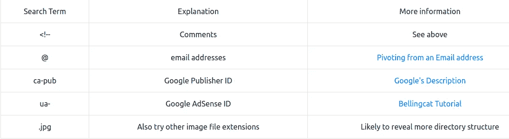**

**找到以上任何一个数据都会给你一个潜在的支点。上面链接的 Bellingcat 文章更详细地介绍了具体如何做，但是你不必把事情搞得太复杂！**

**你可以随时把上面的任何信息插入你最喜欢的搜索引擎，你可能会找到金子！**

**准备好将这一切付诸实践了吗？**

**以下问题涉及 heat[dot]net/36/需要租用商业供暖承包商/**

**开始吧！**

**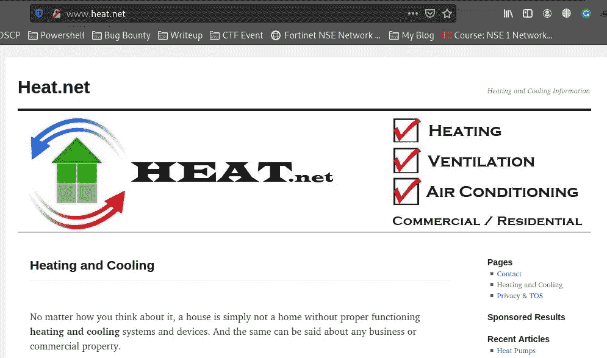**

**[http://www.heat.net/](http://www.heat.net/)**

****问题 1:** 文章正文中有多少个内部链接？**

> ****答案:5****

****Q.2:** 文章正文中有多少个外部链接？**

> ****答案:1****

****问题 3:** 文章中唯一的外部链接网站(那不是广告)**

**外部链接 URL**

> ****答案:purchase.org****

****问题 4:** 尝试找到链接到该网站的谷歌分析代码**

**使用文章上的查看页面源代码，找到 google analytics 代码，如下所示**

**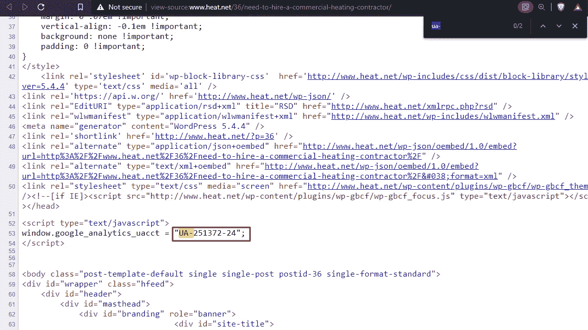**

> ****答案:UA-251372–24****

****问题 5:**Google Analytics 代码是否在其他网站上使用？是或否**

> **答案:不**

****问题 6:** 该网站的链接是否嵌入了任何明显的联盟代码？是或否**

> **答案:否**

# **任务 7:期末考试:将点点滴滴联系起来**

**有经验的 osit 研究人员会告诉你，没日没夜的追兔子洞而不能建立一些稳固的联系，这不是 osit。**

**OSINT 指的是当我们在数据分析中将点连接起来时开始出现的模式。**

**恭喜你。你发现我们的目标，热。]net，链接到一个有趣的外部网站。一个问题仍然存在:为什么？？？**

**链接中没有关联代码，所以两者之间没有明显的财务联系。也许还有另一种联系。**

**这是你的期末考试，只有一个问题。**

**忙起来！**

****问题 1:** 使用任务 4 中的工具确认两个站点之间的链接。在没有提示的情况下努力想明白。**

**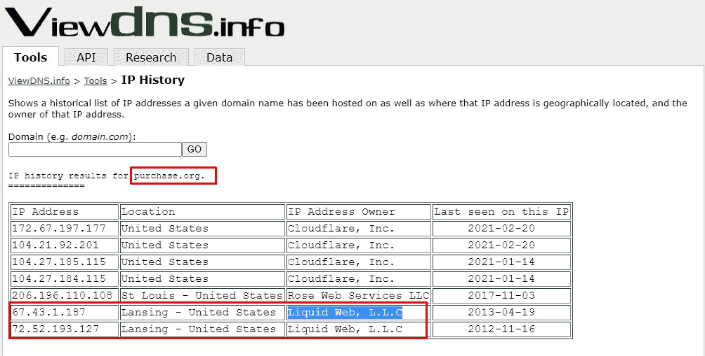**

> ****答案:Liquid Web，L.L.C****

# **信息资源**

**一点网络知识对在线调查大有帮助。它发挥作用的几个例子包括任何种类的商业信息，在线诈骗，甚至政治新闻。如果你想看到这种研究被付诸实践的最好例子，我强烈推荐看看 NixIntel 的揭露[将 antifa.com 和俄国](https://nixintel.info/osint/website-osint-whats-the-link-between-antifa-com-and-russia/)联系起来，这是一个惊人的案例研究。**

**请务必查看其他信息框，例如:**

*   **用于地理定位和图像分析的[探照灯机房](https://tryhackme.com/room/searchlightosint)和[地理定位](https://tryhackme.com/room/geolocatingimages)**
*   **高级搜索引擎运营商的谷歌书呆子空间**
*   **额外练习的空间**

**还有两个精彩的播客，每个 OSINT 从业者都应该经常听。[新的好奇](https://osintcurio.us/)播客和[隐私、安全&新的节目](https://inteltechniques.com/podcast.html)。**

**最后，一个不会让你倾家荡产的在线培训的可靠付费选择是[选择](https://www.theosintion.com/)。如果你喜欢这个房间的内容，你会喜欢他们提供的商业课程。除了成为一名满意的顾客之外，我与这门课程没有任何关系。**

**你可以在:
**LinkedIn:-**[https://www.linkedin.com/in/shamsher-khan-651a35162/](https://www.linkedin.com/in/shamsher-khan-651a35162/)
**Twitter:-**[https://twitter.com/shamsherkhannn](https://twitter.com/shamsherkhannn)
**Tryhackme:-**[https://tryhackme.com/p/Shamsher](https://tryhackme.com/p/Shamsher)**

****

**如需更多演练，请在出发前继续关注…** 

**访问我的其他演练:-**

**感谢您花时间阅读我的演练。
如果您觉得有帮助，请点击👏按钮👏(高达 40 倍)并分享
它来帮助其他有类似兴趣的人！+随时欢迎反馈！**