# 网站 OSINT

> 原文：<https://infosecwriteups.com/website-osint-fca43dba2c0c?source=collection_archive---------0----------------------->


在本文中，我学习了如何使用开源智能(OSINT)技术和工具来收集关于几个网站的信息，并了解仅通过查看公开可用的信息就可以发现网站的哪些信息。这个挑战在 [TryHackMe](https://tryhackme.com) 平台上有，标题为“ **WebOSINT** ，由用户“[osinstan](https://tryhackme.com/p/OSINTStan)”创建。

# WHOIS 注册

## 挑战描述

> 尽可能多地找到关于 RepublicofKoffee.com 网站的信息

## 挑战问题和答案

> 1.域名注册的公司名称是什么？

挑战赛建议直接前往[lookup.icann.org](https://lookup.icann.org/lookup)获取与“*RepublicOfKoffee.com*”相关的 WHOIS 信息。该网站的搜索结果显示，注册该域名的公司名称为" *Namecheap Inc* "

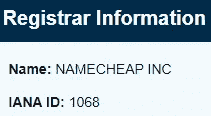

WHOIS 注册服务商信息。

> 2.注册公司的电话号码是多少？(不包括国家代码或特殊字符/空格)？

参考作为搜索结果的一部分提供的原始注册 RDAP 响应，我可以看到注册公司列出的电话号码。

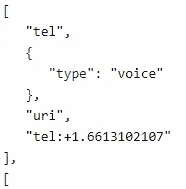

原始注册 RDAP 响应中列出的电话号码。

> 3.网站列出的第一个域名服务器是什么？

查看该域名的信息，我可以看到列出了两个域名服务器，其中第一个名为“*NS1.BRAINYDNS.COM*”。

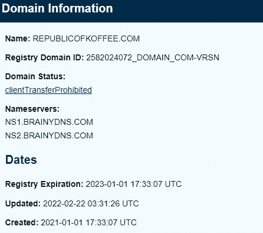

WHOIS 域名信息。

不幸的是，这不是挑战的答案。自挑战创建以来，名称服务器一定发生了变化。为了找到正确答案，我们可以搜索“*RepublicOfKoffee.com*”的 [DNS 历史](https://dnshistory.org/dns-records/republicofkoffee.com)，并确定之前的域名服务器。

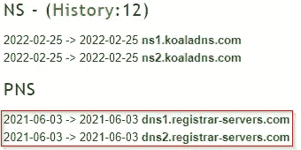

以前的域名服务器。

看上面的图片，我可以看到之前网站列出的第一个域名服务器是“*DNS1.REGISTRAR-SERVERS.COM*”。

> 4.注册人的名字是什么？

回到我们之前的 WHOIS 查找结果，我可以看到“*因隐私而修订*”被列为注册人的名称。

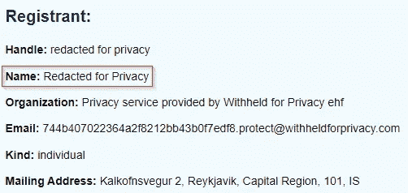

WHOIS 注册人姓名。

> 5.注册人在哪个国家？

查看 WHOIS 结果，我可以看到为注册人列出的国家是“*冰岛*”。


WHOIS 注册国。

不幸的是，自挑战创建以来，这些信息似乎也发生了变化。我可以通过网站 [whoxy](https://www.whoxy.com/republicofkoffee.com) 查看之前谁拥有域名“*RepublicOfKoffee.com*”。该网站有 7 项记录，记录了过去谁曾拥有该域名。通过查看列表，我发现在冰岛之前为注册人列出的国家是“*巴拿马*”。

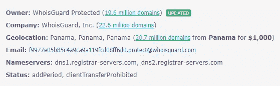

注册国巴拿马记录。

# 网站过去的幽灵

## 挑战描述

> 查看有关 RepublicOfKoffee.com 的历史信息，并回答以下问题。

## 挑战问题和答案

> 1.博客作者的名字是什么？

使用 [WayBack](https://web.archive.org/web/20150615000000*/RepublicOfKoffee.com) 机器，我可以看到追溯到 2015 年的“*RepublicOfKoffee.com*”的网络缓存。

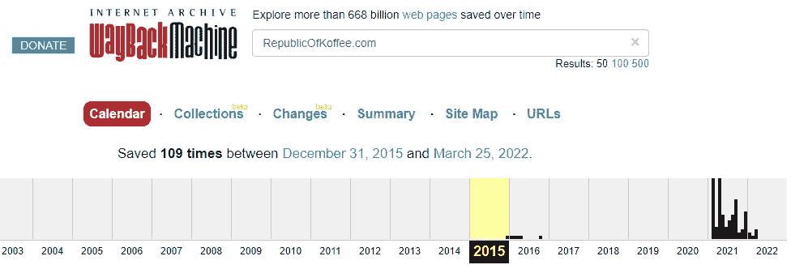

WayBack 机器存档。

我从查看最早的网络档案开始，这是 2015 年 12 月 31 日拍摄的快照。看网站发表的第一篇文章提供了作者姓名。

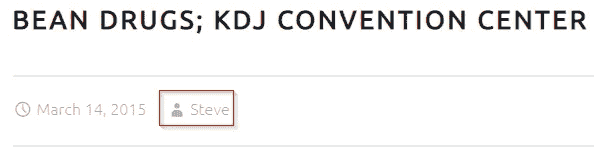

博客作者的名字。

> 2.作者来自哪个城市和国家？

通过阅读史蒂夫的博客帖子，我可以看到他在*木登山国家公园*附近安排了会议。

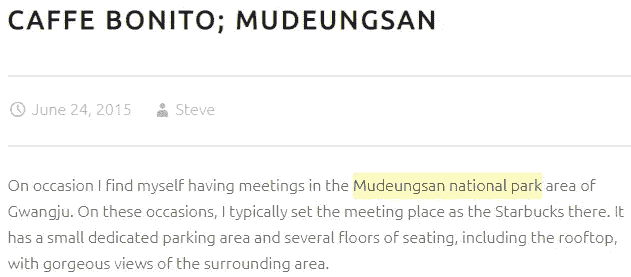

*博文中提到的木登山国家公园。*

*木登山国家公园*位于韩国光州。

> 3.[研究]作者经常去的国家公园内的寺庙叫什么名字(英文)？

据 [koreatriptips](http://www.koreatriptips.com/en/tourist-attractions/1618277.html) 网站报道，有一座名为 Jeungsimsa 的寺庙，位于慕德山的西麓。

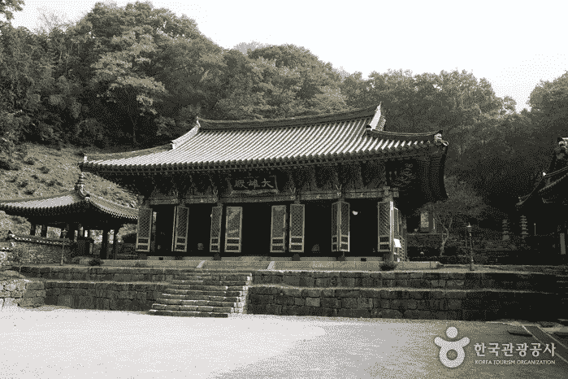

永济寺。

# 深入研究 DNS

## 挑战描述

> 使用像 ViewDNS.info 这样的网站来识别关于 RepublicOfKoffee.com 的技术细节

## 挑战问题和答案

> 1.RepublicOfKoffee.com 截至 2016 年 10 月的 IP 地址是多少？

使用 [ViewDNS.info](https://viewdns.info/) ，我可以对域名“*RepublicOfKoffee.com*”执行 IP 历史搜索。查看结果，我可以看到 2016 年 10 月的 IP 地址是“*173.248.188.152*”。

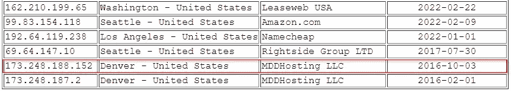

截至 2016 年 10 月“*RepublicOfKoffee.com*的 IP 地址。

> 2.基于相同 IP 地址上托管的其他域，我们可以安全地假设我们的目标使用哪种托管服务？

由于有其他域托管在同一个 IP 地址上，我们可以安全地假设我们的目标使用**共享**托管。

> 3.在域的历史中，IP 地址改变了多少次？

自从这项挑战产生以来，该域名的 IP 历史已经改变了多次，大多数发生在 2022 年。从下往上看，我可以看到 IP 地址改变了**四次**，直到并包括 IP 地址所有者“ *Namecheap* ”。

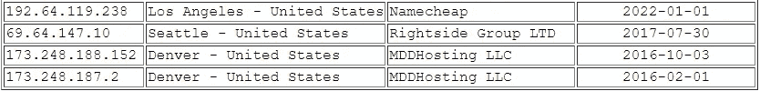

IP 地址更改了四次。

# 取下训练轮

## 挑战描述

> 使用目前为止看到的工具和技术收集关于 **heat[dot]net** 的信息并回答问题。

## 挑战问题和答案

> 1.为该域列出的第二个名称服务器是什么？

我开始使用[lookup.icann.org](https://lookup.icann.org/lookup)查找“*heat.net*”的 WHOIS 信息。我看到第二个域名服务器是“*NS2.HEAT.NET*”。

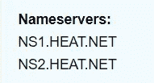

heat.net 的 WHOIS 名称服务器。

> 2.截至 2011 年 12 月，该域名位于哪个 IP 地址？

使用 [viewdns.info](https://viewdns.info/iphistory/?domain=heat.net) 网站，搜索该域名的 IP 历史，可以看到 2011 年 12 月列出的 IP 地址是“*72.52.192.240*”。

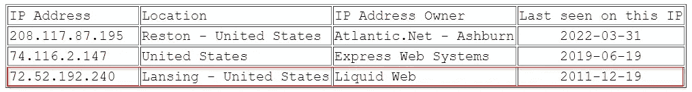

2011 年 12 月列出的 IP 地址。

> 3.基于共享相同 IP 的域名，域名所有者使用的是哪种托管服务？

因为有其他域托管在同一个 IP 地址上，我们可以安全地假设我们的目标使用**共享**托管。

> 4.互联网档案馆首次捕获该网站是在哪一天？(年月日/YY 格式)

使用[web.archive.org](https://web.archive.org/web/19970601000000*/heat.net)，我可以看到这个网站在 1997 年 6 月 1 日首次被互联网档案馆捕获。

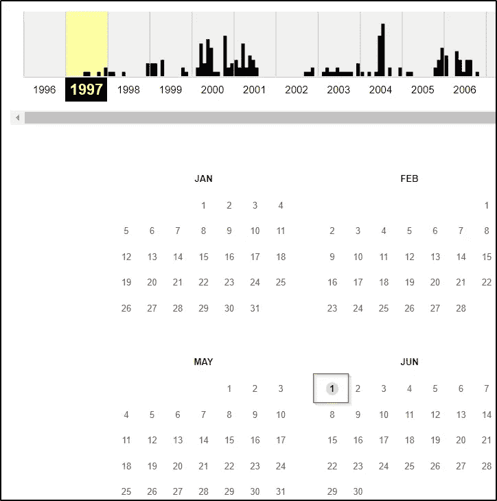

网站首次被互联网档案馆捕获的日期。

> 5.从 2001 年的最终捕获的第一个主体段落的第一句话是什么？

看 2001 年 6 月 28 日的网站最终截图，可以看到第一段正文的第一句话。

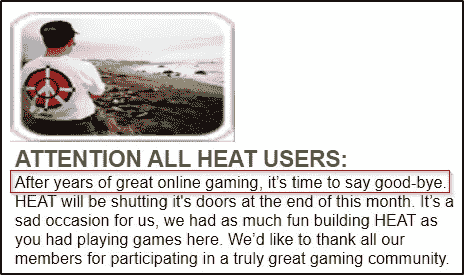

2001 年最终捕获的第一段正文的第一句话。

> 6.运用你的搜索引擎技能，负责网站原始版本的公司叫什么名字？

我可以使用 Google dorks 来查找 Google 在该页面上可能有的补充信息(对于查找缓存页面很有用)。

```
info:heat.net
```

查看这个搜索的输出，我可以看到它返回了一家名为“ *SegaSoft* ”的 PC 游戏公司的名称。


谷歌呆子返回公司名称。

在搜索结果中，我还可以看到多篇文章证实“ *SegaSoft* ”是负责该网站原始版本的公司名称。

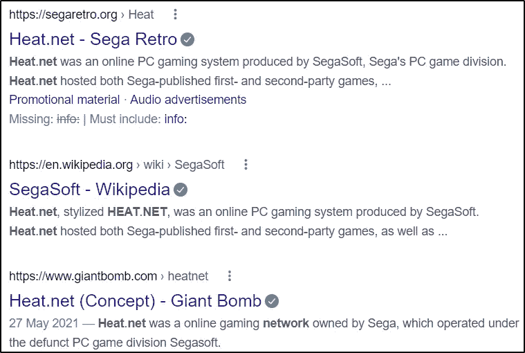

谷歌呆子搜索结果。

> 7.2010 年最后一张照片的第一个标题是什么？

使用 web.archive.org 的[，我可以看到网站在 2010 年的最后一次截图是在 12 月 30 日。看着网页，我能看到第一个标题。](https://web.archive.org/web/20101230184331/http://www.heat.net/)

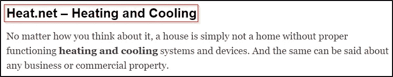

2010 年最后一次拍摄的第一个标题。

# 在一个网站的引擎盖下登峰造极

## 挑战描述

> 参考 heat[dot]net/36/need-to-hire-a-commercial-heating-contractor/并回答以下问题。

## 挑战问题和答案

> 1.文章正文有多少个内部链接？

我首先导航到目标 URL“*heat[dot]net/36/need-to-hire-a-commercial-heating-contractor/*”，并在文章正文中找出了五个内部链接。

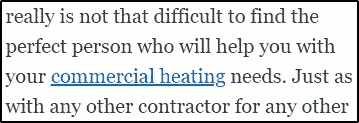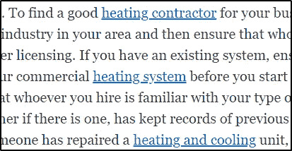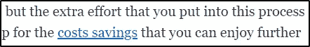

文章正文中的内部链接。

> 2.文章正文中有多少个外部链接？
> 
> 3.文章中唯一的外部链接(那不是广告)

我在文章的正文中发现了一个外部链接，它指向“*www.purchase.org*”。


外部链接。

> 4.尝试找到链接到该网站的谷歌分析代码

我首先查看网页的源代码，并搜索关键字“分析”，它确定了链接到该网站的谷歌分析代码。

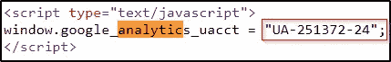

谷歌分析代码。

> 5.谷歌分析代码是否在其他网站上使用？是或否

这个挑战的提示建议使用网站 [nerdydata](https://www.nerdydata.com/reports/new?search={%22all%22:[{%22type%22:%22code%22,%22value%22:%22ua-251372-24%22}],%22any%22:[],%22none%22:[]}) 。搜索结果显示没有其他网站在使用该代码(即**否**)。

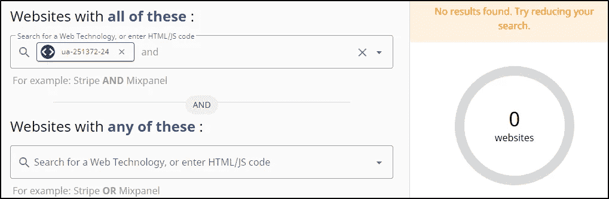

Nerdydata 搜索结果。

> 6.这个网站的链接是否嵌入了任何明显的会员代码？是或否

查看该网站的链接，href 代码中没有无关信息(如代销商的 ID 或用户名)。

# 期末考试:将点点滴滴连接起来

## 挑战描述

> 这是你的期末考试，只有一个问题。

## 挑战问题和答案

> 1.使用任务 4 中的工具确认站点“heat.net”和“purchase.org”之间的链接。

任务 4 中使用的工具与 DNS 相关，确定的外部网站为“*purchase.org*”。通过使用 [viewdns.info](https://viewdns.info/iphistory/?domain=purchase.org) ，我发现“*heat.net*”和“*purchase.org*”拥有同一个 IP 地址所有者，名为“*灵动网*”。

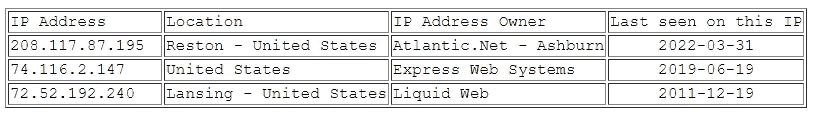

“heat . net”IP 地址所有者

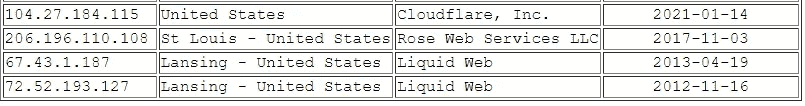

“purchase . org”IP 地址所有者。

答案需要另外三个字符。在谷歌上搜索“*灵动网络*”，会显示公司名称，后面跟着“*有限责任公司*”。提交“*灵动网络，有限责任公司*”完成挑战。

# 最后的想法

我真的很喜欢在这个房间里工作，有机会学习更多关于 Web OSINT 的知识。这个挑战进展顺利，我学到了很多在网站上收集开源信息的知识。谢谢你一直读到最后，继续黑下去😄！