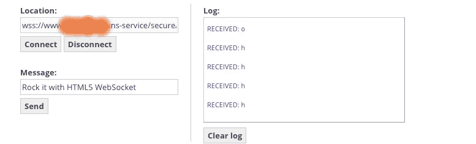
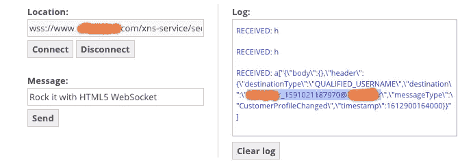
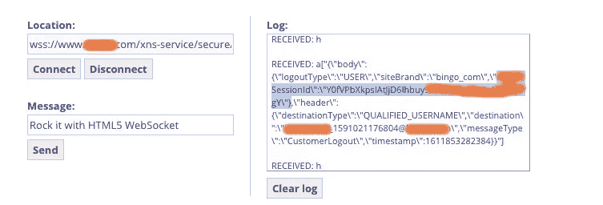
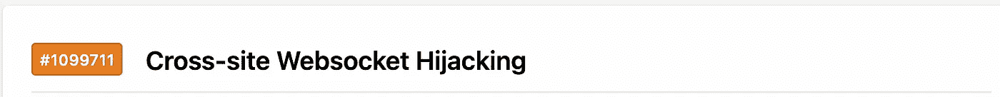

# “Websocket 劫持”来窃取受害用户的 Session_ID

> 原文：<https://infosecwriteups.com/websocket-hijacking-to-steal-session-id-of-victim-users-bca84243830?source=collection_archive---------0----------------------->

大家好，希望你们都健康平安。今天的文章是关于我在一个游戏网站上的发现。有趣的是，我一直认为这种攻击只是一种理论。和往常一样，我会尽量让我的文章不那么专业，这样对任何初学者来说都容易理解。开始吧！

在进入细节之前，让我们讨论一下 websocket 请求:

什么是 Websocket？

使用 websocket 请求，可以在用户的浏览器和服务器之间打开一个双向的交互式通信会话。有了这个 API，您可以向服务器发送消息并接收事件驱动的响应，而不必轮询服务器的回复。如果您想了解更多信息，请点击此处—[https://sookocheff . com/post/networking/how-do-web sockets-work/](https://sookocheff.com/post/networking/how-do-websockets-work/)

**剥削:**

所以我在这个私人黑客程序<redacted>com 上搜索。在开始攻击之前，我习惯于通过拦截 Burpsuite 中的请求来快速检查网站。在这个过程中，我发现很少有 websocket 请求携带消息。所以我开始检查它是否容易受到 websocket 劫持。为此，我使用了这个网站:[http://websocket.org/echo.html](http://websocket.org/echo.html)【这是一个为连接 websockets 而创建的易受攻击的网站】。您所要做的就是在位置输入中输入 websocket url，并检查您是否能够发送和接收消息。我输入了这样的目标 web socket URL:*WSS://www。<已修订>。com/xns-service/secure/client/desktop/000/xxxxxxxx/web socket*，我立即在第三方网站上得到这样的回复</redacted>

*   **注意:** 000 —在实际的 url 中，这是字母数字值，但我发现它接受任何值，同样适用于 XXXXXX

到目前为止还不错，但是有什么影响呢？所以我开始进一步探索这个网站，发现当一个用户更新他们的个人资料时，他们会收到这样的消息，泄露了这个用户的用户名

所以我知道，如果受害者正在执行任何操作，websocket 连接建立的第三方正在接收包含敏感内容的 websocket 响应。所以我继续做敏感的动作，所有的动作都有相同的反应。但就在那时，我执行了密码更改操作，然后嘣！！本次披露的 Session_Id:)

**又有什么影响？**

因此，攻击者将创建一个网站并托管易受攻击的代码。现在，当受害者打开攻击者的网站时，连接将立即建立，每当受害者执行一个操作时，他们就可以开始看到 websocket 消息。影响最大的行为是当受害者试图更新他们的密码时，攻击者可以看到受害者帐户的 Session_Id。

要创建一个真实的攻击场景，请使用通过[http://websocket.org/echo.html](http://websocket.org/echo.html)获得的代码，利用这些代码，攻击者可以充当第三方并拦截 websocket 响应。所以我很快在 Hackerone 中报告了这个漏洞，由于一些原因，报告被接受了，严重性和奖金都有所降低，但识别部分让我很高兴，因为我一直认为这种类型的漏洞只是一个理论！

**快速总结:**

1.  在 Burpsuite 中播放请求时发现 websocket 请求。
2.  打开:【http://websocket.org/echo.html】的[并检查我是否能发送和接收 websocket 响应](http://websocket.org/echo.html)
3.  收到来自目标的响应。
4.  尝试升级严重性，发现当受害用户更新密码时，session_Id 被泄露给第三方。
5.  为了展示一个真实的攻击场景，我们使用了下面的代码:[http://websocket.org/echo.html](http://websocket.org/echo.html)

希望你喜欢我的解释。如果你有任何疑问，请随时通过 twitter 联系我:[https://twitter.com/sunilyedla2](https://twitter.com/sunilyedla2)。保持积极，传播积极:)