# 每周新闻

> 原文：<https://infosecwriteups.com/weekly-osint-df9b6451fb90?source=collection_archive---------1----------------------->

你好。！！

希望你平安健康！！

让我引用一段话开始本周的博客。

> 让我们面对现实吧:未来就是现在。我们已经生活在一个网络社会，所以我们需要停止忽视它或假装它没有影响我们。
> 
> 马尔科·恰佩利

在我们所处的当代世界，这一点非常正确。所以思考它很好，学习它也更好。

好了，让我们直接进入我们的内容吧！！

本周内容:

1.  来自 geoguessr 的挑战

 [## 让我们探索世界吧！

### GeoGuessr 是一款地理游戏，带你环游世界，挑战你的认知能力…

www.geoguessr.com](https://www.geoguessr.com/) 

2.来自网络足球的几个挑战|网络侦探 CTF

 [## 网络社会|网络侦探 CTF

### 网络侦探 CTF 是一个专注于网络的 CTF，由卡迪夫大学网络协会创建

ctf.cybersoc.wales](https://ctf.cybersoc.wales/) 

3.最后是 EMAIL OSINT(如何利用有限的信息找到电子邮件地址)

— — — — — — — — — — — — — — — — — — — — — — — — — —

1.  我们被丢到了一个地方，我们需要找到我们在世界上的位置。

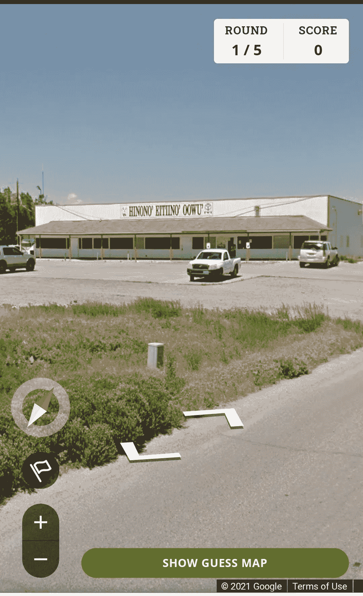

我们看到的建筑上写着一些乱码。所以首先我们需要找到这是什么，然后试着找到它的位置。

这个词是:Hinono Eitiino Oowu

有了这个，我们可以直接回到我们最常用的工具……

谷歌

所以当我们搜索这个的时候，我们会看到纽约时报的一篇文章。

简而言之，Hinono'eitiino'oowu 是怀俄明州风河保留地的一所语言沉浸式小学，于 10 月 17 日刚刚开学。

阿尔韦娜·奥德曼发起这一倡议的主要目的是通过向年轻人传授阿拉帕霍语，使其免于灭绝。

如果感兴趣，请阅读这篇文章:

 [## 世界必须听到的女人:天空人的学校

### 像大多数现存的美洲土著语言一样，阿拉帕霍语正处于消失的边缘。学者和…

www.culturalsurvival.org](https://www.culturalsurvival.org/publications/cultural-survival-quarterly/women-world-must-hear-school-sky-people) 

所以回到寻找它的位置，因为它是在 2020 年 10 月建立的，仅仅使用谷歌地图是不容易找到的。所以在这条路上往前走一点，我们看到:

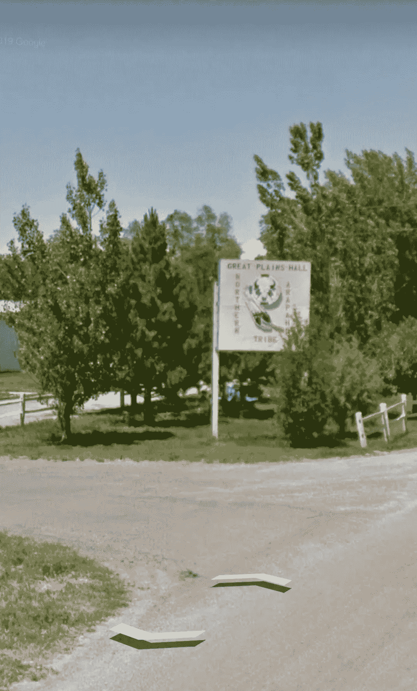

嘣！！！！我们发现另一个地标(大平原大厅)离我们的目标很近，这个可以在地图上找到。

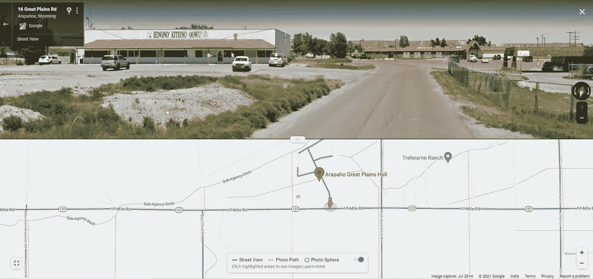

— — — — — — — — — — — — — — — — — — — — — — — — —

2.接下来我们有

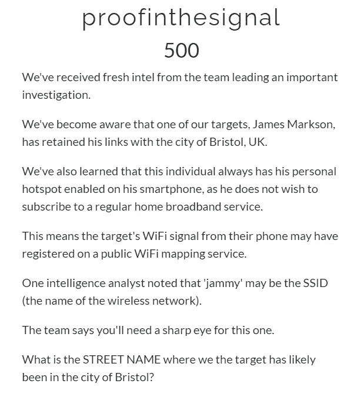

在这个实验中，我们被指定使用一个人使用的无线网络的 SSID(无线热点的名称)来找到他在布里斯托尔的确切位置。

OMG！！这怎么可能呢？？？？

实际上有一种方法可以找到它……让我们看看它的实际应用吧！

另一个增加我们武器库的工具是 wigel

 [## WiGLE:无线网络映射

### 802.11 无线网络的地图和数据库，带有统计数据，由 wardrivers、netstumblers 和 net huggers 提交。

wigle.net](https://wigle.net/) 

> 那么威格尔是什么？？
> 
> **WiGLE** (或**无线地理日志引擎**)是一个收集世界各地不同[无线热点](https://en.wikipedia.org/wiki/Hotspot_(Wi-Fi))信息的网站。
> 
> 用户可以在网站上注册并上传热点数据，如 [GPS 坐标](https://en.wikipedia.org/wiki/GPS_coordinates)、 [SSID](https://en.wikipedia.org/wiki/SSID) 、 [MAC 地址](https://en.wikipedia.org/wiki/MAC_address)以及发现的热点所使用的加密类型。此外，上传并显示[蜂窝塔](https://en.wikipedia.org/wiki/Cell_site)数据。

这也被称为驾驶。

听起来很酷吧！！任何人都可以把信息上传到 wigle 上，这使它变得非常强大。

现在让我们开始我们的任务，搜索英国布里斯托尔所有可用的热点，然后搜索“jammy”。

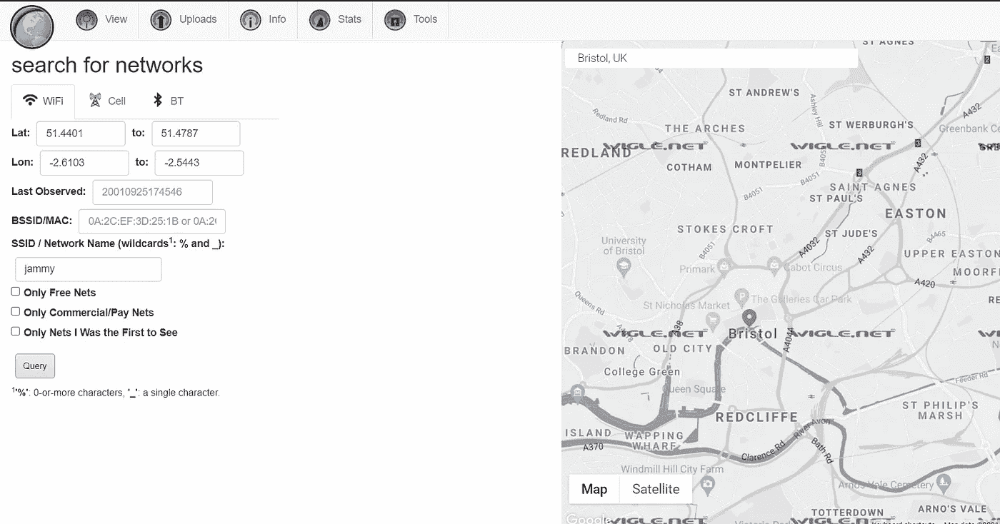

搜索布里斯托尔，我们得到了这个，如果你仔细看，你可以在伊斯顿上方的 A432 附近看到两个紫色的小点。

紫色的点实际上代表网络，放大后我们可以看到…

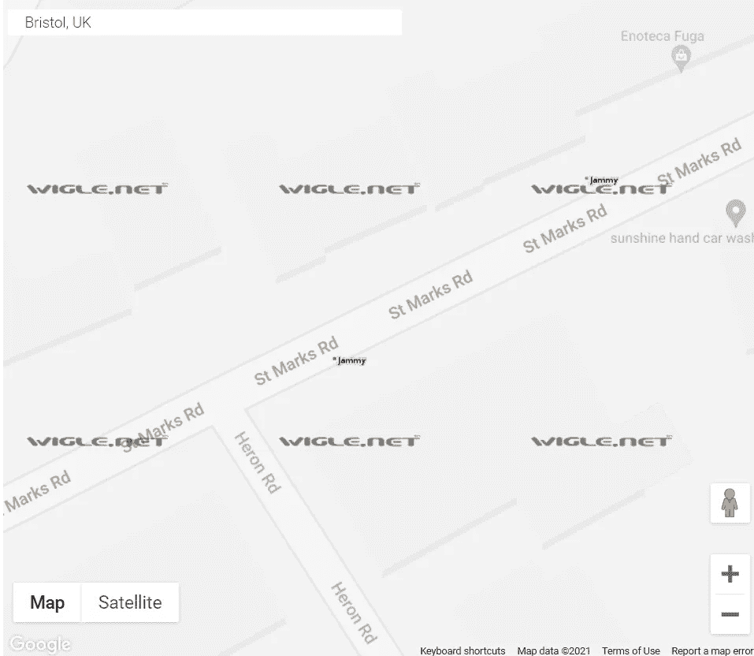

海哲明的网络繁荣。

另一名嫌犯被捕。

旗帜:圣马可路

— — — — — — — — — — — — — — — — — — — — — — — — — —

3.

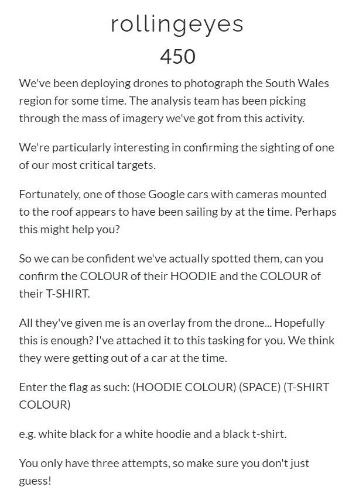

附无人机图片

所以我们需要在这附近找到一个穿 t 恤和连帽衫的人。

这可能听起来不可能或像大海捞针，但它是可能的！！。

我们得到了一个线索，大约在我们的目标漫游到那里的同时，有一辆车顶有摄像头的汽车在附近行驶。

这意味着我们已经在谷歌地图中记录了该地区的街景，因此我们必须在该地区四处走动才能找到我们要找的人..

因此，我在地图中搜索 Poppy-n-Pals 宠物护理服务，并直观地绘制了该地区的地图。

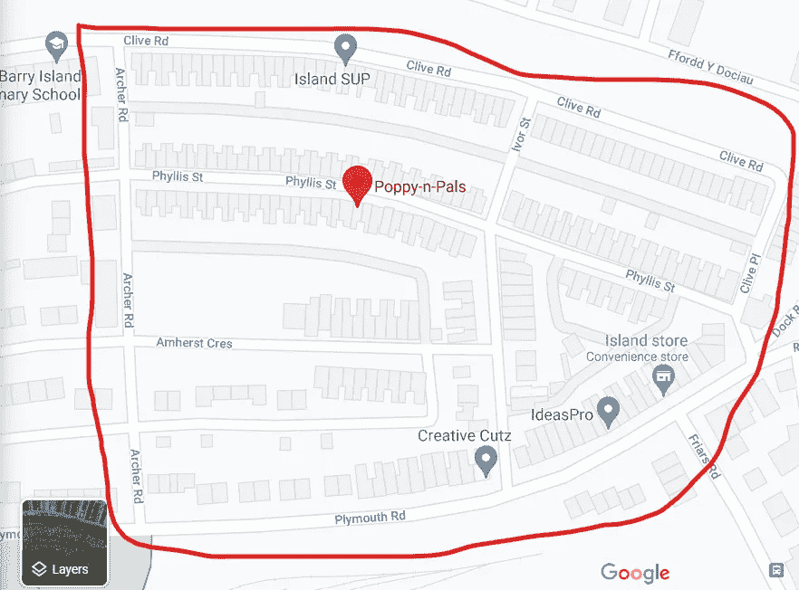

所以这是我们要去的地方，我想我们可以从这里开始

阿彻路→阿默斯特街→走向创意路

我几乎只有这些，并没有以最佳方式搜索整个区域，但幸运的是，我找到了有这些的人😂😂。

所以，如果你能指导我在整个地区进行一次适当的搜索，请告诉我！！

所以在中途我发现了目标

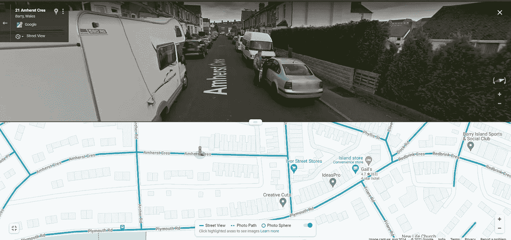

这个男人穿着:红色帽衫和蓝色 t 恤

国旗:红色蓝色

我甚至拍了一张照片

汽车的车顶摄像头是什么样子的？？

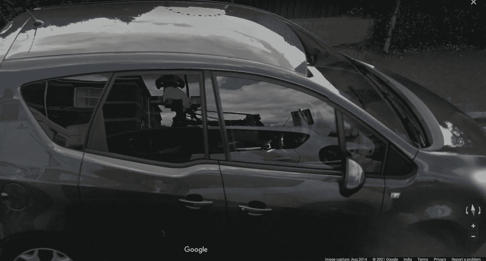

在这个倒影中，我们可以看到汽车被涂上了不同的颜色，如绿色、黄色和顶部的凸轮。

事实上，我想这个设置看起来很酷！！

— — — — — — — — — — — — — — — — — — — — — — — — — -

最后，让我们看看电子邮件搜索:

> 免责声明:
> 
> 请不要将这种方法或工具用于邪恶的目的，因为它们可能会泄露一些有价值的信息。这是为了教育和提高技能，以帮助有需要的人！！

为此，我们将使用一些网站，如:

1.  电话簿. cz
2.  清零位连接
3.  我被耍了吗？？
4.  电子邮件河马

电话簿. cz:

 [## 电话簿. cz

### 电话簿列出了给定输入域的所有域、电子邮件地址或 URL。*.gov.uk 等通配符是…

电话簿. cz](https://phonebook.cz/) 

这是一个免费使用的网站，用我们拥有的信息搜索电子邮件地址，网址等。

假设我们需要找到 tryhackme.com 网站的支持邮件。

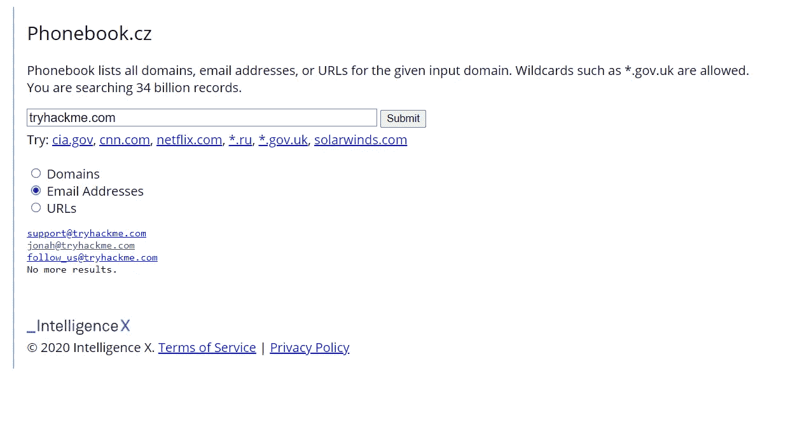

我们可以看到它已经得到了 tryhackme.com 的支持邮件 id，只有它的域名。

酷吧！！

单击 id，我们可以看到从中检索到该内容的来源。

2.

 [## Clearbit Connect -超级充电 Gmail

### 查找任何公司的员工电子邮件地址，并为向您发送电子邮件的任何人显示有用的上下文数据。

chrome.google.com](https://chrome.google.com/webstore/detail/clearbit-connect-supercha/pmnhcgfcafcnkbengdcanjablaabjplo) 

在没有 Gmail 的情况下使用这个扩展，我们可以直接从 Gmail 页面搜索电子邮件地址。

安装后，我们可以在页面右侧看到 Clearbit。

用这个追踪我们得到的电子邮件地址

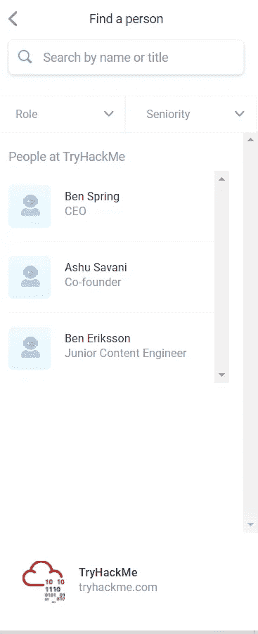

这向我们展示了比电话簿更多的信息，点击它显示的名字

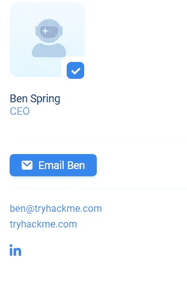

我们看到了电子邮件 id，甚至是他的 Linkedin 页面的链接…

太棒了……..

现在电子邮件河马和我被 pwned 可以用来检查一封电子邮件是否有效。

我是否被 pwned 实际上是一个网站，检查我们的凭据是否通过数据泄露暴露给世界。

我希望你能探索这些，从中学习一些东西，并确保上网安全..

— — — — — — — — — — — — — — — — — — — — — — — —

好的，最后我们将看看我们能从这个博客中得到什么:

1.  Geo-OSINT 是一项有趣的活动，我们可以在这里探索不同的风景和地方。

这个网站

 [## virtualvacation.us -在家探索世界

### 使用 virtualvacation.us 从家中探索世界/全球！查看来自不同城市的现场镜头，甚至可以…

虚拟教育. us](https://virtualvacation.us/) 

实际上带你通过一个不同的地方，如纽约，那不勒斯和更多的视觉旅游…

你可以选择驾驶选项在城市中漫游，就像你在开车一样…这是消除无聊的好方法。一定要看看这个！！

2.当你在找工作或推销产品时，电子邮件搜索会派上用场。

比方说，你对一家特定的公司感兴趣，你正试图联系人力资源部或招聘经理申请一份工作，甚至获得各种空缺职位的信息。

电子邮件对于在公司中找到这些排名靠前的人非常有用，因为他们的地址可能不会出现在公开的网站上。

这可能是一个很好的方法来接触他们，并从他们身上学到最多的东西，让你有足够的能力去参加这个开幕式！！

3.最后，在阿尔韦纳·奥德曼的倡议下，我们必须意识到保护文化习俗、语言、传统和所有那些我们在当代世界中通常看不起的东西的重要性。

因为这些东西定义了我们是谁，我们应该是什么样子，并告诉我们通往健康生活的道路等等……

这些不仅止于道德，它们甚至为一些惊人发明和发现开辟了新的道路..

## 就这样，我关闭了这个博客…

让我们下周带着一些很酷的东西再见面吧…

如果你没有看过我之前的博客，请看看:

 [## 开源智能

### 你好。！！希望你一切都好。

thiru18krish.medium.com](https://thiru18krish.medium.com/osint-open-source-intelligence-dd92f920766a)