# Wekor Tryhackme 报道

> 原文：<https://infosecwriteups.com/wekor-tryhackme-writeup-17ade6e4e1a?source=collection_archive---------5----------------------->

作者 Shamsher khan 这是一篇关于 Tryhackme room“Wekor”的文章

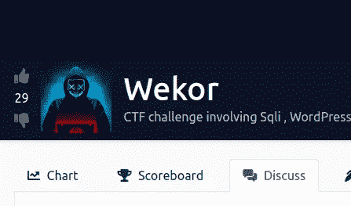

https://tryhackme.com/room/wekorra

**房间链接:**[https://tryhackme.com/room/wekorra](https://tryhackme.com/room/wekorra)
**注:此房免费**

将标签添加到主机文件

```
echo "10.10.62.4      wekor.thm" >> /etc/hosts
```

# 列举

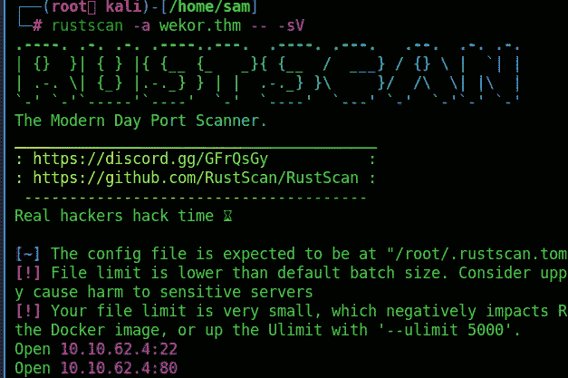

在端口 80 上

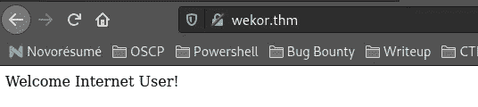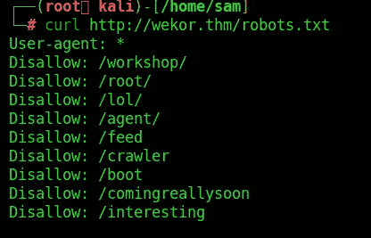

网站上还有一个 robots.txt，在访问 robots.txt 时，我们会看到许多不同的目录路径。遗憾的是，除了一个“/comingrealysoon”之外，所有这些都将我们重定向到 404(没有找到)

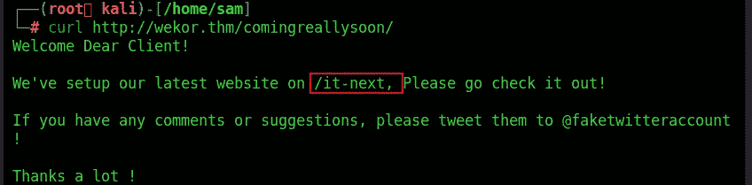

这里我们找到了另一个目录

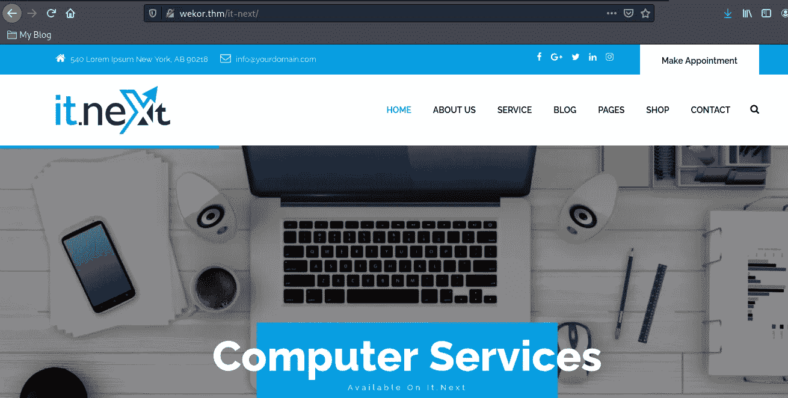

经过一番探索，我们看到在网站的结帐部分有一个表单域，在那里他们要求提供优惠券代码。
测试一个可能的 SQL 注入，试图只放一个单引号，网站反映一个错误信息。

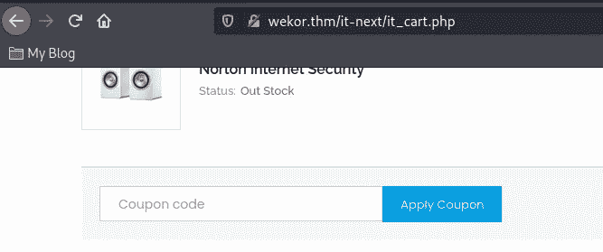

使用“**”或 1 = 1—**”，不带双引号，将获得实际的优惠券代码。

使用 Burpsuite 捕获请求

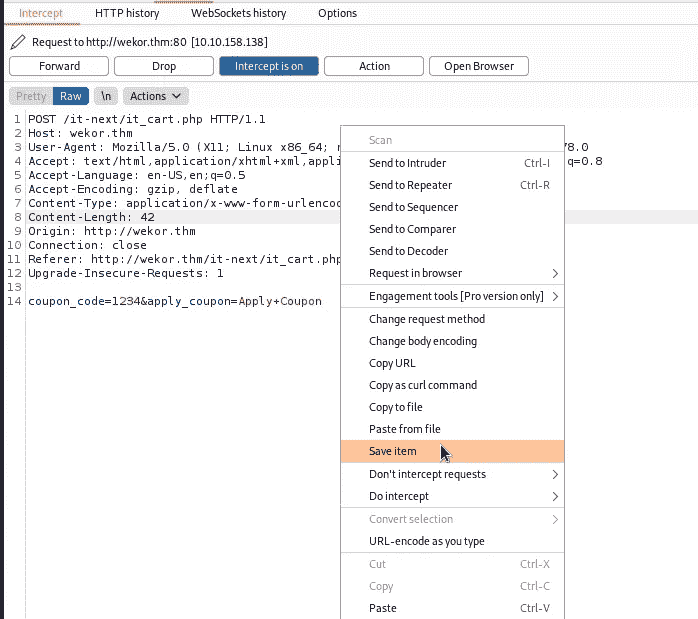

运行 SQLMAP

> *sqlmap -r request.txt*

这证实了我们有 SQL 注入的可能:


检查可用的数据库:

> *sqlmap-r request . txt—DBS*

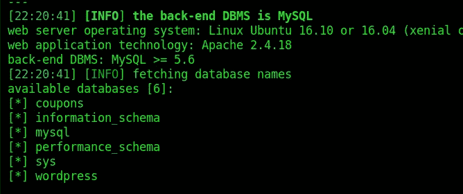

检查 WordPress 数据库中的表格:

> *sqlmap-r request . txt-D WordPress-tables*

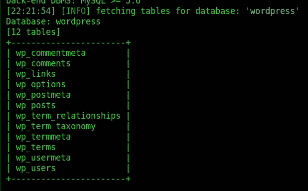

转储表“wp_users”

> *sqlmap-r request . txt—dump-D WordPress-T WP _ users*


因此，我们有网站用户“管理员”的散列:[http://site.wekor.thm/wordpress](http://site.wekor.thm/wordpress)

从[这里](https://hashcat.net/wiki/doku.php?id=example_hashes)我们可以看到 has 的类型是“phpass”:

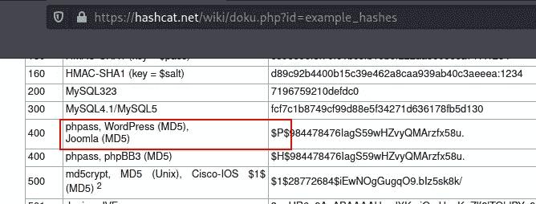

[https://hashcat.net/wiki/doku.php?id=example_hashes](https://hashcat.net/wiki/doku.php?id=example_hashes)

把所有的散列放在一个文本文件中，然后用 JTR 破解:

> *John—word list = rock you . txt—format = phpass hash . txt*

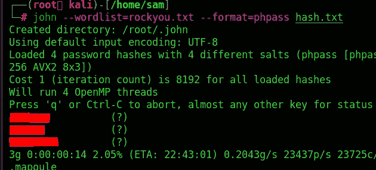

破解了一些哈希，尝试破解用户“wp_yura”的密码，我们可以登录到[http://site.wekor.thm/wordpress/wp-](http://site.wekor.thm/wordpress/wp-)login.php。

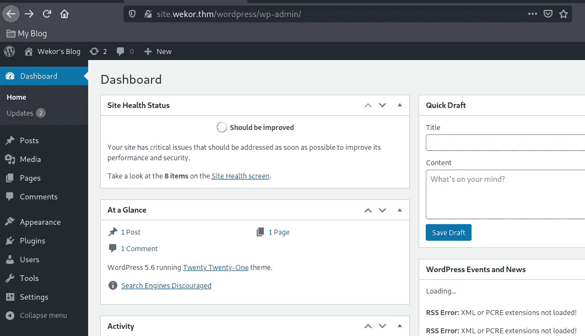

# 反向外壳

现在可以从这里通过外观- >主题编辑器- > 404 模板(404.php)注入一个 [php 反向外壳](https://github.com/pentestmonkey/php-reverse-shell/blob/master/php-reverse-shell.php)得到一个反向外壳:

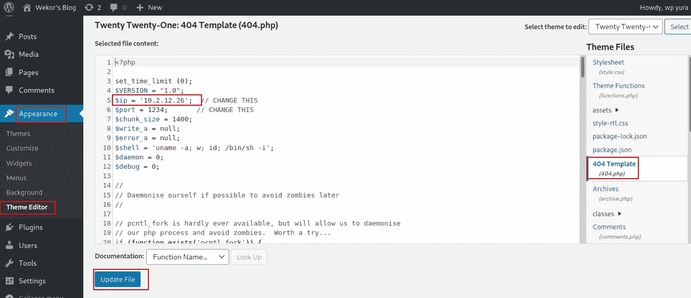

记得输入我们想要获得反向 shell 的机器的 IP 地址和端口号。还要在该计算机上启动 netcat 会话。现在使用以下链接访问 404.php:

> [*http://site . wekor . thm/WordPress/WP-content/themes/twenty twenty one/404 . PHP*](http://site.wekor.thm/wordpress/wp-content/themes/twentytwentyone/404.php)

我们得到了一个相反的外壳:


我们有哪些用户

```
cat /etc/passwd
```

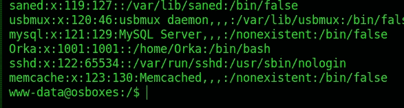

只有 Orka 和 root 拥有 shell 配置。

寻找开放端口，您可以在端口 11211 中找到正在运行的东西。

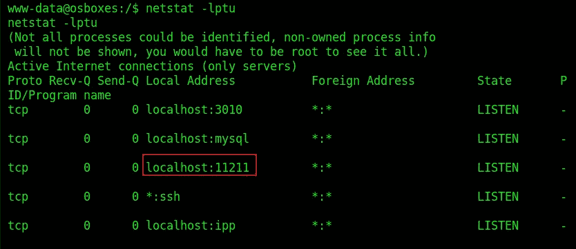

在谷歌搜索后，我们发现这是一个 memcached 服务器。再进行一些搜索，我们得到了转储缓存数据的命令。

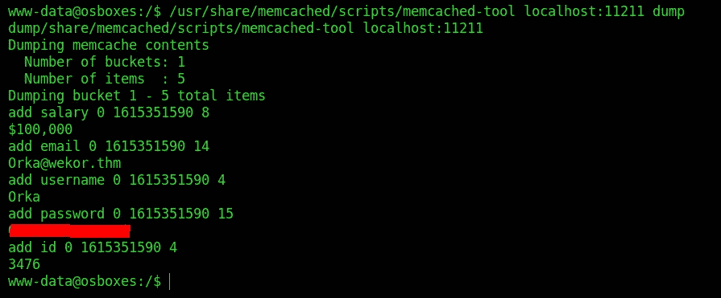

好了，现在我们有 Orka 密码了。

作为奥卡，你能做什么？

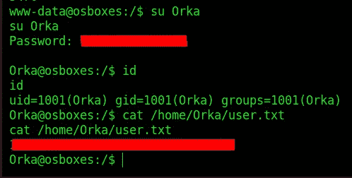

# 权限提升

现在是时候进行权限升级了。首先，在运行任何脚本之前，让我们检查 Orka 是否可以使用`sudo -l`运行任何东西:

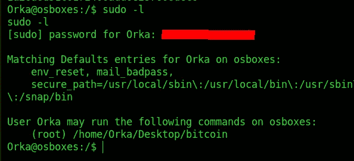

可以执行比特币为 sudo。你也不能改变比特币，但你可以改变桌面文件夹。我们把比特币换成 bash，求根。

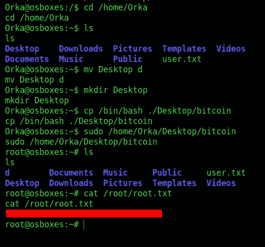

你可以在:
**LinkedIn:-**[https://www.linkedin.com/in/shamsher-khan-651a35162/](https://www.linkedin.com/in/shamsher-khan-651a35162/)
**Twitter:-**[https://twitter.com/shamsherkhannn](https://twitter.com/shamsherkhannn)
**Tryhackme:-**[https://tryhackme.com/p/Shamsher](https://tryhackme.com/p/Shamsher)


如需更多演练，请在出发前继续关注…
…

访问我的其他演练:-

感谢您花时间阅读我的演练。
如果你觉得有用，请点击👏按钮👏(高达 40 倍)并分享
它来帮助其他有类似兴趣的人！+随时欢迎反馈！