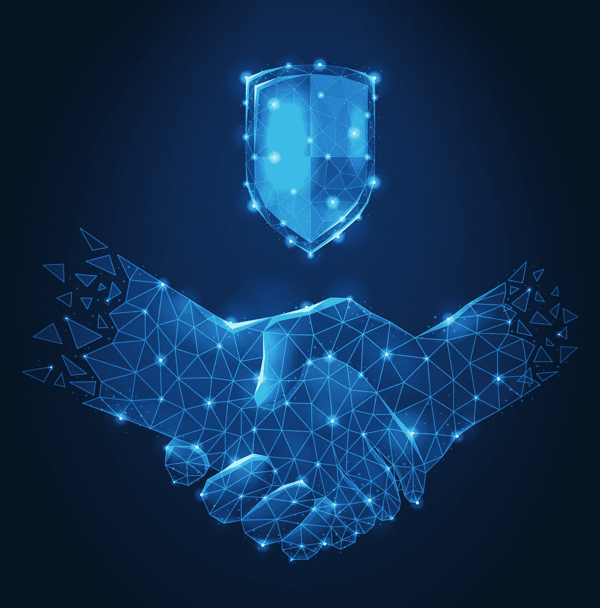

# 我们正在组织我们的第一次虚拟会议暨网络活动

> 原文：<https://infosecwriteups.com/were-organizing-our-first-virtual-conference-cum-networking-event-f377584229e?source=collection_archive---------6----------------------->

## 我们希望你能参与其中！

由宏向量在[freepik.com](http://www.freepik.com)上创建的设计向量

你好可爱的人们

我们开始建立一个信息安全爱好者社区已经有四年了。现在，Infosec Writeups 是 Infosec 相关文章的最大的媒体存储库，拥有 23，000 多名关注者和 800 多名作者。

你可能会在 Discord、LinkedIn 或 Twitter 上看到 Infosec 的文章，偶尔也会阅读我们的文章。不管怎样，你都是我们旅程的一部分。现在，是时候让我们的关系更进一步了。

在与你们中的一些人交流后，我们确信是时候为社区做一些独特的事情了。

> 因此，我们 Infosec Writeups 正在组织我们有史以来第一次虚拟会议暨网络活动。

# 以下是你可以从会议中期待的:

从我们的角度来看，信息安全会议存在差距。现在，几乎所有的都涵盖了技术方面。然而，我们更愿意把注意力集中在社区最重要的部分:*你们，人民。*

为了实现这一点，我们会议上的讨论将涉及信息安全的一些基本方面。这些将有助于你的职业生涯建设和提升你的简历。

我们希望邀请在信息安全领域拥有独特经验的个人来分享他们的故事。如果你有一个独特的故事可以分享，比如你是如何发展你的 YouTube 频道的，你是如何开始自由职业并找到惊人的客户的，你是如何自学昆虫赏金猎人的，或者你的身份如何影响你的旅程，我们很乐意邀请你作为演讲者。请在这里填写您的详细信息**。**

**我们欢迎任何与「资讯安全」有关的话题，以及你在这方面的个人经验。**

# **社交活动是关于什么的？**

**如果您愿意，在活动期间，您将被随机分配给另一位与会者。这将是一个 5 分钟的一对一通话，你可以用它来快速交换电子邮件或 LinkedIn 个人资料，或者延长通话时间进行更长的对话。**

**这将是一个极好的机会，可以结识来自世界各地有着相似目标的信息安全爱好者，你们可以为 CTFs 进行合作，或者只是交流知识。**

**毕竟，你的净资产等于你的人际网络，这是一个扩展你的人际网络的绝佳机会。**

# **定价**

**与其他昂贵的安全会议不同，我们希望使会议暨网络活动尽可能容易参加。我们象征性地收取 5 美元的费用。这只是为了确保您认真对待您的注册。**

**如果你付不起这个价格，你可以给我们发电子邮件，我们很乐意给你一张免费的入场券。**

# **我们正在寻找赞助商！**

**如果您愿意赞助我们的活动，请在此 处填写您的详细信息 [**。**](https://forms.gle/hwPSEZTPqAM4X7KW7)**

**由于几位网络安全专业人士和有影响力的人士将参加此次活动，这是一个建立更多品牌知名度和吸引潜在客户或员工的绝佳机会。**

**这项活动将在本月底或二月初举行。一旦演讲人确定下来，我们会尽快通过电子邮件通知你具体的细节。**

**会议暨网络活动将是一个爆炸的信息安全爱好者。如果你正在寻找一个副业，一次晋升，或者只是想建立强大的联系，这就是你需要的地方。**

**期待您的积极参与。如果您对我们有任何建议，请随时回复此邮件或留下评论，我们会尽快回复您。**

**满怀爱心，
编辑团队
Infosec 报道**