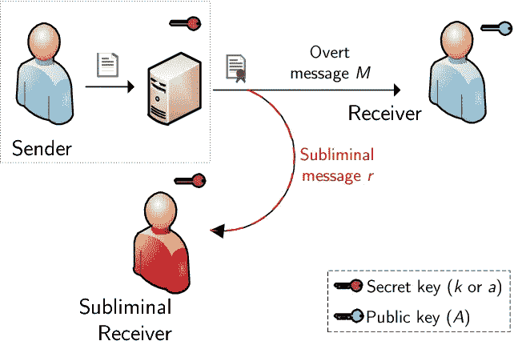

# 什么导致了精神签名漏洞(CVE-2022–21449)？

> 原文：<https://infosecwriteups.com/what-caused-psychic-signatures-vulnerability-cve-2022-21449-60542811eac2?source=collection_archive---------4----------------------->


马库斯·斯皮斯克在 [Unsplash](https://unsplash.com?utm_source=medium&utm_medium=referral) 上的照片

# **简介**

在我们开始这篇博文之前，我要问你一个问题。**0 等于 0** ？你可能会因为我问了这个简单的问题而批评我，但这是这个弱点的基础。

**CVE-2022–21449，也被许多人称为精神签名**，是 Java 实现 ECDSA(弹性曲线数字签名算法)中的一个漏洞，可导致使用 ECDSA 的 TLS 和 JWT 签名导致的通信完整性失效。



[来源](https://www.semanticscholar.org/paper/A-Subliminal-Channel-in-EdDSA%3A-Information-Leakage-Hartl-Annessi/aebec72025beda029ae9b370d33f0eac0606965c/figure/0)

较难的公钥密码加密算法之一是椭圆曲线数字签名算法(ECDSA)，有时也称为 ECDSA。椭圆曲线加密的使用允许生成比由数字签名技术创建的典型密钥更小的密钥。它是一种基于有限域上椭圆曲线的代数结构的公钥密码学，是椭圆曲线密码分析的一个子集。采用椭圆曲线的密码学主要用于生成伪随机数、数字签名和其他应用。它是一种身份验证机制，通过使用公钥对和数字证书作为签名过程的一部分来验证信息接收方或发送方的身份。

**该漏洞使得攻击者能够拦截浏览器和 web 服务器之间的通信。**

甲骨文给这个 CVE 的 CVSS 评分是 7.5 分，而 Java 版本 15、16、17 和 18 容易受到这个 CVE 的攻击。如果您的应用程序在生产中使用上述任何 Java 版本，建议您应用 2022 年 4 月的关键补丁来缓解此漏洞。

# **分析**

数字签名广泛应用于识别和验证目的。数字签名使用非对称加密，其中用于加密会话的密钥不同于用于解密会话的密钥。这是可能的，因为密钥在数学上是相关的，并且只有这些密钥可以一起用于加密和解密。使用任何其他键都不起作用。

数字签名的实现不同于非对称加密和解密。

在数字签名中，私钥用于查找(要发送的)消息的散列，接收方将使用发送方的公钥来验证消息确实来自声称的发送方。

**Java 使用的数字签名算法是 ECDSA** 。使用 ECDSA 比 RSA 有好处(这也很常见)。它们(就像其他非对称加密方案一样)都依赖于素数的使用。*质数应该很大(大约 256 或 512 位)以提供良好的安全性。在尺寸受到限制的系统中，ECDSA 是一个很好的选择。它可以提供与 RSA 相同的安全性，但与 RSA 相反，RSA 需要很长的数字，而它使用的数字很少。*

在 ECDSA 中，签名是由发送者生成的对(r，s ),然后在对这些和(消息的)散列进行一些复杂的计算之后，由接收者检查和验证。

在对我们如何尽可能简单地解释这一点进行了一些研究之后，这是用于验证签名匹配的方程的过于简化的版本。关于 ECDSA 如何工作的详细信息，你可以参考维基百科文章[这里](https://en.wikipedia.org/wiki/Elliptic_Curve_Digital_Signature_Algorithm#Signature_verification_algorithm)。

```
if (**r == [complex equation] * [value derived from s]**)Then validOtherwise, invalid
```

从安全角度来看，重要的是实现一个逻辑检查，即 r 和 s 都不应该为 0。这是因为上面的等式会变成如下所示

```
**0 == 0 * [complex equation]** which is **0 == 0**
```

**正确的实现应该是检查 r，s > = 1。**

但是 ECDSA 的 Java 实现不检查这一点。所以，把两个 r，s 都作为 0 发送是可能的。正如您从上面可以得出的结论，该等式将始终产生一个真的无关紧要的私钥，用于对消息进行签名。这造成了很大的安全风险，因为现在消息可以由声称是无辜个人的恶意第三方签署。由于库中的 bug，签名将总是导致 True。

在[这个](https://www.youtube.com/watch?v=S77ES52AGVg)视频里有深入的讲解，有兴趣可以参考一下。

# **缓解**

针对此漏洞的缓解措施是应用 2022 年 4 月的关键补丁，其链接可在此处找到[。](https://www.oracle.com/security-alerts/cpuapr2022.html)