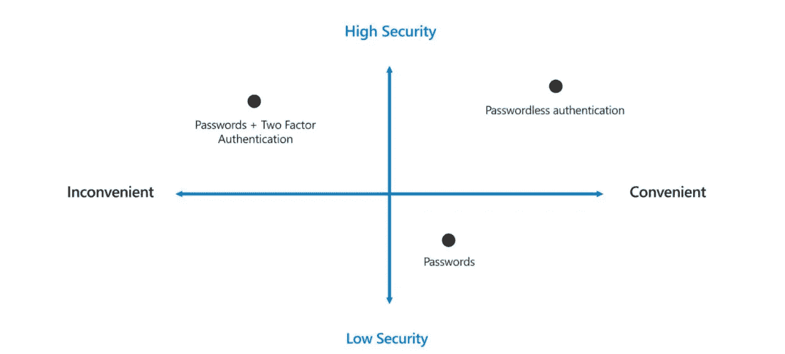
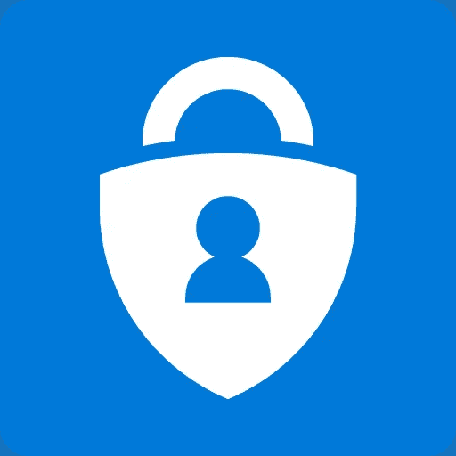

# 你对 Azure 的安全性了解多少？☁️azure 安全实践公司

> 原文：<https://infosecwriteups.com/what-do-you-know-of-security-in-azure-azure-security-practices-%EF%B8%8F-cc07d7593ac3?source=collection_archive---------3----------------------->

让我们来看看这个问题，当我们谈论 azure 时，我们真正想要保护的是什么🤗研究这些问题的最好方法是从攻击者的角度来看问题。首先，了解他们能从暗网上买到什么是非常重要的。

我们可以雇一个攻击者来帮你做所有的工作。

我们可以买一套勒索软件。可能这些是给刚开始做罪犯/攻击者的新人的。

受影响的智能手机仍然可以买到，个人电脑相对于其他电脑非常便宜，但手持设备平均价格昂贵。

鱼叉式网络钓鱼可以被雇佣来接管某人的账户，但代价相当昂贵。

被盗的密码，包括用户名和密码，在黑暗的网络中很容易找到。用户使用弱密码，如生日，身份证号码，以导致攻击者窃取了容易和出售在黑暗的网站。🥺🥺

其中一个主要问题是拒绝服务，这可以让一个网站瘫痪。

那么，azure 有哪些安全能力来保护其客户免受上述威胁。

# **本地威胁检测，包括基于本地云的 SIEM(Azure Sentinel)。**

基于 EDR 的 XDR 检测响应，端点检测响应

这是一种本机威胁检测，具有高质量的警报、响应和调查。

Azure 有助于保护组织中所有可能遭受攻击的资产；Azure，Azure AD，Windows，Linux，Android，IOS，也针对运营技术。

从所有客户、计算机、软件和网络收集基于云的数据，包括现场数据和跨各种云的数据。

快速响应涉及日常任务的集成编排和自动化的事件

利用微软分析和无与伦比的威胁情报，检测先前发现的风险并最大限度地减少误报。

# **无密码和多因素认证(MFA)**

这是一个我们应该更加担心的领域。为什么我们要去掉密码？用户讨厌它们，它们很难被召回，它们在任何地方都被重复使用。人们不仅不喜欢他们。IT 经理经常因为确切的原因不喜欢他们。让它们复位要花很多钱。谁爱上了这些密码？黑客。去年，超过 75%的数据泄露包含弱密码、默认密码或受损密码。

图片来自[https://www . Microsoft . com/en-us/security/business/identity-access-management/password-authentic ation](https://www.microsoft.com/en-us/security/business/identity-access-management/passwordless-authentication)

因此，多因素身份认证(MFA)🔐是减少这些密码影响的完美方法。它不仅仅是密码，易于使用的挑战，但容易受到中间人和网络钓鱼攻击。

因此，微软推出了三种不同的方法来帮助用户保护他们的身份，并通过标准的无密码身份验证为用户提供更多选择。

> ***Windows 你好***

✔️It's 微软的首要无密码体验。通过这个终端，用户可以使用一个简单的 pin 或一个生物特征手势(面部识别或指纹扫描)立即登录到计算机。✔

> **微软认证器 **

图片由 Google Play 提供

✔️This 是一种体验，已经向 MFA 推送通知注册了验证器的用户可以在应用程序中简单地升级他们的帐户，并获得完整的无密码体验。

> ***FIDO2 安全钥匙*** 🔑

图片由澳大利亚 PCMag】提供

基于✔️These 标准的无密码认证方法，使用两种通用协议；

✨WebAuthN

✨CTAP

这些开放标准允许合作伙伴提供创新产品，满足广泛的用户需求。这些安全密钥通常采用 USB 或 NFC 格式

无通行证之旅= >从小处着手😊

*   启用 Azure Active Directory
*   允许所有用户使用 Azure 多因素身份验证和自助密码重置。
*   识别和更新应用程序以允许 AAD 认证
*   想想你的硬件和设备。
*   从试点开始

# **原生防火墙和网络安全** [🐱‍💻](https://emojipedia.org/hacker-cat/)

用户可以通过使用互联网反向防火墙作为服务来保护其网络的边缘。定制起来非常快捷方便，大大降低了复杂性，并帮助您更快地启动和运行该保护。

图片来自 [DroneFest](https://www.google.com/url?sa=i&url=https%3A%2F%2Fdronefest.cc%2Fproduct%2Fazure-firewall-icon&psig=AOvVaw222mOokxUiCYnLhJ9iQU4L&ust=1614708647235000&source=images&cd=vfe&ved=0CAMQjB1qFwoTCKir-r7bj-8CFQAAAAAdAAAAABAD)

组织有一系列的安全要求。在某些情况下，同一家公司可以针对不同的设置采用不同的保护标准。

许多 Azure 客户认为 Azure 防火墙功能集是一个很好的匹配，并作为基于云的本机托管服务提供了几个关键优势:

## azure 防火墙将提供什么样的高级功能？👇

*   网络地址转换(SNAT+DNAT)
*   FQDN 滤波(无 SSL 终端)
*   内置高可用性，具有无限制的云可扩展性(随着流量增长自动扩展)
*   完整日志记录，包括 SIEM 集成
*   集成监控和管理，零维护-云服务模式。

(摘自 Azure 防火墙与网络虚拟设备—功能比较)

## 其他 Azure 安全实践是什么？

*   加密静态和动态数据
*   限制对数据库的访问
*   限制对虚拟机的访问
*   保护您的应用程序机密
*   将单独的 azure 订阅用于生产
*   实施 web 应用程序防火墙
*   使用 azure 安全中心

就这些了，希望你们喜欢，也希望你们能从我的博客中有所收获。❤️

谢谢大家所有的掌声和回应！

# 👉👉黑客快乐！😷注意安全！👈👈