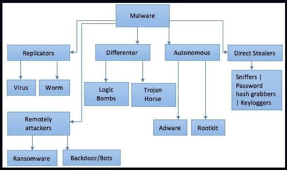

# 什么是恶意软件？

> 原文：<https://infosecwriteups.com/what-is-a-malware-f600c51d209a?source=collection_archive---------3----------------------->

我们将讨论什么是恶意软件和恶意软件的类型，一些著名的恶意软件及其影响和恶意软件分析师的未来范围。

> **什么是恶意软件？**

恶意软件是本质上是恶意的可执行文件或二进制文件。恶意软件一词指的是专门设计用来扰乱、破坏或未经授权访问计算机系统的软件。这表示恶意软件是“恶意软件”的缩写

一些常见的恶意软件包括:广告软件，无文件恶意软件病毒，蠕虫，木马，勒索软件，间谍软件，老鼠，滴管…..等等

*   一个**病毒**在没有人类互动的情况下无法复制，无论是点击链接、打开附件、启动应用程序还是下载文件。
*   一个**蠕虫**不需要人类互动，可以自我复制，深入系统，并在设备之间移动。
*   **恶意软件**是一个通用术语，囊括了所有威胁——病毒、蠕虫、僵尸网络、勒索软件等。任何与软件相关的恶意软件。

**第一个恶意软件**

世界上第一个病毒概念证明，被称为“爬虫”虽然被各种实体认为是世界上第一个计算机病毒，但爬虫实际上表现出了蠕虫的行为。它基于德国数学家约翰·冯·诺依曼在 20 世纪 40 年代首次提出的概念，由工程师鲍勃·托马斯在 BBN(后来被雷神公司收购的一家美国研发公司)建造。它通过阿帕网计算机传播开来，并发布了以下消息:

"我是爬行者，有本事你来抓我！"**恶意软件的分类及其类型:**

下图描述了恶意软件的分类和类型

# 不管是侥幸还是无情，这些恶意软件攻击都在互联网上留下了痕迹。

# 其中一些如下:

# Emotet，特洛伊(2018):恶意软件之王

2021 年，**执法和司法当局瓦解了**被吹捧为世界上最危险的恶意软件 Emotet。这是一种计算机恶意软件，于 2014 年首次检测到，主要针对银行和医疗机构。Emotet 在 2018 年感染了德国的 Fürstenfeldbruck 医院，迫使他们关闭了 450 台电脑后一举成名。同年，美国国土安全部将其列为最具破坏性的恶意软件之一。

它通过 Outlook 收集进行传播，特洛伊木马从受害者的计算机中读取电子邮件，然后**向受害者的联系人发送包含 Word 文档**的钓鱼电子邮件，使其看起来好像内容来自可信来源。

# WannaCry，勒索软件(2017)

**WannaCry 勒索病毒攻击**是 WannaCry 勒索病毒 cryptoworm 在 2017 年 5 月发起的一次全球网络攻击，该攻击通过加密数据并要求以比特币加密货币支付赎金，以运行微软 Windows 操作系统的计算机为目标。它通过 EternalBlue 传播，eternal blue 是美国国家安全局(NSA)为 Windows 系统开发的一种漏洞。永恒之蓝在袭击前一个月被一个叫影子经纪人的组织窃取并泄露。据估计，这次攻击影响了 150 个国家的 30 多万台电脑，**损失总额从几亿到几十亿美元不等**。

> *“我爱你”:一种计算机病毒造成了 100 亿美元的损失，并暴露了 20 年来一直存在的漏洞。*

ILOVEYOU 被认为是有史以来最致命的计算机病毒之一。这种病毒通过电子邮件感染电脑，并以向收件人表白的形式出现。一旦人们点击附件，它会立即将自己发送给用户电子邮件列表中的每个人，覆盖文件，并使受感染的计算机完全无法启动。

这对大公司和政府来说是灾难性的。在短短 10 天内，它在大约 5000 万台计算机中传播，导致中央情报局、五角大楼和许多大公司关闭了他们的电子邮件系统。

**萨瑟**

Sasser 在 2004 年制造了很多问题，造成了 5 亿美元的损失。这种快速传播的电脑蠕虫对全球电脑用户造成了更大的破坏，影响了几家企业、银行和政府机构，包括英国海岸警卫队。

造成如此大破坏的病毒制造者是一名来自德国的青少年。他的一个“朋友”出卖了这位年轻的黑客，微软悬赏 25 万美元要他的人头，他很快就被逮捕了。

**尼姆达**

这种病毒不仅是最昂贵的，也是互联网上传播最广的病毒之一。2001 年，它造成了 6 . 35 亿美元的损失。Windows 操作系统的用户报告说机器和电脑反应迟钝，无缘无故地退出或重启。

**SQL SLAMMER**

SQL Slammer 是 2003 年的一种蠕虫病毒，感染了 20 万台计算机，造成了 7 . 5 亿美元的损失。这是列表中最复杂的蠕虫之一。

**CIH**

1998 年，一名台湾学生创造了计算机病毒切尔诺贝利(也称为 CIH)。大约 50 万台个人电脑受到影响，损失估计达 10 亿美元。CIH 病毒被认为是最危险的病毒之一，因为一旦被激活，它就可能破坏 BIOS 芯片数据并摧毁硬盘上的所有信息。然而，该病毒的创造者从未被起诉，现在他在技嘉公司工作。

**SIRCAM**

你收到过主题为“我把这个文件发给你是为了征求你的意见”的电子邮件吗？？恭喜你，你知道 Sircam！

SirCam 计算机蠕虫在 2001 年造成了超过 10 亿美元的损失。除了传播之外，该病毒还可以删除受害者的硬盘或填满硬盘上剩余的可用空间，使其无法保存文件或打印。

梅丽莎

Melissa 被归类为宏病毒，并被视为一种电子邮件蠕虫，在其发布的几天内劫持了大约 100 万台电脑。它通过向受感染用户的联系人发送大量邮件来复制自己。它通过主题为“重要信息来自”的电子邮件和带有色情网站的文档进行传输，并使用 outlook 进行自我复制以加快处理速度。

**红色代码**

红色代码蠕虫于 2001 年曝光，入侵了大约 975，000 台主机。

它通过高喊“被中国人黑了！”并完全使用目标计算机的内存来执行。不幸的是，它没有在硬件中留下任何痕迹(就像硬盘上的文件一样)，这使得取证分析变得复杂。

损失高达 24 亿美元。

**集结号**

Conficker，或 Downup 或 Downadup，是一种来历不明的 Windows 蠕虫，它在 2008 年首次露出了丑陋的面孔。这种恶意软件证明了 Windows 中过多的安全漏洞会变得多么危险，因为它利用这些漏洞创建了一个僵尸网络。

900 万个系统成为了所有可以想象的国家的玉米饼主机，包括私人企业，政府，个人。

很少有蠕虫能够感染如此多的计算机并造成如此大的损失——90 亿美元。

**SOBIG**

Sobig 在 2003 年作为另一种蠕虫出现，就像 Mydoom 一样。然而，它作为最危险的网络病毒的成功仅次于 Mydoom，因为它在全球范围内造成了约 300 亿美元的损失。它传到了欧洲、美国和亚洲。作者发布了几个 Sobig 版本，很快就被 Sobig 所知。a 到 Sobig.F 最后一个最差。

这种恶意软件显示自己是附在电子邮件中的合法软件。

它扰乱了全球许多企业的活动，加拿大航空公司的票务是当时最著名的问题。

**MYDOOM**

Mydoom 爆发是有史以来最严重的病毒攻击。据估计，损失高达 380 亿美元。它也被称为“诺瓦克”这是一种蠕虫病毒，它在互联网群发电子邮件中找到了自己的方式。由于这种蠕虫非常活跃，它负责了全球约四分之一的电子邮件流量。

当 Novarg 进入系统时，它会扫描新的地址。然后它把自己的副本发送到这些地址。它还将受感染的计算机链接到一个僵尸网络，该网络的目的是实施 DDoS(分布式拒绝服务)攻击。这些攻击通过用垃圾流量淹没网站或服务器来关闭网站或服务器。

《我的末日》的作者是个通缉犯。25 万美元的奖励可用于他的

**恶意软件分析师的未来范围**

全球恶意软件分析市场规模预计将从 2019 年的 30 亿美元增长到 2024 年的 117 亿美元，2019 年至 2024 年的 CAGR 为 31.0%。目前，由于全球市场上恶意软件攻击的增加，对恶意软件分析师的需求也在增加

[https://www . benzinga . com/press releases/21/01/19388326/malware-analysis-market-future-scope-opportunities-with-strategic-growth-and-top-players](https://www.benzinga.com/pressreleases/21/01/19388326/malware-analysis-market-future-scope-opportunities-with-strategic-growth-and-top-players)