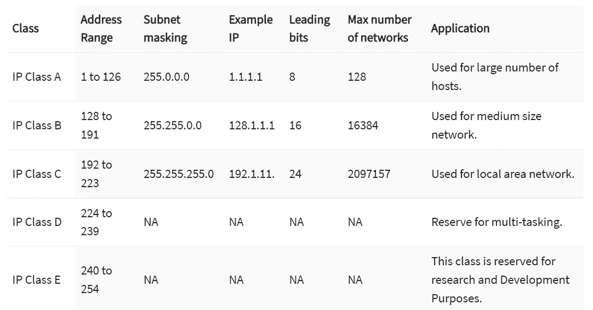
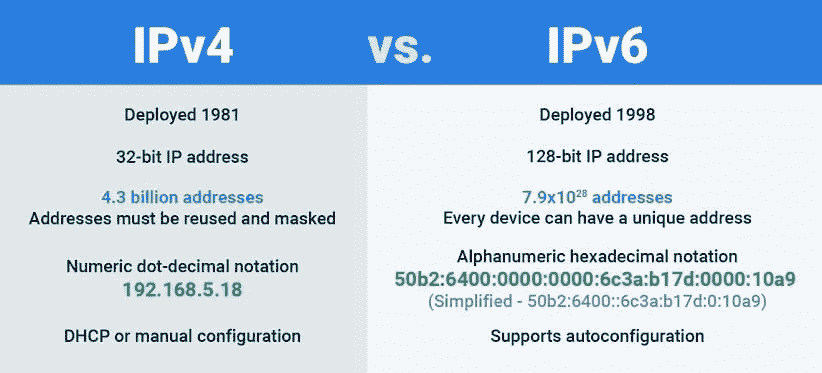

# 什么是 IP 地址？

> 原文：<https://infosecwriteups.com/what-is-an-ip-address-62f99c6afd4d?source=collection_archive---------2----------------------->

***Hii 朋友们在本文中，我们将讨论什么是 IP 地址，不同类别的 IP 地址以及 IPv4 和 IPv6***

**什么是 IP 地址？**

IP 地址是一长串数字，分配给连接到使用互联网协议作为通信媒介的网络的每台设备

IP(互联网协议)地址是在局域网/互联网上识别和定位特定机器的逻辑地址，也可以定义为**在互联网或本地网络上识别设备的唯一地址**

*   静态 IP 地址:这代表不会因为网络(如 web 服务器)的变化而改变的 IP 地址
*   动态 IP 地址:这表示 IP 地址随着网络的变化而变化，比如我们的移动设备、笔记本电脑和个人电脑。
*   公共 IP 地址意味着该 IP 地址可以被世界上任何一台计算机访问。
*   私有 IP 地址意味着该 IP 地址只能由同一网络上的用户使用。

**IP 地址类别**:

1.  a 类(单播)
2.  b 类(单播)
3.  c 类(单播)
4.  类别 d(多播)
5.  类别(保留)

下图显示了所有 IP 类、它们的地址范围和子网:

**IPv4 vs IPv6**

> IP 地址有两个版本: [IPv4 和 IPv6](https://www.networkworld.com/article/3254575/what-is-ipv6-and-why-aren-t-we-there-yet.html) ，它们有不同的格式，它们之间的主要区别是可以创建比 IPv4 地址(2 次方 128)多得多的唯一 IPv6 地址。

由于越来越多的物联网设备，IPv4 地址被淘汰，IPv6 得以实施

*   如果你想知道你的 IP 地址，请访问:[https://whatismyipaddress.com/](https://whatismyipaddress.com/)这里显示了你的 IPv4 和 IPv6 以及你的 ISP，你还可以得到地址。