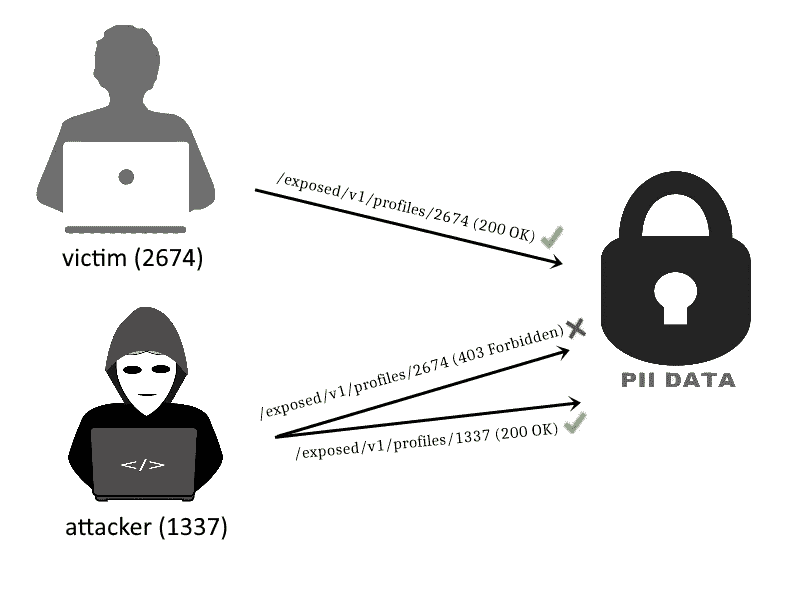
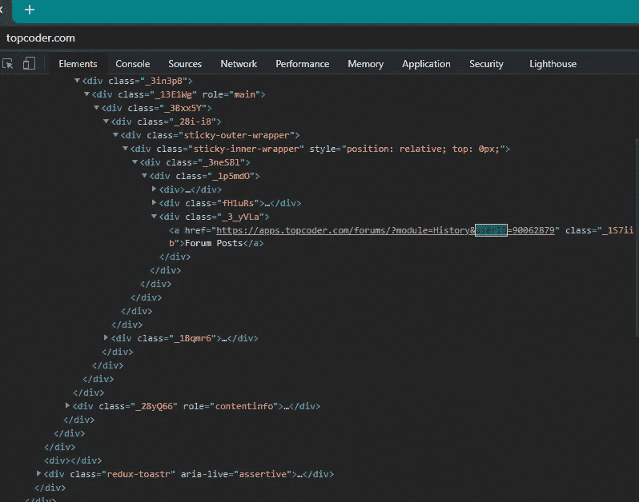
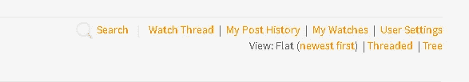
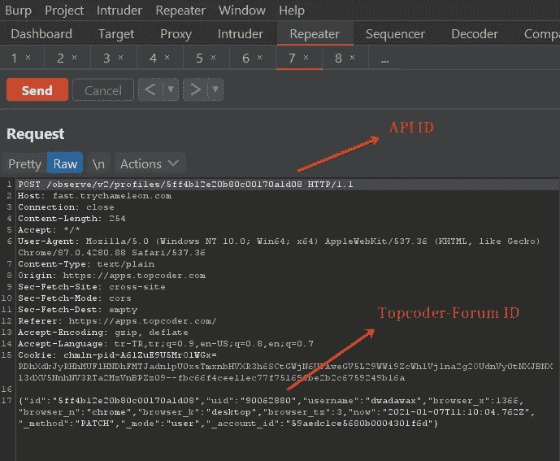
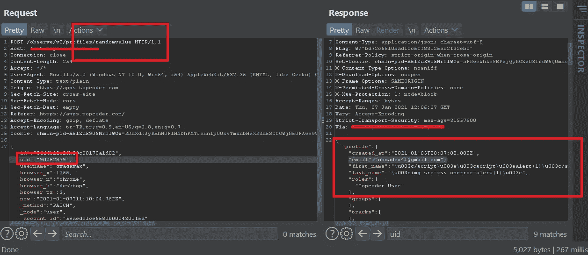

# 博拉是什么？来自 Topcoder 的 3 位数奖金($$$)

> 原文：<https://infosecwriteups.com/what-is-bola-3-digit-bounty-from-topcoder-a25e7fae0d64?source=collection_archive---------1----------------------->

大家好。

这篇写的将是关于**破碎对象级授权(BOLA)** ，也就是 API 安全 [**(OWASP)**](https://owasp.org/www-project-api-security/) 的 **#1** 话题。我还将考虑一个我发现此漏洞的案例。好了，事不宜迟，让我们开始吧。

> 什么是**碎物级授权(BOLA)？**

(防博拉)

**中断对象级授权(BOLA)** 依赖于用户在应用程序上发送的敏感请求被其他资源访问的能力。这通常是由于开发人员缺少/不正确的访问控制造成的。技术上基本可以比作 IDOR。当这种安全配置没有正确完成时，它具有广泛的攻击面(从信息泄露到帐户接管)。

从图像中可以看出，如果我们尝试制作一个典型的攻击场景，它将是这样的:

*   API 将为受害者和攻击者提供特定的身份，并允许他们访问敏感数据。(https://redacted.com/exposed/v1/profiles/self-id)
*   攻击者将注意到 API 中的弱点，并能够使用受害者的用户 id 访问受害者的 PII 数据。(https://redacted.com/exposed/v1/profiles/target-id)

然而，这些特定于用户的变量并不总是需要保存在 GET 请求中。一些 API 也可能在 POST 请求中携带特定于用户的变量。在某些情况下，漏洞 API 可基于多个控制点来配置。

> **top coder 中的 BOLA 案例**

根据这种情况，我给大家讲一下我在 Topcoder 中发现的漏洞。该漏洞与一个 API 上的多个检查点有关。(这份报告在 hackerone 上公开:[https://hackerone.com/reports/1073420](https://hackerone.com/reports/1073420))

当我开始在 Topcoder 上寻找漏洞时，我首先在 topcoder.com 上创建了一个帐户，当我通过 Burp 检查所有 HTTP 请求时，我注意到我的论坛用户 id 信息在会员开放期间，我也可以在会员页面的源代码中访问该值。此外，当我输入任何其他用户的个人资料时，我可以看到论坛用户 id。

我在主网站上找不到太多，开始寻找子域名(我发送了一些报告，但重复:/)我得到了子域名列表，并决定分析 Topcoder 论坛。(apps.topcoder.com/forums)。它直接在主网站上使用我的账户。所以，我在主网站上的 PII 信息对我的论坛账户也是有效的。

浏览了一会论坛，进了一个帖子，注意到了**“看帖子”**部分。我打开拦截器，开始查看请求。
来自不同主机的 API 正在发送没有授权头的 POST 请求。在这种情况下，我决定仔细查看 API，POST 数据中的一些信息引起了我的注意。它在请求的头部接收 API 定义的 id 信息(我猜是),在数据部分接收我的论坛用户 ID。在回复部分，我可以看到我的电子邮件，姓名和帐户 id，这些都没有反映在我的 Topcoder 个人资料中。

我立即创建了另一个用户，并在数据部分更改了我的 Topcoder ID。然而，什么都没有改变。API 接受多个值，并可能使用所有这些值来控制用户。
请求标题中反映的 ID 引起了我的注意，我用另一个字母替换了最后一位数字，同时用受害者的 Topcoder id 替换了我的 Topcoder id，并发送了请求。

**答对了！**我能够访问目标的 PII 信息。API 试图使用多个检查点对目标用户进行身份验证。但是，这些信息在 Topcoder.com 上公开显示，API 给出的 ID 在更改为随机值时反映了敏感数据。

Topcoder 确认了这个漏洞，奖励了我$$$。

资源:
[https://blog . shift left . io/API-security-101-broken-object-level-authorization-Fe 8720 c 779 EC](https://blog.shiftleft.io/api-security-101-broken-object-level-authorization-fe8720c779ec)

 [## 什么是中断的对象级授权(BOLA ),它会如何影响您？

### 根据 OWASP(开放 Web 应用安全项目)2019 API 安全项目，破碎对象级别…

heimdalsecurity.com](https://heimdalsecurity.com/blog/what-is-broken-object-level-authorization-bola/) 

[https://github . com/OWASP/API-Security/blob/master/2019/en/src/0xa 1-broken-object-level-authorization . MD](https://github.com/OWASP/API-Security/blob/master/2019/en/src/0xa1-broken-object-level-authorization.md)

谢谢！！

推特:[https://twitter.com/canmustdie](https://twitter.com/canmustdie)