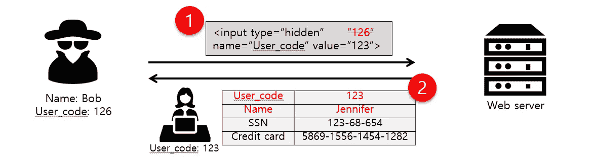

# 什么是参数篡改

> 原文：<https://infosecwriteups.com/what-is-parameter-tampering-5b1beb12c5ba?source=collection_archive---------0----------------------->

## 参数篡改:特殊字符

# 摘要

参数操作包括篡改 URL 参数以检索用户无法获得的信息。利用漏洞的风险取决于正在修改的参数，以及将其提交给 web 应用程序服务器的方法。参数操纵攻击可用于实现多种目标，包括泄露 web 根目录以上的文件、从数据库中提取信息以及执行任意操作系统级命令。建议包括采用安全编程技术，以确保应用程序只接受预期的数据。

# 说明

这种特定漏洞的影响取决于被操纵的参数，以及它是如何提交给应用服务器的。至少，攻击者可能能够获得有用的信息来策划更进一步的、更具破坏性的攻击。但是，利用此漏洞完全控制系统并非不可能，甚至是不可能。可以修改的值包括:

**查询字符串:** Web 应用程序通常使用查询字符串作为从客户端和服务器传递数据的简单方法。查询字符串是向超链接添加数据调用的一种方式，然后在链接的页面显示时检索该页面上的信息。通过操纵查询字符串，攻击者可以很容易地从数据库中窃取信息，了解 web 应用程序体系结构的详细信息，或者可能在 web 服务器上执行命令。

**Post data:** 因为操作查询字符串就像在浏览器的地址栏中键入文本一样简单，所以许多 web 应用程序依赖于 Post 方法和表单的使用，而不是 GET 来在页面之间传递数据。由于浏览器通常不显示 POST 数据，一些程序员误以为很难或不可能修改数据，而事实恰恰相反。

**头:**HTTP 请求和响应都使用头来传递关于 HTTP 消息的信息。开发人员可能不会将 HTTP 头视为输入区域，即使许多 web 应用程序会将诸如“referrer”或“user-agent”之类的头记录到数据库中以进行流量统计。

许多网络应用程序使用 Cookies 在客户端机器上保存信息(例如，用户 ID 和时间戳)。通过更改这些值或毒害 cookie，恶意用户可以访问其他用户的帐户和信息。此外，攻击者还可以窃取用户的 cookie，绕过输入 ID 和密码或其他形式的身份验证，直接访问用户的帐户。

# 建议

**用于开发:**

这个问题是由于对应用程序接受的字符进行不正确的验证而引起的。任何时候将参数传递到动态生成的网页中，都必须假设数据可能格式不正确。应用程序应该包含足够的逻辑来处理参数没有传入或传入不正确的情况。记住数据是如何提交的，作为 GET 或 POST 的结果。在开发安全稳定的代码时，应该将 Cookies 视为参数。以下建议将有助于确保您交付安全的 web 应用程序。

*   **严格定义数据类型:**
    严格定义应用程序将接受的数据类型(例如，字符串、字母数字字符等)。验证输入中的不正确字符。采用善用而非恶用的哲学。定义允许的字符集。例如，如果一个字段要接收一个数字，只让该字段接受数字。定义应用程序可以接受的最大和最小数据长度。
*   **参数没有被传递:**
    如果一个参数应该被传递给一个动态网页而被忽略，应用程序应该向用户提供一个可接受的错误消息。此外，在应用程序中使用参数之前，不要假设正在传递参数。
*   **格式不正确的参数:**
    永远不要认为参数的格式是有效的。如果将参数传递给 SQL 数据库，情况尤其如此。任何没有首先检查格式是否正确就直接传递给数据库的字符串都可能是一个重大的安全风险。此外，不能因为参数通常由组合框或隐藏字段提供，就认为格式是正确的。如果黑客试图闯入您的网站，他会首先尝试更改这些参数。
*   **允许通过文件名传递文件名:**
    如果一个参数正被用于确定以任何方式处理哪个文件，在文件名被验证为有效之前，绝不允许使用该文件名。具体来说，您应该测试是否存在指示目录遍历的字符，例如…/、c:\和/。
*   **将关键数据存储在隐藏参数中:**
    许多程序员会犯将关键数据存储在隐藏参数或 cookie 中的错误。他们认为既然用户看不到它，它是存储价格、订单号等数据的好地方。隐藏参数和 cookie 都可以被操作并返回给服务器，所以永远不要假设客户端返回了您通过隐藏参数或 cookie 设置的内容。

**对于安全操作:**

由参数操作引起的问题最终需要在应用程序代码中纠正。

**对于质量保证:**

出于安全原因，不仅要以普通用户的身份测试 web 应用程序，还要以恶意用户的身份进行测试，这一点非常重要。简单的手动测试可以包括顺序更改数字参数值，修改 cookie 值，或者在数字参数中包含字母，以观察应用程序如何响应。该评估将彻底测试参数对操纵的敏感性。

# 参考

**用于开发:**

这个问题是由于对应用程序接受的字符进行不正确的验证而引起的。任何时候将参数传递到动态生成的网页中，都必须假设数据可能格式不正确。应用程序应该包含足够的逻辑来处理参数没有传入或传入不正确的情况。记住数据是如何提交的，作为 GET 或 POST 的结果。在开发安全稳定的代码时，应该将 Cookies 视为参数。以下建议将有助于确保您交付安全的 web 应用程序。

*   **严格定义数据类型:**
    严格定义应用程序将接受的数据类型(例如，字符串、字母数字字符等)。验证输入中的不正确字符。采用善用而非恶用的哲学。定义允许的字符集。例如，如果一个字段要接收一个数字，只让该字段接受数字。定义应用程序可以接受的最大和最小数据长度。
*   **参数没有被传递:**
    如果一个参数应该被传递给一个动态网页而被忽略，应用程序应该向用户提供一个可接受的错误消息。此外，在应用程序中使用参数之前，不要假设正在传递参数。
*   **格式不正确的参数:**
    永远不要假定参数的格式有效。如果将参数传递给 SQL 数据库，情况尤其如此。任何没有首先检查格式是否正确就直接传递给数据库的字符串都可能是一个重大的安全风险。此外，不能因为参数通常由组合框或隐藏字段提供，就认为格式是正确的。如果黑客试图闯入您的网站，他会首先尝试更改这些参数。
*   **允许通过文件名传入文件名:**
    如果某个参数正被用于确定以任何方式处理哪个文件，在文件名被验证为有效之前，不允许使用该文件名。具体来说，您应该测试是否存在指示目录遍历的字符，例如…/、c:\和/。
*   **将关键数据存储在隐藏参数中:**
    许多程序员会犯将关键数据存储在隐藏参数或 cookie 中的错误。他们认为既然用户看不到它，它是存储价格、订单号等数据的好地方。隐藏参数和 cookie 都可以被操作并返回给服务器，所以永远不要假设客户端返回了您通过隐藏参数或 cookie 设置的内容。

**安保运行:**

由参数操作引起的问题最终需要在应用程序代码中纠正。

**对于质量保证:**

出于安全原因，不仅要以普通用户的身份测试 web 应用程序，还要以恶意用户的身份进行测试，这一点非常重要。简单的手动测试可以包括顺序更改数字参数值，修改 cookie 值，或者在数字参数中包含字母，以观察应用程序如何响应。该评估将彻底测试参数对操纵的敏感性。