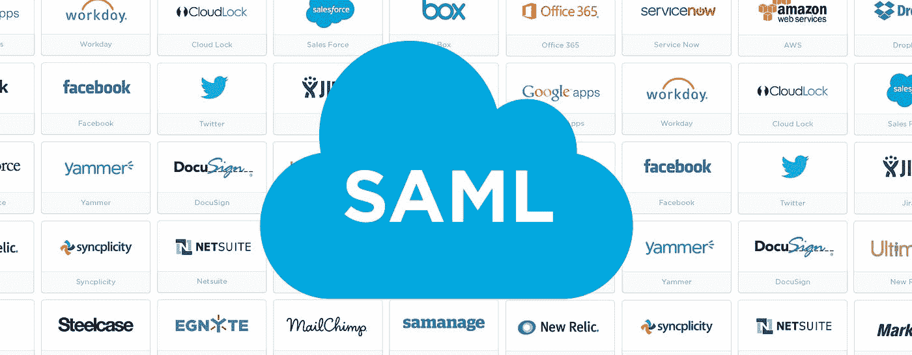
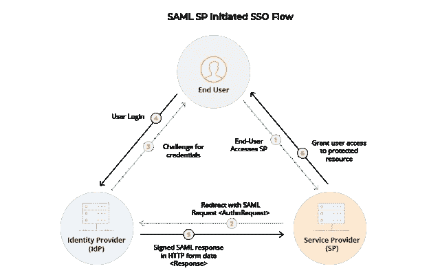
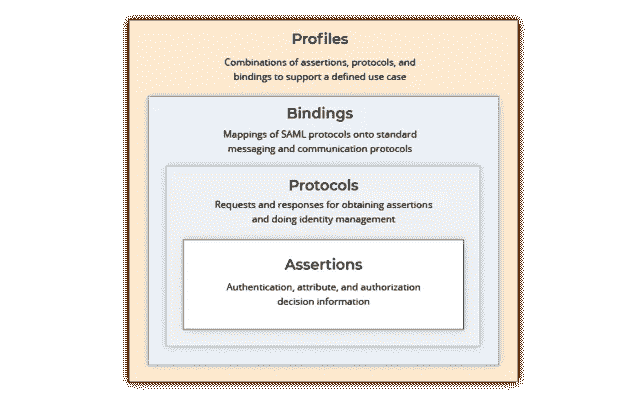

# 安全断言标记语言

> 原文：<https://infosecwriteups.com/what-is-saml-and-how-it-is-useful-for-sso-24d83b98185a?source=collection_archive---------1----------------------->

## 它对启用单点登录(SSO)的作用

如今，我们都已经广泛适应了技术，并发展到了登录应用程序不需要任何密码的阶段。我们每天都在使用许多应用程序，但我们可能已经观察到的一件常见的事情是通过脸书、谷歌、链接等登录

我们中有没有人想过它是如何发生的，这个过程是什么？让我澄清一下这个问题。这一过程称为单点登录，即访问和使用一组证书来访问多个应用程序，如 Zoom、Udemy、Call of Duty 等...但是这是如何工作的呢？所以有一个框架用来配置这个过程，并帮助它没有任何问题地工作。让我们多了解一下吧…

# **什么是 SAML？**

SAML 代表安全断言标记语言。它是一种基于 XML 的开放标准，用于通过建立身份联盟在两方(即身份提供者和服务提供者)之间交换身份验证和授权，以允许 SSO 体验。

看起来非常复杂...让我们把它分解成几块…

*   身份验证:用户声明其访问权限的方式
*   授权:验证用户访问级别的方法
*   身份提供者(IDP):执行身份验证，验证用户的授权并授予访问权限。
*   服务提供商(SP):根据身份提供商提供的可信信息授予用户访问权限。

# **这是怎么回事？**

SAML 身份验证基于身份验证过程中生成的断言请求工作。SAML 断言基本上是一个 XML 文档，它包含两个实体/提供者之间交换的数据，用于授权和认证。

SAML 使用场景有两种方式:

*   服务提供商启动
*   身份提供者启动

## **服务商发起**:

假设您想要登录到一些公共云托管的应用程序，如 DropBox 或 Udemy。在那里，您可以提供您的凭证，或者您可以使用 SAML 身份验证。

*   一旦您使用 SAML 配置进行 SSO 登录，服务提供者就会向身份提供者(例如 Google、LinkedIn)发送 SAML 断言请求，以验证用户的访问(假设用户已经登录了他的 Google 帐户)。
*   一旦 IDP 收到请求，它将检查 SAML 断言并验证用户对现有数据的访问，以确认用户是否有活动会话。如果是，他会将授权请求发送回 SP 进行确认。一旦 SP 收到它，它将为用户提供访问，并在用户、IDP 和 SP 之间建立联邦连接。

## **身份提供商启动**:

这些多见于企业。有许多身份提供者(Okta、Ping Identity、Auth0)与许多服务提供者建立了兼容的 SAML 配置和联邦连接。这种互兼容行为为用户提供了无缝体验。

*   用户通过 IDP 认证后，IDP 会验证用户的访问权限，并为用户提供一个 SP 池，用户可以在其中登录并使用服务。当用户选择服务提供商进行身份验证时，IDP 会生成一个 SAML 断言，其中包含与 SP 进行交换所需的信息。
*   SP 接收 SAML 并验证授予用户访问权限所需的唯一值，并在 SP — IDP —用户之间建立联邦连接。

# **好处:**

*   增强的安全性:使用使用 SAML 的 SSO 将提高安全性级别，并通过在一个地方保护密码和使用 SAML 会话令牌进行身份验证来提高身份管理的便利性。
*   易用性:通过 SAML 身份验证，用户可以在使用多个应用程序时无缝访问，而无需多次跳跃和身份验证。
*   互操作性:IDP 和 SP 之间的可操作性提高了用户体验，减少了操作和故障排除问题。
*   降低成本:使用 SAML 重用认证通过避免多个 SP 的用户数据库来降低维护成本

## SAML 和 IDP 行业参与者:

*   Ping 身份
*   奥克塔恒等式
*   平行线
*   微焦点。

随着技术的不断进步，SAML 的改进也在不断变化。SAML 于 2005 年首次推出 SAML1.0，但其最新版本 SAML 2.0 仍在业界使用。一个新的开放标准框架 **OAuth** (开放授权)带来了更高级别的安全性，这一进步支持了 SSO 概念以获得更增强的体验。

这篇文章是参考多篇文章写成的。请在下面找到它们。

感谢阅读:)

 [## SAML 基础知识-SAML 身份验证的工作原理

### 本文涵盖了 SAML 身份验证的基础知识，它在幕后是如何工作的，使用 SAML 的好处…

www.parallels.com](https://www.parallels.com/blogs/ras/saml-basics/)  [## 什么是 SAML？它是如何工作的以及它是如何支持单点登录的

### 安全断言标记语言(SAML)是一种开放标准，它允许安全凭证由…

www.csoonline.com](https://www.csoonline.com/article/3232355/what-is-saml-how-it-works-and-how-it-enables-single-sign-on.html)  [## 什么是 SAML，SAML 认证是如何工作的

### 在本文中，您将了解什么是 SAML，它是如何工作的，以及如何使用…

auth0.com](https://auth0.com/blog/how-saml-authentication-works/)