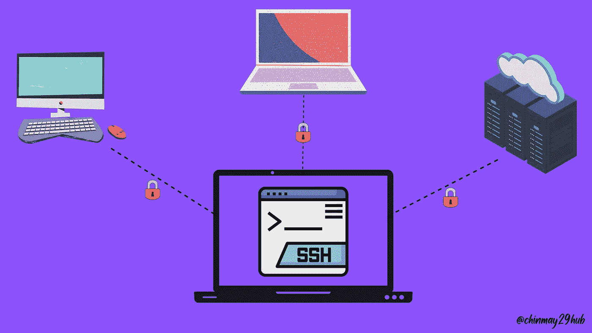
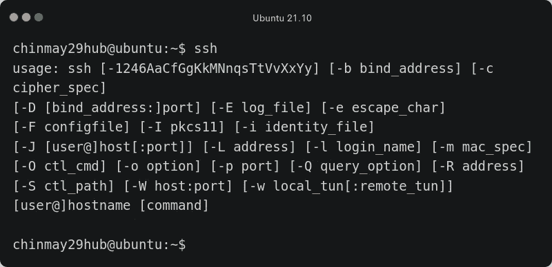
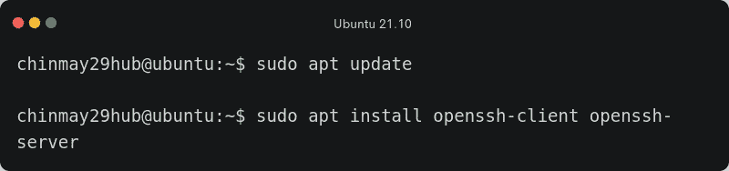
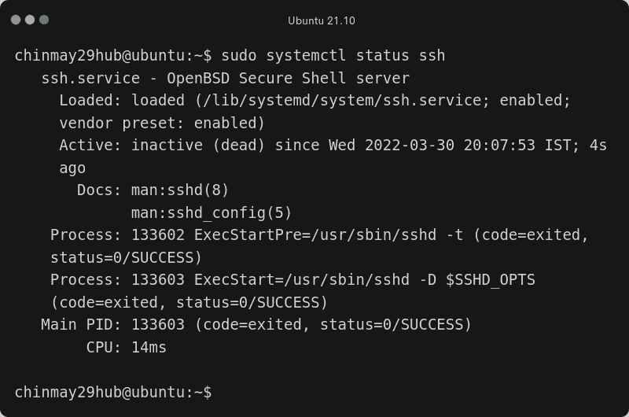
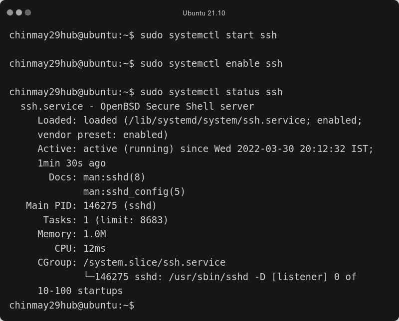
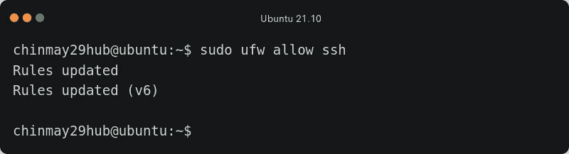

# SSH 是什么，怎么用？|带示例

> 原文：<https://infosecwriteups.com/what-is-ssh-and-how-to-use-it-with-examples-578c72ff32b0?source=collection_archive---------4----------------------->

ssh 插图

# **简介**

[**SSH**](https://en.wikipedia.org/wiki/Secure_Shell) 也称为安全 Shell 或安全套接字 Shell，是一种可以用来连接远程计算机的协议或工具。SSH 使得计算机即使在不安全的网络中也能通信和共享数据。

SSH 使用客户机-服务器模型。您正在使用的计算机是**【客户端】**，您正在连接的远程计算机是**【服务器】**。如果遵循所有的安全预防措施，SSH 被认为是高度安全的。

简而言之，您可以使用当前计算机上的**终端**来访问和管理远程计算机上的资源。

# **安装&用途**

让我们打开命令提示符/终端，键入以下命令来检查 ssh 客户端是否安装在您的计算机上。此命令用于连接到远程计算机。

如果您没有得到相同的输出，这意味着您将需要手动安装它。对于 Windows，您可以遵循本 [**微软**](https://docs.microsoft.com/en-us/windows-server/administration/openssh/openssh_install_firstuse) 教程，对于 Linux，您可以遵循以下说明。(我用的是 [**Ubuntu**](https://ubuntu.com/) 做教程)。

您需要输入以下命令来更新和安装所需的软件包:

出现提示时，输入" **Y** "根据您的网速，安装需要一些时间。

## 我们要安装什么？

OpenSSH-客户端—连接到远程计算机

OpenSSH-server——以便您的计算机可以充当远程计算机

现在，您可以连接到任何远程计算机。在远程端，应该安装服务器包。SSH 服务在默认情况下可能是禁用的，您需要手动启动该服务。您可以使用以下命令检查服务的状态:

正如您在上面看到的，状态是不活动的(死亡)。现在，点击以下命令来启动服务并启用它，这样您就不必在启动后一次又一次地启动它:

所以你已经成功地配置了你的远程系统，但是如果你已经在你的发行版上安装了 [UFW](https://en.wikipedia.org/wiki/Uncomplicated_Firewall) (简单的防火墙)，你需要点击下面的命令来让“ssh”完美地工作:

呜！！如果你按照教程正确的一切都在客户端和服务器端完成。现在是时候把手弄脏并连接到远程计算机上了。

我将连接到我的 [raspberry pi](https://en.wikipedia.org/wiki/Raspberry_Pi) 4，并通过以太网连接使用它(没有任何显示器或键盘/鼠标)。您可以使用任何计算机连接到。注意:以下示例将针对同一网络中的设备。要连接到网络外部的设备，我们需要转发端口 22，我认为这是另一天的教程。

我打开了我的 pi，现在让我把它和我现在的 ubuntu 电脑连接起来。下面是连接到系统时应遵循的语法，其中**用户名**是您希望连接到的用户名，它位于远程系统上。并且 **ip 地址**是由 wifi 路由器分配给该设备的本地 ip(在我们的例子中)。要找到远程系统的 ip 地址，您可以访问路由器的默认网关。我的是 192.168.0.1

> ssh 用户名@ip 地址

我的情况是:

> ssh pi@192.168.0.103

其中“pi”是用户名，“192.168.0.103”是 **raspberry pi** (远程计算机)的 *ip*

**注意**:上述命令在 windows 和 linux 上保持不变

下面是一个简短的 gif 图片，展示了我如何连接到我的 Pi。

因此，通过这些方式，我们可以使用 ssh 连接到不同的计算机。如果您使用的是 AWS，您应该开始使用 ssh 来连接 AWS 实例。SSH 有很多优点，比如避免数据包嗅探等攻击。

如果你不太熟悉使用终端，你可以使用像 [**PUTTY**](https://www.chiark.greenend.org.uk/~sgtatham/putty/latest.html) 这样的应用，它既适用于 **Windows** 又适用于 [**Linux**](https://en.wikipedia.org/wiki/Linux) 。

# 结论

所以在这些博客中，我们学习了 ssh 以及如何在 Ubuntu 系统上安装它。如何连接到同一网络中的各种远程计算机。这只是一个基础教程，我们将在下一个教程中学习更多关于 ssh 命令和函数的知识。