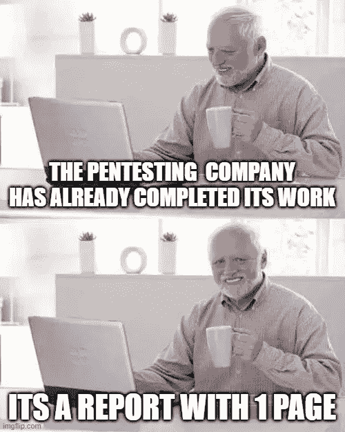
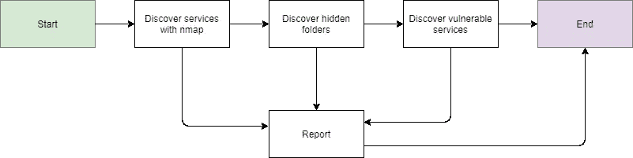
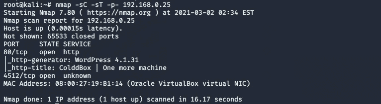
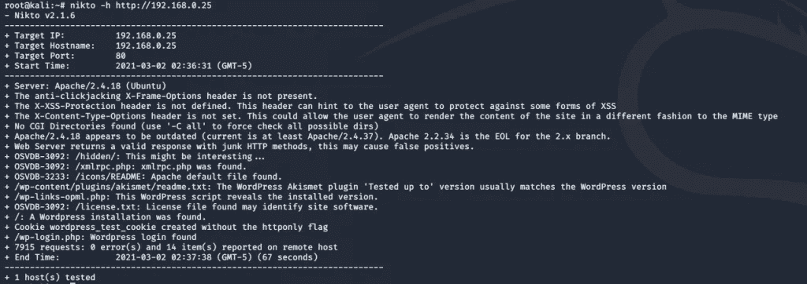
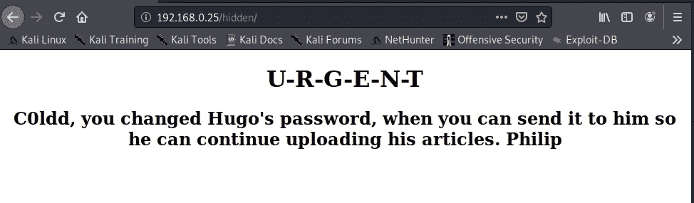
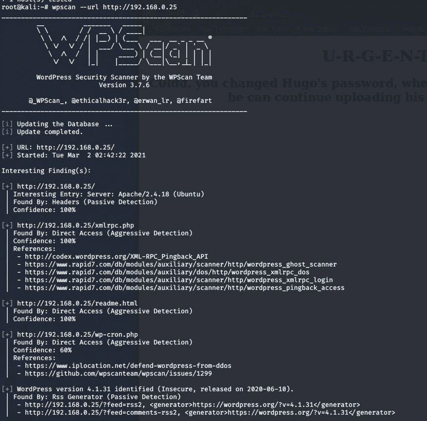

# 关于圣灵降临节，什么是真正丑陋、悲伤的事实？—网络锻造

> 原文：<https://infosecwriteups.com/what-is-the-actual-ugly-sad-truth-about-pentesting-cyberforged-54fb9eee1209?source=collection_archive---------0----------------------->

## 你可能想在测试上比你想象的多花一点钱

大家早上好，

让我们坚强地开始:在圣灵降临测试的想法背后，真正丑陋、悲伤的真相是什么？它只和将要执行它的黑客一样好。事实上，我们在之前的文章中已经看到了这个“真相”:[https://cyber forged . com/top-5-things-you-must-absolute-know-about-pentesting/](https://cyberforged.com/top-5-things-you-must-absolutely-know-about-pentesting/)

但是什么叫只和背后的黑客一样优秀呢？在今天的文章中，我们将看到一个真实世界中的例子，一个真正关心自己在做什么的黑客和一个只是“按按钮”的黑客之间会发生什么。

# 问题是

首先，我觉得应该谈谈这背后真正的问题是什么。

我们想象一个公司，一个开业不到 6 个月的创业公司。它需要在市场上立足，它需要它的产品真正给人新的感觉，并让公众认为它们是真正能解决问题的东西。

在这些类型的小公司和新公司，他们往往会很好地照顾他们所做的工作。为什么？很简单:**他们需要为数不多的顾客让他们开心，这样他们提供的优质服务就会广为人知。**这适用于任何领域，但让我们来谈谈网络安全:想象一下一家做 pentesting 和其他事情的公司。由于是新的，对公众几乎没有影响，他们提供的所有服务都必须让人感觉质量上乘，做工考究。

好吧，现在让我们想象相反的情况:一个已经在市场上建立的公司，它已经提供它的服务很多年了。它的商业模式已经得到了很好的验证，不需要打开新的视野就能继续存在。在我们的例子中，这家公司将致力于提供一般的 IT 咨询服务，但由于最近的新时尚是网络安全，他们已经决定开始提供测试服务。

这家公司不需要提供“特别的”服务来赢得顾客:它已经有了一系列的顾客。它不需要区分自己，因为对他们来说，提供这种测试服务已经足够了。

在这两家公司之间，你认为哪一家会有一个薪酬过低、经验不足的庞大黑客团队，哪一家会有更少、但精力充沛得多的黑客？我认为例子说明了一切。

> 这是一个真正的问题:当你做一个测试时，只关注你将从服务中获得的零分，任何时候你都不会注意到安全分析的正确性和广泛性。测试是一门需要时间和精力的艺术，如果我们将这项活动委托给一个没有足够质量的公司，我们将严重损害我们系统的安全性。

# 这个例子

好吧，让我们想象一家提供测试服务的大公司，但这不是它的主要收入来源。如果我们考虑他们的技术操作，他们的每个测试流程如下:

1.  我们开始测试
2.  发现机器上公开可用的服务
3.  我们发现是否有隐藏的文件夹
4.  发现易受攻击的服务
5.  我们完成了

如果在第 2 步到第 4 步之间的任何时候发现了什么，就会自动报告并终止。

看流程的话，找漏洞应该没问题吧？不，这里有一个巨大的错误:如果发现的漏洞是不可利用的，也就是说，即使它们存在，它们也不会影响系统，那该怎么办？如果这些漏洞中的一个导致更严重的漏洞呢？

让我们看一个连锁漏洞的例子。

# 连锁漏洞示例

对于这个例子，我们将使用 Coldbox vulnhhub 机器([https://www.vulnhub.com/entry/colddbox-easy,586/](https://www.vulnhub.com/entry/colddbox-easy,586/))。让我们跟随不仅仅依靠 pentesting 谋生的大公司的流程:

该公司报告说，客户在 4 个月后删除了该/hidden 文件夹(因为对他们来说这不是一个非常严重的漏洞)，就这样。这个过程正如我们已经解释过的那样是极其危险的。

让我们看看一个参与进来的黑客会真正做些什么:

*   启动 nmap 并查看这两个服务。其中一个是 WordPress，众所周知它通常很容易受到攻击。
*   他启动 nikto 并注意到/hidden 文件夹的存在。注意，到目前为止一切都是一样的。
*   通过浏览器发出一个请求，看看文件夹后面藏着什么。

*   它看到有一个名为 c0ldd 的用户。
*   他启动 wpscan 来查看是否有任何与 WordPress 相关的漏洞。可以看到 4.1.31 版本是老版本！

虽然黑客可能还需要采取更多的步骤，但他实际上已经证明了大公司没有证明的事情:他已经能够证明这些漏洞(在这种情况下是隐藏文件夹和 WordPress 的过时版本)确实是危险的，可能会影响你的业务和隐私。

# 结论

今天，我们已经看到了致力于工作的黑客和只想赚钱并向客户报告信息的黑客之间的区别。在雇佣外部公司的服务时，记住这一点非常重要。

> 担心你的系统的安全性，即使你不得不在测试过程上多花一点钱。

*原载于 2021 年 3 月 2 日*[*【https://cyberforged.com】*](https://cyberforged.com/what-is-the-actual-ugly-sad-truth-about-pentesting)*。*