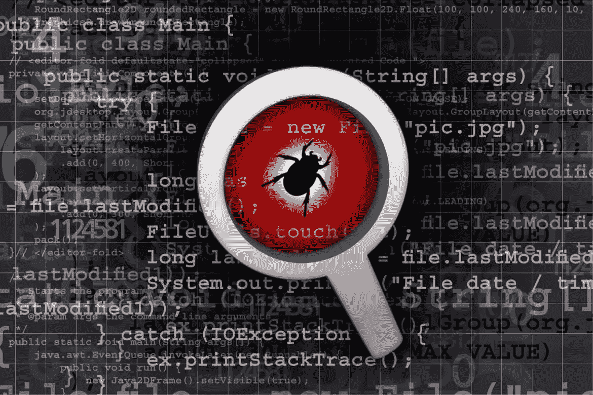

# 在赏金里找到虫子需要什么！

> 原文：<https://infosecwriteups.com/what-it-takes-to-find-bugs-in-bounties-273ad278f77e?source=collection_archive---------1----------------------->

嗨，黑客朋友们，我希望你们都在寻找自己喜欢的目标并发现漏洞。即使你找不到他们，也要确保你继续努力寻找:)

那么我为什么写这篇博客呢？原因是，许多人开始了他们的黑客之旅，但他们不明白是什么导致了成功的 bug 赏金追逐。很多人都问过我同样的问题，要么是*“如何启动 bug 奖金”要么是“我已经启动了 bug 奖金，但没有找到 bug”。如何找到他们*。所以我猜测这是时候通过这篇文章来消除疑虑并与他们交谈了:)

基本上有两种类型的 bug 猎人，一种像我一样热爱黑客，另一种强迫自己进入
只是为了钱。我建议你们都检查一下自己，找出自己属于哪一类。如果是第二次，恐怕你需要重新考虑。你可以离开这篇文章，因为它不会涵盖如何从奖金中赚钱:)如果你属于第一类，你真的很好奇，干杯！我们将一起走这条路。

我们将在这里讨论两种一般情况。首先，让我们假设你一直在努力工作，没有发现好的 bug。
其次，你已经发现了低级错误，但还不满足，想要更进一步。从第一个开始，你需要改变你的方法。我没有用“可能”，我知道你需要。记住这句台词:- ***熟能生巧。谁做谁就是完美的练习。因此，确保你以正确的方式做事。如何入门我就不深究了。这里有一个很好的 [**博客**](https://medium.com/hackcura/learning-path-for-bug-bounty-6173557662a7) 作者 [Udit Bhadauria](https://medium.com/u/9c6c10d7ecf5?source=post_page-----273ad278f77e--------------------------------) 一定会对你有很大帮助。你需要检查你哪里做错了。你可能见过相当新的人，但他们的发现是惊人的。所以万一你没有主意，开始花时间在打嗝上，很多。你需要尽快理解这一点，自动化只是作为一个参考，除非那天你非常幸运，否则你无法找到好的 bug。所以，开始大量使用打嗝，了解一个网站是如何工作的。那真的会有帮助。我曾经花了一整天的时间去理解一个网站是如何工作的，它是用来做什么的。此外，明智地选择你的目标。选择一个具有最大功能的程序，如输入字段、文件上传、外部链接交互等。***

从 bug 开始，你不会总是在 burp 中找到一个用户 ID，在那里你可以修改它并得到好的报酬。你也需要学习一些绕过，它会随着经验而来。如果你真的在纠结 bug，那就从业务逻辑开始吧。思考哪些事情会影响一个组织。
如果可以创建两个用户，和他们一起玩，玩很多。试着做一些不同的事情，比如你能在没有其他人参与的情况下访问他们的数据吗？
它包含许多漏洞，你需要有一个清单，你可以在应用程序中使用。你必须创建你自己的漏洞清单，你知道利用。一旦你有了自己的清单，检查你提到的每一个 bug。

您应该检查的其他错误类型是，*访问控制和认证错误*。一旦你以好的方式检查它们
，你可能会发现好的东西**。**[**pentester lab**](https://pentesterlab.com/)上面有一些很棒的实验室，一定要去看看。此外，授权是很好的检查。众所周知，我们都不可能在编码方面同样出色，你将需要专注于逻辑错误，但要确保你在找到它们的过程中成为最好的自己:)此外，确保你尝试了你最喜欢的目标的 android 应用程序。如果你还没有开始安卓黑客，我强烈建议你学习一下。没有多少人在做 android pentesting，你可能会发现人们还没有发现的 bug。有时你会发现同样的错误，例如，如果你在 web 应用程序中发现了 IDOR，请确保在他们的 android 应用程序中也检查同样的事情。我发现了两个这样的 IDORS。

继续第二种类型:)让我们假设你想找到 P1 和 P2s 但没有得到它们，试着尽可能多地探索你的目标。
子域很可能更不安全。如果你得到了一个有一些好的功能的子域，比如文件上传和外部 URL 上传，你会有更多的机会找到一个好的 bug。还有，链接真的很重要。假设你发现了一个反射的 XSS，试着制作一个包含一些 SQLi 或 SSRF payloads 的有效载荷。我多次看到它工作。此外，如果你有一个像 XSS 这样的 bug，试着在你得到几乎相同功能的每个子域中找到它。

最近几天，我在两种类型的 vulns 上工作了很多。那是斯凯利和 SSRF。再给你一个提示，一旦你在
狩猎中有了一些经验，选择一个漏洞并开始到处寻找它(然而，做对你有用的:)。一旦你发现了一些，把它升级到更大的东西。总是试图扩大一个 bug 的影响，但是确保你提交了之前的一个，否则你会迟到，别人也会告发你的。一旦你对低级错误有了一个好的想法，进入一些关键的。即使你在任何地方都找不到它们，你也需要拥有这些知识。SSRFs 和 SQLis 是很好的开始。检查 URL 正在使用的每个默认参数。打嗝搜索在这方面会给你很大帮助。一旦你得到一个网址重定向，升级到 SSRF。是的，你需要绕过过滤器，当然:)

我想再补充一些东西。那些即使过了几个月也很难找到 bug 的人，你应该把重点放在
one 平台上。另外，不要从一个目标跳到另一个目标。你会变得筋疲力尽，并感到气馁。最好坚持一个项目，我相信
你会告诉我你的发现。此外，确保你优先考虑你所热爱的事情，这应该对你有用。我的意思是你需要
把所有无意义的事情都抛在黑客之上。

最后，这完全取决于你的思维方式有多不同。请参阅 web 应用程序是为黑客而构建的。没有一个应用程序是 100%安全的。如果我们能黑苹果，我们就能黑任何东西。所以永远不要感到失望，永远不要低估自己。如果你没有比别人更多的技能，那就建立它。学习是一个永无止境的过程。记住，**黑客不是目的地，而是一个旅程。**一旦进去了，爱黑就没办法了。我们可能有不同的大脑，但我们都有相同的机会。把你的时间用在好的事情上，休息都是暂时的，黑客才是永远的:)

我相信你会从中得到一些东西，因为很多人都有同样的要求。如果你喜欢，给我鼓掌。还有，你可以关注我的 [**twitter**](https://twitter.com/manash4rsh) 。我通常会在那里保持活跃，如果你有任何疑问，请联系我。

所以下次就这样了。我也要把我最近的发现写下来。一会儿见:)

保重，快乐黑客！再见了，❤

LinkedIn:-[https://www.linkedin.com/in/manas-harsh-05636a154/](https://www.linkedin.com/in/manas-harsh-05636a154/)