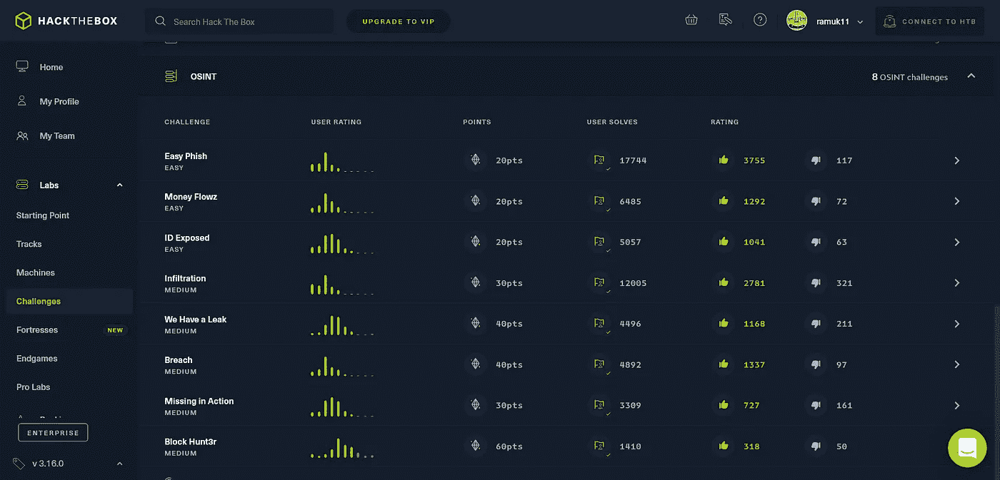
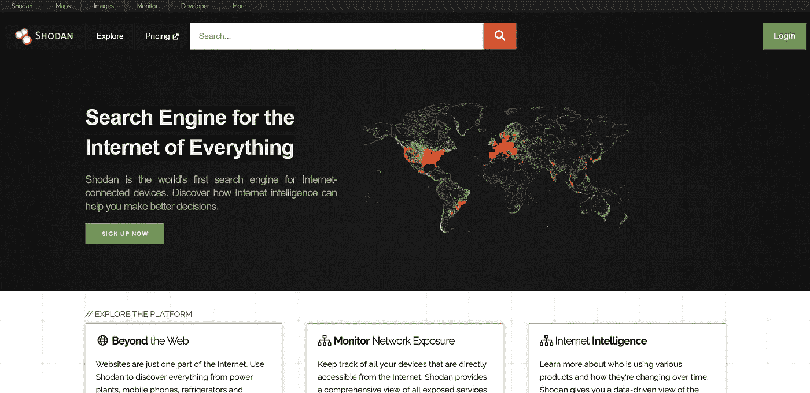
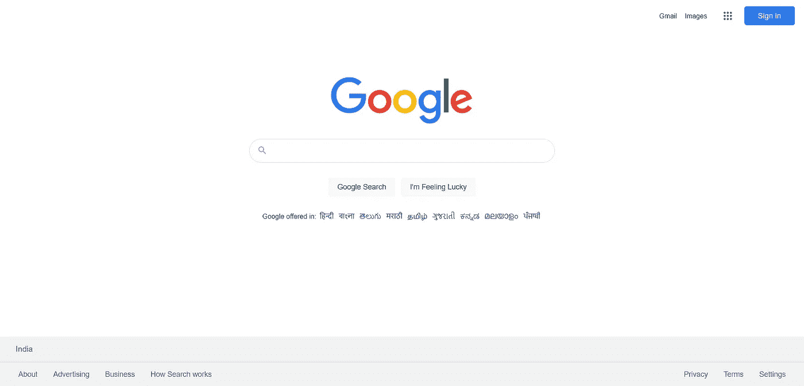

# 你能从解决新的挑战中学到什么？

> 原文：<https://infosecwriteups.com/what-you-can-learn-by-solving-osint-challenges-cc837e009f31?source=collection_archive---------2----------------------->

## 我已经完成了 HTB 所有的新挑战，这是我所学到的。

# 了解 OSINT

开源情报(OSINT)是一个信息集合，我们可以从公开可用的资源中获取这些信息。如果你使用公开可用的信息，如谷歌搜索、新闻媒体、照片、地图等来做决定，那么你就遵循了 OSINT 方法论。

OSINT 被所有人使用，甚至被普通人在不知情的情况下使用。情报机构使用社交媒体和其他信息来跟踪一个人或系统。安全人员使用 web 上的可用信息来查找系统中的漏洞。如果你曾经在约会前谷歌过一个人，那么你就用过 OSINT。

肖丹

# 你能从解决新的挑战中学到什么？

## 侦察就是一切

侦察是 OSINT 的重要组成部分。你通过对目标进行人工侦察来接近它。您从在线和离线资源中收集尽可能多的目标信息。你在谷歌、社交媒体网站、新闻报道和 Shodan 等网站上搜索目标。

当你做这项工作时，你开始意识到你可以很容易地找到关于一个目标的多少信息。你也会知道侦察工作的重要性。如果你做好了侦察工作，你的问题会自动解决一半。

一个强大的工具

## 网上什么都有

你会惊讶地发现网上有多少免费信息。你只需要知道如何利用这些信息。我在 HTB 完成的所有 OSINT 挑战都要求我有效地搜索不同的网站。一开始有点困难，但在完成一些挑战后，我开始喜欢上了它。

有许多工具可用，如 Amass、Shodan、Sublist3r，还有许多工具可以获取您需要的信息。有效地使用你的工具，知道如何谷歌信息。这将有助于你从已有的免费资源中获得个人收益。

社交媒体有大量有用的信息

## 社交媒体是有用数据的宝库

几乎所有 HTB 面临的挑战都包括仔细阅读社交媒体账户、评论、图片和元数据，以找到一些隐藏的信息。不仅在挑战赛中，而且在现实生活中，社交媒体上也有很多有用的信息可供你使用。您可以通过社交媒体数据了解您的竞争对手、您的竞争对手或自己的企业、感兴趣的人以及更多信息。

为了你的利益，正确使用社交媒体网站上的可用数据。你甚至可以使用 Lookup ID 和 Namechk 等工具或不同的搜索参数，从社交媒体网站上获取更多关于目标的信息。

> 我已经完成了所有的 HTB 挑战，现在我渴望更多

# 解决所有 HTB 面临的挑战——个人想法。

首先，解决 HTB 面临的挑战并不困难。我没有做任何不可能或困难的事。

在开始做这个挑战之前，我并没有多想 OSINT。我以为我比任何人都更喜欢网络。但是最近我在完成网页挑战方面没有太大的成功，所以我开始做 OSINT。

这非常有趣，通过完成这个挑战，我学到了很多东西。是的，有一些工具可以用于 OSINT。但是为了完成这个挑战，我只使用了谷歌和一些社交媒体网站。HTB 奥辛特的所有挑战都很容易，所以只要你花点时间，你就能轻松解决它们。是的，我已经向一些不和谐的人寻求暗示和鼓励。但它只是帮助我明白了我缺少什么。现在我觉得我从 OSINT 上找到有用信息的方法有所改进。

> 我敢说你能完成所有的 HTB 挑战

## 最后的想法，

现在我已经完成了所有的 HTB 新挑战，我渴望更多，希望 HTB 能尽快发布更多。如果你想提高你在 CTF 或臭虫奖励方面的知识，那么我谅你也不敢完成所有的奥辛特 HTB 挑战。

***亲提示:*** *可以👏这个帖子最多 50 次，以显示你有多喜欢它。*