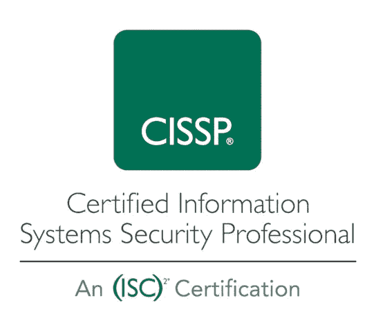

# 关于 CISSP 考试你需要知道什么

> 原文：<https://infosecwriteups.com/what-you-need-to-know-about-the-cissp-exam-a1aefb1cf0e6?source=collection_archive---------5----------------------->

要准备认证信息系统安全专家(CISSP)考试，您应该首先熟悉考试内容和形式。该考试涵盖与信息安全相关的广泛主题，包括安全和风险管理、资产安全、安全工程、通信和网络安全等。你可以在(ISC)网站上找到考试领域以及他们测试的知识和技能的详细概述。

CISSP —注册信息系统安全专家

除了对考试内容有透彻的理解，在信息安全领域有实践经验也很重要。CISSP 考试是为在该领域有很强基础的有经验的专业人士设计的，拥有实践经验对备考非常有帮助。

一旦你对考试内容和形式有了很好的理解，并且在这个领域有了一些实践经验，你就可以开始认真地为考试而学习了。有许多不同的学习材料和资源可以帮助你准备，包括书籍、学习指南、练习考试和在线课程。选择最适合你和你的学习风格的资源，并制定一个学习计划，让你系统地覆盖材料并跟踪你的进展。

利用管理 CISSP 考试的机构(ISC)提供的资源也是一个好主意。他们提供各种学习材料和资源，包括(ISC)官方培训提供商计划，可以帮助您找到培训提供商和课程，以帮助您准备考试。您还可以在(ISC)网站上找到关于考试报名和时间安排的信息，以及学习和参加考试的提示和建议。

总之，为了准备 CISSP 考试，你应该:

1.  熟悉考试内容和形式。
2.  获得信息安全领域的实践经验。
3.  选择适合你的学习材料和资源，并制定学习计划。
4.  利用(ISC)提供的资源和支持。

想了解更多关于 CISSP 的信息吗？

*   如何准备你的 CISSP 考试
*   你需要了解的 CISSP 猫([中](https://medium.com/codex/what-you-need-to-know-about-the-cissp-cat-e063756e6d2b)
*   获得网络安全认证的 5 个理由([中](https://medium.com/codex/5-reasons-to-get-a-cybersecurity-certification-9b9c39a53a49))

如果你喜欢阅读这样的故事，并想支持我成为一名作家，可以考虑[注册成为一名媒体会员](https://medium.com/@AnthonyToday/subscribe)。每月 5 美元，你可以无限制地阅读媒体上的故事。如果你[用我的链接](https://medium.com/@AnthonyToday/subscribe)注册，我会赚一小笔佣金。

【https://medium.com/@AnthonyToday/subscribe 