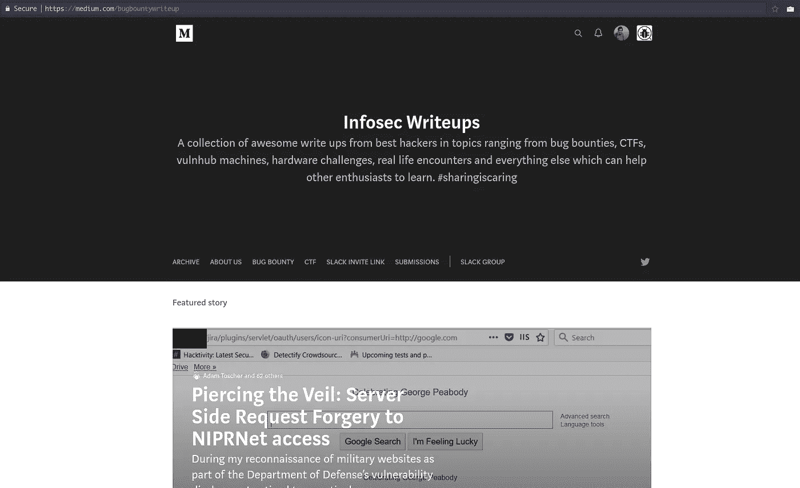

# 信息安全社区正在发生什么

> 原文：<https://infosecwriteups.com/whats-happening-in-the-infosec-community-a21c60c14902?source=collection_archive---------1----------------------->

## 读者们好

给你带来一些好消息——我们的出版物[**InfoSec 在 Medium 上的文章**](https://medium.com/bugbountywriteup) 现在是一个拥有 2000 多名成员的强大社区。我们鼓励您与其他安全研究人员、黑客和任何您认为可能感兴趣的人分享该出版物，以便他们能够找到我们，并为这个不断发展的社区贡献自己的一份力量。

如果你已经是这里的作家，这意味着我们已经发现了你在 Medium 上的现有文章，并欢迎你加入我们的贡献者社区。如果你还不是作家，而与安全相关的文章是你的强项，你可以遵循 [***投稿指南***](https://medium.com/bugbountywriteup/submission-guidelines-3952000f119) 并加入我们。

我们的 [**Slack 频道**](https://infosecwriteups.slack.com/) 已经跨越了 790 个成员，我们一直在寻找新的安全爱好者加入。因此，如果你还不是 InfoSec 社区的一员，你应该知道该去哪个链接。

在别处找到我们: [**推特**](https://twitter.com/infoseccomm)

在其他新闻中，我们很高兴地分享我们自己的一个人，信息安全报道的编辑 Anangsha Alammyan 出版了她的第一本书。