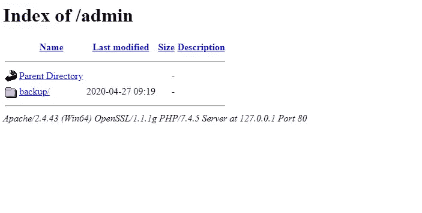

# 我的上有什么？htaccess？

> 原文：<https://infosecwriteups.com/whats-on-my-htaccess-a2a440cf4cd0?source=collection_archive---------4----------------------->


网站上常见的一些安全问题可以通过使用。超文本访问文件。在本文中，我将展示。我的 WordPress 网站上的 htaccess 配置，并解释使用它解决的安全问题。然而，在我们开始之前，让我们看看。htaccess 文件实际上是。

> *。htaccess 是在运行 Apache web 服务器软件的 Web 服务器上使用的配置文件。当一个. htaccess 文件放在一个目录中，这个目录又通过 Apache Web 服务器加载，那么。Apache Web 服务器软件检测并执行 htaccess 文件。*
> 
> *这些。htaccess 文件可用于改变 Apache Web 服务器软件的配置，以启用/禁用 Apache Web 服务器软件必须提供的附加功能和特性。这些工具包括基本的重定向功能，例如，如果出现“404 文件未找到”错误，或者更高级的功能，如内容密码保护或图像热链接阻止。*
> 
> — *HTACCESS-Guide*

## 警告

1.  的。htaccess 文件是一个服务器配置文件。即使是一个打字错误也会导致你的服务器配置错误，导致你的网站瘫痪！请**注意**作者不会对你在服务器上造成问题的任何错误负责。
2.  如果你不知道你在做什么，咨询一下网站开发者。如果你喜欢冒险，一定要备份你的原件。htaccess 文件，请谨慎操作。
3.  如果站点关闭，请使用您的 FTP/SSH/cPanel 访问来恢复。备份中的 htaccess 文件。
4.  而。我的服务器上的 htaccess 配置是为保护我的 WordPress 安装而定制的，下面给出的许多指令可以根据你的非 WordPress 网站的设置进行修改(如果需要)和使用。但是，我强烈建议在进行适当的备份后，谨慎地进行任何此类修改。

现在，让我们开始吧。htaccess 文件块块，看看它如何帮助我保护我的网站。您希望在自己的服务器上使用的以下任何代码块都需要复制到。网站根目录下的 htaccess 文件。如上所述，**请备份你的** **。htaccess 文件**，然后再进行任何更改。

# 保护 HTACCESS 文件

考虑到。htaccess 文件，这是至关重要的，以保护文件本身免受未经授权的用户。下面的代码块就是这样做的。

```
# Protect HTACCESS
<files ~ "^.*\.([Hh][Tt][Aa])">
order allow,deny
deny from all
satisfy all
</files>
```

# 保护其他重要文件

下面的代码块可以用来保护 WordPress 中的其他重要文件，比如错误日志、wp-config.php 和 php.ini

```
# Protect Important Files
<FilesMatch "^.*(error_log|wp-config\.php|php.ini)$">
Order deny,allow
Deny from all
</FilesMatch>
```

# 禁用图像的热链接

图片热链接会导致你的网站变慢。如果一个人把你网站上的图片嵌入到他们自己的网站上，那么每次图片在他们的网站上被浏览时，它就会从你的服务器上被加载。结果，你的带宽在他们没有访问你的网站的情况下就被消耗掉了。

使用下面的代码块来防止这种情况发生。请确保将“jinsonvarghese.com”替换为您的域。

```
# Disable hotlinking of images with forbidden or custom image option
RewriteEngine on
RewriteCond %{HTTP_REFERER} !^$
RewriteCond %{HTTP_REFERER} !^http(s)?://(www\.)?jinsonvarghese.com [NC]
RewriteCond %{HTTP_REFERER} !^http(s)?://(www\.)?google.com [NC]
RewriteRule \.(jpg|jpeg|png|gif)$ – [NC,F,L]
```

**自己检查:**

通过在谷歌中搜索以下内容，检查你的图片是否被热链接。下面这个谷歌呆子会做的是从你的网站上搜索每一张图片，但它会删除包含你自己的 URL 的每一个结果。其余的搜索结果将显示你的图片被热链接的任何网站。

*inurl:your website . com-site:your website . com*

# 禁用 HTTP 跟踪方法

> *HTTP TRACE 方法是为诊断目的而设计的。如果启用，web 服务器将通过在其响应中回显收到的确切请求来响应使用 TRACE 方法的请求。*
> 
> *这种行为通常是无害的，但偶尔会导致敏感信息的泄露，如反向代理附加的内部认证头。这个功能在历史上可以用来绕过 cookie 上的 HttpOnly cookie 标志，但是在现代的 web 浏览器中已经不可能了。*
> 
> — *PortSwigger*

使用下面的代码块在服务器上禁用 HTTP TRACE 方法。

```
# Disable HTTP TRACE Method
<IfModule mod_rewrite.c>
RewriteEngine On
RewriteCond %{REQUEST_METHOD} ^TRACE
RewriteRule .* - [F]
</IfModule>
```

# 禁用服务器签名

服务器签名可能会向攻击者泄露敏感信息，如所用软件组件的版本，攻击者将能够根据这些信息更好地准备攻击。它们通常出现在服务器响应、404 错误页面、目录列表等中。

可以通过在。htaccess 文件。

```
# Disable server signature
ServerSignature Off
```

# 启用 HTTP 安全标头

HTTP 安全头可用于提供另一层安全，以帮助减少安全漏洞。

## x-XSS-保护接头

> *X-XSS 保护标头旨在启用现代 web 浏览器内置的跨站点脚本(XSS)过滤器。*
> 
> —密钥 DN

以下代码块设置了 **X-XSS 保护**报头。

```
# Enable X-XSS-Protection Header
<IfModule mod_headers.c>
Header set X-XSS-Protection "1; mode=block"
</IfModule>
```

**参考:** [https://developer . Mozilla . org/en-US/docs/Web/HTTP/Headers/X-XSS-Protection](https://developer.mozilla.org/en-US/docs/Web/HTTP/Headers/X-XSS-Protection)

## x-内容-类型-选项标题

> *X-Content-Type-Options 头可以防止 Internet Explorer 和 Google Chrome 从声明的内容类型中嗅探到响应。这有助于降低非法下载的危险，并有助于正确对待内容。*
> 
> —密钥 DN

下面的代码块设置了 **X-Content-Type-Options** 头。

```
# Enable X-Content-Type Header
<IfModule mod_headers.c>
Header set X-Content-Type-Options nosniff
</IfModule>
```

**参考:** [https://developer . Mozilla . org/en-US/docs/Web/HTTP/Headers/X-Content-Type-Options](https://developer.mozilla.org/en-US/docs/Web/HTTP/Headers/X-Content-Type-Options)

## HTTP 严格传输安全(HSTS)标头

> *HTTP 严格传输安全(HSTS)是一项安全增强功能，它限制 web 浏览器只能通过 HTTPS 访问 web 服务器。这确保了不能通过易受攻击的不安全 HTTP 连接建立连接。HSTS 在响应报头中被定义为严格传输安全，并且一旦支持的浏览器接收到该报头，它就知道通过 HTTPS 传送所有信息。*
> 
> —密钥 DN

下面的代码块设置了**严格传输安全**头。

```
# Enable Strict Transport Security Header
<IfModule mod_headers.c>
	Header always set Strict-Transport-Security "max-age=63072000; includeSubDomains"
</IfModule>
```

**参考:** 关于 HSTS 头及其指令的更多信息，可根据您的具体需求进行选择，请参考[https://developer . Mozilla . org/en-US/docs/Web/HTTP/Headers/Strict-Transport-Security](https://developer.mozilla.org/en-US/docs/Web/HTTP/Headers/Strict-Transport-Security)

## x-框架-选项标题

> *Clickjacking(用户界面补救攻击、用户界面补救攻击、用户界面补救)是一种恶意技术，诱骗网络用户点击与其所点击的内容不同的内容，从而在点击看似无害的网页时可能泄露机密信息或控制其计算机。*
> 
> *X-Frame-Options HTTP 头仍然是最受支持的点击劫持保护选项。*
> 
> Acunetix

以下代码块设置了 **X-Frame-Options** 标题。

```
# Enable X-Frame-Options Header
<IfModule mod_headers.c>
Header set X-Frame-Options "SAMEORIGIN"
</IfModule>
```

**参考:** [https://developer . Mozilla . org/en-US/docs/Web/HTTP/Headers/X-Frame-Options](https://developer.mozilla.org/en-US/docs/Web/HTTP/Headers/X-Frame-Options)

## 推荐人-策略标题

> *添加到您的站点。htaccess 文件或服务器配置文件，此代码指示支持的浏览器只为来自当前域(同源)的请求设置 referrer 头。请记住，此标题与安全性关系不大，更多的是关于控制推荐信息，这是各种规则和法规(如 GDPR)所要求的。*
> 
> — htaccessbook

下面的代码块设置了 **Referrer-Policy** 头。

```
# Enable Referrer-Policy Header
<IfModule mod_headers.c>
Header set Referrer-Policy "same-origin"
</IfModule>
```

参考:
[https://developer . Mozilla . org/en-US/docs/Web/HTTP/Headers/Referrer-Policy](https://developer.mozilla.org/en-US/docs/Web/HTTP/Headers/Referrer-Policy)

# 禁用目录列表

当目录列表被启用时，攻击者可以向*www.example.com/admin/*发出请求，来自服务器的响应将包括目录*管理员*的目录内容。



为了防止对您的网站目录进行未经授权的访问，请将下面一行代码添加到您的。htaccess 文件。

```
# Disable Directory Listing
Options All -Indexes
```

# 防止 WordPress 脚本注入攻击

攻击者向网站代码中注入恶意代码，以执行恶意操作，例如对敏感数据进行未经授权的访问。下面的代码块可以保护 WordPress 网站免受这样的攻击。

```
# Protect Against Script Injection
Options +FollowSymLinks
RewriteEngine On
RewriteCond %{QUERY_STRING} (<|%3C).*script.*(>|%3E) [NC,OR]
RewriteCond %{QUERY_STRING} GLOBALS(=|[|%[0-9A-Z]{0,2}) [OR]
RewriteCond %{QUERY_STRING} _REQUEST(=|[|%[0-9A-Z]{0,2})
RewriteRule ^(.*)$ index.php [F,L]
```

# 防范 SQL 注入攻击

虽然这不能像 WAF 那样提供对 SQL 注入攻击的完全保护或阻止更复杂的攻击，但下面的代码块至少可以用来阻止一些最常见的 SQLi 攻击。

```
# Protect Against SQL Injection
<IfModule mod_rewrite.c>
RewriteEngine On
RewriteBase /
RewriteCond %{REQUEST_METHOD} ^(HEAD|TRACE|DELETE|TRACK) [NC]
RewriteRule ^(.*)$ - [F,L]
RewriteCond %{QUERY_STRING} \.\.\/ [NC,OR]
RewriteCond %{QUERY_STRING} boot\.ini [NC,OR]
RewriteCond %{QUERY_STRING} tag\= [NC,OR]
RewriteCond %{QUERY_STRING} ftp\:  [NC,OR]
RewriteCond %{QUERY_STRING} http\:  [NC,OR]
RewriteCond %{QUERY_STRING} https\:  [NC,OR]
RewriteCond %{QUERY_STRING} (\<|%3C).*script.*(\>|%3E) [NC,OR]
RewriteCond %{QUERY_STRING} mosConfig_[a-zA-Z_]{1,21}(=|%3D) [NC,OR]
RewriteCond %{QUERY_STRING} base64_encode.*\(.*\) [NC,OR]
RewriteCond %{QUERY_STRING} ^.*(\[|\]|\(|\)|<|>|ê|"|;|\?|\*|=$).* [NC,OR]
RewriteCond %{QUERY_STRING} ^.*(%24&x).* [NC,OR]
RewriteCond %{QUERY_STRING} ^.*(%0|%A|%B|%C|%D|%E|%F|127\.0).* [NC,OR]
RewriteCond %{QUERY_STRING} ^.*(globals|encode|localhost|loopback).* [NC,OR]
RewriteCond %{QUERY_STRING} ^.*(request|select|insert|union|declare).* [NC]
RewriteCond %{HTTP_COOKIE} !^.*WordPress_logged_in_.*$
RewriteRule ^(.*)$ - [F,L]
</IfModule>
```

# 在 WordPress 中阻止作者扫描

> *如果启用了永久链接，在许多 WordPress 安装中，可以枚举所有遍历作者档案的 WordPress 用户名。无论何时发布帖子，用户名或别名都会显示为作者。例如，URL http://site.com/?author=1 将显示来自用户 id 1 的所有帖子。攻击者可以滥用该功能来找出站点上可用的用户名。*
> 
> Acunetix

将下面的代码添加到。你的 WordPress 网站根目录下的 htaccess 文件将阻止所有的作者扫描攻击。

```
# BEGIN block author scans
RewriteEngine On
RewriteBase /
RewriteCond %{QUERY_STRING} (author=\d+) [NC]
RewriteRule .* - [F]
# END block author scans
```

# 在 WordPress 阻止对 load-scripts.php 的 DoS 攻击

WordPress 中的**load-scripts.php**文件接受一个 **load** 参数，该参数可以提供许多 JavaScript 文件名，作为回报，这个 PHP 文件将连接这些 JavaScript 文件并一次性返回。

攻击者有可能利用此功能发送大量请求，以关闭网站。

下面的代码块将确保所有访问**load-scripts.php**文件的尝试都将返回 403 禁止错误，除非来自您的域。确保替换“jinsonvarghese\”。与您的域名。

```
# Prevent DOS Attacks on load-scripts.php
RewriteCond %{HTTP_REFERER} !jinsonvarghese\.com [NC]
RewriteCond %{THE_REQUEST} \.php[\ /?].*HTTP/ [NC]
RewriteRule ^wp-admin/load-scripts\.php$ – [R=403,L]
```

**自己测试:**

一旦添加了代码并且。htaccess 文件已保存，请访问 yourdomain.com/wp-admin/load-scripts.php.

# 对未授权用户隐藏 WordPress 文件

在一个新的 WordPress 安装之后，有一些文件(没有太大的安全风险)仍然是用户可以访问的。因为我不喜欢未经授权的用户能够访问这些文件，所以我使用下面的代码来隐藏它们。这些文件是/wp-admin/install.php、/wp-admin/upgrade.php、readme.html 和 license.txt

```
# Redirect install.php
RedirectMatch Permanent wp-admin/install(-helper)?\.php /
RedirectMatch Permanent wp-admin/upgrade\.php /# Protect Files
<Files "readme.html">
Require all denied
</Files><Files "license.txt">
Require all denied
</Files>
```

# 阻止 WordPress XML-RPC 请求

> WordPress XML-RPC 是一个旨在标准化不同系统间通信的规范。它使用 HTTP 作为传输机制，使用 XML 作为编码机制，允许传输大范围的数据。
> 
> *近年来，XML-RPC 已经成为暴力攻击的一个越来越大的目标。当使用 XML-RPC 进行调用时，您需要提供用户名和密码，当您找到有效的一对时，系统会进行确认。*
> 
> ——[*金斯塔*](https://kinsta.com/blog/xmlrpc-php/)

如果你没有使用像 [Astra](https://www.getastra.com/) 这样的网络应用防火墙或者像 [WP Hardening](https://wordpress.org/plugins/wp-security-hardening/) 这样的 WordPress 插件来阻止对你的 WordPress 站点的 XML-RPC 的攻击，你可以手动设置它来阻止这样的攻击。htaccess 文件。

```
# Block WordPress xmlrpc.php requests
<Files xmlrpc.php>
order deny,allow
deny from all
allow from xxx.xxx.xxx.xxx
allow from xxx.xxx.xxx.xxx
</Files>
```

在上面的代码中，我们指示服务器阻止对 xmlrpc.php 的所有访问，除了来自“allow from”后指定的 IP 地址的访问。

# 最后的想法

这些是我自己使用的一些安全措施。htaccess 文件。在我作为信息安全分析师的日常工作中，我遇到了多个配置不正确的站点，可以使用这些简单的修复方法。

我决定发布这篇文章，因为我知道有更多的网站可以使用这些补丁来提高安全性。希望有帮助！:)

*你可以关注我这里的*[*Medium*](/@jinsonvarghese)*或* [*我的网站*](https://www.jinsonvarghese.com) *了解我做的各种安全审计和我发现的疯狂漏洞的更多故事，以及在*[*Twitter*](https://twitter.com/JinsonCyberSec)*上了解更多网络安全相关新闻。*

*原载于 2020 年 6 月 28 日 www.jinsonvarghese.com*[](https://www.jinsonvarghese.com/whats-on-my-htaccess/)**。**