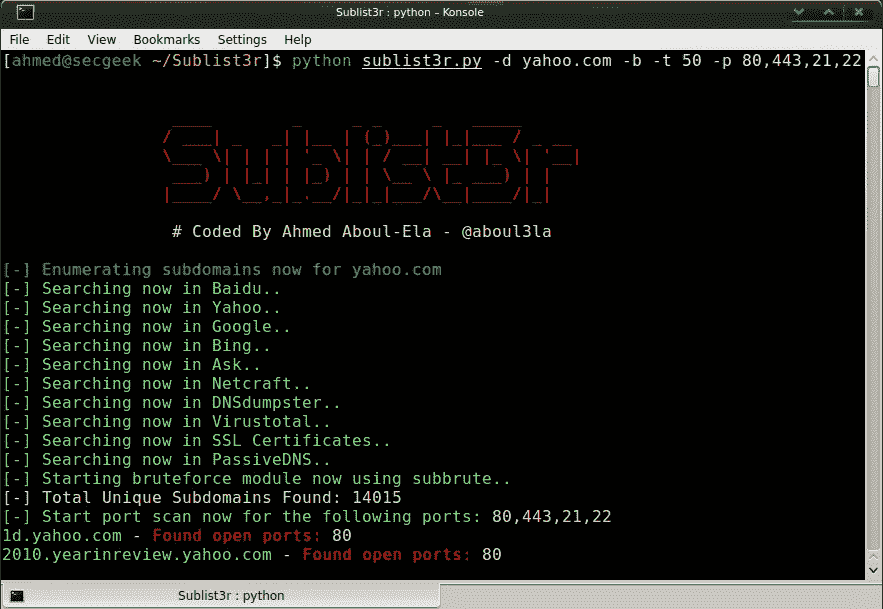
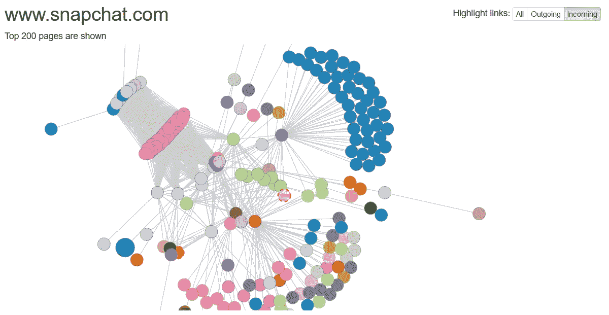
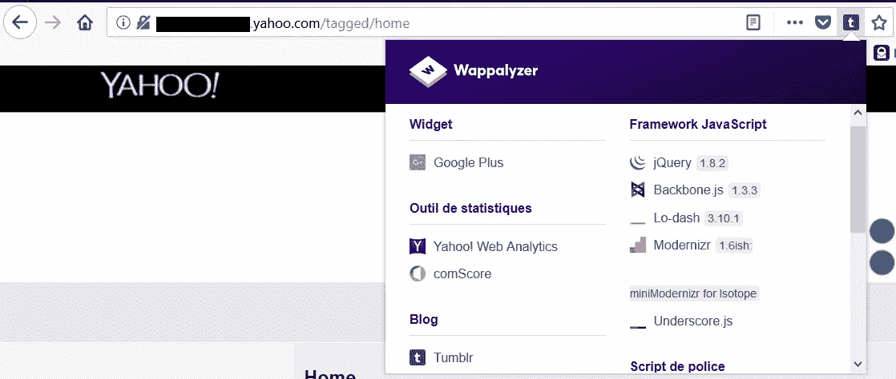
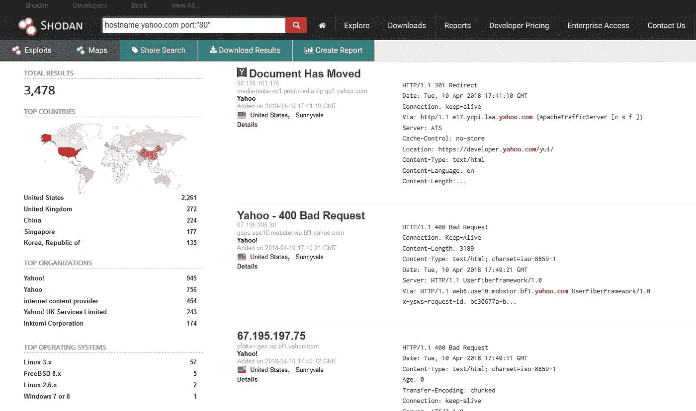
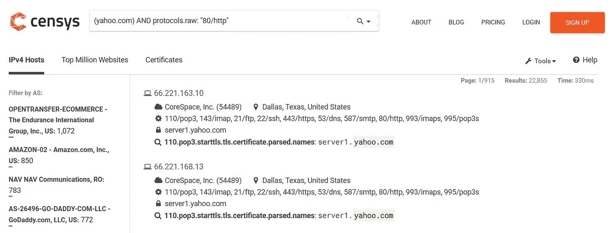
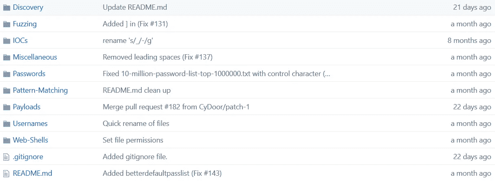

# 在#BugBounty 中，我使用什么工具进行侦查

> 原文：<https://infosecwriteups.com/whats-tools-i-use-for-my-recon-during-bugbounty-ec25f7f12e6d?source=collection_archive---------0----------------------->

嗨伙计们！这是我第一篇关于 Bug Bounty 的文章，希望你会喜欢！我是 [**YesWeHack**](https://yeswehack.com/hunters/hisxo) 上的一个 bug 猎人，我认为分享我所知道的关于侦查的事情很酷。

*我确实是 Bug Bounty 的初学者，你可能会在这篇文章中看到一些错误。随意评论或者* [***推特我***](https://twitter.com/adrien_jeanneau/) *！分享就是关爱！*

***向您致敬*** [***尼科、***](https://twitter.com/lestutosdenico) ***感谢您的帮助:)***

当我试着猎捕虫子的时候是我

# 先看规则

## “谢谢你，明显队长”

是的，这似乎是显而易见的…但我检查规则和范围。第一次检查有助于了解目标的许多情况:

*   *范围是什么？*
*   *哪些不该考？*
*   *接受什么类型的报告和漏洞？*
*   *已经报告了哪些漏洞？(例如在 HackerOne 上公开披露)*
*   *奖励$$$？*

一个程序的规则可以清楚地帮助理解 URL 的目的是什么等等。它可以节省阅读所有内容的时间，避免不必要地关注超出范围的领域或应用程序。

说实话，当我看到一个范围仅限于[*www.domain.com*](http://www.domain.com)而不是 **.domain.com* 的时候我就有点不那么热情了。但是对于学习来说，这可能很酷，因为我们只需要专注于一个领域，并理解目标是如何工作的。

# 用子列表 3r 枚举目标的子域

如何不谈**子列表 3r** ？这个工具太棒了，可以帮助你找到很多很多的子域。如果你的作用域是 **.domain.com* 你应该使用**子列表 3r** 。

> Sublist3r 是一个 python 工具，旨在使用 OSINT 枚举网站的子域。它帮助渗透测试人员和 bug 猎人收集和聚集他们所针对的域的子域。Sublist3r 使用 Google、Yahoo、Bing、Baidu、Ask 等多种搜索引擎枚举子域。Sublist3r 还使用 Netcraft、Virustotal、ThreatCrowd、DNSdumpster 和 ReverseDNS 枚举子域。
> 
> Subbrute 与 Sublist3r 集成在一起，通过改进的单词表增加了使用 bruteforce 找到更多子域的可能性。

你可以在这里下载**子列表 3r**:https://github.com/aboul3la/Sublist3r[T3](https://github.com/aboul3la/Sublist3r)

Sublist3r 是帮助查找子域的一个很好的工具

*不要忘记添加-O 参数将子域列表导出到 TXT 文件中。*

# 使用 Aquatone 枚举子域并检查子域接管

4 个月前，我发现了一个叫做 **Aquatone** 的工具。当你的范围是 **.domain.com* 时，这个工具就完美了。 **Aquatone** 可以列出子域并检查子域接管，还可以扫描大范围的端口。

> AQUATONE 是一套对域名进行侦察的工具。它可以通过使用开放源码以及更常见的子域字典暴力方法来发现给定域上的子域。发现子域后，AQUATONE 可以扫描主机的常见 web 端口和 HTTP 头，HTML 正文和屏幕截图可以收集并整合到一份报告中，以便轻松分析攻击面。

 [## michenriksen/aquatone

### aquatone——域名跨越工具

github.com](https://github.com/michenriksen/aquatone) 

## 关于子域接管的一些话

你应该勾选“ ***我能接手 XYZ*** ”。这是一个由 **Ed Overflow** (另一个很棒的家伙 [**跟随**](https://twitter.com/EdOverflow) )创建的 GitHub 库，你会知道是否有可能接管一个服务(GitHub pages、Heroku、CloudFront 等)使用的子域。) :

 [## EdOverflow/我能接管 xyz 吗

### 我能接管 xyz 吗？“我能接管 XYZ 吗？”-服务列表以及如何使用悬空 DNS 申请(子)域名…

github.com](https://github.com/EdOverflow/can-i-take-over-xyz) 

# 创建目标的全局视图

侦察部分是必不可少的。我需要几个月的时间来理解这一点，因为我专注于寻找漏洞。但是当你对它的地图没有一个真正的概念时，怎么可能找到它们呢？

网站地图有助于获得网站的全局视图。

当我试图列出所有端点、页面、文件夹、文件和其他有用的东西时，我认为我们有两件不同的东西:

*   **我们无需用户帐户即可访问公共页面**
*   **私人页面，只能通过用户帐户访问**

为了创建目标的第一张*全局图片*，我使用了在线工具**可视化站点映射器**[(www.visualsitemapper.com](http://www.visualsitemapper.com/))。这个工具将创建一个图形化的网站地图，并可以非常有用地列出公共网址，以了解网站如何工作以及背后的页面如何交互。

使用在线工具虚拟站点映射器创建目标的全局视图

现在我们有了一个有趣的 URL 列表，试着用 GET 参数检查 URL。在做了很多 Bug 悬赏之后，我发现这些 URL 总是更有趣。对于这一部分，我做手工测试。它可以是自动化的，但我更喜欢手动检查。脚本不能代替所有的手工测试。

# 告诉我你用的是什么，我会告诉你什么是潜在的漏洞

在您开始寻找漏洞之前，有必要了解您的目标使用什么技术来工作:

*   他们使用像 CloudFront 或 CloudFlare 这样的 WAF 吗？
*   *他们使用像 Wordpress、Drupal 或 Joomla 这样的内容管理系统吗？*
*   *他们使用类似 AngularJS 或 CakePHP 的框架吗？*
*   *Apache 的版本是什么？*
*   *他们用的是 Jinja2 或者 Smarty 之类的模板引擎吗？*

当您知道他们使用哪种技术时(如果您有版本就更好了)，这将有助于您查找漏洞。

> 例如:您的目标有一个 profil 页面，您可以在其中控制反映在公共页面上的输入(如姓名或昵称)。如果你知道框架的版本，你可以试试 XSS 或者其他的有效载荷！
> 
> 如果您的目标使用像 Smarty 这样的模板引擎，请检查版本并尝试模板注入！

为了获得关于目标的这些信息，我安装了一个名为 **Wappalyzer** 的插件。

插件 Wappalyzer 对于了解目标用途非常有用

这个插件可以在谷歌浏览器和火狐浏览器上运行。要使用它，你只需要去你的目标。您会看到 URL 旁边显示一个小图标。

如果你点击它，Wappaylzer 会显示你的目标的有趣信息。有时候你看不到这个版本，但不管怎样，它还是很有用的。

 [## 下载和安装

### 为 Chrome 或 Firefox 下载 Wappalyzer。

www.wappalyzer.com](https://www.wappalyzer.com/download) 

# 你是说谷歌呆子吗？

对于一个好的侦察，我不能忘记谷歌呆子和其他类似的提示。谷歌索引许多网址和文件，它可能是有用的尝试提取它们。

我建议你像这样使用谷歌呆子:

*站点:target.com -www
站点:target . com intitle:" test "-support
站点:target.com ext:php | ext:html
站点:subdomain.target.com
站点:target.com inurl:auth
站点:target.com inurl:dev*

要有创意！如果你想更多地了解这一点:[https://apollonsky.me/growth-hacking-google-dork](https://apollonsky.me/growth-hacking-google-dork/)

# Shodan.io:互联网连接设备的搜索引擎

如果要我用一分钟时间介绍 shodan.io，我会说它就像谷歌，只不过是服务器、物联网和所有可以连接到互联网的设备。

就像谷歌一样，你可以用一些“T21 呆子”来改进你的研究。以下是您可以使用的基本搜索过滤器:

*   *国家*:查找特定国家的设备
*   地理位置:你可以把坐标传给它
*   *主机名*:查找与主机名匹配的值
*   *网*:基于 IP 或/x CIDR 的搜索
*   *os* :基于操作系统的搜索
*   *端口*:查找开放的特定端口
*   *之前/之后*:在一个时间范围内查找结果

使用 shodan.io 上的“呆子”来改进你的研究

# Censys.io:另一个伟大的搜索引擎

Censys 是一个帮助发现、监控和分析可从互联网访问的设备的平台。我们可以将这个工具与 Shodan 进行比较。这是一个有趣的工具，您可以找到有关目标的信息，如开放端口、服务、服务器名称，如果他们使用 CloudFlare 等。

*   [https://censys.io](https://censys.io/)

censys.io

# 虫子赏金的完美词表

我小小的经历让我明白，目标总是有一个不应该公开的页面，不应该在这里，或者不应该在没有许可的情况下被访问。

为了帮助我发现这些“*秘密*”页面，我推荐这个优秀的 GitHub 知识库，在这里，令人敬畏的人分享他们的列表和知识。

> SecLists 是安全测试人员的伴侣。它是安全评估期间使用的多种类型列表的集合，集中在一个位置。列表类型包括用户名、密码、URL、敏感数据模式、模糊负载、web 外壳等等。目标是使安全测试人员能够将这个 repo 放到一个新的测试盒中，并访问可能需要的每种类型的列表。

 [## 丹尼尔·米斯勒/塞克里斯特

### SecLists 是安全测试人员的伴侣。它是安全期间使用的多种类型列表的集合…

github.com](https://github.com/danielmiessler/SecLists) 

我不能在这里写所有回购的内容。但是相信我，它已经多次帮助我发现敏感内容。

他们有一个所有常见扩展名的列表，像 php，asp，txt，bak，old，conf，config…还有很多有趣的文件名，有效载荷和模糊列表。

您可以使用此列表来发现内容、目录、子域、暴力密码…

GitHub 上一个很棒的 SecList

# 内容发现的两个好工具

要使用 **SecList** ，我建议您使用以下工具之一:

*   **搜索**:[https://github.com/maurosoria/dirsearch](https://github.com/maurosoria/dirsearch)
*   **Dirb :** 默认安装在 Kali Linux 上

您可以指定要使用的单词列表和扩展名文件或扩展名列表。该工具将逐一测试所有条目，您将在终端中直接看到结果。

# 查找隐藏的 GET & POST 参数

在 Bug Bounty 期间，我发现了一些有趣的参数。有时开发人员在 GET 或 POST 查询中隐藏参数，有时试图找到这些参数并向其中注入有效负载会很有趣。

为了帮助我完成这个任务，我使用了一个叫做 Arjun 的好工具。这个 python 脚本将强制使用 GET 和 POST 参数。试一试你就知道了！

 [## 终极黑客/Arjun

### Arjun 是一个 python 脚本，用于查找隐藏的 GET & POST 参数。

github.com](https://github.com/UltimateHackers/Arjun) 

# 打嗝套件是你的朋友，JS 脚本也是

浏览网站时，一定要先运行**打嗝套件**工具。我不会在这篇文章中解释**打嗝套件**是如何工作的，但是这个工具是你的朋友，你必须使用它。

*社区版(Burp 套件免费版)足够了，不用担心！*

有了 Burp Suite，您就有了一个列出和查找 ***的好选择。JS** 脚本。我建议您这样做，并将所有 JS 脚本导出到一个文件中。

如果你做 Bug Bounty，你可能知道 *Jobert Abma* (否则，跟着他[https://twitter.com/jobertabma](https://twitter.com/jobertabma))。他创造了一个叫做**相对 url 提取器**的工具。

这个 python 脚本真的很酷，它试图提取 JS 脚本中存储的 URL 端点。效果很好，帮了我很多次！

 [## jobertabma/相对 url 提取器

### 一个从文件中提取相对 url 的小工具。

github.com](https://github.com/jobertabma/relative-url-extractor) 

乔伯特创造了另一个认可的好工具。这叫做**虚拟主机发现**，这个脚本可以帮助你找到目标背后的 **Vhost** 。你会惊讶地发现有多少像“ *admin* ”或“ *beta* ”这样的 **Vhost** 目标没有得到适当的保护！

 [## jobertabma/虚拟主机发现

### 虚拟主机发现——枚举服务器上虚拟主机的脚本。

github.com](https://github.com/jobertabma/virtual-host-discovery) 

谢谢你把文章看完，希望对你有用，能帮你发现更多漏洞！随时在 Twitter 上 ping 我**！**

**我要感谢所有的猎人和 Bug 赏金社区！写报告和概念验证对学习❤至关重要**