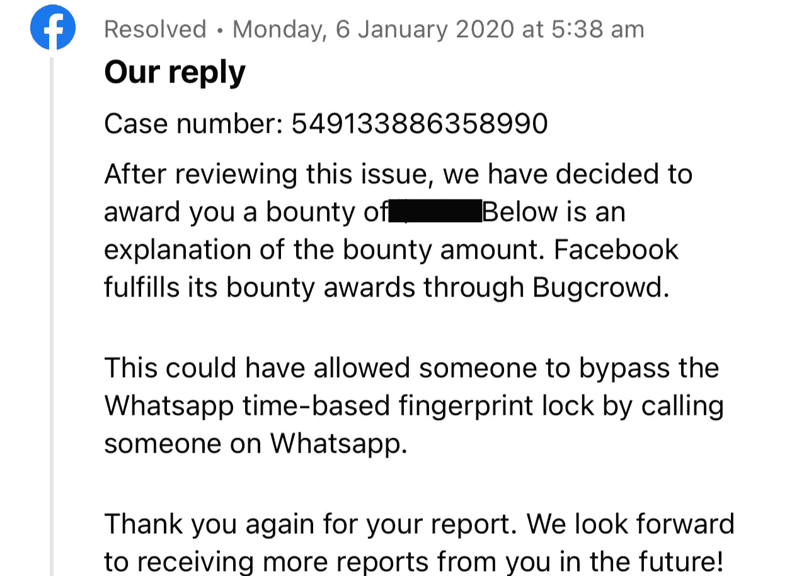

# WhatsApp Bug Bounty:使用 voip 绕过生物认证

> 原文：<https://infosecwriteups.com/whatsapp-bug-bounty-bypassing-biometric-authentication-using-voip-87548ef7a0ba?source=collection_archive---------0----------------------->


*注:根据负责任的披露政策，这是在脸书的许可下出版的。该漏洞现已修复。*

在 Android 中，WhatsApp 的“屏幕锁定”功能允许用户使用可用的设备生物特征凭证(指纹、Face ID、PIN 码和图案)来锁定应用程序。

“自动锁定”功能将在用户指定的持续时间后自动锁定应用程序。如果用户选择“1 分钟”，那么应用程序将在 1 分钟不活动后被锁定。

这里的问题是，如果用户在 1 分钟或以后收到某人的 WhatsApp 呼叫，那么应用程序无法锁定。因此，攻击者可以轻松地绕过生物识别锁，只需拨打电话并拒绝它就可以完全访问应用程序(阅读聊天，发送消息……)。

**旁路步骤:**

1.  启用生物识别锁定并设置自动锁定持续时间(1 分钟或任何时间)。
2.  关闭应用程序。
3.  1 分钟或之后，拨打该设备。
4.  拒绝来电，打开 WhatsApp。

# 技术根本原因

TL；博士；医生

自动锁定实现示例代码:

```
public class App extends Application { public void onCreate() {
    super.onCreate();
    registerActivityLifecycleCallbacks(activityLifecycleCallbacks);
  }

  ActivityLifecycleCallbacks activityLifecycleCallbacks = new ActivityLifecycleCallbacks() {

    public void onActivityResumed(Activity activity) {
       if(!excludedActivityList.contains(activity)) &&     
       SystemClock.*elapsedRealtime*() - getAppClosedTime() >=                 USER_SPECIFIED_DURATION) {
           lockTheApp();
        }
    }

    public void onActivityPaused(Activity activity) {
      saveAppClosedTime(SystemClock.*elapsedRealtime*());
    } };

}
```

*“任何屏幕不活动监听器”:WhatsApp 会在超时后自动锁定，即使用户从聊天、主页或设置屏幕等任何活动中最小化它。为了实现这一点，WhatsApp 在{Application.class}中注册了“活动生命周期回调”。*

**代码流程:**

1.  收到呼叫时，启动{CallActivity.class}。

2.调用结束后，将关闭{CallActivity.class}，并调用方法{onActivityPaused()}。

> 方法:onActivityPaused()
> 
> *将当前“设备运行时间”{SystemClock.elapsedTime()}存储为{app 关闭时间}。*

3.现在，当应用程序重新打开时，将调用方法{ onactivityrasered()}。

> 方法:onActivityResumed()
> 
> *计算当前“设备运行时间”和存储的{应用关闭时间}之间的“时间差”。如果是>{用户指定时长}，那么只有它会锁定 app。*

现在无法锁定是因为通话结束后保存了{app 关闭时间}，“时差”为< {user specified duration}.

```
public void onActivityPaused(Activity activity) {
    if(!excludedActivityList.contains(activity)) {             
        saveAppClosedTime(SystemClock.*elapsedRealtime*());
    }
}
```

**修正:**

每当暂停/恢复应用程序的任何活动时，都会调用{ onactivityphansted()}和{ onactivityphansted()}方法。

因此，可以通过检查活动类名并在{CallActivity.class}不保存{app closed time}的情况下修复此问题。



感谢阅读这篇文章。

推特:[https://twitter.com/ar_arv1nd](https://twitter.com/ar_arv1nd)

Infosec Writeups 团队刚刚完成了我们的第一次虚拟网络安全会议和网络活动。我们有 16 位出色的演讲者，他们主持了非常有价值和鼓舞人心的会议。要查看发言人名单和主题，并终身获得所有 16 场演讲的录音版本，请点击此处。

[](https://iwcon.live/) [## IWCon2022 — Infosec 书面报告虚拟会议

### 与世界上最优秀的信息安全专家建立联系。了解网络安全专家如何取得成功。将新技能添加到您的…

iwcon.liv](https://iwcon.live/)