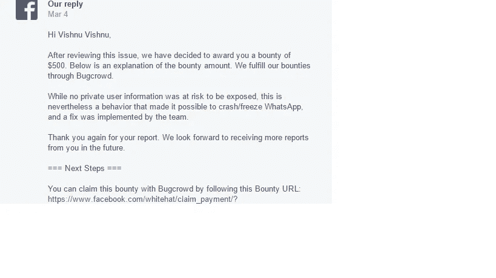

# IOS 和 ANDROID 中的 WHATSAPP-DOS 漏洞

> 原文：<https://infosecwriteups.com/whatsapp-dos-vulnerability-in-ios-android-d896f76d3253?source=collection_archive---------1----------------------->

读者你好，)

今天，我想和你们分享我对脸书一个发现；他们悬赏 500 美元买这只虫子。

好了，介绍一下吧。

在我寻找 bug 的职业生涯中，我一直在寻找脸书的 bug，我总是试图在他们的收购、子域和主域中找到一些东西，但我得到的都是许多重复的东西，有些 bug 被拒绝了，但无论如何我都不会放弃(XSS、CSRF、身份验证和会话管理失败等)..)有一天我有了一个绝妙的主意:在 whatsapp 上找点东西，脸书是一家收购了 50 多家公司的公司，其中包括 WhatsApp。WhatsApp 的收购以 190 亿美元的高价完成，WhatsApp 应用程序可用于 Android、IOS、Windows phone 和 pc。

如你所知，在 WhatsApp 上你可以和你的 WhatsApp 好友聊天..所以我想了很多关于我能找到什么类型的 bug..是的，有史以来最简单的 bug，DOS。

在这次经历之前，我看到有研究人员在脸书主域和 facebook messenger app 中发现了一些类似的 bug，于是我就教了..“我能”，然后我开始打猎。

老实说，我的想法是找到一个缓冲区溢出(这是一个坏主意，因为我不清楚:) )错误，但后来，在一些研究发布后，如果我们谈论缓冲区溢出和 Dos，这是完全不同的。

其实我已经举报过这个 bug，标题是:《WhatsApp Messenger 安卓应用上的缓冲区溢出漏洞》，但是我错了，只是一个简单的 Dos 无论如何，脸书安全团队接受这个问题，这才是最重要的！:)

我在考虑通过向受害者发送一条包含恶意有效载荷或特殊字符的消息来破坏 WhatsApp 应用程序。

这是最精彩的部分，伙计们，我是如何为 dos 错误找到这些特殊字符的..你有没有在 facebook 上看到过，你的时间线上有这样的人物:[https://pastebin.com/7aSNKVaV](https://pastebin.com/7aSNKVaV)，看看这里的特殊人物..你可以想象我的想法。(有史以来最好的主意..因为有时我们需要运用想象来寻找有趣的东西)

我决定创建一个联系人文件，并在共享的联系人姓名区域添加一些表情符号和“特殊字符”。然后我分享了这个联系人 victom。我打开他的聊天，手机屏幕变黑，bamm whatsapp 崩溃了，我有时提示重启！！

起初，脸书安全团队不理解我的问题，但经过澄清后，他们将我的问题发送给了相应的团队

嗨毗湿奴，

我们已经调查了这个问题，并认为该漏洞已被修补。如果您认为该补丁不能解决这个问题，请与我们联系。

谢谢，

伦
安全

3 月 4 日，发布了新的 IOS/Android Messenger 应用程序，其中包含对我的问题的修复..是的，我得到了 500 美元的赏金:

嗨毗湿奴毗湿奴，

在审查了这个问题之后，我们决定奖励你 500 美元。下面是赏金金额的说明。我们通过 Bugcrowd 完成我们的赏金。

虽然没有私人用户信息暴露的风险，但这种行为使得 WhatsApp 有可能崩溃/冻结，该团队已经实施了修复措施。

再次感谢您的报告。我们期待将来收到您更多的报告。

===后续步骤===

现在，我的名字出现在“2017 年”部分。)

“代表超过 10 亿的用户，我们要感谢以下人员向我们做出了负责任的披露:”这个页面说 facebook.com/whitehat/thanks,，我也要说谢谢脸书安全团队的合作和奖金，也为增加我的名字在那里，在这个世界上最重要的名人堂之一！:)

我们今天学到了什么？发挥你的创造力，在 IOS/Android 等上搜索 bug，努力工作，你就会看到结果。

希望我们会喜欢这篇文章，再次感谢所有的支持！

时间线:

2017 年 1 月 15 日--初步报告已发送。

2017 年 2 月 7 日——Aaron 通知我他们会调查这个问题。

2017 年 2 月 16 日——Aaron 通知我，漏洞已经修复。

2017 年 3 月 4 日奖励 500 美元:)

为下一篇文章保持敬畏！

干杯，

。/毗湿奴:)