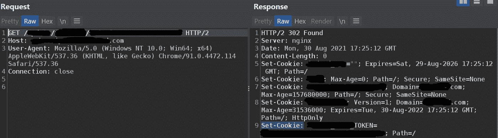
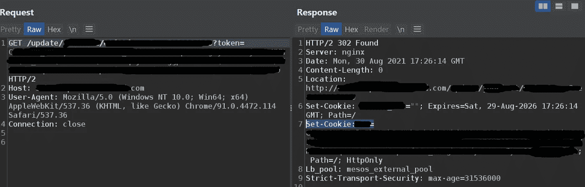
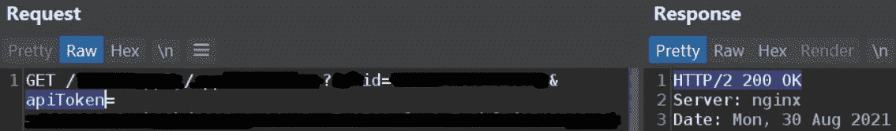

# 当自动化 wayback 机和 ffuf 不是答案时，或手动分析 ftw

> 原文：<https://infosecwriteups.com/when-automating-wayback-machine-and-ffuf-is-not-the-answer-or-manual-analysis-ftw-d100e8f39d77?source=collection_archive---------0----------------------->

返程机器是快速侦察的绝佳资源。它有助于找到有时模糊的路径和端点，具体到该公司命名的方式，不在任何公共单词列表中的单词和路径。当有太多的端点需要手动分析时，快速分析这些端点的方法是使用 ffuf 或等效方法。但是，如果那些根据 ffuf 不符合 200 的端点实际上仍然有用呢？

**破碎的拼图** wayback machine 中有一些没有任何意义的端点，通常是因为它们似乎属于 js 文件或 html 源代码(即 html.onmouseover、innerHTML.onfocus 等。)并且从不或者很少是正确链接的一部分(除非它是 xss 有效负载)。这些都没用。但也有“坏”的，有意义的，如果你想把它全部留给自动化，这可能意味着你会错过一些很酷的东西。

**拼凑** 有一次，我发现自己有一个看似有趣的端点列表。它有标记，这些端点的命名暗示了一个非常有趣的 IDOR。我使用 ffuf 快速验证了什么值得一看，ffuf 确实找到了一些有效的端点。尽管如此，由于列表很大，而且它有参数，我想，让我们看看在攻击参数时是否能得到更多的东西，比如 xss/ssrf/sqli/rce。
查看列表，我注意到端点之间有相似之处，比如，一些端点缺少令牌参数，而另一对端点却有令牌参数。然后一些端点暗示连接到总的 api，但是给出 403，因为它们需要令牌 param。

下面是两种 302 重定向的示例，具体取决于令牌是否存在:

我不得不屏蔽一堆东西，但下一个截图会让这个更有意义

注意位置头和相当大的 Set-Cookie 值

这里是一个没有 api 令牌的端点的示例，然后它如何使用在 wayback 机器中找到的有效 api 令牌进行响应:

如您所见，只有一个参数，响应是 400 错误请求

这里您可以看到一个额外的参数 apiToken，响应是 200 OK

**两种类型的断开链接** 现在，我几乎可以看到有两种类型的断开链接:
1 —一些 api 密钥不适用于一个端点，但另一个端点具有有效的 api 密钥，这意味着我们刚刚获得了一个额外的 api 端点。
2-某些端点需要额外的路径或参数，或者两者都需要。它不必是一个特殊的键，它可以是请求有效并给出有效响应所必需的，否则，它将给出 404 或 400，甚至 301/302/500，这取决于配置。

另一个教训/风险提醒是，当依赖自动化验证时，即使是像 wayback machine 的存档端点这样简单的事情。换句话说，有时是手动分析规则。:)