# 当集群遇到网络安全时:

> 原文：<https://infosecwriteups.com/when-clustering-meets-cyber-security-24ed8d5392ad?source=collection_archive---------5----------------------->

## 机器学习和算法:

## 无监督方法:

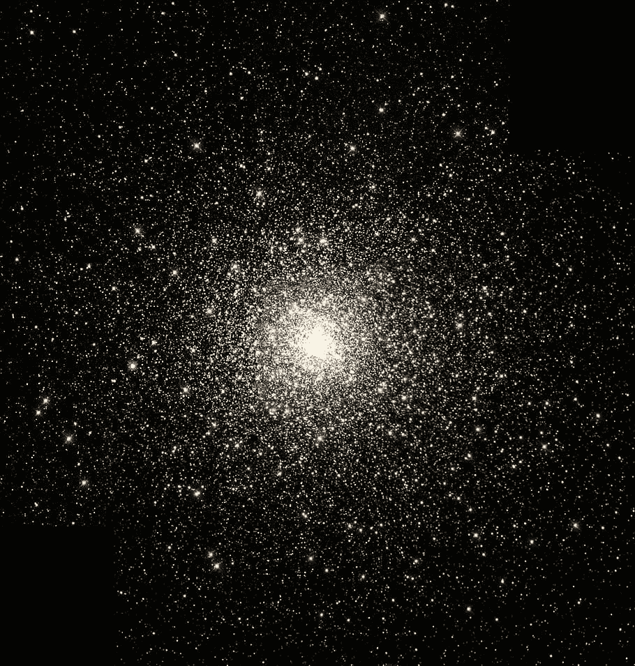

[https://C1 . wallpaperflare . com/preview/299/412/959/star-clusters-global-cluster-star-star-formation . jpg](https://c1.wallpaperflare.com/preview/299/412/959/star-clusters-globular-cluster-star-star-formation.jpg)

你们好，可爱的人们。我希望你做得很好，不断进步，并从工作和学习中获得最大收益。我们又回到了数据科学领域中最不受重视的话题之一，这也是学习和使用最重要、最愉快的话题，也是许多算法和机器学习模型的基础。例如，在聚类介绍中，我们将看到一系列内容，如它如何工作、如何实施、我们为什么使用聚类、聚类中使用的算法、如何通过不同的算法识别数据模式等等。

所以让我们开始吧。

让我们从头开始看

## 机器学习的定义。

→机器学习(ML)是对计算机算法的研究，它根据经验(即历史数据)自动学习和改进，而无需显式编程。

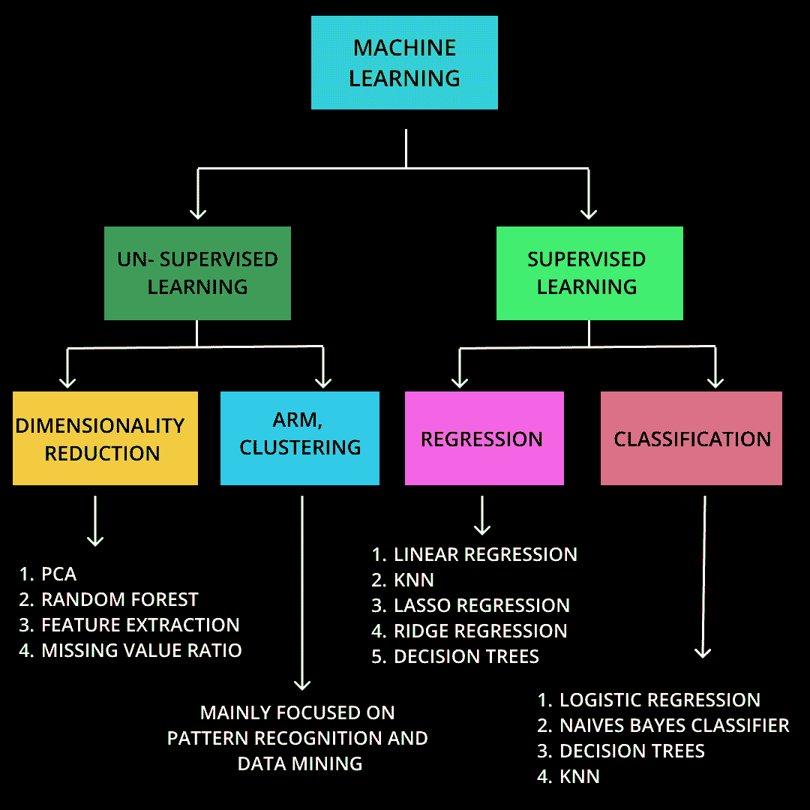

作者图片

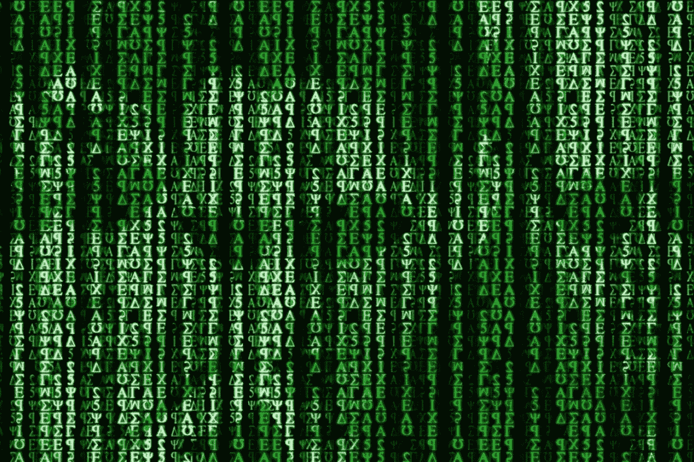

[https://I . pinimg . com/564 x/7d/E0/5a/7de 05 a 6b 16 c 82 c 80 ca 1d 88 a 82 ea 6727 c . jpg](https://i.pinimg.com/564x/7d/e0/5a/7de05a6b16c82c80ca1d88a82ea6727c.jpg)

尝试用 2 分钟分析上面的图像；你能认出任何图案或图像吗？

如果是这样，恭喜你。如果没有，放松；你没有错过任何东西；只需缩小前面图像的尺寸，然后再次进行分析。

## 聚焦无监督机器学习:

1.  从未标记的结构中推断出描述隐藏结构的函数的任务

数据=无监督学习

*   分布/概率密度函数
*   汇总统计数据

2.用于从包含无标记响应的输入数据的数据集进行推断的算法。

## 监督学习和非监督学习的最大区别:

1.  监督学习和非监督学习之间的主要区别是对标记训练数据的要求。无监督学习使用未标记的或原始的数据，而监督学习使用标记的输入和输出训练数据。
2.  由于提供给学习者的示例是未标记的，因此评估潜在解决方案不会有错误——这将无监督学习与有监督学习区分开来。

## 尝试理解数据中的模式

理解数据模式时我们需要问的问题:

1.  哪个(些)值出现得最频繁？
2.  数据差异有多大？
3.  数据围绕中心变化的对称程度如何？
4.  数据是否围绕值聚集在一起？
5.  数据“集中”的子空间

让我们分析以下数据，了解一些集群的基本概念，以及在执行集群时我们需要记住的内容:

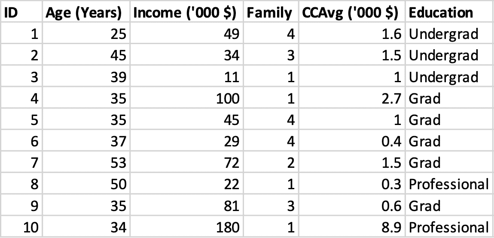

作者图片

## 聚类:

在许多数据科学应用中，另一种重要的联系是数据集各行之间的相似性。这就是所谓的集群。

## 例如:

1.  各列之间的关系:我们可能需要了解年龄和收入是否相关，或者收入和家庭规模是否与信用卡平均余额相关。
2.  行之间的关系:另外，我们需要知道人 3 是否与人 6 相似，人 4 是否与人 5 或 9 相似，等等。我们可以根据人们的相似程度来对他们进行分类吗？

## 快速问题第一部分:

我们什么时候可以对数据进行聚类？当然，我们不能随机聚集任何数据。

所以，

1.彼此相似(接近)的数据实例在同一个集群中。

2.彼此不同(相距很远)的数据实例位于不同的集群中。

## 集群的质量/类型:

## 1.集群内凝聚力(紧密度):

内聚性衡量聚类中的数据点与聚类质心的接近程度。

## 2.集群间分离:(隔离):

分离意味着不同的质心应该彼此远离。

**注意:距离的概念是以上所有内容的中心。**

## 快速问题第 2 部分:

**我们刚刚了解了距离、分离和隔离，但是，如何准确地计算距离呢？**

不用担心:这就是数学的数值方法发挥作用的地方。

## 方法 1:欧几里德距离或 L 范数:

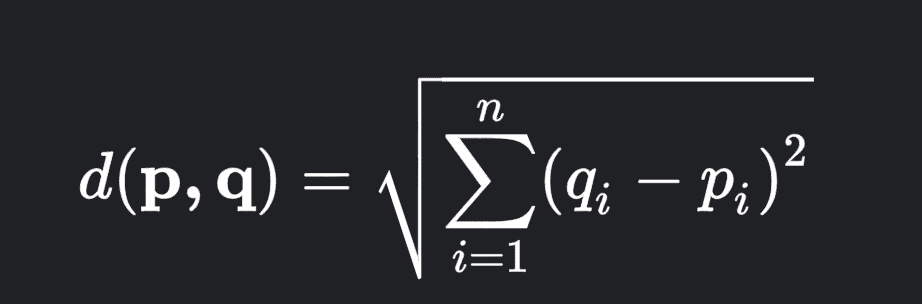

[https://www . gstatic . com/education/formulas 2/472522532/en/euclidean _ distance . SVG](https://www.gstatic.com/education/formulas2/472522532/en/euclidean_distance.svg)

**符号:**

p，q =欧几里德 n-空间中的两点。

pi，qi =欧几里得向量，从空间的原点(初始点)开始

n = n 空间

## 方法 2:曼哈顿距离或 L1 范数:

曼哈顿距离也称为城市街区距离，通过公式计算得出

|x2-x1|+|y2-y1|

## 方法 3:闵可夫斯基距离或 LQ 范数:

公式:

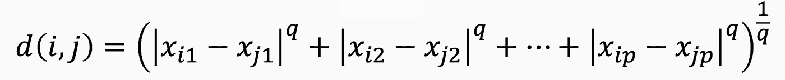

[https://cdn-images-1 . medium . com/max/800/1 * iu0 jikfxjqgekhtwxpoiiw . png](https://cdn-images-1.medium.com/max/800/1*IU0JIkFXjqGEKHtwxPoIiw.png)

## 注意:

无监督和有监督学习以及各自的算法都是工具，我们只需要明白什么时候用什么！

不浪费太多时间，让我们转到博客的另一个更有趣的部分，即理解关联规则挖掘和其他相关的东西。

## 聚类有几种有趣的算法可供尝试:

**1。K-MEANS:**

K-MEANS 是一种分割聚类算法，因为它将给定的数据分割成 K 个聚类。

1.每个聚类都有一个聚类中心，称为质心。

2.k 由用户指定。

**2。凝聚层次聚类:**

这是一种分层聚类算法，因为它创建了聚类和子聚类的层次结构。

1.从每个点开始，作为一个单独的集群。

2.重复合并两个最接近的聚类，直到出现一个单一的、无所不包的聚类。

**3。数据库扫描:**

这是一个基于密度的分区聚类算法。

1.聚类数由算法自动确定。

2.低密度区域中的点被分类为噪声并被省略。

## 让我们深入研究这些算法，看看它实际上是如何工作的？

## k 均值聚类:

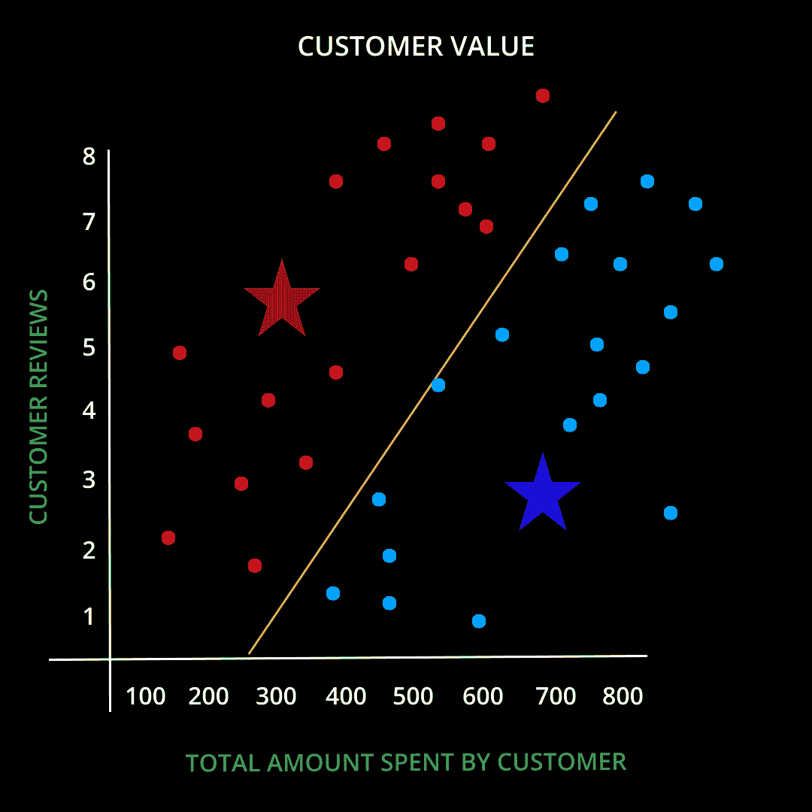

作者图片

**试着分析一下图形。**

让我们简单看看上图中的情况以及 K-means 聚类的工作原理。

1.  假设 K =2
2.  因此，这里的两个质心(红星和蓝星表示为质心)是随机初始化的。
3.  更靠近质心的点被分配给该聚类。
4.  简而言之，重新计算每个簇(质心)中的点。

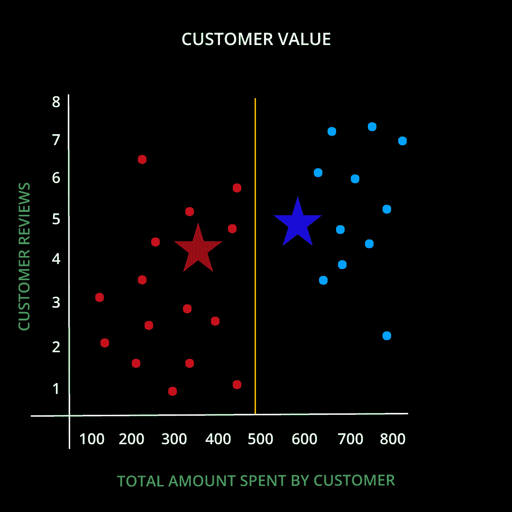

作者图片

**这里发生了什么？**

在上面的图中，点被重新分配给它们的质心(星)更接近的簇，并且该过程重复直到算法收敛。

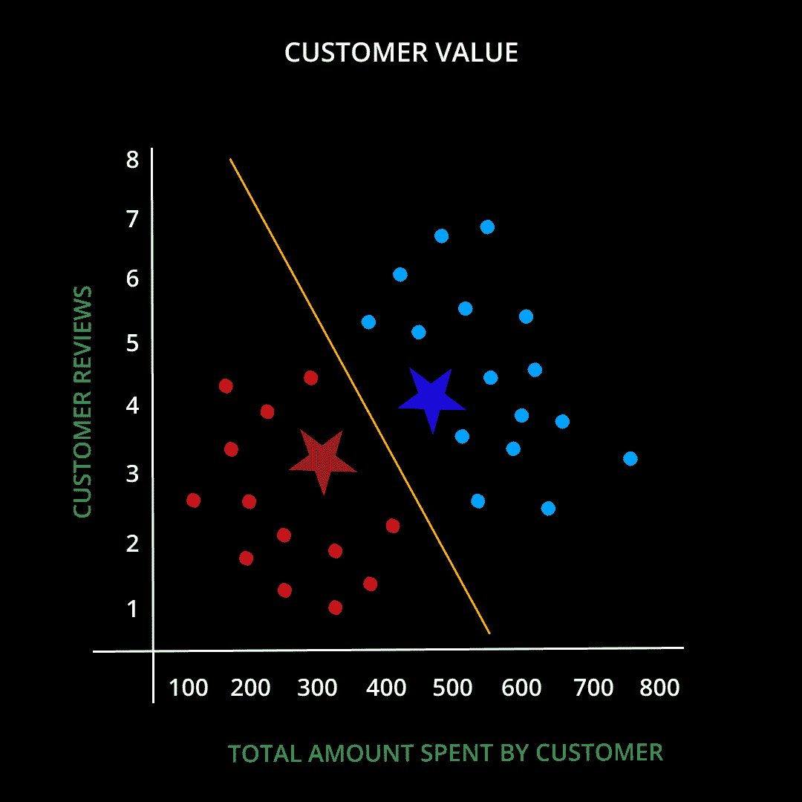

作者图片

**最终图形**

最后一步包括不再改变质心的位置，因为聚类算法已经收敛。

## 我们到目前为止在 K-MEANS 聚类中所看到的内容的简短总结:

→给定 K，K 均值算法工作如下:

1.  随机选择 K 个数据点(也称为种子，我们取 k = 2)作为初始质心(即聚类中心)。
2.  将每个数据点分配给最近的质心
3.  使用当前群集成员重新计算质心。
4.  如果不满足收敛标准，或者如果一些聚类没有得到任何点，则再次转到步骤 2 并重复。

## 到底什么是停止或收敛标准:

1.  没有(或最少)将数据点重新分配给不同的集群
2.  质心无变化(或变化最小)。
3.  或者成本函数的最小减少，误差平方和(SSE)，

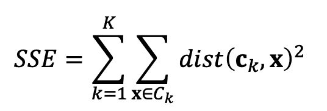

[https://www . gstatic . com/education/formulas 2/472522532/en/residual _ sum _ of _ squares . SVG](https://www.gstatic.com/education/formulas2/472522532/en/residual_sum_of_squares.svg)

**符号:**

其中 Ck 是 k^th 聚类，ck 是聚类 Ck 的质心(Ck 中所有数据点的平均向量)，距离是两个对象之间的标准欧几里得距离。

## 要记住 K-MEANS 的局限性:

1.  随着 SSE 的增加，离群值可能会导致问题，或者小集群可能会与离群值结合在一起，从而提供不自然的集群。
2.  无法正确处理分类数据或混合数据。
3.  最初，当质心是随机的时，结果可能会根据簇的不同而不同。
4.  非凸簇处理不好。

## K-MEANS 局限性的解决方案:

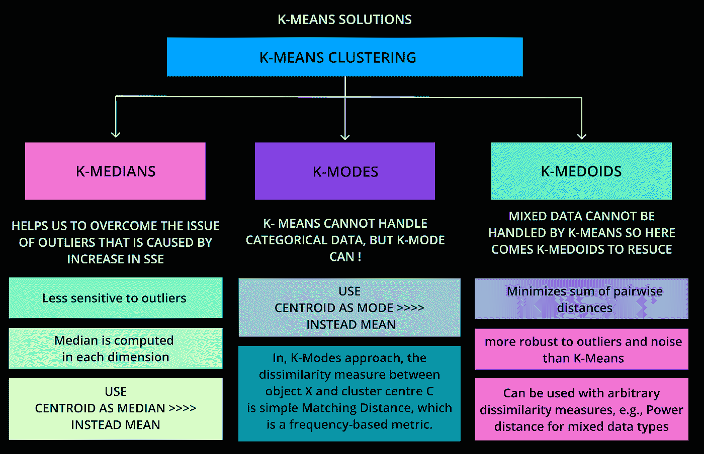

作者图片

向前发展…

## 2]凝聚层次聚类(AHC):

## AHC 算法的工作原理:

1.  首先将所有点作为单独的聚类，也就是将每个项目分配到它自己的聚类中，这样，如果你有 N 个项目，你现在有 N 个聚类，每个聚类只包含一个项目。
2.  在每一步，合并两个最接近的集群，直到只剩下一个集群
3.  计算新分类和每个旧分类之间的距离(相似性)。
4.  重复第 2 步和第 3 步，直到所有项目都聚集成一个大小为 n 的簇。

## 要记住的关键操作:

1.  这需要聚类邻近度的定义，即距离矩阵或邻近度矩阵。所以，这也是一种类似 K-Means 的基于距离的算法。
2.  各种凝聚层次技术的区别在于它们定义邻近性的方式。

## 它与 K-MEANS 算法有什么不同？

1.  k 没有被指定为先验的。但是，需要一个终止条件。
2.  因为每对点之间的距离是为邻近矩阵计算的。

## 示例:

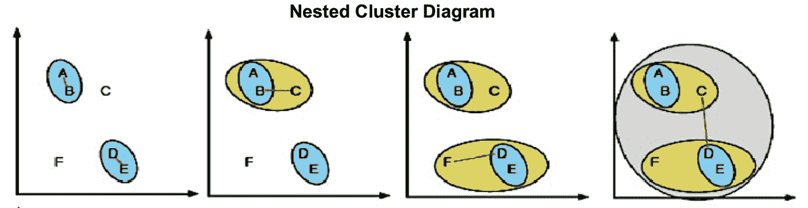

[https://www . researchgate . net/profile/Carsten-Walther/publication/273456906/figure/fig 3/AS:294866065084419 @ 1447312956501/Example-of-hierarchical-clustering-clusters-is-successfully-merged-with-the-most . png](https://www.researchgate.net/profile/Carsten-Walther/publication/273456906/figure/fig3/AS:294866065084419@1447312956501/Example-of-hierarchical-clustering-clusters-are-consecutively-merged-with-the-most.png)

## 让我们了解一下群集之间的邻近距离:

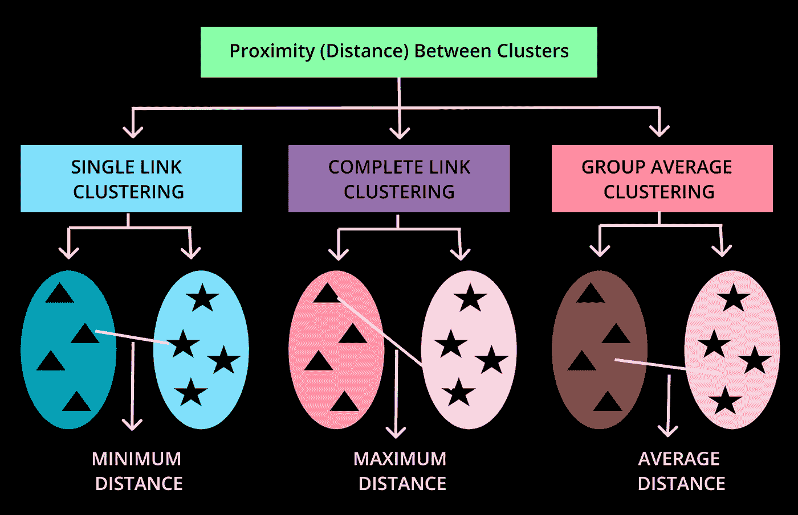

作者图片

## 最不喜欢 NOTT:

## 3]DBS can:[带噪声的应用程序的基于密度的空间聚类]:

**DBSCAN 处理三种类型的数据点，即**

**1。核心要点:**

如果一个点在 eps 中有超过个分点，那么它就是核心点。

1。EPS =通常，当我们谈论密度时，通常困扰我们的问题是如何估计密度，因此在这里，密度是通过计算数据集中特定点的指定半径 EPS 内的点数来估计的。

**2。MinPts** =这里 MinPts 是 eps 半径的最小数据点数的缩写形式。最小值必须等于 3。

**经验法则:如果有“p”个变量，那么 min pts>= p+1】**

**2。边界点:**

在 eps 中比 MinPts 低但在核心点邻域内的点。

**3。噪声点或异常值:**

既不是核心也不是边界的点。

## 算法的工作原理:

1.从 x 中随机选取一个从未被访问过的数据点。

2.如果 eps 内的点数> MinPts，则创建一个聚类；否则将其标记为噪声

a.对于这个新群集中的每个点，重复(ii)

3.重复，直到所有的点都用尽。

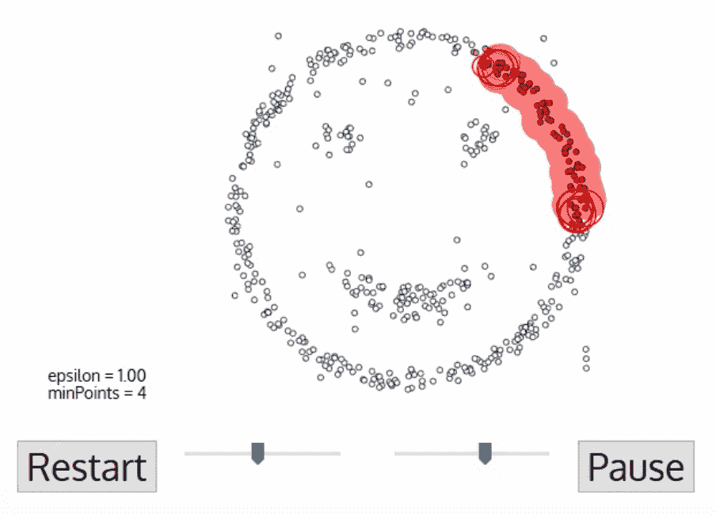

[*https://cdn-images-1 . medium . com/max/1600/1 * tc8UF-h0 nqquflc 8-0 uinq . gif*](https://cdn-images-1.medium.com/max/1600/1*tc8UF-h0nQqUfLC8-0uInQ.gif)

## 集群符合网络安全:

网络安全集群可用于多种目的，包括:

聚类分析简单地说就是将在整个网络中发现的彼此相似的数据点分组，以揭示隐藏和异常的活动模式，并检测网络安全攻击，否则通过从单个数据点分析整个问题将无法检测到这些攻击。

我试图展示我们如何利用聚类分析来定位恶意软件数据集中的模式，因为聚类是一种无监督的机器学习方法，能够检测奇怪的恶意软件攻击模式并识别恶意软件行为。

在这种情况下，我实现了 K-means 聚类检测技术，根据恶意软件的属性来检测数据中的恶意软件行为。找到之前案例研究的 Jupyter 笔记本，请在最后告诉我们您的发现:)

## GITHUB GIST :❤️

**从卡格尔那里拿到问题陈述:在这里提交👇🏻**

[https://www . ka ggle . com/datasets/piyushrumao/malware-executable-detection](https://www.kaggle.com/datasets/piyushrumao/malware-executable-detection)

**关注我们学习数据科学博客和文章的乐趣:**

领英**:**[https://www.linkedin.com/company/dsmcs/](https://www.linkedin.com/company/dsmcs/)

https://www.instagram.com/datasciencemeetscybersecurity/?hl=en

GITHUB:[https://github.com/Vidhi1290](https://github.com/Vidhi1290)

https://twitter.com/VidhiWaghela

中:[https://medium.com/@datasciencemeetscybersecurity-](https://datasciencemeetscybersecurity.blogspot.com/)

**-团队数据科学遇上网络安全❤️💙**