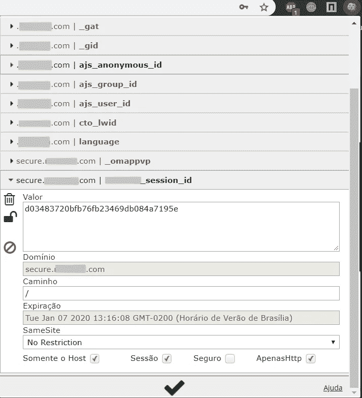
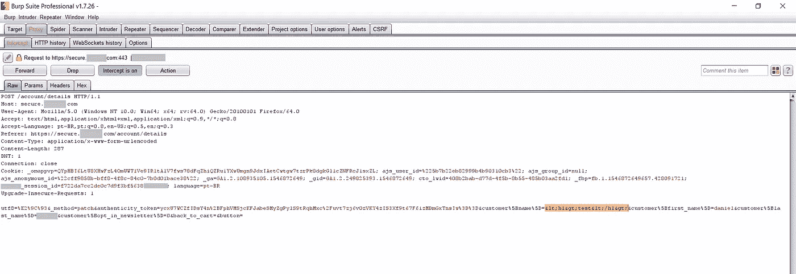
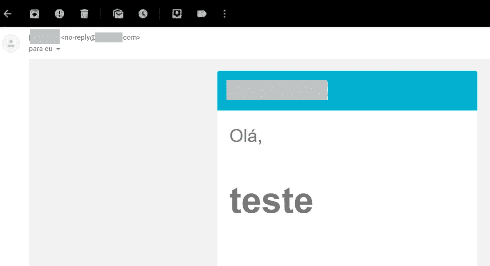

# 当 Cookie 劫持+ HTML 注入变得危险时

> 原文：<https://infosecwriteups.com/when-cookie-hijacking-html-injection-become-dangerous-3c649f7f6c88?source=collection_archive---------0----------------------->

朋友们好，

这一次，我将展示我如何获得 html 注入，以及我如何利用 cookie 劫持漏洞将它变成一个危险的漏洞。

**HTML 注入和 Cookie 劫持:**

> HTML 注入是一种注入问题，当用户能够控制输入点并能够将任意 HTML 代码注入易受攻击的网页时，就会发生这种问题。此漏洞可能会产生许多后果，例如泄露可用于冒充受害者的用户会话 cookies，或者更一般地说，它可能允许攻击者修改受害者看到的页面内容。
> 
> 会话劫持攻击包括利用 web 会话控制机制，该机制通常针对会话令牌进行管理。

**发现阶段:**

这一次，我必须对客户信息屏幕上的每个输入进行手动测试。我注意到输入没有得到预期的验证，但是如何利用这种类型的 vuln，因为它需要登录帐户来“激活”HTML 代码？

**第一次尝试:**尝试利用 CSRF 登录漏洞，攻击者向受害者发送定制代码，登录攻击者自己的账户。大概是这样的:

```
<html>
  <! - CSRF Login PoC ->
  <body>
  <script> history.pushState ('', '', '/') </ script>
    <form action = "https://private-company.com/account/signin" method = "POST">
      <input type = "hidden" name = "customerlogin" value = "attacker-email@gmail.com" />
      <input type = "hidden" name = "customerpassword" value = "attacker-password" />
      <input type = "submit" value = "Submit request" />
    </ form>
  </ body>
</ html>
```

上面的代码没有成功，因为该公司已经通过令牌处理了其客户的登录。

**第二次尝试:**

饼干劫持！攻击成功是因为托管用户会话的令牌在注销功能后没有过期。浏览器中的 cookies 会一直存在，直到被手动清除。下面我来展示一下:

1.  我用一个测试账户登录，然后点击“注销”。请注意，在下面的屏幕截图中，注销后 cookies 仍然存储在浏览器中:



2.请注意，管理客户端会话的 cookie 的有效期是一年。

3.我用工具( [edit this cookie](https://chrome.google.com/webstore/detail/editthiscookie/fngmhnnpilhplaeedifhccceomclgfbg?hl=pt-BR) )复制了 cookie，访问了浏览器 Mozilla Firefox，用之前截图中的值手动添加了 cookie，然后……**完成了！**我被重定向到受害者的个人资料。


伟大的成果！是时候练习 Html 注入并结合这些漏洞进行更有效的演示了。

如前所述，参数“customer_name”容易受到 html 注入的攻击。为了确认故障的存在，我用 burp suite 拦截了请求，并在名称中插入了一个 H1 标记:



有效载荷之后，我给自己的账户发了一封密码恢复邮件:



漏洞成功确认！

**可能性:**

由于 name 参数容易受到 html 注入的攻击，所以可以定制一个 HTML 代码，使其看起来像一个表单，只对用户可见，对吗？也许…

让我们记住，还有一种 cookie 劫持 vuln，它允许攻击者捕获浏览器中存储的 cookie，并登录到受害者的帐户。如果应用程序在公共环境中被访问，例如局域网，那么有几种方法可以利用这个漏洞。

1.  受害者在一个局域网上登录了他的账户。在对公司的应用程序进行操作后，受害者通过注销功能离开账户。
2.  *攻击者访问与受害者相同的公共计算机，捕获 cookies 并登录受害者的帐户。*
3.  *攻击者定制一个新的 HTML 代码并插入到易受攻击的字段中。*
4.  *受害者在重新访问帐户(在另一台设备上)时，开始看到攻击者定制的“新页面”。*

当然，这需要受害者自己的互动，然而，著名的网络钓鱼攻击会有效得多。

就是这样，黑客！希望你喜欢。

在 [Linkedin](https://www.linkedin.com/in/daniel-morais-968463120/) 找到我。