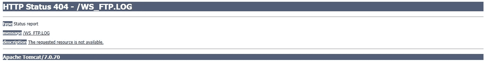
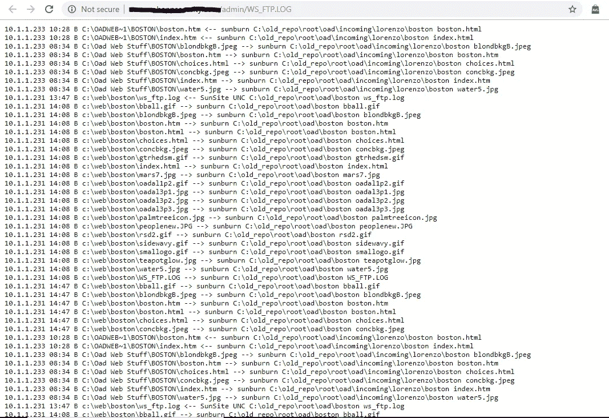

# 当我通过调试信息(cgi 脚本)和 ws-ftp 日志找到错误日志时

> 原文：<https://infosecwriteups.com/when-i-found-error-logs-through-debug-information-cgi-scripts-and-ws-ftp-log-796470a71bea?source=collection_archive---------1----------------------->

在评估过程中，我在 xyz.com 上找到了披露错误日志的调试 URL..

抱歉我不能透露网站名称…

让我们开始…

当我开始侦察并试图找出这个程序的漏洞时。

我尝试了很多东西，比如 xss，idor，nd 等等。(无斑点)

当我试图找到 xss 时..然后大部分时间我都出错了(xyz.com/errors)

一天后，我尝试了一些不同的有效载荷和许多东西，但没有工作。

我尝试的任何东西(随机 xss 有效负载)总是重定向一个页面(xyz.com/errors)

几个小时后，我试着这样做

获取/错误/errors.log HTTP/1.1

然后…

乔丹·马蒂厄在 [Unsplash](https://unsplash.com?utm_source=medium&utm_medium=referral) 上的照片

你看到这个了吗

下次你遇到一些错误，你重定向一些错误页面，请尝试/errors.log。可能是你增加银行存款的一个步骤。

让我们继续前进…

然后我试着浏览这个网站，发现了一些关于 WS_FTP 的好东西。

首先让我们来看看 WS_FTP

在您的 web 应用程序中发现了一个严重的 WS_FTP 漏洞。WS_FTP 是一个流行的 Windows 客户端，系统管理员和开发人员利用它从 web 服务器上传和下载文件，默认情况下，每次传输都记录在日志文件中。与攻击者发现 WS-FTP 日志文件相关的风险源于这样一个事实，即应该保持隐藏的文件，如管理或维护应用程序、web 应用程序配置文件或应用程序数据文件，可能会变得可见。建议包括从应用服务器中删除 WS_FTP 日志文件，并配置 WS_FTP 使其不创建日志文件。

当 WS_FTP 用于传输文件时，服务器上会创建一个名为“ws_ftp.log”的日志文件。该日志文件包含 WS_FTP 访问的每个文件的记录，这可能包含对攻击者非常有价值的信息，因为它可能会列出本来“隐藏”的文件这通常包括管理或维护应用程序、web 应用程序配置文件、开发中的应用程序、备份的应用程序源代码和可能的应用程序数据文件。

首先，WS_FTP 日志文件对攻击者很有价值，因为它们显示了目录中的所有文件，而不仅仅是打算使用的文件。攻击者通过在您的 web 应用程序服务器上发现 WS_FTP 日志文件来利用不安全的 web 应用程序有多容易？通常，这就像输入直接从 WS_FTP 日志文件中获得的文件名一样简单。本质上，获得对 WS_TP 日志文件的访问权大大减少了潜在攻击者获取 web 应用程序知识的工作量。

成功攻击您的 web 应用程序的一个基本要素是侦察。攻击者会采用各种方法，包括恶意扫描代理和 Google 搜索，来尽可能多地找出关于您的 web 应用程序的信息。当攻击者制定下一步攻击方法时，可以利用这些信息。发现 WS_FTP 日志文件的攻击者已经完成了大部分侦察工作

我试过 GET /WS_FTP。记录 HTTP/1.1，但是我得到一些错误…

我再说一遍，你的一步改变了很多事情(花 30 分钟做同样的事情)我明白了..

获取/admin/WS_FTP。日志 HTTP/1.1

**对于开发:**
除非您积极参与 web 应用服务器的实现，否则没有广泛的可用解决方案来防止攻击者发现 WS_FTP 日志文件所带来的问题。这个问题主要由 web 应用服务器管理员来解决。但是，您可以采取某些措施来帮助保护您的 web 应用程序。

*   将重要文件或目录的访问权限限制在真正需要的人。
*   确保包含敏感信息的文件不会被公开访问，或者留在文件中的注释不会泄露最好保密的目录的位置。

**对于安全操作:**
要消除 WS_FTP 日志文件漏洞的风险，可以采取两种主要措施。

*   从应用服务器中手动删除 WS_FTP 日志文件。
*   配置 WS_FTP，使其不在服务器上创建日志文件。

web 应用程序安全性的一个最重要的方面是将对重要文件或目录的访问限制在那些真正需要访问它们的个人。确保您的 web 应用程序的私有架构结构不会暴露给任何希望查看它的人，因为即使看似无害的目录也可能向潜在的攻击者提供重要信息。

以下建议有助于确保您不会无意中允许访问可用于实施攻击的信息或存储在可公开访问的目录中的专有数据。

*   确保包含敏感信息的文件不会被公开访问，或者留在文件内的注释不会泄露最好保密的目录的位置。
*   将重要文件或目录的访问权限限制在真正需要的人。
*   不要遵循隐藏目录的标准命名程序。例如，不要创建包含 cgi 脚本的名为“cgi”的隐藏目录。显而易见的目录名只是…很容易被攻击者猜到。

请记住，您使攻击者越难访问关于您的 web 应用程序的信息，他就越有可能找到一个更容易的目标。

如果你喜欢，请鼓掌。

*关注* [*Infosec 报道*](https://medium.com/bugbountywriteup) *获取更多此类精彩报道。*

 [## 信息安全报道

### 收集了世界上最好的黑客的文章，主题从 bug 奖金和 CTF 到 vulnhub…

medium.com](https://medium.com/bugbountywriteup)